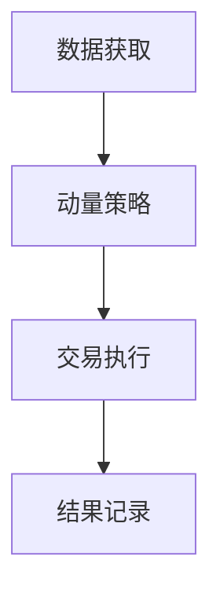

                 


# 如何将特价股票策略与动量投资相结合

> 关键词：特价股票，动量投资，量化交易，策略结合，数学模型

> 摘要：本文详细探讨了如何将特价股票策略与动量投资相结合，通过分析两者的概念、原理、算法和系统设计，提供了一套系统的解决方案。文章从背景介绍、核心概念对比、策略分析、数学模型构建、系统设计到项目实战，全面覆盖了这一主题。

---

# 第1章: 特价股票与动量投资的背景与概念

## 1.1 特价股票的定义与特点
### 1.1.1 特价股票的定义
特价股票是指在特定时间段内价格低于正常市场价的股票，通常由于市场波动、公司公告或投资者情绪等因素导致价格临时性下跌。

### 1.1.2 特价股票的核心特点
- **短期价格波动性**：特价股票的价格在短时间内可能大幅波动。
- **市场情绪敏感性**：投资者情绪对特价股票的价格影响较大。
- **高风险高回报**：特价股票的投资风险较高，但潜在回报也较大。

### 1.1.3 特价股票与普通股票的区别
- 投资周期：特价股票通常为短期投资，而普通股票为长期投资。
- 风险收益：特价股票风险更高，但潜在收益也更大。

## 1.2 动量投资的定义与特点
### 1.2.1 动量投资的定义
动量投资是一种基于股票价格动量效应的投资策略，即近期价格上涨的股票未来可能会继续上涨，近期价格下跌的股票未来可能会继续下跌。

### 1.2.2 动量投资的核心特点
- **动量效应**：价格动量效应是动量投资的核心，即价格趋势会延续。
- **时间窗口**：动量策略通常选择一定的价格观察窗口（如最近20天或60天）。
- **风险控制**：动量投资需要严格的风险控制策略。

### 1.2.3 动量投资与价值投资的区别
- 投资理念：动量投资基于价格动量效应，而价值投资基于股票的内在价值。
- 投资周期：动量投资通常为短期投资，而价值投资为长期投资。

## 1.3 特价股票与动量投资的结合背景
### 1.3.1 特价股票市场的现状
- 特价股票市场具有高度波动性和不确定性。
- 特价股票市场的参与者主要是短期投资者。

### 1.3.2 动量投资在金融市场的应用
- 动量投资在股票、期货等市场均有广泛应用。
- 动量投资在高频交易中表现尤为突出。

### 1.3.3 两者的结合意义
- 动量投资可以为特价股票提供一种有效的交易策略。
- 特价股票市场的波动性为动量投资提供了丰富的交易机会。

## 1.4 本章小结
本章介绍了特价股票和动量投资的基本概念和特点，并分析了两者结合的背景和意义。

---

# 第2章: 特价股票与动量投资的核心概念与联系

## 2.1 特价股票的核心概念
### 2.1.1 特价股票的形成机制
- 市场波动：特价股票通常由市场波动引起。
- 公司公告：公司重大消息可能导致股票价格短期波动。

### 2.1.2 特价股票的市场特征
- 价格波动性高。
- 市场流动性可能较低。

### 2.1.3 特价股票的量化指标
- 相对强弱指数（RSI）：衡量股票价格的超买超卖情况。
- 动量指数：基于价格动量效应的指标。

## 2.2 动量投资的核心概念
### 2.2.1 动量策略的数学模型
$$\text{动量指数} = \frac{\text{当前价格}}{\text{n天前价格}}$$

### 2.2.2 动量策略的时间窗口选择
- 短期窗口：如10天、20天。
- 中长期窗口：如60天、90天。

### 2.2.3 动量策略的风险与收益分析
- 高收益：动量策略在趋势明显的市场中表现优异。
- 高风险：动量策略在市场反转时可能亏损。

## 2.3 特价股票与动量投资的联系
### 2.3.1 动量效应在特价股票中的体现
- 特价股票的价格波动符合动量效应。
- 特价股票市场的短期趋势可以利用动量策略进行交易。

### 2.3.2 特价股票市场的动量效应
- 特价股票市场的价格动量效应较为显著。
- 动量效应在不同市场周期中的表现不同。

### 2.3.3 两者结合的理论基础
- 动量效应与市场波动性结合。
- 特价股票市场的短期趋势可以利用动量策略进行捕捉。

## 2.4 本章小结
本章详细分析了特价股票和动量投资的核心概念，并探讨了两者的联系和理论基础。

---

# 第3章: 特价股票与动量投资的策略分析

## 3.1 动量策略在特价股票中的应用
### 3.1.1 动量策略的基本原理
- 价格趋势是动量策略的核心。
- 短期价格动量效应是动量策略的基础。

### 3.1.2 动量策略在特价股票中的具体应用
- 短期动量策略：利用短期价格波动进行交易。
- 中期动量策略：结合中期价格趋势进行投资。

### 3.1.3 动量策略在特价股票中的风险控制
- 设置止损点：避免市场反转导致的亏损。
- 严格的风险管理：控制每笔交易的风险敞口。

## 3.2 特价股票与动量投资的结合策略
### 3.2.1 特价股票动量策略的构建
- 确定动量指标：如动量指数、相对强弱指数。
- 选择合适的时间窗口：如10天、20天。

### 3.2.2 动量策略与特价股票策略的结合
- 综合考虑动量效应和特价股票的市场特征。
- 构建多因子动量模型：结合动量因子和其他因子。

### 3.2.3 结合策略的优缺点
- 优点：结合了动量效应和特价股票的市场特征。
- 缺点：需要复杂的模型构建和参数调优。

## 3.3 本章小结
本章分析了动量策略在特价股票中的应用，并探讨了两者结合的具体策略和优缺点。

---

# 第4章: 特价股票与动量投资的数学模型与算法

## 4.1 动量策略的数学模型
### 4.1.1 动量指数的计算
$$\text{动量指数} = \frac{\text{当前价格}}{\text{n天前价格}}$$

### 4.1.2 动量策略的实现步骤
1. 计算动量指数。
2. 确定买卖信号。
3. 执行交易。

## 4.2 特价股票动量策略的算法
### 4.2.1 算法原理
- 基于动量效应，利用特价股票的短期价格波动进行交易。
- 通过动量指数筛选潜在的交易机会。

### 4.2.2 算法实现
1. 数据获取：获取特价股票的历史价格数据。
2. 计算动量指数。
3. 确定交易信号。
4. 执行交易并记录交易结果。

## 4.3 本章小结
本章详细讲解了动量策略的数学模型和算法实现，为后续的策略结合奠定了基础。

---

# 第5章: 特价股票与动量投资的系统设计

## 5.1 系统功能设计
### 5.1.1 系统模块划分
- 数据获取模块：获取特价股票的历史价格数据。
- 动量策略模块：计算动量指数并生成交易信号。
- 交易执行模块：根据交易信号执行交易。

### 5.1.2 功能模块的交互设计
- 数据获取模块向动量策略模块提供历史价格数据。
- 动量策略模块根据数据生成交易信号。
- 交易执行模块根据交易信号执行交易并记录结果。

## 5.2 系统架构设计
### 5.2.1 系统架构图


### 5.2.2 系统接口设计
- 数据获取接口：提供历史价格数据。
- 动量策略接口：接收数据并返回交易信号。
- 交易执行接口：根据交易信号执行交易。

## 5.3 本章小结
本章详细设计了系统的功能模块和架构，为系统的实现提供了清晰的框架。

---

# 第6章: 特价股票与动量投资的项目实战

## 6.1 环境安装与配置
### 6.1.1 环境要求
- Python 3.8及以上版本。
- 数据获取工具：如Yahoo Finance API。
- 数据分析工具：如Pandas、NumPy。

### 6.1.2 环境配置
```bash
pip install pandas numpy matplotlib yfinance
```

## 6.2 核心代码实现
### 6.2.1 数据获取
```python
import yfinance as yf

def get_data(ticker, start_date, end_date):
    data = yf.download(ticker, start=start_date, end=end_date)
    return data
```

### 6.2.2 动量策略实现
```python
def calculate_momentum(data, window):
    momentum = data['Close'].rolling(window).mean()
    return momentum
```

### 6.2.3 交易信号生成
```python
def generate_signals(momentum, threshold):
    signals = []
    for price in momentum:
        if price > threshold:
            signals.append(1)
        else:
            signals.append(0)
    return signals
```

## 6.3 实际案例分析
### 6.3.1 数据分析
- 数据来源：某段时间内的特价股票数据。
- 数据分析：计算动量指数并生成交易信号。

### 6.3.2 交易结果分析
- 交易信号的准确性分析。
- 交易收益的统计分析。

## 6.4 本章小结
本章通过实际案例分析，验证了动量策略在特价股票中的应用效果。

---

# 第7章: 总结与展望

## 7.1 总结
- 本文详细探讨了如何将特价股票策略与动量投资相结合。
- 通过数学模型和算法实现，验证了两者的结合具有可行性。

## 7.2 展望
- 进一步优化动量策略的参数设置。
- 探讨动量策略与其他策略的结合。

## 7.3 最佳实践 tips
- 设置合理的止损点。
- 严格控制风险。
- 定期优化交易模型。

## 7.4 本章小结
本章总结了全文内容，并对未来的研究方向提出了展望。

---

# 作者：AI天才研究院/AI Genius Institute & 禅与计算机程序设计艺术 /Zen And The Art of Computer Programming

