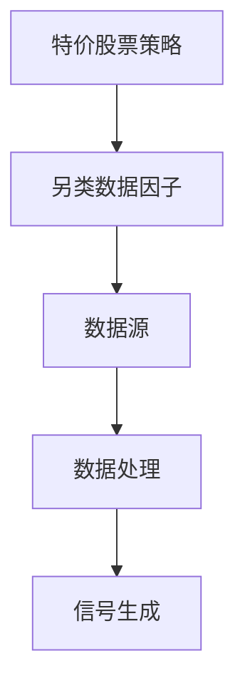
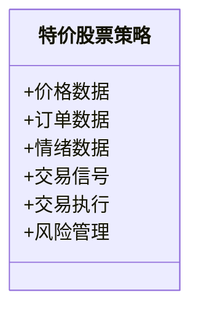
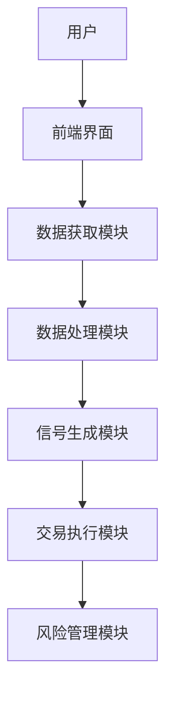
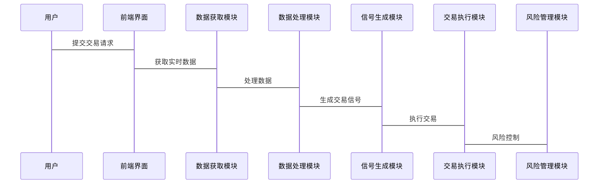

                 


# 如何将特价股票策略与另类数据因子共创策略相结合

> 关键词：特价股票策略，另类数据因子，量化投资，数据驱动，算法交易

> 摘要：本文详细探讨了如何将特价股票策略与另类数据因子相结合，通过数据驱动的方法优化投资决策。文章从背景与概念、策略构建、算法实现、系统架构设计到项目实战，层层深入，为读者提供了一套完整的解决方案。

---

## 第一部分: 特价股票策略与另类数据因子结合的背景与概念

### 第1章: 特价股票策略概述

#### 1.1 特价股票策略的定义与特点

##### 1.1.1 特价股票策略的定义
特价股票策略是一种基于短期价格波动的交易策略，通常利用市场中的价格差异或事件驱动的机会进行买卖。其核心在于捕捉市场中的短期价格波动，通过快速交易获利。

##### 1.1.2 特价股票策略的核心特点
- **短期性**：交易周期短，通常在几小时或几天内完成。
- **高频性**：依赖高频交易技术，快速捕捉市场机会。
- **技术性**：依赖技术分析，如K线图、均线等。

##### 1.1.3 特价股票策略的应用场景
- **套利交易**：利用不同市场或资产之间的价格差异进行无风险或低风险套利。
- **事件驱动**：基于公司公告、并购等事件引发的股价波动进行交易。
- **市场微观结构分析**：通过订单簿数据分析市场深度和流动性。

#### 1.2 另类数据因子概述

##### 1.2.1 另类数据的定义与特点
另类数据是指传统金融数据之外的非传统数据源，包括社交媒体情绪、卫星图像、专利数据、供应链数据等。其特点是数据来源广泛、维度多样，能够提供传统金融数据无法捕捉的市场信息。

##### 1.2.2 另类数据的核心特征
- **实时性**：许多另类数据具有实时性，能够捕捉市场动态。
- **非线性**：另类数据与市场价格之间的关系通常是非线性的。
- **多样性**：包括文本、图像、语音等多种数据类型。

##### 1.2.3 另类数据的分类与应用场景
- **社交媒体数据**：分析市场情绪，预测股价走势。
- **卫星数据**：监测供应链变化，预测公司业绩。
- **专利数据**：分析技术创新能力，预测公司竞争力。

#### 1.3 特价股票策略与另类数据结合的意义

##### 1.3.1 特价股票策略的局限性
- **信息滞后**：传统金融数据可能存在滞后性，无法捕捉实时市场机会。
- **竞争激烈**：套利机会往往被高频交易者迅速捕捉，利润空间有限。
- **市场深度不足**：部分市场可能存在流动性不足的问题。

##### 1.3.2 另类数据在金融领域的潜力
- **数据丰富性**：另类数据能够提供更丰富的市场信息。
- **非线性关系**：通过分析另类数据，发现传统金融数据难以捕捉的市场规律。
- **实时性优势**：实时数据能够更快地捕捉市场机会。

##### 1.3.3 两者的结合如何提升投资效率
通过结合特价股票策略与另类数据因子，投资者可以：
- **提高交易决策的实时性**：利用另类数据的实时性优势，快速捕捉市场机会。
- **增强策略的多样性**：结合多种数据源，优化交易信号的准确性。
- **降低交易成本**：通过数据驱动的方式优化交易策略，减少不必要的交易成本。

#### 1.4 特价股票策略与另类数据结合的核心概念

##### 1.4.1 核心概念的定义与属性对比
| 核心概念 | 特价股票策略 | 另类数据因子 |
|----------|--------------|--------------|
| 定义     | 短期价格波动交易策略 | 非传统金融数据源 |
| 特点     | 短期性、高频性、技术性 | 多样性、实时性、非线性 |
| 应用场景 | 套利交易、事件驱动、市场微观结构分析 | 社交媒体数据、卫星数据、专利数据 |

##### 1.4.2 实体关系图


---

## 第二部分: 特价股票策略与另类数据因子结合的策略构建

### 第2章: 特价股票策略与另类数据因子的结合策略

#### 2.1 市场行为分析

##### 2.1.1 市场情绪分析
通过分析社交媒体、新闻等另类数据源，计算市场情绪指数，预测市场走势。

##### 2.1.2 市场趋势预测
利用时间序列分析和机器学习模型，基于另类数据预测市场短期趋势。

##### 2.1.3 市场波动性分析
通过分析订单簿数据，评估市场流动性，预测市场波动性。

#### 2.2 另类数据因子的筛选与设计

##### 2.2.1 数据源的选择
根据策略需求选择合适的另类数据源，例如社交媒体情绪数据、新闻数据等。

##### 2.2.2 数据清洗与预处理
对数据进行清洗，去除噪声，标准化数据格式。

##### 2.2.3 数据特征提取
提取关键特征，例如情绪强度、关键词频率等。

#### 2.3 信号生成与交易策略

##### 2.3.1 信号生成逻辑
结合特价股票策略和另类数据因子，生成交易信号。

##### 2.3.2 交易规则设计
根据信号强度、市场状况等条件，设计具体的交易规则。

##### 2.3.3 风险控制策略
设置止损、止盈等风险管理机制，确保交易策略的稳健性。

#### 2.4 策略优化与回测

##### 2.4.1 策略回测
对策略进行历史数据回测，评估策略的收益和风险。

##### 2.4.2 参数优化
通过回测结果优化策略参数，提高策略的收益和稳定性。

##### 2.4.3 持续优化
根据市场变化和数据源更新，持续优化策略。

---

## 第三部分: 特价股票策略与另类数据因子结合的算法与数学模型

### 第3章: 算法实现与数学模型

#### 3.1 时间序列分析

##### 3.1.1 ARIMA模型
ARIMA（自回归积分滑动平均模型）是一种常用的时序预测模型，适用于分析价格走势。

##### 3.1.2 GARCH模型
GARCH（广义自回归条件异方差模型）用于预测市场波动性。

#### 3.2 机器学习算法

##### 3.2.1 支持向量回归（SVR）
通过SVR模型预测价格走势。

##### 3.2.2 随机森林
通过随机森林模型分析市场情绪对价格的影响。

#### 3.3 信号生成模型

##### 3.3.1 基于情绪的信号生成
通过分析社交媒体情绪数据，生成交易信号。

##### 3.3.2 基于订单簿的信号生成
通过分析订单簿数据，预测市场流动性变化。

---

## 第四部分: 系统架构设计与实现

### 第4章: 系统架构设计

#### 4.1 项目介绍

##### 4.1.1 项目目标
通过结合特价股票策略与另类数据因子，构建一个智能化的交易系统。

##### 4.1.2 项目需求
- 实时数据获取
- 信号生成与交易执行
- 风险管理

#### 4.2 系统功能设计

##### 4.2.1 领域模型


##### 4.2.2 系统架构


#### 4.3 系统接口设计

##### 4.3.1 数据接口
- 数据获取接口：从数据源获取实时数据。
- 数据处理接口：对数据进行清洗和特征提取。

##### 4.3.2 交易接口
- 信号生成接口：生成交易信号。
- 交易执行接口：执行交易指令。

#### 4.4 系统交互设计

##### 4.4.1 交互流程


---

## 第五部分: 项目实战

### 第5章: 项目实战

#### 5.1 环境搭建

##### 5.1.1 安装Python
```bash
python --version
pip install numpy pandas scikit-learn
```

##### 5.1.2 安装数据获取库
```bash
pip install yfinance requests
```

#### 5.2 核心实现

##### 5.2.1 数据获取模块
```python
import yfinance as yf

def get_data(ticker, start, end):
    df = yf.download(ticker, start=start, end=end)
    return df
```

##### 5.2.2 数据处理模块
```python
import pandas as pd

def preprocess_data(df):
    df = df.dropna()
    return df
```

##### 5.2.3 信号生成模块
```python
from sklearn.svm import SVR

def generate_signal(df, target_column):
    X = df.index.values.reshape(-1, 1)
    y = df[target_column].values
    regressor = SVR(kernel='linear')
    regressor.fit(X, y)
    predictions = regressor.predict(X)
    return predictions
```

#### 5.3 代码应用解读与分析

##### 5.3.1 代码功能分析
- 数据获取：从Yahoo Finance获取股票数据。
- 数据处理：清洗数据，去除缺失值。
- 信号生成：使用支持向量回归模型预测价格走势。

##### 5.3.2 代码优化建议
- 引入更多的数据源，如社交媒体情绪数据。
- 使用更复杂的模型，如深度学习模型。

#### 5.4 实际案例分析

##### 5.4.1 案例背景
分析某只股票在特定事件（如并购消息）后的价格走势。

##### 5.4.2 数据分析
使用另类数据（如社交媒体情绪数据）和传统价格数据进行分析。

##### 5.4.3 结果解读
通过模型预测，捕捉事件驱动的交易机会。

#### 5.5 项目小结
通过项目实战，验证了特价股票策略与另类数据因子结合的有效性，为投资者提供了新的交易思路。

---

## 第六部分: 优化与扩展

### 第6章: 优化与扩展

#### 6.1 策略优化

##### 6.1.1 引入更复杂的数据源
- 使用卫星图像数据监测供应链变化。
- 分析专利数据预测公司技术创新能力。

##### 6.1.2 优化算法模型
- 使用深度学习模型提高预测精度。
- 引入多因子模型优化交易信号。

#### 6.2 系统扩展

##### 6.2.1 扩展数据源
- 整合更多类型的数据源，如新闻数据、语音数据等。
- 建立数据湖，便于后续分析。

##### 6.2.2 扩展交易品种
- 从股票扩展到期货、外汇等其他金融资产。

#### 6.3 注意事项

##### 6.3.1 数据质量
确保数据源的可靠性和准确性，避免噪声干扰。

##### 6.3.2 模型鲁棒性
定期回测和优化模型，确保策略在不同市场环境下的有效性。

##### 6.3.3 风险管理
建立完善的风险控制机制，避免过度杠杆和市场风险。

#### 6.4 拓展阅读

##### 6.4.1 相关书籍
- 《Quantitative Equity Portfolio Management》
- 《Algorithmic Trading: Winning Strategies and Their Rationale》

##### 6.4.2 相关博客
- 《机器学习在金融中的应用》
- 《另类数据在量化投资中的应用》

---

## 第七部分: 结语

### 7.1 全文总结

通过本文的详细讲解，我们了解了如何将特价股票策略与另类数据因子相结合，构建一个智能化的交易系统。从理论到实践，我们探讨了策略构建、算法实现、系统架构设计和项目实战的全过程。

### 7.2 注意事项

- 特价股票策略具有高风险性，投资者需谨慎操作。
- 另类数据的获取和处理需要投入大量资源，需做好数据清洗和预处理。
- 模型的优化和更新需要持续关注市场变化和数据源更新。

### 7.3 未来展望

随着技术的进步和数据源的丰富，特价股票策略与另类数据因子的结合将更加广泛。未来，我们可以期待更多基于人工智能和大数据的创新交易策略。

---

## 作者信息

作者：AI天才研究院/AI Genius Institute & 禅与计算机程序设计艺术 /Zen And The Art of Computer Programming

---

