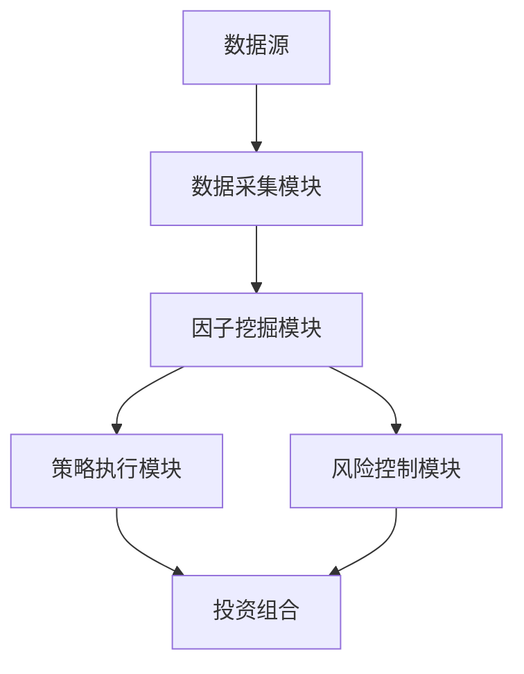

                 


# 如何将特价股票策略与另类数据因子挖掘策略相结合

> 关键词：特价股票策略，另类数据，因子挖掘，机器学习，投资组合优化

> 摘要：本文将详细探讨如何将特价股票策略与另类数据因子挖掘策略相结合，以提升投资收益。通过分析特价股票的核心机制，结合另类数据的挖掘技术，构建高效的股票投资模型。本文从理论基础、算法实现、系统架构到项目实战，全面解析这一结合过程，帮助读者理解如何利用技术手段优化股票投资策略。

---

## 第一部分: 特价股票策略与另类数据因子挖掘的背景与基础

### 第1章: 特价股票策略概述

#### 1.1 特价股票的定义与特点

##### 1.1.1 特价股票的定义
特价股票是指在特定市场条件下，价格显著低于其内在价值的股票。这种现象通常出现在市场波动、公司基本面变化或投资者情绪低落时。

##### 1.1.2 特价股票的核心特点
- **低估值**：市盈率、市净率等指标远低于行业平均水平。
- **短期低估**：市场暂时未发现其价值，存在反弹潜力。
- **高波动性**：价格波动大，容易出现快速回升。

##### 1.1.3 特价股票的市场表现
特价股票往往在市场低迷时出现，投资者可以通过挖掘这些股票获得超额收益。然而，特价股票也伴随着较高的风险，需要结合市场环境和公司基本面进行综合判断。

#### 1.2 特价股票策略的类型

##### 1.2.1 时间驱动型策略
根据市场周期，在特定时间点买入低估股票，如市场底部或公司财报发布后。

##### 1.2.2 价格驱动型策略
通过技术分析或量化模型，识别股价偏离价值的股票。

##### 1.2.3 综合驱动型策略
结合时间、价格和公司基本面多种因素，构建综合选股模型。

#### 1.3 特价股票策略的优势与挑战

##### 1.3.1 优势分析
- **高收益潜力**：通过低价买入高价卖出，获得超额收益。
- **分散风险**：通过多只股票组合，降低单一股票风险。

##### 1.3.2 挑战与风险
- **市场波动**：特价股票价格波动大，容易受到市场情绪影响。
- **信息不对称**：优质特价股票往往被机构抢先买入，个人投资者难以获取。

---

### 第2章: 另类数据因子挖掘概述

#### 2.1 另类数据的定义与特点

##### 2.1.1 另类数据的定义
另类数据是指传统金融数据之外的非结构化数据，包括社交媒体情绪、卫星图像、专利申请、招聘信息等。

##### 2.1.2 另类数据的核心特点
- **非结构化**：数据形式多样，需要预处理才能使用。
- **实时性**：部分另类数据具有较强的时效性，如社交媒体情绪。
- **丰富性**：涵盖广泛的市场信息，能够提供更多维度的洞察。

##### 2.1.3 另类数据的分类
- **文本数据**：社交媒体、新闻、财报披露等。
- **图像数据**：卫星图像、公司Logo、产品展示等。
- **网络数据**：网页爬取、API接口获取的数据。

#### 2.2 另类数据在金融领域的应用

##### 2.2.1 另类数据在股票分析中的应用
- **情绪分析**：通过社交媒体和新闻情绪，预测市场走势。
- **公司基本面**：通过招聘信息、专利数量等数据，判断公司创新能力。

##### 2.2.2 另类数据在风险控制中的应用
- **市场情绪监控**：识别市场恐慌或乐观情绪，辅助风险评估。
- **行业动态监测**：通过产业链数据，判断行业景气度。

##### 2.2.3 另类数据在投资决策中的应用
- **发现投资机会**：通过另类数据挖掘潜在的价值股。
- **优化投资组合**：利用另类数据构建多元化的投资组合。

#### 2.3 另类数据因子挖掘的优势与挑战

##### 2.3.1 优势分析
- **数据丰富性**：另类数据能够提供更多的市场信息，帮助发现潜在投资机会。
- **差异化优势**：利用另类数据可以构建独特的投资策略，避免同质化竞争。

##### 2.3.2 挑战与风险
- **数据处理难度**：非结构化数据的清洗和预处理成本较高。
- **数据质量**：部分另类数据可能存在噪声，影响模型准确性。

---

## 第二部分: 特价股票策略与另类数据因子挖掘的结合

### 第3章: 特价股票策略与另类数据的结合原理

#### 3.1 特价股票策略与另类数据的关系

##### 3.1.1 特价股票策略的核心要素
- **估值指标**：市盈率、市净率等。
- **市场情绪**：投资者情绪对股价的影响。
- **市场周期**：经济周期对股价的影响。

##### 3.1.2 另类数据因子的核心要素
- **情绪因子**：社交媒体情绪、新闻情绪。
- **创新因子**：专利数量、研发投入。
- **市场行为因子**：交易量、订单流数据。

##### 3.1.3 两者结合的逻辑框架
通过结合另类数据中的情绪因子和创新因子，优化特价股票的筛选过程，提高选股准确率。

#### 3.2 另类数据在特价股票策略中的应用

##### 3.2.1 另类数据如何辅助识别特价股票机会
- **情绪监控**：通过社交媒体情绪，发现市场情绪低落时的潜在特价股票。
- **创新评估**：通过专利数量和研发投入，筛选具有长期增长潜力的公司。

##### 3.2.2 另类数据如何优化策略执行
- **实时监控**：利用另类数据实时监控市场情绪，及时调整投资组合。
- **风险控制**：通过另类数据构建风险指标，提前预警市场风险。

##### 3.2.3 另类数据如何提升策略收益
- **多元化投资**：利用另类数据发现更多潜在机会，构建多元化投资组合。
- **超额收益**：通过另类数据挖掘，找到市场未充分定价的股票，获取超额收益。

---

### 第4章: 另类数据因子挖掘的核心算法

#### 4.1 数据预处理与特征提取

##### 4.1.1 数据清洗与标准化
- **文本清洗**：去除停用词、标点符号，进行分词处理。
- **数据标准化**：对数值型数据进行归一化处理，确保模型输入一致。

##### 4.1.2 特征选择与降维
- **特征选择**：使用卡方检验、互信息等方法，筛选重要特征。
- **降维技术**：使用主成分分析（PCA）进行降维，减少特征维度。

##### 4.1.3 数据增强与扩展
- **文本增强**：通过同义词替换、句式变化，增加数据多样性。
- **数据扩展**：利用外部数据库，补充缺失数据。

#### 4.2 因子挖掘算法

##### 4.2.1 线性回归模型
通过线性回归模型，分析各因子与股票收益之间的线性关系。

##### 4.2.2 非线性回归模型
使用支持向量回归（SVR）、随机森林回归等方法，捕捉非线性关系。

##### 4.2.3 聚类分析与因子提取
通过聚类分析，识别具有相似特征的股票，提取共性因子。

#### 4.3 算法优化与调参

##### 4.3.1 超参数优化
使用网格搜索（Grid Search）或随机搜索（Random Search），优化模型超参数。

##### 4.3.2 模型评估与验证
通过K折交叉验证，评估模型的泛化能力。

##### 4.3.3 模型部署与应用
将优化后的模型部署到实时交易系统，进行策略回测和实盘交易。

---

## 第三部分: 系统架构与项目实战

### 第5章: 系统架构与项目实战

#### 5.1 系统架构设计

##### 5.1.1 系统功能模块
- **数据采集模块**：负责采集另类数据和传统金融数据。
- **因子挖掘模块**：对数据进行预处理和特征提取，挖掘关键因子。
- **策略执行模块**：基于因子挖掘结果，生成投资策略。
- **风险控制模块**：监控市场风险，调整投资组合。

##### 5.1.2 系统架构图


#### 5.2 项目实战

##### 5.2.1 环境安装
- **Python环境**：安装Python 3.8及以上版本。
- **依赖库安装**：使用pip安装numpy、pandas、scikit-learn、textblob等库。

##### 5.2.2 核心实现代码
```python
import pandas as pd
from sklearn.linear_model import LinearRegression
from sklearn.metrics import mean_squared_error

# 数据预处理
def preprocess_data(data):
    # 文本清洗
    data['text'] = data['text'].apply(clean_text)
    # 特征提取
    data['sentiment'] = data['text'].apply(get_sentiment)
    return data

# 模型训练
def train_model(X, y):
    model = LinearRegression()
    model.fit(X, y)
    return model

# 模型评估
def evaluate_model(y_true, y_pred):
    mse = mean_squared_error(y_true, y_pred)
    print(f"均方误差: {mse}")

# 主函数
def main():
    # 数据加载
    data = pd.read_csv('data.csv')
    # 数据预处理
    processed_data = preprocess_data(data)
    # 特征提取
    X = processed_data[['sentiment', 'market_cap']]
    y = processed_data['returns']
    # 模型训练
    model = train_model(X, y)
    # 模型预测
    y_pred = model.predict(X)
    # 模型评估
    evaluate_model(y, y_pred)

if __name__ == "__main__":
    main()
```

##### 5.2.3 代码解读与分析
- **数据预处理**：对文本数据进行清洗和情感分析，提取情绪因子。
- **模型训练**：使用线性回归模型，基于情绪因子和市值因子，预测股票收益。
- **模型评估**：计算均方误差，评估模型预测准确性。

##### 5.2.4 实际案例分析
通过具体案例，展示如何利用另类数据因子挖掘，优化特价股票策略，提升投资收益。

---

## 第四部分: 总结与展望

### 6.1 小结
本文详细探讨了如何将特价股票策略与另类数据因子挖掘相结合，通过理论分析、算法实现和系统设计，展示了这一结合的可行性与优势。

### 6.2 注意事项
- **数据质量**：确保数据来源可靠，避免噪声干扰。
- **模型优化**：持续优化模型，提升选股准确率。
- **风险控制**：建立完善的风控机制，降低投资风险。

### 6.3 拓展阅读
- **相关书籍**：《Python金融数据分析》、《机器学习在量化投资中的应用》
- **学术论文**：搜索相关领域的最新研究论文，获取更多灵感。

---

作者：AI天才研究院 & 禅与计算机程序设计艺术

