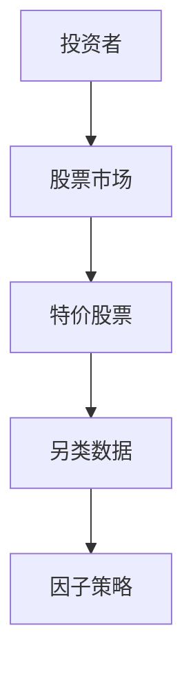
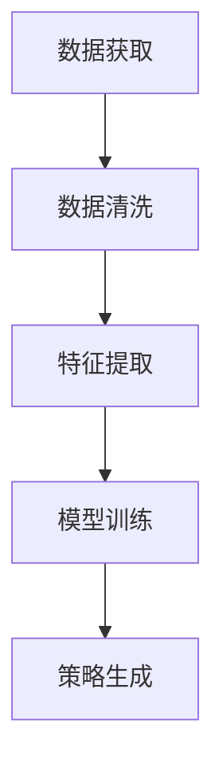
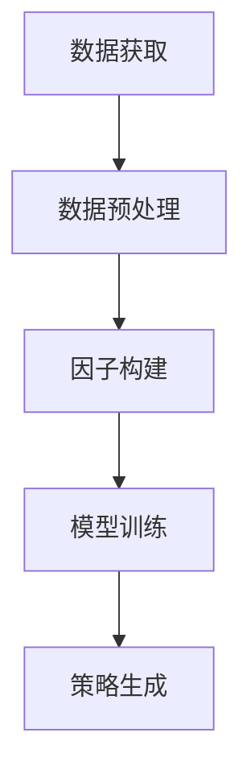
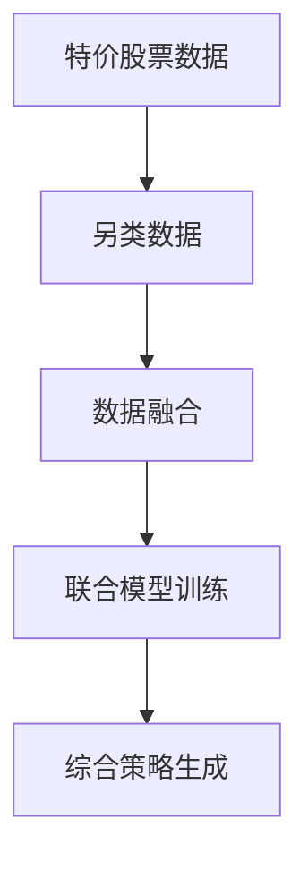
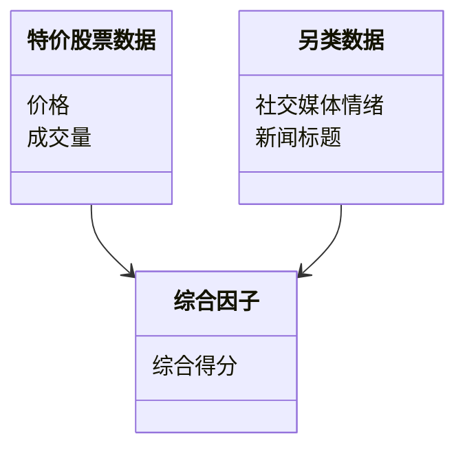
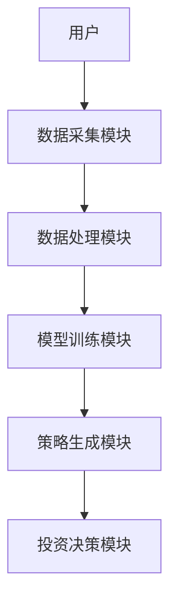
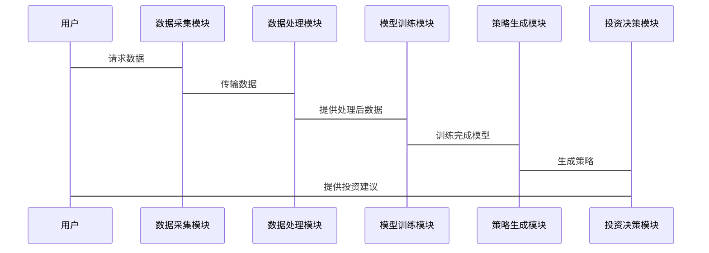

                 


# 如何将特价股票策略与另类数据因子策略相结合

## 关键词：特价股票策略、另类数据因子策略、量化投资、算法交易、金融数据分析

## 摘要：  
本文将详细介绍如何将特价股票策略与另类数据因子策略相结合，通过分析两者的核心概念、算法原理、数学模型以及系统架构，探讨其在量化投资中的应用。文章从背景介绍、核心概念对比、算法流程、系统设计到实战案例，全面解析如何利用这两种策略的结合来优化投资决策。

---

## 第一部分：特价股票策略与另类数据因子策略概述

### 第1章：特价股票策略与另类数据因子策略的背景介绍

#### 1.1 特价股票策略的核心概念

##### 1.1.1 特价股票的定义与特点
特价股票是指价格低于市场平均值或行业标准的股票，通常具有较高的投资吸引力。其特点包括价格低廉、流动性较高、波动性适中等。投资者可以通过特价股票策略在市场低迷时寻找低估资产，或在市场波动中获利。

##### 1.1.2 特价股票的市场机制与运作模式
特价股票的市场机制主要依赖于价格发现、供需关系和市场情绪。投资者通过分析公司基本面、技术指标和市场趋势，寻找被低估的股票进行投资。运作模式包括价值投资、事件驱动投资等。

##### 1.1.3 特价股票策略在投资中的作用
特价股票策略能够帮助投资者在市场中寻找潜在回报较高的股票，尤其在市场下跌时具有防御性。通过精选低价股，投资者可以在市场复苏时获得超额收益。

#### 1.2 另类数据因子策略的核心概念

##### 1.2.1 另类数据的定义与来源
另类数据是指传统金融数据之外的非结构化数据，如社交媒体情绪、卫星图像、专利申请等。这些数据能够提供传统金融数据无法捕捉的市场信息。

##### 1.2.2 另类数据因子的构建与应用
通过分析另类数据，投资者可以构建反映市场情绪、行业趋势或公司竞争力的因子。例如，社交媒体上的积极情绪可能预示公司股价上涨。

##### 1.2.3 另类数据在投资决策中的价值
另类数据能够提供前瞻性的市场信号，帮助投资者在传统金融数据之外发现投资机会，提高决策的准确性。

#### 1.3 特价股票策略与另类数据因子策略的结合点

##### 1.3.1 两者的互补性分析
特价股票策略关注价格因素，而另类数据因子策略关注市场情绪和趋势。两者的结合能够帮助投资者在价格低估的同时，抓住市场情绪变化带来的投资机会。

##### 1.3.2 结合策略的潜在优势
结合策略能够利用两种策略的优势，既有价格优势，又能捕捉市场情绪变化，提高投资决策的全面性。

##### 1.3.3 结合策略的可行性评估
随着大数据和人工智能技术的发展，结合策略在技术和数据支持上具有可行性，但需要克服数据获取难度和模型复杂性。

---

### 第2章：特价股票策略与另类数据因子策略的核心概念与联系

#### 2.1 核心概念原理

##### 2.1.1 特价股票策略的数学模型
$$ P(t) = a \cdot P(t-1) + b \cdot V(t) + \epsilon $$
其中：
- \( P(t) \) 表示当前价格
- \( P(t-1) \) 表示前一时间的价格
- \( V(t) \) 表示当前成交量
- \( a \) 和 \( b \) 是模型参数
- \( \epsilon \) 是误差项

##### 2.1.2 另类数据因子策略的数学模型
$$ F = \alpha \cdot D_1 + \beta \cdot D_2 + \gamma \cdot D_3 + \delta $$
其中：
- \( F \) 表示因子值
- \( D_1, D_2, D_3 \) 表示不同来源的另类数据
- \( \alpha, \beta, \gamma \) 是模型参数
- \( \delta \) 是误差项

##### 2.1.3 两者的结合模型
$$ C = \lambda \cdot P(t) + (1-\lambda) \cdot F $$
其中：
- \( C \) 表示结合策略的综合因子
- \( \lambda \) 是模型权重参数

#### 2.2 核心概念属性特征对比表格

| 特性                | 特价股票策略                        | 另类数据因子策略                      |
|---------------------|------------------------------------|--------------------------------------|
| 数据来源            | 股价、成交量、市盈率等             | 社交媒体、新闻、专利申请等           |
| 分析方法            | 技术分析、基本面分析               | 文本挖掘、情绪分析、图像识别          |
| 投资目标            | 寻找价格低估的股票                 | 捕捉市场趋势和情绪变化                |
| 优势                | 风险较低，收益稳定                 | 前瞻性高，捕捉市场拐点                |
| 局限性              | 仅关注价格因素，可能忽略市场情绪   | 数据获取难度大，处理复杂             |

#### 2.3 ER实体关系图



---

### 第3章：特价股票策略与另类数据因子策略的算法原理

#### 3.1 特价股票策略的算法流程



#### 3.2 另类数据因子策略的算法流程



#### 3.3 结合策略的算法流程



---

### 第4章：数学模型与公式

#### 4.1 特价股票策略的数学模型
$$ P(t) = a \cdot P(t-1) + b \cdot V(t) + \epsilon $$

#### 4.2 另类数据因子策略的数学模型
$$ F = \alpha \cdot D_1 + \beta \cdot D_2 + \gamma \cdot D_3 + \delta $$

#### 4.3 结合策略的数学模型
$$ C = \lambda \cdot P(t) + (1-\lambda) \cdot F $$

---

## 第二部分：系统架构与设计方案

### 第4章：系统架构与设计方案

#### 4.1 问题场景介绍
投资者希望通过结合特价股票策略和另类数据因子策略，构建一个智能化的投资系统，以提高投资决策的准确性和效率。

#### 4.2 系统功能设计

##### 4.2.1 领域模型


##### 4.2.2 系统架构设计


##### 4.2.3 系统接口设计
- 数据采集模块接口：从股票市场和社交媒体获取数据
- 数据处理模块接口：清洗和转换数据
- 模型训练模块接口：训练结合策略的数学模型
- 策略生成模块接口：生成投资策略
- 投资决策模块接口：输出投资建议

##### 4.2.4 系统交互设计


---

## 第三部分：项目实战

### 第5章：项目实战

#### 5.1 环境安装
- Python 3.8+
- NumPy, Pandas, Scikit-learn, NLTK, TextBlob

#### 5.2 核心实现代码

##### 5.2.1 特价股票数据处理
```python
import pandas as pd
import numpy as np

# 获取特价股票数据
def get_cheap_stocks():
    # 示例数据
    data = {
        '股票代码': ['A', 'B', 'C'],
        '收盘价': [10, 15, 8],
        '成交量': [1000, 800, 1200]
    }
    df = pd.DataFrame(data)
    return df

# 数据清洗
def preprocess_data(df):
    df = df.dropna()
    df = df[df['成交量'] > 0]
    return df

# 特征提取
def extract_features(df):
    features = df[['收盘价', '成交量']]
    return features
```

##### 5.2.2 另类数据处理
```python
from textblob import TextBlob
import requests

# 获取社交媒体情绪数据
def get_sentiment(url):
    response = requests.get(url)
    text = response.text
    blob = TextBlob(text)
    sentiment = blob.sentiment.polarity
    return sentiment

# 构建情绪因子
def build_sentiment_factor(stocks):
    sentiment_scores = {}
    for stock in stocks:
        url = f'https://example.com/{stock}'
        sentiment = get_sentiment(url)
        sentiment_scores[stock] = sentiment
    return sentiment_scores
```

##### 5.2.3 综合策略模型
```python
from sklearn.linear_model import LinearRegression

# 结合策略模型
def combined_strategy(price_data, sentiment_data):
    X = price_data[['收盘价', '成交量']]
    y = sentiment_data['情绪得分']
    model = LinearRegression()
    model.fit(X, y)
    return model

# 预测综合因子
def predict_factor(model, new_data):
    return model.predict(new_data)
```

#### 5.3 实际案例分析
假设我们有以下特价股票数据和另类数据：

| 股票代码 | 收盘价 | 成交量 | 情绪得分 |
|----------|--------|--------|----------|
| A        | 10     | 1000   | 0.7      |
| B        | 15     | 800    | -0.3     |
| C        | 8      | 1200   | 0.2      |

通过结合策略模型，我们可以预测综合因子：

$$ C = \lambda \cdot P(t) + (1-\lambda) \cdot F $$

假设 $\lambda = 0.6$，则：

- 对于股票A：$C = 0.6 \times 10 + 0.4 \times 0.7 = 6.2 + 0.28 = 6.48$
- 对于股票B：$C = 0.6 \times 15 + 0.4 \times (-0.3) = 9 - 0.12 = 8.88$
- 对于股票C：$C = 0.6 \times 8 + 0.4 \times 0.2 = 4.8 + 0.08 = 4.88$

综合因子最高的股票B将被优先推荐。

---

## 第四部分：总结与展望

### 6.1 总结

通过将特价股票策略与另类数据因子策略相结合，投资者能够利用价格优势和市场情绪变化，制定更加科学的投资策略。结合策略在数据获取、模型构建和策略生成方面具有较高的可行性。

### 6.2 展望

未来，随着大数据和人工智能技术的进一步发展，结合策略将更加智能化和高效化。投资者可以利用更多的另类数据源和更复杂的算法模型，进一步优化投资决策。

---

## 作者：AI天才研究院/AI Genius Institute & 禅与计算机程序设计艺术 /Zen And The Art of Computer Programming

---

本文通过详细分析特价股票策略与另类数据因子策略的结合，从背景介绍、核心概念、算法原理到系统架构和实战案例，全面解析了如何利用这两种策略的结合来优化投资决策。希望本文能够为投资者提供有价值的参考和启发。

