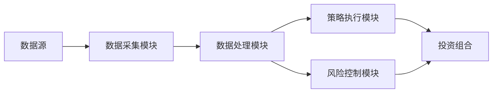
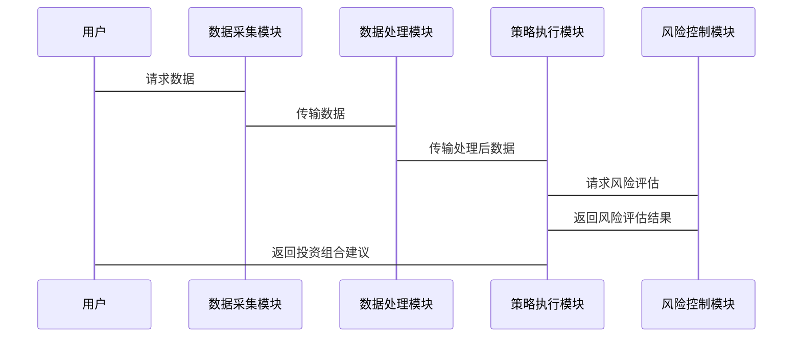

                 


```markdown
# 如何将特价股票策略与另类风险因子策略相结合

> 关键词：特价股票策略，另类风险因子，投资组合优化，风险控制，量化投资

> 摘要：本文详细探讨了如何将特价股票策略与另类风险因子策略相结合，以优化投资组合并降低风险。通过理论分析、算法实现和系统设计，本文提出了结合策略的核心思想、实现步骤和实际案例，帮助读者理解并应用这一创新策略。

---

# 第一部分: 特价股票策略与另类风险因子策略概述

## 第1章: 特价股票策略与另类风险因子策略的背景与概念

### 1.1 特价股票策略的背景与特点
- **1.1.1 特价股票的定义与分类**  
  特价股票是指在特定市场条件下价格被低估的股票，通常分为周期性特价股票、价值型特价股票和成长型特价股票。

- **1.1.2 特价股票策略的核心要素**  
  包括估值指标（如市盈率、市净率）、市场情绪、宏观经济指标等。

- **1.1.3 特价股票策略的应用场景**  
  如市场低迷时期、行业周期性低谷、公司基本面改善等。

### 1.2 另类风险因子策略的背景与特点
- **1.2.1 风险因子的定义与分类**  
  包括市场风险因子（Beta）、特异风险因子（Alpha）、波动率因子等。

- **1.2.2 另类风险因子的特征与优势**  
  如非线性关系、低相关性、多样化风险敞口等。

- **1.2.3 另类风险因子在投资中的作用**  
  优化投资组合的风险-收益比，增强收益的稳定性。

### 1.3 特价股票策略与另类风险因子策略的结合背景
- **1.3.1 市场变化与策略调整的需求**  
  随着市场的变化，传统策略逐渐失效，需要引入新的策略来应对。

- **1.3.2 风险控制与收益优化的双重目标**  
  通过结合两种策略，可以在追求收益的同时有效控制风险。

- **1.3.3 传统策略的局限性与新策略的优势**  
  传统策略往往过于依赖单一指标，而结合策略则通过多维度分析提高策略的有效性。

## 1.4 本章小结  
通过本章的介绍，我们了解了特价股票策略和另类风险因子策略的基本概念和特点，以及它们结合的背景和优势。

---

# 第二部分: 特价股票策略与另类风险因子策略的核心概念与联系

## 第2章: 特价股票策略的核心原理

### 2.1 特价股票筛选的数学模型
- **2.1.1 市盈率（P/E）模型**  
  $$ P/E = \frac{\text{股价}}{\text{每股收益}} $$
- **2.1.2 市净率（P/B）模型**  
  $$ P/B = \frac{\text{股价}}{\text{每股净资产}} $$
- **2.1.3 其他估值指标的分析**  
  如股息率、市销率等。

### 2.2 特价股票策略的实现步骤
- **2.2.1 数据收集与预处理**  
  收集历史股价、财务数据等，清洗数据并填充缺失值。

- **2.2.2 估值指标的计算与筛选**  
  根据特定阈值筛选出符合条件的股票。

- **2.2.3 策略回测与优化**  
  使用历史数据验证策略的有效性，并进行参数优化。

### 2.3 特价股票策略的优缺点分析
- **2.3.1 优点：捕捉低估机会**  
  在市场低迷时，特价股票可能有较高的上涨潜力。

- **2.3.2 缺点：市场波动与流动性风险**  
  部分特价股票流动性差，难以快速变现。

## 第3章: 另类风险因子策略的核心原理

### 3.1 风险因子的定义与分类
- **3.1.1 市场风险因子（Beta）**  
  衡量股票相对于市场的波动性。

- **3.1.2 特异风险因子（Alpha）**  
  衡量股票相对于市场的超额收益能力。

- **3.1.3 其他另类风险因子**  
  如波动率因子、信用风险因子等。

### 3.2 另类风险因子的计算与应用
- **3.2.1 风险因子的量化方法**  
  使用统计方法或机器学习模型对风险因子进行量化。

- **3.2.2 风险因子在投资组合中的应用**  
  通过调整投资组合中各资产的风险因子权重，优化整体风险。

- **3.2.3 风险因子与收益的关系**  
  高风险因子可能带来高收益，但也可能增加亏损风险。

### 3.3 另类风险因子策略的优缺点分析
- **3.3.1 优点：增强风险控制能力**  
  通过引入另类风险因子，可以更全面地评估和控制风险。

- **3.3.2 缺点：复杂性与数据依赖性**  
  另类风险因子的计算需要大量数据支持，且模型复杂度较高。

## 第4章: 特价股票策略与另类风险因子策略的结合原理

### 4.1 结合策略的核心思想
- **4.1.1 通过另类风险因子优化特价股票筛选**  
  在筛选特价股票时，引入另类风险因子，进一步降低投资风险。

- **4.1.2 利用特价股票数据丰富风险因子模型**  
  利用特价股票的特性，优化风险因子模型，使其更加贴合实际市场情况。

### 4.2 结合策略的具体实现步骤
- **4.2.1 数据整合与清洗**  
  将特价股票数据与另类风险因子数据进行整合，清洗数据。

- **4.2.2 风险因子与估值指标的综合评分**  
  根据综合评分筛选出既符合特价股票条件，又具备较低风险的股票。

- **4.2.3 基于机器学习的优化方法**  
  使用机器学习模型进一步优化结合策略，提高策略的有效性。

---

# 第三部分: 特价股票策略与另类风险因子策略的结合应用

## 第5章: 结合策略的算法实现

### 5.1 数据整合与预处理
- 使用Python读取和清洗数据，填充缺失值，处理异常值。

### 5.2 综合评分模型
- **5.2.1 估值指标的加权计算**  
  根据不同的权重计算综合估值分数。

- **5.2.2 风险因子的加权计算**  
  根据不同的权重计算综合风险因子分数。

- **5.2.3 综合评分的计算**  
  将估值指标和风险因子的评分进行加权求和，得到最终综合评分。

### 5.3 基于机器学习的优化
- **5.3.1 数据特征选择**  
  选择影响评分的关键特征。

- **5.3.2 模型训练与优化**  
  使用随机森林或支持向量机等模型进行训练，并进行参数优化。

### 5.4 代码实现
```python
import pandas as pd
from sklearn.ensemble import RandomForestRegressor
from sklearn.metrics import mean_squared_error
from sklearn.model_selection import train_test_split

# 数据加载与预处理
data = pd.read_csv('stock_data.csv')
data = data.dropna()

# 特征选择
features = ['P/E', 'P/B', 'Beta', 'Alpha']
target = '综合评分'

X = data[features]
y = data[target]

# 数据分割
X_train, X_test, y_train, y_test = train_test_split(X, y, test_size=0.2, random_state=42)

# 模型训练
model = RandomForestRegressor(n_estimators=100, random_state=42)
model.fit(X_train, y_train)

# 模型评估
y_pred = model.predict(X_test)
print('均方误差:', mean_squared_error(y_test, y_pred))
```

### 5.5 结果分析
- 通过模型预测结果，筛选出综合评分较高的股票，作为投资标的。

---

## 第6章: 结合策略的系统架构设计

### 6.1 系统功能模块设计
- 数据采集模块：从数据库中采集股票数据和风险因子数据。
- 数据处理模块：清洗和预处理数据，计算估值指标和风险因子。
- 策略执行模块：根据综合评分筛选股票，生成投资组合。
- 风险控制模块：监控投资组合的风险，调整持仓。

### 6.2 系统架构设计


### 6.3 系统交互设计


---

## 第7章: 结合策略的项目实战

### 7.1 项目环境配置
- 安装必要的Python库，如pandas、numpy、scikit-learn等。

### 7.2 代码实现
```python
import pandas as pd
import numpy as np
from sklearn.ensemble import RandomForestRegressor
from sklearn.model_selection import train_test_split

# 数据加载与预处理
data = pd.read_csv('stock_data.csv')
data = data.dropna()

# 特征选择
features = ['P/E', 'P/B', 'Beta', 'Alpha']
target = '综合评分'

X = data[features]
y = data[target]

# 数据分割
X_train, X_test, y_train, y_test = train_test_split(X, y, test_size=0.2, random_state=42)

# 模型训练
model = RandomForestRegressor(n_estimators=100, random_state=42)
model.fit(X_train, y_train)

# 模型预测
y_pred = model.predict(X_test)
print('均方误差:', mean_squared_error(y_test, y_pred))
```

### 7.3 实际案例分析
- 以具体股票为例，展示结合策略在实际投资中的应用。

### 7.4 项目小结
- 总结项目实现的关键步骤和成果，分析可能的改进方向。

---

## 第8章: 总结与展望

### 8.1 总结
- 本文详细介绍了如何将特价股票策略与另类风险因子策略相结合，提出了结合策略的核心思想和实现步骤。

### 8.2 未来展望
- 探讨结合策略的进一步优化方向，如引入更多的风险因子、结合市场情绪指标等。

---

# 作者

作者：AI天才研究院/AI Genius Institute & 禅与计算机程序设计艺术 /Zen And The Art of Computer Programming
```

