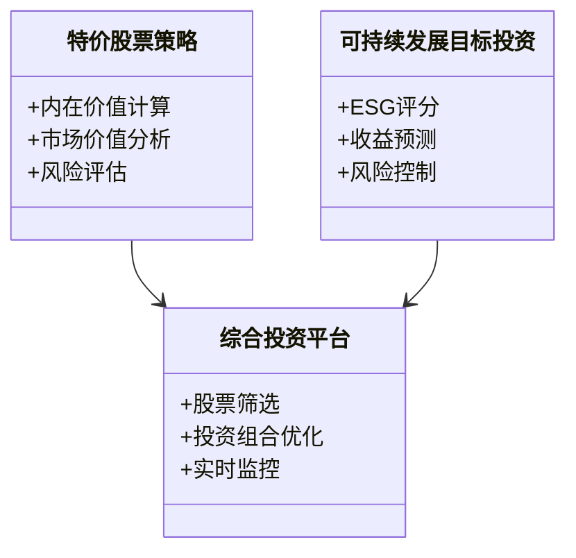
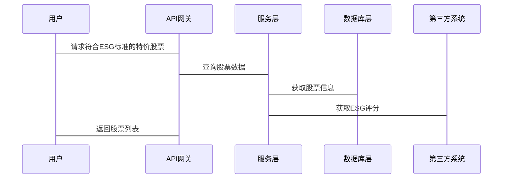

                 


# 如何将特价股票策略与可持续发展目标投资结合

> 关键词：特价股票策略，可持续发展目标投资，金融模型，风险管理，投资组合优化

> 摘要：本文探讨如何将特价股票策略与可持续发展目标投资相结合，通过数学模型和系统设计，提出一种综合考虑财务表现和社会责任的投资方法，旨在为投资者提供更优的决策支持。

---

## 正文

### 第一部分：背景介绍

#### 第1章：特价股票策略与可持续发展目标投资的背景

##### 1.1 特价股票策略的基本概念

- **1.1.1 特价股票的定义**
  特价股票是指市场价格低于其内在价值的股票。通常，这类股票具有较高的潜在回报，但可能暂时被市场低估。

- **1.1.2 特价股票的分类与特点**
  特价股票可以分为价值型股票和成长型股票。价值型股票通常市盈率较低，成长型股票则具有较高的增长潜力。

- **1.1.3 特价股票的市场定位与作用**
  特价股票在市场中起到平衡投资组合的作用，尤其在市场下跌时，能够提供较高的安全边际。

##### 1.2 可持续发展目标投资的基本概念

- **1.2.1 可持续发展目标投资的定义**
  可持续发展目标投资是指在投资决策中考虑环境、社会和治理（ESG）因素的投资策略。

- **1.2.2 可持续发展目标投资的核心原则**
  可持续发展目标投资强调长期价值创造，关注企业对社会和环境的积极影响。

- **1.2.3 可持续发展目标投资的全球发展趋势**
  随着全球对气候变化和社会责任的关注增加，可持续发展目标投资越来越受到投资者的青睐。

##### 1.3 特价股票策略与可持续发展目标投资的结合背景

- **1.3.1 当前金融市场的发展趋势**
  传统投资策略逐渐向可持续发展方向转型，投资者不仅关注财务回报，还关注企业的社会责任。

- **1.3.2 可持续发展目标投资的市场需求**
  越来越多的投资者希望其投资组合能够对社会产生积极影响，同时获得财务回报。

- **1.3.3 特价股票策略在可持续发展目标投资中的潜力**
  特价股票通常具有较高的内在价值，结合可持续发展目标，可以在保证收益的同时，支持社会责任项目。

---

### 第二部分：核心概念与联系

#### 第2章：特价股票策略与可持续发展目标投资的核心概念

##### 2.1 特价股票策略的核心原理

- **2.1.1 特价股票的定价机制**
  特价股票的定价基于内在价值与市场价值的差异，通常通过基本面分析确定。

- **2.1.2 特价股票的市场分析方法**
  通过技术分析和基本面分析，识别市场低估的股票。

- **2.1.3 特价股票的风险评估与管理**
  通过分散投资和定期监控，降低投资风险。

##### 2.2 可持续发展目标投资的核心原理

- **2.2.1 可持续发展目标的评估标准**
  使用ESG指标评估企业的环境、社会和治理表现。

- **2.2.2 可持续发展目标投资的伦理与社会影响**
  投资于符合社会责任的企业，促进社会和环境的可持续发展。

- **2.2.3 可持续发展目标投资的经济效益分析**
  长期来看，可持续发展目标投资可能带来超额收益。

##### 2.3 特价股票策略与可持续发展目标投资的联系

- **2.3.1 特价股票策略在可持续发展目标投资中的应用潜力**
  通过筛选符合ESG标准的特价股票，投资者可以在获得超额收益的同时，支持可持续发展。

- **2.3.2 可持续发展目标投资对特价股票策略的促进作用**
  可持续发展目标投资的兴起为特价股票提供了新的价值发现机会。

- **2.3.3 两者结合的理论基础与实践意义**
  结合两者可以实现财务回报与社会责任的双重目标，为投资者提供更优的选择。

---

### 第三部分：数学模型与算法原理

#### 第3章：特价股票策略与可持续发展目标投资的数学模型

##### 3.1 特价股票策略的数学模型

- **3.1.1 特价股票的定价模型**
  $$\text{内在价值} = \frac{\text{股息}}{\text{贴现率}}$$

- **3.1.2 特价股票的风险评估模型**
  使用CAPM模型评估股票的预期收益：
  $$\text{预期收益} = r_f + \beta (r_m - r_f)$$

- **3.1.3 特价股票的市场趋势预测模型**
  使用ARIMA模型预测股票价格走势。

##### 3.2 可持续发展目标投资的数学模型

- **3.2.1 可持续发展目标的评估指标体系**
  使用ESG评分系统，权重分别为环境（40%）、社会（30%）和治理（30%）。

- **3.2.2 可持续发展目标投资的收益预测模型**
  $$\text{预期收益} = \alpha \times \text{ESG评分} + \beta \times \text{市场收益}$$

- **3.2.3 可持续发展目标投资的风险控制模型**
  使用VaR方法评估投资组合的风险。

##### 3.3 两者结合的综合数学模型

- **3.3.1 综合评分公式**
  $$\text{综合评分} = 0.5 \times \text{内在价值评分} + 0.5 \times \text{ESG评分}$$

- **3.3.2 综合收益模型**
  $$\text{综合收益} = \sum_{i=1}^n w_i \times r_i$$
  其中，$w_i$是股票$i$的投资权重，$r_i$是股票$i$的预期收益。

---

### 第四部分：系统分析与架构设计方案

#### 第4章：系统功能设计与架构

##### 4.1 问题场景介绍

- 投资者希望在投资组合中加入可持续发展目标投资，同时利用特价股票策略获取超额收益。

##### 4.2 项目介绍

- 开发一个综合投资平台，帮助投资者筛选符合ESG标准的特价股票。

##### 4.3 系统功能设计（领域模型）



##### 4.4 系统架构设计


##### 4.5 系统接口设计

- API接口：
  - GET /stocks?esg=true：获取符合ESG标准的股票列表。
  - POST /portfolio：优化投资组合。

##### 4.6 系统交互设计



---

### 第五部分：项目实战

#### 第5章：环境安装与核心实现

##### 5.1 环境安装

- 安装Python和相关库：
  ```bash
  pip install pandas numpy matplotlib requests
  ```

##### 5.2 核心代码实现

```python
import pandas as pd
import numpy as np
import requests

# 获取股票数据
def get_stock_data(ticker):
    url = f"https://api.example.com/stock/{ticker}"
    response = requests.get(url)
    return pd.DataFrame(response.json())

# 计算内在价值
def calculate_intrinsic_value(stock):
    return stock['earnings'] / stock['discount_rate']

# 获取ESG评分
def get_esg_score(ticker):
    url = f"https://esg.example.com/api/{ticker}"
    response = requests.get(url)
    return response.json()['score']

# 综合评分
def calculate综合评分(stock):
    iv = calculate_intrinsic_value(stock)
    esg = get_esg_score(stock['ticker'])
    return 0.5 * iv + 0.5 * esg
```

##### 5.3 案例分析

- 案例：假设股票A的内在价值为50元，ESG评分为80分。
  $$\text{综合评分} = 0.5 \times 50 + 0.5 \times 80 = 65$$

---

### 第六部分：总结与展望

#### 第6章：总结与建议

##### 6.1 最佳实践 tips

- 定期调整投资组合，确保符合最新的ESG标准。
- 结合技术分析和基本面分析，提高投资决策的准确性。

##### 6.2 小结

通过将特价股票策略与可持续发展目标投资结合，投资者可以在获得超额收益的同时，支持社会责任项目。

##### 6.3 注意事项

- 注意市场波动对投资组合的影响。
- 定期评估ESG评分的变化。

##### 6.4 拓展阅读

- 阅读更多关于ESG投资的文献。
- 学习时间序列分析技术，优化股票预测模型。

---

### 作者

作者：AI天才研究院/AI Genius Institute & 禅与计算机程序设计艺术/Zen And The Art of Computer Programming

