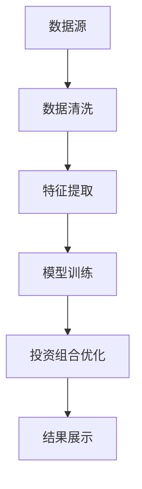

                 


```markdown
# 如何将特价股票策略与固定收益投资结合

> 关键词：特价股票、固定收益投资、资产配置、风险管理、量化分析、投资组合优化

> 摘要：本文详细探讨了如何将特价股票策略与固定收益投资相结合，构建优化的投资组合。通过分析两者的特性，结合量化方法，提出了一种新的投资策略，以实现风险可控下的收益最大化。

---

## 第一部分：特价股票与固定收益投资的背景与基础

### 第1章：特价股票与固定收益投资概述

#### 1.1 特价股票的基本概念
- **定义**：特价股票指的是价格被市场低估的股票，通常具有较高的潜在回报。
- **特点**：
  - 价格波动较大
  - 市盈率或市净率低于行业平均水平
  - 可能存在财务困境或市场误解
- **投资价值**：潜在的高回报，适合长期投资者。

#### 1.2 固定收益投资的基本概念
- **定义**：固定收益投资是指通过投资债券、国债等固定收益工具，获得稳定的利息收入。
- **主要形式**：
  - 国债
  - 企业债
  - 城投债
- **风险与收益**：
  - 低风险，收益稳定
  - 对利率变化敏感，存在再投资风险。

#### 1.3 结合的意义
- **风险分散**：通过组合投资降低整体风险。
- **收益优化**：利用特价股票的高增长潜力，平衡固定收益投资的低收益。
- **适合投资者**：适合风险偏好适中，追求稳定收益的投资者。

---

## 第二部分：核心概念与联系

### 第2章：特价股票策略的核心原理

#### 2.1 市场分析
- **周期分析**：识别市场周期，抓住低估股票的机会。
- **技术分析**：使用K线图、均线等工具辅助决策。
- **基本面分析**：关注公司财务状况和行业前景。

#### 2.2 筛选标准
- **市盈率（PE）**：低于行业平均水平。
- **市净率（PB）**：低于1。
- **ROE**：净资产收益率高。

#### 2.3 交易策略
- **长期持有**：等待市场重估。
- **短期套利**：利用市场波动快速获利。
- **事件驱动**：公司重组、并购等事件驱动的策略。

### 第3章：固定收益投资的核心原理

#### 3.1 产品分类
- **国债**：安全性高，收益稳定。
- **企业债**：收益较高，风险较大。
- **金融债**：由金融机构发行，风险较低。

#### 3.2 定价模型
- **债券定价公式**：
  $$ P = \sum_{t=1}^{n} \frac{C}{(1 + r)^t} + \frac{F}{(1 + r)^n} $$
  其中，C为每年利息，r为收益率，F为面值，n为期限。
- **到期收益率（YTM）**：
  $$ YTM = \left( \frac{C + \left( F - P \right)}{n} \right) $$
  其中，P为购买价格。

#### 3.3 风险管理
- **利率风险**：债券价格与利率反向变动。
- **信用风险**：债券发行人违约风险。
- **流动性风险**：无法及时变现的风险。

### 第4章：特价股票与固定收益投资的结合策略

#### 4.1 组合投资
- **资产配置**：将部分资金投入特价股票，其余投入固定收益产品。
- **风险分散**：通过多样化降低整体风险。
- **收益优化**：利用特价股票的高增长潜力，提高整体收益。

#### 4.2 投资组合优化模型
- **目标**：在风险可控下，最大化收益。
- **约束条件**：
  - 总投资不超过100%
  - 特价股票和固定收益投资的比例合理。
- **优化方法**：使用均值-方差优化模型。

---

## 第三部分：算法原理与数学模型

### 第5章：量化分析方法

#### 5.1 特价股票的量化评估
- **价值评估**：使用市盈率和市净率进行比较。
- **质量评估**：分析公司的财务状况和行业地位。
- **流动性评估**：评估股票的交易量和换手率。

#### 5.2 固定收益产品的量化评估
- **信用评级**：使用 Moody's 和 S&P 的评级。
- **流动性评估**：评估债券的市场深度和交易活跃度。
- **利率风险评估**：计算债券的价格波动性。

#### 5.3 投资组合优化算法
- **数学模型**：
  $$ \text{最大化 } E(R_p) - \lambda \times \text{Var}(R_p) $$
  其中，\( E(R_p) \) 是投资组合的期望收益，\( \text{Var}(R_p) \) 是风险，\( \lambda \) 是风险厌恶系数。
- **算法步骤**：
  1. 确定可投资的资产和权重。
  2. 计算各资产的期望收益和方差。
  3. 使用优化算法求解最优权重。

#### 5.4 代码实现
```python
import numpy as np
import pandas as pd

# 假设我们有两组资产：股票和债券
# 股票收益和波动率
r_stock = 0.12
vol_stock = 0.2

# 债券收益和波动率
r_bond = 0.05
vol_bond = 0.03

# 风险厌恶系数
lambda_val = 4

# 计算组合收益
weights = np.array([0.5, 0.5])
E Rp = weights[0] * r_stock + weights[1] * r_bond

# 计算组合波动率
var Rp = (weights[0] ** 2) * (vol_stock ** 2) + (weights[1] ** 2) * (vol_bond ** 2)

# 计算效用函数
utility = E Rp - lambda_val * var Rp

print(f"最优权重：{weights}")
print(f"组合收益：{E Rp:.2%}")
print(f"组合波动率：{var Rp:.2%}")
print(f"效用函数值：{utility:.2%}")
```

---

## 第四部分：系统分析与架构设计

### 第6章：投资组合管理系统

#### 6.1 系统功能设计
- **数据采集**：获取股票和债券的实时数据。
- **分析模块**：评估资产的价值和风险。
- **优化模块**：计算最优投资组合。
- **监控模块**：实时跟踪投资组合的表现。

#### 6.2 系统架构设计


#### 6.3 接口设计
- **API接口**：与数据源和第三方服务对接。
- **用户界面**：提供友好的操作界面。

---

## 第五部分：项目实战与案例分析

### 第7章：项目实战

#### 7.1 环境安装
- 安装Python、Pandas、NumPy、Matplotlib。
- 安装量化分析工具如Pinecone或QuantLib。

#### 7.2 核心实现
- 数据清洗：处理缺失值和异常值。
- 模型训练：使用机器学习算法预测股票价格。
- 策略回测：测试投资策略的收益和风险。

#### 7.3 案例分析
- 数据来源：使用 historical stock data 和 bond yield data。
- 策略实现：构建一个简单的投资组合，定期再平衡。
- 结果分析：比较不同策略的收益和风险。

---

## 第六部分：最佳实践与总结

### 第8章：总结与建议

#### 8.1 总结
- 结合特价股票和固定收益投资可以有效分散风险，提高收益。
- 量化分析是实现这一目标的关键工具。

#### 8.2 投资建议
- **分散投资**：避免过度集中在某一种资产。
- **定期调整**：根据市场变化及时调整投资组合。
- **风险控制**：设定止损点，避免重大损失。

#### 8.3 注意事项
- 市场波动风险：市场波动可能会影响策略效果。
- 数据质量：确保数据准确和及时。
- 政策风险：关注相关政策变化。

#### 8.4 拓展阅读
- 《投资学》：了解更多的投资理论和策略。
- 《Python量化投资》：学习更多量化分析技术。

---

## 作者：AI天才研究院 & 禅与计算机程序设计艺术

---

通过以上结构和内容，您可以根据需要进一步扩展每一部分，确保文章内容详实，逻辑清晰，帮助读者全面理解如何将特价股票策略与固定收益投资结合。
```

