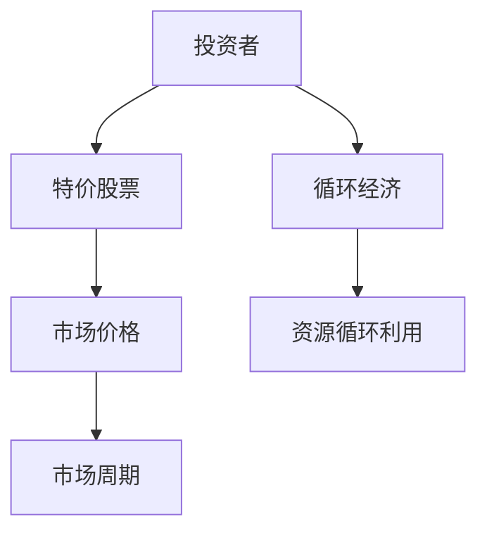
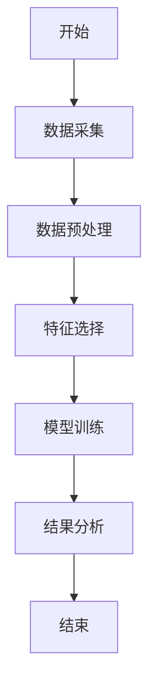

                 


# 如何将特价股票策略与循环经济投资理念结合

> 关键词：特价股票策略，循环经济投资理念，投资策略，可持续发展，股票投资，经济模式

> 摘要：本文将深入探讨如何将特价股票策略与循环经济投资理念结合起来，通过分析两者的核心概念、算法原理、数学模型、系统架构设计以及实际项目案例，为投资者提供一种全新的投资思路。文章内容涵盖背景介绍、核心概念对比、算法实现、系统设计、项目实战和最佳实践等，旨在帮助读者理解如何在股票投资中融入循环经济的理念，实现经济效益与可持续发展的双重目标。

---

## 第一部分：背景介绍

### 第1章：特价股票策略的背景与概念

#### 1.1 问题背景
- **特价股票策略**：在股票市场中，特价股票通常指那些价格被市场低估的股票。投资者通过识别这些股票，能够在市场低迷时以较低的价格买入，待市场回升时卖出，从而获得超额收益。
- **市场周期性**：股票市场具有周期性，投资者需要在市场低谷时寻找低估的股票，在市场高峰时卖出获利。

#### 1.2 问题描述
- **市场波动性**：股票市场的波动性使得投资者需要具备敏锐的市场洞察力，以抓住短期和长期的投资机会。
- **市场参与者的多样性**：投资者包括个人投资者、机构投资者等，他们的行为会影响市场价格。

#### 1.3 问题解决
- **寻找低估股票**：通过分析市场数据和公司基本面，识别出价格低于其内在价值的股票。
- **市场周期分析**：利用市场周期理论，判断市场所处的阶段，选择合适的股票进行投资。

#### 1.4 边界与外延
- **边界**：特价股票策略适用于市场低迷或震荡阶段，且公司基本面良好的股票。
- **外延**：包括技术分析和基本面分析，帮助投资者更全面地评估股票的价值。

#### 1.5 概念结构与核心要素
- **核心要素**：市场数据、公司基本面、市场周期、投资策略。

### 第2章：循环经济投资理念的背景与概念

#### 2.1 问题背景
- **循环经济**：循环经济是一种以资源高效利用和循环利用为核心的发展模式，强调减少资源消耗和环境污染。
- **经济可持续性**：传统的线性经济模式依赖于资源的大量消耗，而循环经济通过资源的循环利用，实现经济的可持续发展。

#### 2.2 问题描述
- **资源消耗问题**：传统经济发展模式导致资源枯竭和环境污染，需要寻找一种更可持续的经济发展模式。
- **环境问题**：全球气候变化、资源枯竭等问题促使各国转向循环经济模式。

#### 2.3 问题解决
- **资源循环利用**：通过技术创新和制度设计，实现资源的高效利用和循环利用。
- **经济发展模式转型**：从依赖资源消耗的线性经济转向循环经济，实现经济可持续发展。

#### 2.4 边界与外延
- **边界**：循环经济投资理念适用于资源消耗较大的行业，如制造业、能源行业等。
- **外延**：包括绿色金融、可持续投资、环境技术等领域。

#### 2.5 概念结构与核心要素
- **核心要素**：资源循环利用、技术创新、制度设计、经济发展模式。

---

## 第二部分：核心概念与联系

### 第3章：特价股票策略的核心原理

#### 3.1 核心原理
- **市场定价理论**：股票价格反映市场参与者的预期和市场信息。
- **价值投资理论**：寻找价格低于其内在价值的股票，长期持有的投资策略。

#### 3.2 核心属性特征对比
| 特性       | 特价股票策略                     | 循环经济投资理念                     |
|------------|----------------------------------|--------------------------------------|
| 核心目标   | 获取超额收益                     | 实现经济可持续发展                     |
| 投资策略   | 低买高卖                         | 资源循环利用                         |
| 风险因素   | 市场波动性                        | 资源依赖性                            |
| 收益来源   | 价格回升                          | 资源节约和技术创新                    |

#### 3.3 实体关系图


### 第4章：循环经济投资理念的核心原理

#### 4.1 核心原理
- **资源循环利用**：通过技术创新和制度设计，实现资源的高效利用和循环利用。
- **经济可持续发展**：减少资源消耗和环境污染，实现经济与环境的协调发展。

#### 4.2 核心属性特征对比
| 特性       | 特价股票策略                     | 循环经济投资理念                     |
|------------|----------------------------------|--------------------------------------|
| 核心目标   | 获取超额收益                     | 实现经济可持续发展                     |
| 投资策略   | 低买高卖                         | 资源循环利用                         |
| 风险因素   | 市场波动性                        | 资源依赖性                            |
| 收益来源   | 价格回升                          | 资源节约和技术创新                    |

#### 4.3 实体关系图


---

## 第三部分：算法原理与数学模型

### 第5章：特价股票策略的算法实现

#### 5.1 算法概述
- **算法名称**：基于市场周期的特价股票识别算法。
- **算法目标**：识别市场价格低于其内在价值的股票。

#### 5.2 算法流程


#### 5.3 算法实现
```python
import pandas as pd
import numpy as np

# 数据预处理
data = pd.read_csv('stock_data.csv')
data = data.dropna()

# 特征选择
features = ['price', 'volume', 'PE_ratio']
data_features = data[features]

# 模型训练
from sklearn.linear_model import LinearRegression
model = LinearRegression()
model.fit(data_features, data['target'])

# 结果分析
predictions = model.predict(data_features)
print(predictions)
```

#### 5.4 数学模型
- **回归分析模型**：
$$ y = \beta_0 + \beta_1x_1 + \beta_2x_2 + \epsilon $$

---

## 第四部分：系统分析与架构设计

### 第6章：投资决策支持系统的架构设计

#### 6.1 问题场景介绍
- **问题场景**：投资者需要在股票市场中寻找低估的股票，同时考虑循环经济的理念，实现可持续发展。

#### 6.2 系统功能设计
- **数据采集模块**：采集股票市场数据和公司基本面数据。
- **数据分析模块**：对数据进行预处理和特征选择，构建模型进行分析。
- **投资决策模块**：根据模型结果，生成投资建议。

#### 6.3 系统架构设计


---

## 第五部分：项目实战

### 第7章：特价股票策略与循环经济投资理念的结合

#### 7.1 环境安装
- **安装Python**：Python 3.8或更高版本。
- **安装依赖库**：`pandas`, `numpy`, `scikit-learn`, `mermaid`。

#### 7.2 系统核心实现
```python
import pandas as pd
import numpy as np
from sklearn.linear_model import LinearRegression

# 数据预处理
data = pd.read_csv('stock_data.csv')
data = data.dropna()

# 特征选择
features = ['price', 'volume', 'PE_ratio']
data_features = data[features]

# 模型训练
model = LinearRegression()
model.fit(data_features, data['target'])

# 结果分析
predictions = model.predict(data_features)
print(predictions)
```

#### 7.3 代码解读与分析
- **数据预处理**：去除缺失值，确保数据的完整性。
- **特征选择**：选择影响股票价格的关键特征。
- **模型训练**：使用线性回归模型进行预测。
- **结果分析**：输出模型预测结果，评估模型的准确性。

#### 7.4 实际案例分析
- **案例背景**：假设某制造企业在市场低迷时期，其股票价格被低估，同时企业采用循环经济模式，资源利用效率高。
- **分析结果**：模型预测该股票价格将回升，投资者可以买入该股票，同时支持企业的可持续发展。

#### 7.5 项目小结
- **项目总结**：通过将特价股票策略与循环经济投资理念结合，投资者可以在获取超额收益的同时，支持企业的可持续发展。
- **项目意义**：实现经济与环境的协调发展，促进循环经济的发展。

---

## 第六部分：最佳实践与注意事项

### 第8章：最佳实践

#### 8.1 小结
- **总结**：本文通过分析特价股票策略与循环经济投资理念的核心概念和联系，提出了将两者结合的投资策略。
- **经验总结**：投资者在实际操作中，应结合市场环境和企业基本面，灵活调整投资策略。

#### 8.2 注意事项
- **风险管理**：投资者应注重市场风险，避免过度依赖单一策略。
- **持续学习**：市场环境不断变化，投资者需要持续学习，更新投资策略。

#### 8.3 拓展阅读
- **推荐书籍**：《循环经济与投资》、《股票投资策略》。
- **推荐阅读**：相关领域的学术论文和行业报告。

---

## 作者信息

作者：AI天才研究院/AI Genius Institute & 禅与计算机程序设计艺术/Zen And The Art of Computer Programming

