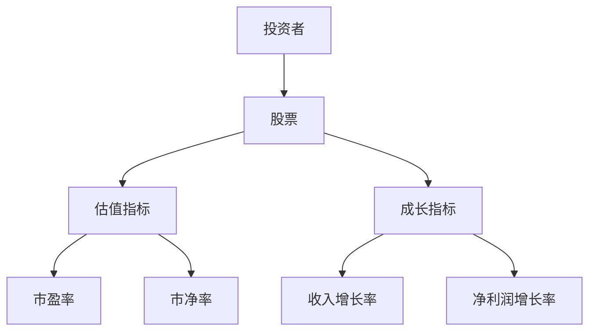
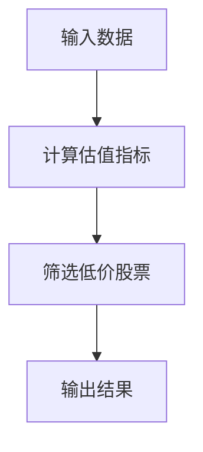
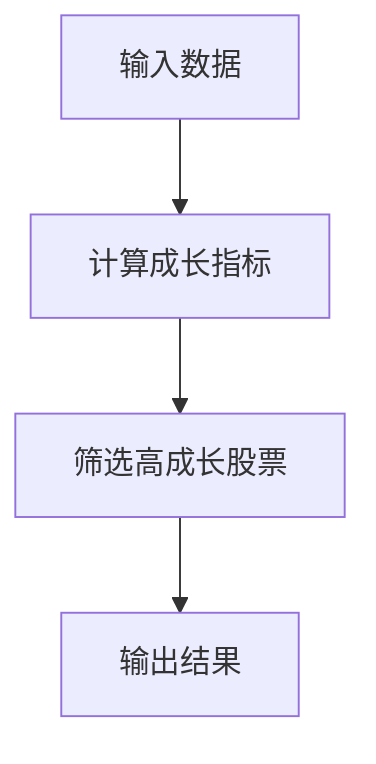
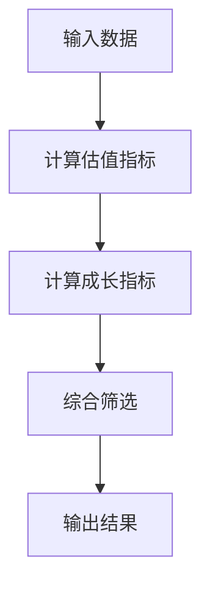
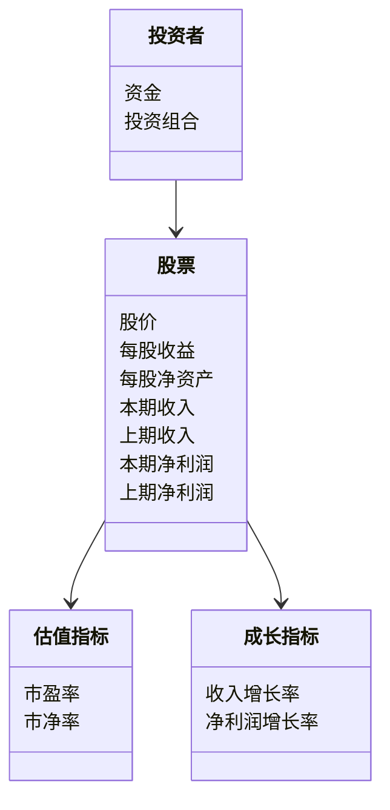
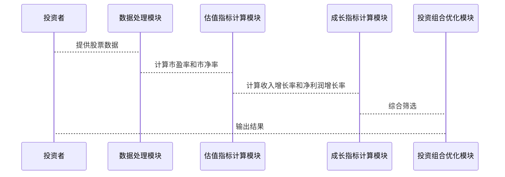

                 


# 如何将特价股票策略与成长投资相结合

> 关键词：特价股票，成长投资，股票策略，投资组合，风险管理

> 摘要：本文将详细探讨如何将特价股票策略与成长投资相结合，通过分析两者的核心概念、数学模型、算法原理以及实际案例，帮助投资者制定更有效的投资策略。

---

# 第一部分: 特价股票策略与成长投资的背景介绍

## 第1章: 特价股票策略的核心概念

### 1.1 特价股票的定义与特征

- **特价股票的定义**: 特价股票是指市场价格低于其内在价值的股票，通常被认为被市场低估。
- **特征**:
  - 低市盈率（P/E ratio）
  - 低市净率（P/B ratio）
  - 股价低于每股净资产（Price < Book Value per Share）
  - 通常出现在周期性低谷或市场恐慌期间

### 1.2 特价股票的市场背景

- **市场波动性**: 特价股票往往在市场下跌或恐慌时出现。
- **投资者情绪**: 市场恐慌时，理性投资者可以利用市场非理性下跌的机会。
- **周期性行业**: 如房地产、能源等行业在周期性低谷时可能出现特价股票。

### 1.3 特价股票与成长投资的结合意义

- **双重优势**: 通过投资特价股票，投资者既能获得低估值的优势，又能享受成长股的增长潜力。
- **风险与收益平衡**: 结合成长性和估值，可以在控制风险的同时追求更高的收益。

---

## 第2章: 成长投资的核心概念

### 2.1 成长投资的定义与特征

- **定义**: 成长投资是指投资于那些收入和利润持续增长的公司，即使当前估值较高。
- **特征**:
  - 高收入增长率
  - 高净利润增长率
  - 高ROE（Return on Equity）
  - 通常出现在高增长行业，如科技、生物技术等。

### 2.2 成长投资的市场背景

- **高增长行业**: 科技、互联网、新能源等领域。
- **市场预期**: 市场对高增长公司的未来盈利有较高预期。
- **风险与收益**: 成长股通常波动较大，但长期收益潜力高。

### 2.3 成长投资与特价股票的结合价值

- **结合优势**: 通过投资成长性好的特价股票，可以在控制估值风险的同时，享受成长股的增长潜力。
- **动态调整**: 根据市场变化，动态调整投资组合中特价股票和成长股的比例。

---

# 第二部分: 特价股票策略与成长投资的核心概念与联系

## 第3章: 特价股票与成长投资的核心要素对比

### 3.1 估值指标对比

| 指标         | 特价股票关注点       | 成长投资关注点       |
|--------------|----------------------|----------------------|
| 市盈率（P/E） | 低                   | 高或合理             |
| 市净率（P/B） | 低                   | 高或合理             |
| 股价与书值    | 低于书值             | 接近或略高于书值      |

### 3.2 成长指标对比

| 指标         | 特价股票关注点       | 成长投资关注点       |
|--------------|----------------------|----------------------|
| 收入增长率    | 中低                 | 高                   |
| 净利润增长率  | 中低                 | 高                   |
| ROE          | 中低                 | 高                   |

### 3.3 风险指标对比

| 指标         | 特价股票关注点       | 成长投资关注点       |
|--------------|----------------------|----------------------|
| 波动率        | 低                   | 高                   |
| 贝塔系数      | 小于1                | 大于1                |

---

## 第4章: 特价股票与成长投资的ER实体关系图



---

# 第三部分: 特价股票策略与成长投资的算法原理

## 第5章: 特价股票筛选算法

### 5.1 算法步骤



### 5.2 算法实现

```python
def screen_penny_stocks(data, threshold):
    # 计算市盈率
    data['PE'] = data['股价'] / data['每股收益']
    # 筛选市盈率低于阈值的股票
    data = data[data['PE'] < threshold]
    return data
```

---

## 第6章: 成长投资筛选算法

### 6.1 算法步骤



### 6.2 算法实现

```python
def screen_growth_stocks(data, threshold):
    # 计算收入增长率
    data['收入增长率'] = (data['本期收入'] - data['上期收入']) / data['上期收入']
    # 筛选收入增长率高于阈值的股票
    data = data[data['收入增长率'] > threshold]
    return data
```

---

## 第7章: 综合策略算法

### 7.1 算法步骤



### 7.2 算法实现

```python
def combined_strategy(data, pe_threshold, growth_threshold):
    # 计算市盈率
    data['PE'] = data['股价'] / data['每股收益']
    # 筛选市盈率低于阈值的股票
    data = data[data['PE'] < pe_threshold]
    # 计算收入增长率
    data['收入增长率'] = (data['本期收入'] - data['上期收入']) / data['上期收入']
    # 筛选收入增长率高于阈值的股票
    data = data[data['收入增长率'] > growth_threshold]
    return data
```

---

# 第四部分: 特价股票与成长投资的数学模型与公式

## 第8章: 特价股票筛选公式

- 市盈率公式：
  $$ \text{市盈率} = \frac{\text{股价}}{\text{每股收益}} $$

- 市净率公式：
  $$ \text{市净率} = \frac{\text{股价}}{\text{每股净资产}} $$

## 第9章: 成长投资筛选公式

- 收入增长率公式：
  $$ \text{收入增长率} = \frac{\text{本期收入} - \text{上期收入}}{\text{上期收入}} $$

- 净利润增长率公式：
  $$ \text{净利润增长率} = \frac{\text{本期净利润} - \text{上期净利润}}{\text{上期净利润}} $$

---

# 第五部分: 特价股票与成长投资的系统分析与架构设计

## 第10章: 系统功能设计

### 10.1 领域模型



---

## 第11章: 系统架构设计


---

## 第12章: 系统接口设计

### 12.1 输入接口

- 数据输入格式：CSV或Excel
- 数据字段：股价、每股收益、每股净资产、本期收入、上期收入、本期净利润、上期净利润

### 12.2 输出接口

- 输出格式：CSV或Excel
- 输出字段：股票名称、市盈率、市净率、收入增长率、净利润增长率、综合得分

---

## 第13章: 系统交互设计

### 13.1 交互流程



---

# 第六部分: 特价股票与成长投资的项目实战

## 第14章: 环境安装与配置

### 14.1 环境要求

- Python 3.8+
- Pandas、NumPy、Matplotlib库

### 14.2 安装依赖

```bash
pip install pandas numpy matplotlib
```

---

## 第15章: 核心实现

### 15.1 数据获取

```python
import pandas as pd

# 从CSV文件加载数据
data = pd.read_csv('stock_data.csv')
```

### 15.2 估值指标计算

```python
data['PE'] = data['股价'] / data['每股收益']
data['PB'] = data['股价'] / data['每股净资产']
```

### 15.3 成长指标计算

```python
data['收入增长率'] = (data['本期收入'] - data['上期收入']) / data['上期收入']
data['净利润增长率'] = (data['本期净利润'] - data['上期净利润']) / data['上期净利润']
```

### 15.4 综合筛选

```python
# 筛选市盈率低于20的股票
data = data[data['PE'] < 20]
# 筛收收入增长率高于10%的股票
data = data[data['收入增长率'] > 0.1]
```

---

## 第16章: 案例分析与解读

### 16.1 案例分析

假设我们有以下数据：

| 股票名称 | 股价 | 每股收益 | 每股净资产 | 本期收入 | 上期收入 | 本期净利润 | 上期净利润 |
|----------|------|----------|------------|----------|----------|-----------|-----------|
| 股票A    | 10   | 5        | 6          | 100      | 90       | 30        | 25        |
| 股票B    | 20   | 4        | 5          | 150      | 120      | 40        | 35        |
| 股票C    | 30   | 6        | 7          | 180      | 150      | 50        | 40        |

### 16.2 筛选过程

1. 计算市盈率：
   - 股票A：10 / 5 = 2
   - 股票B：20 / 4 = 5
   - 股票C：30 / 6 = 5

2. 筛选市盈率低于5的股票：股票A和股票B。

3. 计算收入增长率：
   - 股票A：(100 - 90) / 90 ≈ 11.11%
   - 股票B：(150 - 120) / 120 = 25%
   - 股票C：(180 - 150) / 150 = 20%

4. 筛选收入增长率高于10%的股票：股票A、股票B和股票C。

5. 综合筛选结果：股票A、股票B和股票C均满足条件。

---

## 第17章: 项目小结

- **成功之处**: 成功筛选出符合条件的特价成长股。
- **改进空间**: 可以引入更多指标（如ROE、贝塔系数等）进行综合筛选。
- **注意事项**: 需要动态调整筛选阈值，以应对市场变化。

---

# 第七部分: 总结与展望

## 第18章: 总结

- **核心观点**: 特价股票策略与成长投资的结合可以在控制估值风险的同时，享受成长股的增长潜力。
- **主要收获**: 通过算法和数学模型，投资者可以系统地筛选出符合条件的特价成长股。

## 第19章: 未来展望

- **算法优化**: 引入更多指标和机器学习算法进行综合筛选。
- **动态调整**: 根据市场变化动态调整投资组合。
- **风险管理**: 开发更完善的风控制度，降低投资风险。

---

# 作者

作者：AI天才研究院/AI Genius Institute & 禅与计算机程序设计艺术 /Zen And The Art of Computer Programming

