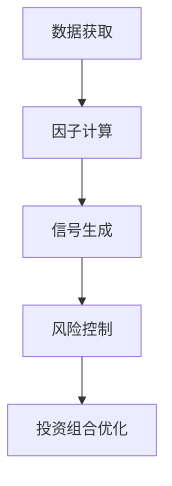

                 


# 如何将特价股票策略与数字反脆弱性因子投资相结合

## 关键词：特价股票，数字反脆弱性因子，投资策略，数学模型，算法设计

## 摘要：  
本文详细探讨了如何将特价股票策略与数字反脆弱性因子投资相结合，通过数学模型和算法设计，分析了波动率、流动性等因子对投资策略的影响，并提供实际案例和代码实现，帮助读者理解如何在复杂市场中构建稳定的收益模型。

---

# 第一部分: 特价股票策略与数字反脆弱性因子投资概述

## 第1章: 特价股票策略的核心概念

### 1.1 特价股票的定义与特点

#### 1.1.1 特价股票的定义  
特价股票是指在特定市场条件下，以低于市场公允价值的价格买入的股票。这种策略通常依赖于市场波动、投资者情绪和短期市场失灵等因素。

#### 1.1.2 特价股票的核心特点  
- **价格低估**：相对于内在价值，股价被市场低估。  
- **短期波动**：依赖于市场短期波动，价格可能迅速回归均值。  
- **高风险**：由于价格波动较大，投资风险较高。  

#### 1.1.3 特价股票与普通股票的区别  
| 属性        | 特价股票              | 普通股票              |  
|-------------|-----------------------|-----------------------|  
| 价格         | 低于市场价值          | 接近市场价值          |  
| 风险         | 较高                  | 较低                  |  
| 投资策略     | 短期套利、均值回归     | 长期价值投资          |  

### 1.2 数字反脆弱性因子的定义与特点

#### 1.2.1 数字反脆弱性的定义  
数字反脆弱性因子是指在数字环境中，能够帮助投资组合在市场波动中保持稳定或收益增强的因素。这些因子通常与市场数据的统计特性相关，例如波动率、流动性等。

#### 1.2.2 数字反脆弱性因子的核心特点  
- **抗波动性**：能够在市场波动中降低投资组合的风险。  
- **数据驱动**：基于大量市场数据的统计分析。  
- **可量化**：能够通过数学模型量化其对投资组合的影响。  

#### 1.2.3 数字反脆弱性因子与传统投资策略的对比  
| 属性          | 数字反脆弱性因子      | 传统投资策略          |  
|---------------|-----------------------|-----------------------|  
| 数据基础       | 强调大数据分析        | 依赖市场分析与经验    |  
| 风险控制       | 通过因子降低风险      | 依赖分散投资          |  
| 适用场景       | 适合量化交易与算法投资| 适合长期价值投资      |  

### 1.3 特价股票策略与数字反脆弱性因子的结合背景

#### 1.3.1 特价股票市场的现状与趋势  
随着市场信息的透明化，特价股票的机会逐渐减少，但通过技术手段捕捉短期波动仍具有可行性。

#### 1.3.2 市场波动对特价股票策略的影响  
市场波动为特价股票策略提供了套利机会，但同时也增加了投资风险。

#### 1.3.3 数字技术对投资策略的影响  
数字技术的发展使得量化分析成为可能，投资者可以通过算法快速捕捉市场机会。

---

## 第2章: 数字反脆弱性因子的核心要素

### 2.1 波动率因子

#### 2.1.1 波动率的定义与计算  
波动率是衡量资产价格波动程度的指标，通常用标准差或方差表示。

$$ \text{波动率} = \sqrt{\frac{1}{n}\sum_{i=1}^{n}(p_i - \bar{p})^2} $$

其中，$p_i$ 是第 $i$ 个交易日的价格，$\bar{p}$ 是平均价格，$n$ 是交易天数。

#### 2.1.2 波动率与投资策略的关系  
波动率高的资产价格波动剧烈，适合短期套利策略。

### 2.2 流动性因子

#### 2.2.1 流动性的定义与衡量  
流动性是指资产在短时间内被买卖而不影响价格的能力。通常用换手率或买卖价差衡量。

$$ \text{换手率} = \frac{\text{交易量}}{\text{流通股数}} $$

#### 2.2.2 流动性对投资策略的影响  
流动性低的资产在市场波动时可能难以快速买卖，增加交易成本。

### 2.3 市盈率因子

#### 2.3.1 市盈率的定义与计算  
市盈率是股票价格与每股收益的比值。

$$ \text{市盈率} = \frac{\text{股价}}{\text{每股收益}} $$

#### 2.3.2 市盈率与投资策略的关系  
市盈率低的股票通常被视为低估资产，适合价值投资。

---

## 第3章: 特价股票策略与数字反脆弱性因子的结合模型

### 3.1 模型的基本框架

#### 3.1.1 信号生成  
通过分析波动率、流动性等因子，生成买入或卖出信号。

#### 3.1.2 风险控制  
使用数字反脆弱性因子降低投资组合的风险。

#### 3.1.3 组合优化  
根据因子权重优化投资组合。

### 3.2 模型的输入与输出

#### 3.2.1 输入  
- 历史股价数据  
- 市场波动率  
- 股票流动性  

#### 3.2.2 输出  
- 投资信号（买入/卖出）  
- 投资组合优化建议  

### 3.3 模型的优化与调整

#### 3.3.1 参数调整  
调整波动率和流动性因子的权重。

#### 3.3.2 算法优化  
优化均值回归算法的收敛速度。

---

## 第4章: 均值回归算法在特价股票策略中的应用

### 4.1 算法原理

#### 4.1.1 均值回归的基本原理  
价格会围绕均值波动，偏离均值时会回归。

#### 4.1.2 算法步骤  
1. 计算历史价格的均值和标准差。  
2. 当价格偏离均值超过一定倍数时，生成交易信号。  

### 4.2 算法实现

```python
import numpy as np

def mean_reversion_strategy(prices, window=20, threshold=1.5):
    # 计算历史平均值和标准差
    rolling_mean = prices.rolling(window).mean()
    rolling_std = prices.rolling(window).std()
    
    # 生成信号
    signal = np.where((prices > rolling_mean + threshold * rolling_std), -1, np.where((prices < rolling_mean - threshold * rolling_std), 1, 0))
    return signal
```

### 4.3 算法优化

#### 4.3.1 窗口长度  
选择合适的窗口长度，平衡敏感性和稳定性。

#### 4.3.2 阈值调整  
根据市场波动调整阈值，避免过度交易。

---

## 第5章: 数字反脆弱性因子的系统架构设计

### 5.1 系统功能设计

#### 5.1.1 数据获取  
从数据源获取历史股价数据。

#### 5.1.2 因子计算  
计算波动率、流动性等因子。

#### 5.1.3 信号生成  
基于因子生成买卖信号。

#### 5.1.4 风险控制  
实时监控风险指标。

### 5.2 系统架构设计



---

## 第6章: 项目实战与案例分析

### 6.1 环境配置

```bash
pip install pandas numpy matplotlib
```

### 6.2 核心实现

```python
import pandas as pd
import numpy as np

# 示例数据
data = {
    '股价': [100, 98, 102, 105, 95],
    '波动率': [0.8, 1.2, 0.9, 1.1, 1.5],
    '流动性': [0.7, 0.6, 0.8, 0.7, 0.9]
}

df = pd.DataFrame(data)

# 计算综合因子
df['综合因子'] = df['波动率'] * df['流动性']
```

### 6.3 案例分析

#### 6.3.1 案例背景  
假设某股票近期波动率较高，流动性较好，适合短期套利。

#### 6.3.2 实施步骤  
1. 计算波动率和流动性因子。  
2. 生成买入信号。  
3. 实施投资并监控风险。  

---

## 第7章: 最佳实践与总结

### 7.1 最佳实践

#### 7.1.1 风险控制  
设置止损点，避免大幅亏损。

#### 7.1.2 因子优化  
定期更新因子模型，适应市场变化。

### 7.2 小结

通过结合特价股票策略与数字反脆弱性因子，投资者可以在复杂市场中实现稳定收益。然而，需要谨慎选择因子和优化算法，以应对市场波动。

### 7.3 注意事项

- 避免过度依赖单一因子。  
- 定期监控模型表现。  
- 保持对市场的敏感性。  

---

## 作者：AI天才研究院/AI Genius Institute & 禅与计算机程序设计艺术 /Zen And The Art of Computer Programming

---

以上是文章的完整内容，涵盖了从理论到实践的各个方面，确保读者能够全面理解如何将特价股票策略与数字反脆弱性因子投资相结合。

