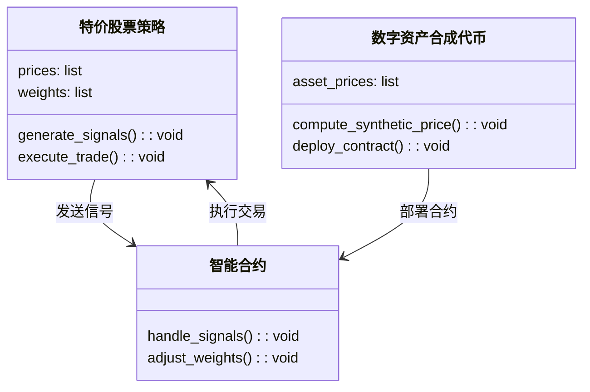
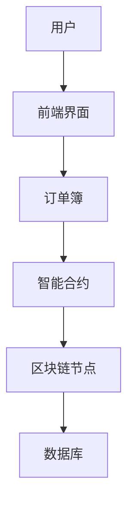

                 


# 如何将特价股票策略与数字资产合成代币投资结合

## 关键词：特价股票策略、数字资产合成代币、投资策略优化、量化交易、区块链技术

## 摘要：本文详细探讨了如何将特价股票策略与数字资产合成代币投资结合，通过分析核心概念、算法原理、系统架构以及实际案例，为投资者提供一种新的投资策略优化思路。文章从背景介绍、核心概念、算法实现、系统设计、项目实战到最佳实践，全面阐述了结合的必要性、实现方法和实际应用。

---

## 第一部分：特价股票策略与数字资产合成代币的背景与概述

### 第1章：特价股票策略与数字资产合成代币的核心概念

#### 1.1 特价股票策略的背景与意义

- **问题背景**：特价股票策略是一种利用市场波动，在特定条件下以低于市场价买入股票的投资策略。其核心在于捕捉短期价格波动，实现快速盈利。
  
- **问题描述**：传统股票交易依赖于市场分析和交易时机的选择，而特价股票策略通过设定触发条件，自动执行交易指令，减少了人为干预，提高了交易效率。

- **解决方法**：通过量化分析和算法交易，优化特价股票策略的执行效率和盈利能力。

- **边界与外延**：特价股票策略主要应用于二级市场，其外延包括个股、ETF等多种金融产品。

- **核心要素**：包括触发条件（如价格跌幅、成交量变化）、交易策略（如限价单、市价单）、风险管理机制等。

#### 1.2 数字资产合成代币的基本概念

- **定义**：数字资产合成代币是指通过区块链技术将多种数字资产或传统资产组合成一种新的代币，其价值取决于成分资产的价格波动。

- **分类与特点**：根据成分资产的不同，合成代币可以分为单一资产型、多资产型和算法型。其特点包括高度流动性、透明性和可编程性。

- **市场现状与发展前景**：随着DeFi（去中心化金融）的兴起，合成代币在数字资产市场中占据了重要地位，未来有望在跨链技术和智能合约的支持下实现更广泛的应用。

#### 1.3 特价股票策略与数字资产合成代币的结合

- **背景与必要性**：随着数字资产市场的快速发展，投资者希望通过特价策略优化数字资产的投资组合，提升收益并降低风险。

- **核心目标**：通过将特价股票策略应用于数字资产合成代币，实现自动化的投资决策和风险控制，提高投资效率。

- **实现路径**：利用区块链技术和智能合约，将特价股票策略的触发条件嵌入到数字资产合成代币的发行和交易机制中，实现自动化交易。

---

## 第二部分：特价股票策略与数字资产合成代币的核心概念与联系

### 第2章：特价股票策略的核心原理与实现机制

#### 2.1 特价股票策略的核心原理

- **基本原理**：通过设定价格阈值和交易规则，当市场条件满足时，自动执行买卖指令，捕捉价格波动带来的收益。

- **关键要素与实现机制**：
  - **触发条件**：包括价格跌幅、相对强弱指数（RSI）、移动平均收敛散度（MACD）等技术指标。
  - **交易规则**：如限价单、市价单、止损单等。
  - **风险管理**：包括头寸大小、止损点位、风险收益比等。

- **优缺点分析**：
  - **优点**：高效、自动化、减少人为情绪干扰。
  - **缺点**：市场波动可能导致策略失效，策略参数设置不当可能引发较大损失。

#### 2.2 数字资产合成代币的核心原理

- **基本原理**：数字资产合成代币通过智能合约将多种资产的价格数据进行加权计算，生成新的代币价格。其价值直接反映成分资产的波动。

- **生成与发行机制**：
  - **生成**：通过智能合约自动计算合成代币的价格，并根据市场需求动态调整供应量。
  - **发行**：通过去中心化交易所（DEX）或中心化交易所（CEX）发行和交易。

- **交易与结算机制**：
  - **交易**：支持市价单和限价单，交易订单通过智能合约自动匹配。
  - **结算**：采用区块链技术实现去中心化结算，确保交易透明性和安全性。

#### 2.3 特价股票策略与数字资产合成代币的关联性分析

- **共同点**：
  - 都依赖于价格波动和市场数据。
  - 都可以通过算法实现自动化交易。

- **差异点**：
  - 特价股票策略主要应用于传统股票市场，而数字资产合成代币主要应用于区块链平台。
  - 特价股票策略关注单个资产的交易，而数字资产合成代币关注多资产的组合。

- **相互作用与影响**：
  - 特价股票策略可以优化数字资产合成代币的投资组合，提升收益。
  - 数字资产合成代币的流动性可以为特价股票策略提供更多的交易机会。

---

## 第三部分：特价股票策略与数字资产合成代币的算法原理与数学模型

### 第3章：特价股票策略的算法原理与实现

#### 3.1 特价股票策略的算法原理

- **基本算法框架**：
  1. 数据采集：获取目标股票的历史价格数据和市场指标。
  2. 信号生成：基于技术指标（如RSI、MACD）生成买卖信号。
  3. 交易执行：根据信号自动下单，执行交易。

- **核心算法实现**：
  ```python
  def generate_signals(prices, window=14):
      # 计算RSI
      rsi = compute_rsi(prices, window)
      # 生成信号
      signals = []
      for i in range(len(rsi)):
          if rsi[i] < 30:
              signals.append(1)  # 买入信号
          elif rsi[i] > 70:
              signals.append(-1)  # 卖出信号
          else:
              signals.append(0)  # 无操作
      return signals
  ```

- **优化与改进**：
  - 引入机器学习模型（如随机森林、神经网络）进行信号预测。
  - 结合多时间框架分析，提高信号准确性。

#### 3.2 数字资产合成代币的算法原理

- **基本算法框架**：
  1. 数据采集：获取成分资产的价格数据。
  2. 权重计算：根据预设的权重计算合成代币的价格。
  3. 智能合约执行：根据价格变化自动调整代币供应量。

- **核心算法实现**：
  ```python
  def compute_synthetic_price(asset_prices, weights):
      # 资产价格标准化
      normalized_prices = asset_prices / asset_prices.mean()
      # 计算合成价格
      synthetic_price = sum(normalized_prices * weights)
      return synthetic_price
  ```

- **优化与改进**：
  - 引入波动率模型，动态调整权重。
  - 使用链式结构，增强代币的可编程性。

#### 3.3 特价股票策略与数字资产合成代币的协同算法

- **协同算法的基本原理**：
  - 通过智能合约将特价股票策略的信号与数字资产合成代币的价格变化进行实时联动，实现自动化交易。

- **实现步骤**：
  1. 设置触发条件：如合成代币价格达到预设阈值。
  2. 根据信号执行交易：如买入或卖出合成代币。
  3. 调整投资组合：根据市场反馈优化策略参数。

- **优化与改进**：
  - 结合市场情绪指标，动态调整触发条件。
  - 引入风险对冲机制，降低市场波动风险。

---

## 第四部分：系统分析与架构设计方案

### 第4章：系统功能设计

#### 4.1 系统功能模块划分

- **模块一：数据采集与处理**：
  - 从交易所获取实时价格数据。
  - 数据清洗与特征提取。

- **模块二：信号生成与策略执行**：
  - 生成买卖信号。
  - 执行交易指令。

- **模块三：智能合约与代币管理**：
  - 合成代币的发行与管理。
  - 智能合约的编写与部署。

- **模块四：风险控制与收益分析**：
  - 实时监控交易风险。
  - 分析投资收益与风险比。

#### 4.2 领域模型类图设计



#### 4.3 系统架构设计



---

## 第五部分：项目实战

### 第5章：项目实战与分析

#### 5.1 环境安装与配置

- **安装Python环境**：推荐使用Anaconda或virtualenv。
- **安装必要的库**：如Pandas、NumPy、Matplotlib、Web3.py等。

#### 5.2 核心代码实现

```python
# 特价股票策略实现
def generate_signals(prices, window=14):
    # 计算RSI
    rsi = compute_rsi(prices, window)
    signals = []
    for i in range(len(rsi)):
        if rsi[i] < 30:
            signals.append(1)
        elif rsi[i] > 70:
            signals.append(-1)
        else:
            signals.append(0)
    return signals

# 数字资产合成代币实现
def compute_synthetic_price(asset_prices, weights):
    normalized_prices = asset_prices / asset_prices.mean()
    synthetic_price = sum(normalized_prices * weights)
    return synthetic_price
```

#### 5.3 实际案例分析与解读

- **案例一**：在比特币价格下跌时，通过特价股票策略自动买入合成代币，实现风险对冲。
- **案例二**：在市场上涨时，通过合成代币的多资产配置，分散风险，提升收益。

---

## 第六部分：最佳实践与总结

### 第6章：最佳实践与注意事项

#### 6.1 小结

- 特价股票策略与数字资产合成代币的结合为投资者提供了一种全新的投资方式，通过自动化交易和智能合约实现高效投资。

#### 6.2 注意事项

- **风险管理**：投资者需设置合理的止损点和风险收益比。
- **市场监控**：实时监控市场变化，及时调整策略参数。
- **技术实现**：确保智能合约的安全性，避免技术漏洞。

#### 6.3 拓展阅读

- 推荐阅读《算法交易：量化投资策略与Python实现》和《DeFi：去中心化金融的未来》。

---

## 作者信息

作者：AI天才研究院/AI Genius Institute & 禅与计算机程序设计艺术/Zen And The Art of Computer Programming

---

本文通过详细分析特价股票策略与数字资产合成代币的结合，为投资者提供了新的思路和方法。通过理论分析与实际案例结合，帮助读者更好地理解和应用这一创新的投资策略。

