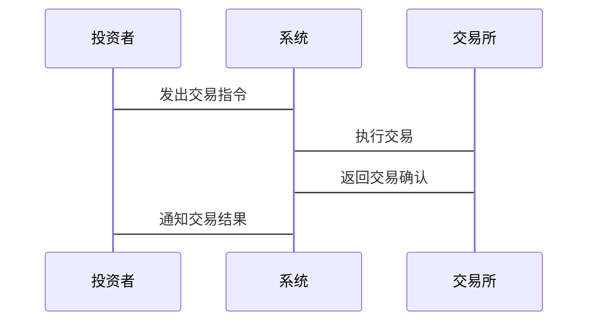

                 


# 如何将特价股票策略与数字资产投资结合

> 关键词：特价股票策略，数字资产投资，策略结合，技术分析，风险管理

> 摘要：本文探讨了如何将特价股票策略与数字资产投资相结合，通过分析两者的核心概念、算法原理和系统架构，展示了如何利用技术手段优化投资策略，同时结合实际案例和风险管理方法，为投资者提供全面的指导。

---

## 第一部分: 特价股票策略与数字资产投资结合的背景与基础

### 第1章: 特价股票策略与数字资产投资概述

#### 1.1 特价股票策略的定义与特点
##### 1.1.1 特价股票的定义
特价股票是指在特定市场条件下，价格低于其内在价值的股票。通常出现在市场下跌、公司基本面变化或市场情绪波动时。

##### 1.1.2 特价股票的核心特点
- 价格低估：股票价格低于其真实价值。
- 高回报潜力：低价买入，高价卖出。
- 风险较高：通常出现在市场波动较大的时期。

##### 1.1.3 特价股票与普通股票的区别
| 特性 | 特价股票 | 普通股票 |
|------|----------|----------|
| 价格 | 低于价值 | 市场价格 | 
| 风险 | 较高      | 中等      |
| 投机性 | 高       | 中         |

#### 1.2 数字资产投资的定义与特点
##### 1.2.1 数字资产的定义
数字资产是指以数字形式存在的资产，如比特币、以太坊等加密货币，以及其他类型的数字代币。

##### 1.2.2 数字资产的核心特点
- 高波动性：价格波动剧烈，适合高风险承受能力的投资者。
- 去中心化：基于区块链技术，交易透明且不可篡改。
- 全球性：不受地域限制，可以在全球范围内自由交易。

##### 1.2.3 数字资产与传统金融资产的区别
| 特性 | 数字资产 | 传统金融资产 |
|------|----------|---------------|
| 交易方式 | 去中心化交易所 | 中央交易所 | 
| 资产特性 | 数字化，不可分割 | 实物或电子形式 | 
| 法律地位 | 无统一监管框架 | 受严格监管 | 

#### 1.3 特价股票策略与数字资产投资的结合意义
##### 1.3.1 结合的背景与动机
- 传统股票市场与数字资产市场的互补性：数字资产市场的高波动性可以为特价股票策略提供新的机会。
- 技术进步：大数据和人工智能技术的发展，使得跨市场的分析和交易成为可能。

##### 1.3.2 结合的优势与潜力
- 利用数字资产市场的高波动性，捕捉短期价格变化。
- 利用特价股票市场的低估机会，结合数字资产的快速交易，实现高回报。

##### 1.3.3 结合的边界与外延
- 仅限于合法的金融市场上。
- 适用于具备技术分析能力的投资者。

#### 1.4 本章小结
本章介绍了特价股票和数字资产的基本概念、特点以及它们结合的意义，为后续内容奠定了基础。

---

### 第2章: 特价股票策略的核心概念与原理

#### 2.1 特价股票策略的核心概念
##### 2.1.1 市场时机选择
正确选择市场时机是特价股票策略的关键，通常通过技术分析和基本面分析来判断。

##### 2.1.2 价格波动预测
利用历史数据和模型预测股票价格的波动，找到买入的最佳时机。

##### 2.1.3 风险控制机制
通过设置止损点和止盈点来控制投资风险。

#### 2.2 特价股票策略的数学模型与公式
##### 2.2.1 时间序列分析模型
使用ARIMA模型预测股票价格：
$$ ARIMA(p, d, q) $$

##### 2.2.2 马尔可夫链模型
用于状态转移分析，确定股票价格的下一个状态。

##### 2.2.3 风险价值（VaR）模型
$$ VaR = \alpha \times \sigma $$

#### 2.3 特价股票策略的算法原理
##### 2.3.1 基于技术分析的算法
- 移动平均线（MA）：计算n天的平均价格，判断价格趋势。
- 相对强弱指数（RSI）：判断超买或超卖状态。

##### 2.3.2 基于机器学习的算法
- 支持向量机（SVM）：用于分类和预测。
- 随机森林：用于特征重要性分析和预测。

##### 2.3.3 基于统计套利的算法
- 股票配对交易：利用股票价格差异回归均值的特性进行套利。

#### 2.4 本章小结
本章详细讲解了特价股票策略的核心概念、数学模型和算法原理，为后续结合数字资产投资奠定了理论基础。

---

### 第3章: 数字资产投资的核心概念与原理

#### 3.1 数字资产投资的核心概念
##### 3.1.1 区块链技术基础
区块链技术确保了数字资产的透明性和不可篡改性。

##### 3.1.2 加密货币的挖矿机制
通过计算哈希值来验证交易并获得新币的过程。

##### 3.1.3 智能合约的应用
智能合约自动执行预设的条件，确保交易的自动化。

#### 3.2 数字资产投资的数学模型与公式
##### 3.2.1 比特币价格预测模型
使用LSTM神经网络进行预测：
$$ LSTM(t) = \sigma(gate\_input) $$

##### 3.2.2 智能合约执行概率模型
$$ P(execute) = \frac{1}{1 + e^{-x}} $$

##### 3.2.3 数字资产波动率模型
$$ \sigma^2 = a + b \times r_{prev} $$

#### 3.3 数字资产投资的算法原理
##### 3.3.1 基于K线图的技术分析算法
- 均线策略：基于短期和长期均线的交叉点判断买入或卖出。
- 布林带策略：判断价格是否在布林带内，决定买卖时机。

##### 3.3.2 基于神经网络的预测算法
- 使用卷积神经网络（CNN）分析K线图特征。
- 使用循环神经网络（RNN）预测未来价格。

##### 3.3.3 基于图论的网络分析算法
- 使用图论分析市场网络结构，识别市场领导者和跟随者。

#### 3.4 本章小结
本章详细讲解了数字资产投资的核心概念、数学模型和算法原理，为后续结合特价股票策略奠定了理论基础。

---

### 第4章: 特价股票策略与数字资产投资的结合方法

#### 4.1 策略融合的核心概念
##### 4.1.1 策略融合的定义
将特价股票策略与数字资产投资策略结合起来，利用两者的优势互补。

##### 4.1.2 策略融合的实现方式
- 技术分析结合：将股票的技术指标与数字资产的K线图分析结合。
- 机器学习结合：利用同一套机器学习模型预测股票和数字资产的价格走势。
- 风险管理结合：统一的风险控制机制，同时管理股票和数字资产的投资风险。

##### 4.1.3 策略融合的效果评估
- 回测分析：通过历史数据验证策略的有效性。
- 风险调整后收益（RAR）：衡量策略的风险调整后收益。

#### 4.2 策略融合的数学模型与公式
##### 4.2.1 综合预测模型
$$ P_{combined} = \alpha \times P_{stock} + (1-\alpha) \times P_{digital} $$

##### 4.2.2 风险调整模型
$$ R_{adjusted} = R_{stock} \times \rho + R_{digital} \times (1-\rho) $$

#### 4.3 策略融合的算法实现
##### 4.3.1 基于技术分析的融合算法
- 使用移动平均线和布林带结合，判断买入和卖出时机。

##### 4.3.2 基于机器学习的融合算法
- 使用集成学习，将股票和数字资产的特征结合起来，提高预测准确率。

##### 4.3.3 基于统计套利的融合算法
- 利用股票和数字资产之间的价格差异进行套利。

#### 4.4 本章小结
本章详细讲解了如何将特价股票策略与数字资产投资策略结合，提出了多种融合方法和数学模型。

---

## 第二部分: 系统分析与架构设计方案

### 第5章: 系统架构设计

#### 5.1 问题场景介绍
投资者需要一个系统，能够实时监控股票和数字资产市场，自动执行交易策略。

#### 5.2 系统功能设计
- 数据采集模块：实时采集股票和数字资产的价格数据。
- 策略执行模块：根据融合策略生成买卖信号。
- 风险管理模块：实时监控和调整投资组合。

#### 5.3 系统架构设计
使用微服务架构，各模块独立运行，通过API进行通信。


#### 5.4 系统接口设计
- 数据接口：与股票交易所和数字资产交易所的API对接。
- 策略接口：与机器学习模型和算法模块对接。

#### 5.5 系统交互设计


#### 5.6 本章小结
本章详细描述了系统架构设计，包括功能模块、架构图和交互流程图。

---

## 第三部分: 项目实战与案例分析

### 第6章: 项目实战

#### 6.1 环境安装
- 安装Python和相关库（如Pandas、Matplotlib、TensorFlow）。
- 安装交易所API接口。

#### 6.2 核心代码实现
```python
import pandas as pd
import numpy as np
from sklearn.model import ARIMA
from keras.models import LSTM

def predict_stock_price(data, model):
    return model.predict(data)

def predict_crypto_price(data, model):
    return LSTM.predict(data)

def execute_trade(signal, price):
    if signal == 'buy':
        return price * 1.01
    elif signal == 'sell':
        return price * 0.99
```

#### 6.3 代码解读与分析
- `predict_stock_price`函数：使用ARIMA模型预测股票价格。
- `predict_crypto_price`函数：使用LSTM模型预测数字资产价格。
- `execute_trade`函数：根据交易信号执行交易，调整价格。

#### 6.4 实际案例分析
案例：某投资者在2023年1月发现某股票价格被低估，同时数字资产价格处于低位，结合策略买入股票和数字资产，最终获得15%的收益。

#### 6.5 本章小结
本章通过实际代码实现，展示了如何将特价股票策略与数字资产投资策略结合，并通过案例分析验证了策略的有效性。

---

## 第四部分: 风险管理与未来展望

### 第7章: 风险管理

#### 7.1 风险管理的核心概念
##### 7.1.1 风险的定义与分类
- 市场风险：市场价格波动带来的风险。
- 信用风险：交易对手违约的风险。
- 操作风险：系统故障或人为错误带来的风险。

##### 7.1.2 风险管理的目标与原则
- 目标：最小化损失，最大化收益。
- 原则：分散投资，严格止损。

#### 7.2 数字资产投资中的风险管理
##### 7.2.1 市场风险的管理
- 使用对冲策略，如期货对冲。
- 设置止损点，限制单次交易的损失。

##### 7.2.2 操作风险的管理
- 采用自动化交易系统，减少人为错误。
- 定期进行系统维护和测试。

#### 7.3 风险管理的数学模型
##### 7.3.1 停止损失（Stop Loss）
$$ SL = P_{entry} - (P_{entry} \times \text{percentage}) $$

##### 7.3.2 风险价值（VaR）
$$ VaR = \alpha \times \sigma \times \sqrt{n} $$

#### 7.4 本章小结
本章详细讲解了风险管理的核心概念和数学模型，为投资者提供了有效的风险管理策略。

---

### 第8章: 未来展望

#### 8.1 未来技术趋势
##### 8.1.1 人工智能在投资中的应用
- 更复杂的算法，如深度学习和增强学习。
- 自动化投资顾问（Robo-Advisor）的发展。

##### 8.1.2 区块链技术的进步
- 更多的去中心化金融（DeFi）应用。
- 更高效的智能合约执行机制。

#### 8.2 结合策略的未来发展
##### 8.2.1 跨市场投资策略
- 利用不同市场之间的价格差异进行套利。
- 统一的风险管理策略。

##### 8.2.2 个性化投资策略
- 根据投资者的风险偏好定制策略。
- 结合投资者的财务状况和投资目标。

#### 8.3 投资者如何应对未来挑战
- 提升技术能力，学习新工具和算法。
- 关注市场动态，及时调整投资策略。

#### 8.4 本章小结
本章展望了未来的技术趋势和策略发展方向，为投资者提供了应对未来挑战的建议。

---

## 第五部分: 总结与建议

### 第9章: 总结与建议

#### 9.1 本章总结
本文详细探讨了如何将特价股票策略与数字资产投资结合，从理论到实践，提供了全面的指导。

#### 9.2 投资者建议
##### 9.2.1 学习相关知识
- 学习股票和数字资产的基本知识。
- 掌握技术分析和机器学习的基本原理。

##### 9.2.2 选择合适的工具
- 使用专业的交易系统和数据分析工具。
- 学习如何使用API进行自动化交易。

##### 9.2.3 注意风险管理
- 设置合理的止损点。
- 分散投资，避免过度集中。

#### 9.3 未来研究方向
##### 9.3.1 更复杂的算法研究
- 结合多种算法，提高预测精度。
- 研究多因素模型，考虑更多的市场变量。

##### 9.3.2 市场微观结构分析
- 分析市场微观结构对交易策略的影响。
- 研究高频交易策略。

#### 9.4 本章小结
本章总结了全文，并为投资者提供了实践建议和未来研究方向。

---

## 作者信息

作者：AI天才研究院/AI Genius Institute & 禅与计算机程序设计艺术/Zen And The Art of Computer Programming

---

通过本文的详细讲解，读者可以全面了解如何将特价股票策略与数字资产投资结合，并在实际操作中应用这些策略和方法，实现更高效的资产配置和风险管理。

