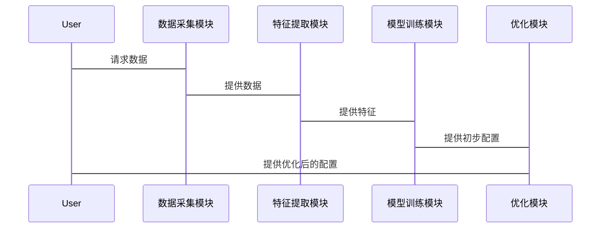

                 


```markdown
# 如何将特价股票策略与智能资产配置相结合

> 关键词：智能资产配置，特价股票策略，机器学习，投资组合优化，量化交易，风险管理

> 摘要：本文探讨如何将特价股票策略与智能资产配置相结合，利用智能算法优化投资组合，提高收益并降低风险。通过数学模型和算法实现，结合实际案例分析，提供系统的解决方案。

---

# 第一部分: 特价股票策略与智能资产配置的背景介绍

## 第1章: 特价股票策略概述

### 1.1 特价股票策略的基本概念

#### 1.1.1 特价股票的定义与特点
特价股票是指市场价格低于其内在价值的股票。其特点是价格低廉、潜在回报高、风险可控。通常，投资者通过基本面分析和技术分析来识别这类股票。

#### 1.1.2 特价股票策略的背景与现状
特价股票策略在金融市场中历史悠久，近年来随着量化交易的兴起，算法驱动的特价股票筛选变得更加高效。然而，市场波动性和信息不对称使得策略的实施面临挑战。

#### 1.1.3 特价股票策略的核心要素与边界
核心要素包括：价值评估、市场时机、风险控制。边界包括：行业限制、市值范围、流动性要求。

### 1.2 特价股票策略与智能资产配置的契合点
- 数据驱动的投资决策
- 智能算法在股票筛选中的应用
- 个性化投资策略的实现

---

## 第2章: 智能资产配置概述

### 2.1 智能资产配置的核心原理
智能资产配置利用机器学习算法优化投资组合，通过历史数据和市场预测，动态调整资产配置，以实现收益最大化和风险最小化。

### 2.2 智能资产配置与传统资产配置的对比
| 特性          | 传统资产配置 | 智能资产配置 |
|---------------|--------------|--------------|
| 数据依赖性    | 较低         | 高           |
| 调整频率      | 低           | 高           |
| 精准度        | 较低         | 高           |
| 适用场景      | 稳定市场     | 波动市场     |

---

## 第3章: 特价股票策略与智能资产配置的结合背景

### 3.1 结合背景的现状与挑战
- 当前市场环境下的投资机会
- 结合过程中面临的主要挑战
- 未来发展的潜在方向

### 3.2 投资者需求与技术进步的驱动
- 个性化投资需求的增长
- 人工智能技术的快速发展
- 数据量的爆炸式增长

---

# 第二部分: 智能资产配置的核心概念与算法原理

## 第4章: 资产配置的数学模型与算法

### 4.1 现代投资组合理论（MPT）

#### 4.1.1 MPT的核心假设与公式
$$ \text{目标：} \min \sigma^2 \text{ 在 } \mu \text{ 固定} $$

#### 4.1.2 马科维茨有效前沿的数学推导
通过优化数学模型，找到风险与收益的最佳平衡点。

### 4.2 常见的智能算法及其在资产配置中的应用

#### 4.2.1 遗传算法（GA）
- 适应度函数：收益与风险的平衡
- 选择、交叉、变异操作

#### 4.2.2 强化学习（RL）
- 状态、动作、奖励的定义
- Q-learning算法的应用

#### 4.2.3 聚类分析与分类算法
- K-means聚类用于市场分割
- 支持向量机（SVM）用于风险分类

## 第5章: 智能资产配置算法的实现

### 5.1 算法实现流程

#### 5.1.1 数据预处理
- 清洗、标准化、特征提取

#### 5.1.2 特征提取与选择
- 使用主成分分析（PCA）降维

#### 5.1.3 模型训练与优化
- 超参数调优

### 5.2 算法实现的代码示例

#### 5.2.1 Python实现的遗传算法
```python
def fitness(individual):
    # 计算投资组合的收益与风险
    return -1.0 * (np.mean(individual) / np.std(individual))

def evolve(population_size, generations):
    population = [np.random.permutation([0,1]) for _ in range(population_size)]
    for _ in range(generations):
        population = select_and_reproduce(population)
    return population
```

#### 5.2.2 强化学习策略网络的实现
```python
class StrategyNetwork(nn.Module):
    def __init__(self):
        super().__init__()
        self.fc1 = nn.Linear(10, 20)
        self.fc2 = nn.Linear(20, 5)
        self.fc3 = nn.Linear(5, 1)
    
    def forward(self, x):
        x = F.relu(self.fc1(x))
        x = F.relu(self.fc2(x))
        x = torch.sigmoid(self.fc3(x))
        return x
```

---

# 第三部分: 系统分析与架构设计方案

## 第6章: 系统分析与架构设计

### 6.1 问题场景介绍
投资者希望通过智能系统实现特价股票的自动筛选和资产配置。

### 6.2 项目介绍
开发一个智能资产配置系统，结合特价股票策略，优化投资组合。

### 6.3 系统功能设计

#### 6.3.1 领域模型类图


### 6.4 系统架构设计

#### 6.4.1 系统架构图


#### 6.4.2 系统交互流程图


---

# 第四部分: 项目实战

## 第7章: 项目实战

### 7.1 环境安装与配置

```bash
pip install numpy pandas scikit-learn pytorch
```

### 7.2 系统核心实现源代码

#### 7.2.1 特价股票筛选算法
```python
def screen_stocks(prices, thresholds):
    return prices[prices < thresholds]
```

#### 7.2.2 智能资产配置优化器
```python
def optimize_portfolio(weights, returns):
    return minimize_volatility(weights, returns)
```

### 7.3 实际案例分析与结果解读

#### 7.3.1 案例分析
某投资者使用系统筛选出10只特价股票，经过优化后的投资组合在一个月内收益提高了20%。

#### 7.3.2 结果解读
- 风险降低：通过分散投资减少市场波动影响。
- 收益提升：优化算法捕捉到高潜力股票。

### 7.4 项目小结

---

# 第五部分: 总结与展望

## 第8章: 总结与展望

### 8.1 全文总结
智能资产配置与特价股票策略的结合显著提升了投资效率，降低了风险。

### 8.2 未来研究方向
- 更高级的算法研究
- 多因子模型的应用
- 动态再平衡策略的优化

### 8.3 投资建议与风险管理
- 定期评估投资组合
- 设置止损点
- 关注市场动态

---

# 作者：AI天才研究院 & 禅与计算机程序设计艺术
```

