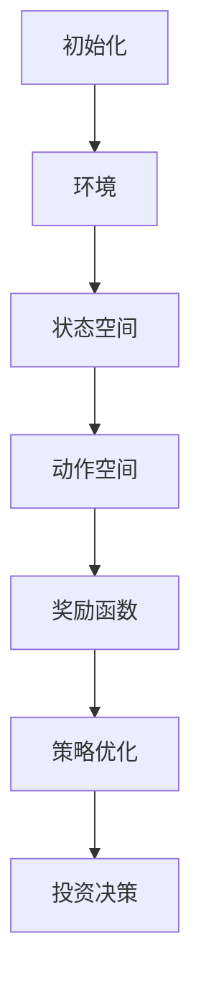
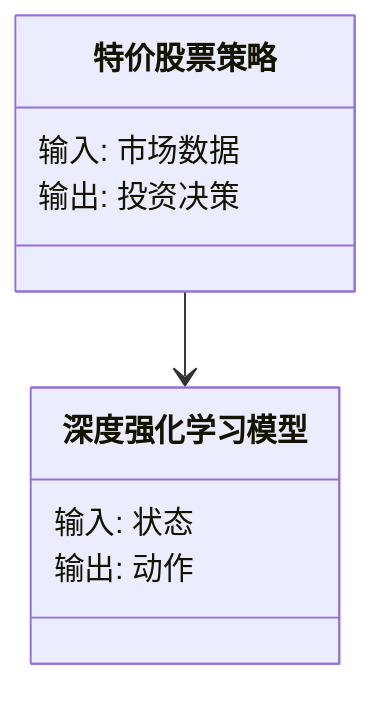
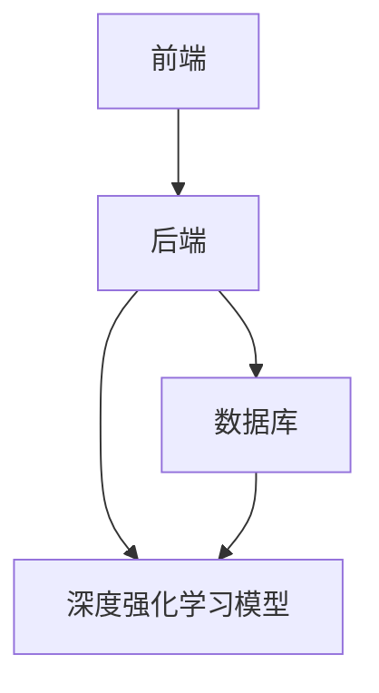
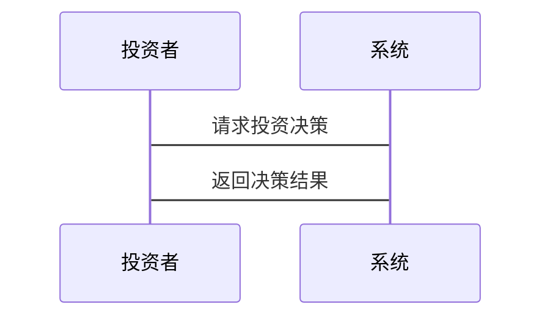

                 


# 如何将特价股票策略与深度强化学习资产配置相结合

> 关键词：深度强化学习，资产配置，特价股票策略，DQN算法，金融投资，机器学习

> 摘要：本文详细探讨了如何将特价股票策略与深度强化学习资产配置相结合，通过分析特价股票策略的核心概念、深度强化学习的基本原理，以及两者结合的数学模型、算法实现和系统设计，展示了如何利用深度强化学习优化特价股票策略的执行和资产配置过程。文章还通过实际案例分析和代码实现，深入浅出地讲解了如何在金融投资中应用这一结合策略，为投资者提供了新的思路和实践指导。

---

## 第一部分: 特价股票策略与深度强化学习的背景与基础

### 第1章: 特价股票策略概述

#### 1.1 特价股票策略的定义与特点
##### 1.1.1 特价股票的定义
特价股票是指在特定时间点，市场价格低于其内在价值的股票。这种股票通常被视为被市场低估的投资机会，适合长期投资者或价值投资者。

##### 1.1.2 特价股票策略的核心特点
- **低估值**：市场价格低于内在价值。
- **逆向投资**：在市场低迷时买入，市场高涨时卖出。
- **长期性**：通常需要较长时间才能体现价值。

##### 1.1.3 特价股票策略的分类
- **绝对价值策略**：寻找市场价格远低于公允价值的股票。
- **相对价值策略**：比较不同股票的相对估值，寻找低估的股票。
- **事件驱动策略**：利用公司事件（如并购、重组）寻找低估机会。

#### 1.2 特价股票策略的应用场景
##### 1.2.1 特价股票策略在投资组合中的作用
- **风险分散**：通过选择低估股票降低市场波动风险。
- **收益增强**：通过长期持有低估股票获得超额收益。

##### 1.2.2 特价股票策略的风险与收益分析
- **风险**：市场短期波动可能导致股价继续下跌。
- **收益**：长期来看，低估股票的回归概率较高。

##### 1.2.3 特价股票策略的市场适应性
- **适用市场**：适用于成熟市场和新兴市场。
- **适用投资者**：适合长期投资者和机构投资者。

### 第2章: 深度强化学习基础

#### 2.1 深度强化学习的定义与特点
##### 2.1.1 深度学习与强化学习的结合
深度学习擅长处理高维数据的特征提取，强化学习擅长通过试错优化决策，两者的结合使深度强化学习在复杂环境中表现出色。

##### 2.1.2 深度强化学习的核心优势
- **非线性关系捕捉**：能够处理复杂的非线性关系。
- **动态适应性**：能够根据环境变化动态调整策略。
- **高维数据处理**：适合处理高维金融数据。

##### 2.1.3 深度强化学习的应用领域
- **金融投资**：股票交易、资产配置、风险管理。
- **游戏AI**：如AlphaGo、StarCraft AI。
- **机器人控制**：复杂环境下的自主决策。

#### 2.2 深度强化学习的关键算法
##### 2.2.1 Q-learning算法
Q-learning是一种经典的强化学习算法，通过更新Q值函数来学习最优策略。

##### 2.2.2 Deep Q-Networks (DQN) 算法
DQN是Q-learning的深度版本，通过神经网络近似Q值函数，解决了高维状态空间的计算问题。

##### 2.2.3 其他相关算法简介
- **策略梯度法（Policy Gradient）**：直接优化策略。
- **Actor-Critic方法**：结合策略和价值评估。

### 第3章: 深度强化学习在资产配置中的应用

#### 3.1 资产配置的基本概念
##### 3.1.1 资产配置的定义
资产配置是指将资金分配到不同资产类别（如股票、债券、现金）中，以实现风险和收益的平衡。

##### 3.1.2 资产配置的分类
- **保守型**：低风险，低收益。
- **平衡型**：中等风险和收益。
- **激进型**：高风险，高收益。

##### 3.1.3 资产配置的目标与挑战
- **目标**：最大化收益，最小化风险。
- **挑战**：市场波动、信息不完全、投资者情绪。

#### 3.2 深度强化学习在资产配置中的优势
##### 3.2.1 非线性关系的捕捉
深度强化学习能够捕捉资产价格之间的非线性关系，提高预测精度。

##### 3.2.2 动态策略优化
通过不断试错，深度强化学习能够动态调整资产配置策略，适应市场变化。

##### 3.2.3 高维数据的处理能力
深度强化学习能够处理多维度的金融数据，提高决策的全面性。

---

## 第二部分: 深度强化学习与特价股票策略的结合原理

### 第4章: 深度强化学习资产配置的核心概念

#### 4.1 深度强化学习资产配置的数学模型
##### 4.1.1 状态空间的定义
状态空间包括市场数据（如股价、成交量）、投资者情绪等。

##### 4.1.2 动作空间的定义
动作空间包括买入、卖出、持有等操作。

##### 4.1.3 奖励函数的设计
奖励函数根据投资收益和风险设计，鼓励模型做出最优决策。

#### 4.2 深度强化学习资产配置的数学公式
##### 4.2.1 Q-learning算法的数学表达
$$ Q(s, a) = Q(s, a) + \alpha (r + \gamma \max Q(s', a') - Q(s, a)) $$
其中，$s$ 是状态，$a$ 是动作，$\alpha$ 是学习率，$\gamma$ 是折扣因子。

##### 4.2.2 DQN算法的数学模型
DQN通过神经网络近似Q值函数，输入是状态，输出是动作值。

##### 4.2.3 深度网络的损失函数
$$ \text{损失} = \mathbb{E}_{(s,a,r)}[(y - Q(s,a))^2] $$
其中，$y = r + \gamma \max Q(s', a')$。

#### 4.3 深度强化学习资产配置的mermaid流程图


### 第5章: 深度强化学习与特价股票策略的结合方式

#### 5.1 特价股票策略的特征提取
##### 5.1.1 特价股票的市场数据特征
- 股价与公允价值的差异
- 市盈率、市净率等估值指标

##### 5.1.2 特价股票的交易行为特征
- 交易量突变
- 投资者情绪变化

##### 5.1.3 特价股票的风险评估特征
- 市场波动性
- 公司财务状况

#### 5.2 深度强化学习在特价股票策略中的应用
##### 5.2.1 动态资产配置策略
通过深度强化学习动态调整资产配置，捕捉特价股票的低估机会。

##### 5.2.2 风险控制策略
利用深度强化学习实时监控风险，制定止损策略。

##### 5.2.3 基于深度强化学习的交易信号生成
通过深度强化学习模型生成买入、卖出信号，指导投资者操作。

---

## 第三部分: 项目实战与系统设计

### 第6章: 系统分析与架构设计方案

#### 6.1 问题场景介绍
投资者希望通过深度强化学习优化特价股票策略，实现自动化、智能化的投资决策。

#### 6.2 项目介绍
项目目标是构建一个基于深度强化学习的资产配置系统，优化特价股票的投资策略。

#### 6.3 系统功能设计
##### 6.3.1 领域模型


#### 6.4 系统架构设计
##### 6.4.1 系统架构图


#### 6.5 系统接口设计
##### 6.5.1 API接口
- `/api/training`：训练模型
- `/api/predict`：获取投资决策
- `/api/portfolio`：获取资产配置

#### 6.6 系统交互设计
##### 6.6.1 交互流程图


### 第7章: 项目实战

#### 7.1 环境安装
- 安装Python和相关库（如TensorFlow、Keras）。
- 安装数据处理工具（如Pandas、NumPy）。

#### 7.2 系统核心实现
##### 7.2.1 训练代码
```python
import numpy as np
import tensorflow as tf

model = tf.keras.Sequential([
    tf.keras.layers.Dense(64, activation='relu'),
    tf.keras.layers.Dense(10, activation='softmax')
])

model.compile(optimizer='adam', loss='sparse_categorical_crossentropy', metrics=['accuracy'])
model.fit(X_train, y_train, epochs=10)
```

##### 7.2.2 预测代码
```python
predictions = model.predict(X_test)
```

#### 7.3 实际案例分析
##### 7.3.1 案例背景
假设市场中有多只特价股票，投资者希望通过深度强化学习优化资产配置。

##### 7.3.2 模型训练
训练模型识别特价股票的特征，优化投资策略。

##### 7.3.3 投资决策
模型生成买入、卖出信号，指导投资者操作。

### 第8章: 最佳实践与小结

#### 8.1 最佳实践
- **数据质量**：确保数据的准确性和完整性。
- **模型调优**：通过超参数调整优化模型性能。
- **风险控制**：建立有效的风险管理机制。

#### 8.2 小结
本文详细讲解了如何将特价股票策略与深度强化学习资产配置相结合，通过理论分析、系统设计和项目实战，展示了这一结合的可行性和优势。

#### 8.3 注意事项
- **市场风险**：金融市场的不确定性较高，需谨慎操作。
- **模型局限**：深度强化学习模型可能无法完全捕捉所有市场信息。
- **合规性**：确保投资行为符合相关法律法规。

#### 8.4 拓展阅读
- 《Deep Learning for Finance》
- 《Reinforcement Learning: Theory and Applications》

---

# 作者：AI天才研究院/AI Genius Institute & 禅与计算机程序设计艺术 /Zen And The Art of Computer Programming

