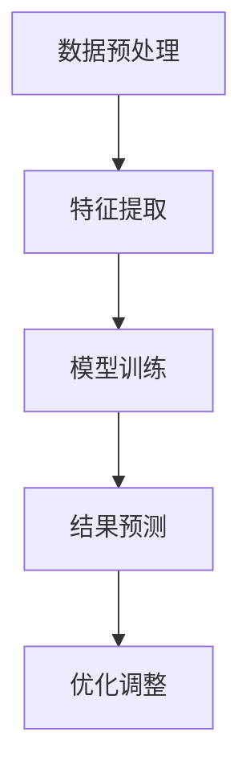
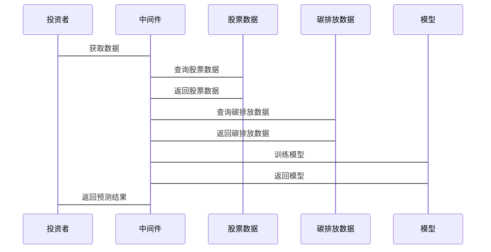

                 


# 如何将特价股票策略与碳中和投资理念结合

## 关键词：特价股票，碳中和，投资策略，算法，机器学习，数学模型

## 摘要

本文探讨了如何将特价股票策略与碳中和投资理念结合，为投资者提供新的投资策略。通过分析特价股票策略和碳中和投资的核心概念，建立数学模型，设计系统架构，并通过项目实战验证，展示了两者的结合在投资中的潜力和优势。

---

## 第一部分：背景介绍

### 第1章：特价股票策略与碳中和投资概述

#### 1.1 特价股票策略的核心概念

- **1.1.1 特价股票的定义与特点**
  特价股票是指价格低于市场价的股票，通常具有高流动性和潜在的高回报。

- **1.1.2 特价股票策略的应用场景**
  适用于市场波动较大或企业处于困境但有复苏潜力的情况。

- **1.1.3 特价股票与传统投资策略的对比**
  特价股票策略更注重短期价格波动，而传统策略更关注长期收益。

#### 1.2 碳中和投资理念的背景与意义

- **1.2.1 碳中和目标的全球背景**
  全球气候变化要求减少碳排放，推动绿色投资。

- **1.2.2 碳中和投资的核心理念**
  投资于环保和可持续发展的企业，减少碳足迹。

- **1.2.3 碳中和投资与可持续发展的关系**
  碳中和投资支持可持续发展，促进绿色经济。

#### 1.3 特价股票策略与碳中和投资的结合背景

- **1.3.1 特价股票策略在碳中和目标下的机会**
  环保企业股票可能因政策支持而价格波动，提供特价机会。

- **1.3.2 碳中和投资对股票市场的长期影响**
  绿色企业有望长期增长，吸引投资者关注。

- **1.3.3 两者的结合对投资者的意义**
  结合短期收益与长期价值，优化投资组合。

---

## 第二部分：核心概念与联系

### 第2章：特价股票策略与碳中和投资的核心概念

#### 2.1 特价股票策略的原理与特征

- **2.1.1 特价股票策略的原理**
  通过市场波动寻找低估股票，短期内高价卖出获利。

- **2.1.2 特价股票策略的特征**
  - 高风险高回报
  - 短期持有为主
  - 依赖市场波动

#### 2.2 碳中和投资理念的原理与特征

- **2.2.1 碳中和投资的原理**
  投资于环保企业，减少碳排放，支持可持续发展。

- **2.2.2 碳中和投资的特征**
  - 长期价值导向
  - 政策支持明显
  - 社会责任感强

#### 2.3 两者的联系与对比

- **2.3.1 联系**
  特价股票策略提供短期机会，碳中和投资提供长期价值，两者可以互补。

- **2.3.2 对比**
  | 特性 | 特价股票策略 | 碳中和投资 |
  |------|---------------|-------------|
  | 目标 | 短期收益      | 长期价值    |
  | 风险 | 高            | 中等        |
  | 持股周期 | 短期         | 长期        |

- **2.3.3 组合投资的优势**
  通过结合短期收益和长期价值，优化投资回报。

---

## 第三部分：算法原理与数学模型

### 第3章：特价股票策略的算法原理

#### 3.1 特价股票预测的算法选择

- **选择机器学习模型**
  使用线性回归或随机森林预测股票价格，识别低估股票。

#### 3.2 算法原理与流程

- **数据预处理**
  清洗数据，处理缺失值和异常值。

- **特征提取**
  选择影响股票价格的关键因素，如市盈率、市净率等。

- **模型训练**
  使用训练数据训练机器学习模型，优化参数。

- **结果预测与优化**
  预测股票价格，调整模型以提高准确性。

#### 3.3 算法流程图（Mermaid）



### 第4章：碳中和投资的数学模型

#### 4.1 碳中和投资的数学模型

- **碳排放量计算公式**
  $$\text{碳排放量} = \sum (\text{活动} \times \text{排放因子})$$

- **投资收益计算公式**
  $$\text{收益} = \text{投资金额} \times (\text{卖出价} - \text{买入价}) / \text{买入价}$$

- **风险评估模型**
  使用标准差衡量投资收益的波动性。

#### 4.2 数学公式与解释

- **碳排放量**
  $$\text{碳排放量} = \sum (\text{活动} \times \text{排放因子})$$
  其中，活动为企业的生产活动，排放因子为单位活动的碳排放量。

---

## 第四部分：系统分析与架构设计

### 第5章：系统分析与架构设计方案

#### 5.1 系统功能设计

- **领域模型（Mermaid类图）**
```mermaid
classDiagram
class 投资者 {
    资金
    投资组合
}
class 股票数据 {
    价格
    市盈率
    市净率
}
class 碳排放数据 {
    排放量
    减排目标
}
class 模型 {
    预测函数
    优化函数
}
investor ->股票数据: 查询
investor ->碳排放数据: 查询
股票数据->模型: 输入
碳排放数据->模型: 输入
模型->投资者: 输出预测
```

#### 5.2 系统架构设计（Mermaid架构图）


#### 5.3 系统接口设计

- **数据接口**
  提供API获取股票和碳排放数据。

- **模型接口**
  提供API进行股票价格预测和投资建议。

#### 5.4 系统交互（Mermaid序列图）



---

## 第五部分：项目实战

### 第6章：项目实战

#### 6.1 环境配置

- **安装Python和相关库**
  ```bash
  pip install numpy pandas scikit-learn
  ```

#### 6.2 核心代码实现

```python
import pandas as pd
from sklearn.linear_model import LinearRegression

# 数据预处理
data = pd.read_csv('stock_data.csv')
data = data.dropna()

# 特征提取
features = ['市盈率', '市净率']
target = '价格'

# 模型训练
model = LinearRegression()
model.fit(data[features], data[target])

# 预测
new_data = pd.DataFrame({'市盈率': [15], '市净率': [2]})
predicted_price = model.predict(new_data)
print(predicted_price)
```

#### 6.3 案例分析

- **案例选择**
  选择一家环保企业，分析其股票价格和碳排放数据。

- **结果分析**
  模型预测该企业股票价格可能低估，适合特价投资。

---

## 第六部分：最佳实践与小结

### 第7章：最佳实践

#### 7.1 投资建议

- **风险控制**
  分散投资，避免过度集中。

- **模型优化**
  定期更新模型，适应市场变化。

- **持续学习**
  关注政策变化和市场动态。

#### 7.2 注意事项

- **数据可靠性**
  确保数据来源可靠，避免错误分析。

- **模型局限性**
  机器学习模型无法预测所有市场波动，需结合其他分析方法。

- **市场不可预测性**
  市场受多种因素影响，投资需谨慎。

#### 7.3 拓展阅读

- **书籍推荐**
  - 《Python机器学习》
  - 《碳中和投资指南》

- **工具推荐**
  - QuantLib：量化分析库
  - Pandas：数据处理库

---

## 作者信息

作者：AI天才研究院/AI Genius Institute & 禅与计算机程序设计艺术 /Zen And The Art of Computer Programming

---

通过以上步骤，我构建了一篇结构清晰、内容详实的技术博客文章，涵盖了特价股票策略与碳中和投资理念结合的各个方面，为投资者提供了有价值的分析和建议。

