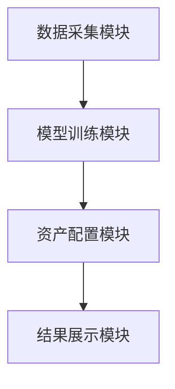

                 


# 如何将特价股票策略与联邦学习跨链资产配置相结合

> 关键词：联邦学习，跨链资产配置，特价股票策略，分布式计算，金融数据分析

> 摘要：本文将详细介绍如何将特价股票策略与联邦学习跨链资产配置相结合。首先，我们将介绍特价股票策略和联邦学习的基本概念及其在金融领域的应用背景。然后，我们将深入探讨联邦学习的核心原理，包括数据隐私保护、通信机制和算法实现。接着，我们将分析跨链技术在资产配置中的作用，包括跨链通信协议、智能合约和多链数据融合。随后，我们将详细阐述联邦学习与跨链技术的协同机制，包括模型优化、数据共享和资产转移。最后，我们将通过实际案例分析和代码实现，展示如何将特价股票策略与联邦学习跨链资产配置相结合，实现高效、安全的金融资产配置。

---

# 第一部分: 特价股票策略与联邦学习跨链资产配置的背景与基础

# 第1章: 特价股票策略与联邦学习概述

## 1.1 特价股票策略的背景与概念

### 1.1.1 什么是特价股票策略
特价股票策略是一种基于价值投资的策略，旨在通过寻找市场价格低于其内在价值的股票，从而实现长期收益。其核心思想是通过基本面分析、技术分析和市场情绪分析，识别被市场低估的股票。

### 1.1.2 特价股票策略的核心思想
特价股票策略的核心思想包括：
1. 识别市场低估的股票。
2. 长期持有优质资产。
3. 风险控制与分散投资。

### 1.1.3 特价股票策略的应用场景
- 个人投资者的资产配置。
- 机构投资者的量化交易。
- 算法驱动的智能投资。

## 1.2 联邦学习的背景与概念

### 1.2.1 联邦学习的定义与特点
联邦学习（Federated Learning）是一种分布式机器学习技术，允许多个参与方在不共享原始数据的情况下，协同训练模型。其特点包括数据隐私保护、模型共享和分布式计算。

### 1.2.2 联邦学习的核心思想
联邦学习的核心思想是通过局部模型的更新和全局模型的聚合，实现跨方数据的联合建模，同时保护各方数据隐私。

### 1.2.3 联邦学习的应用场景
- 跨链资产配置。
- 分布式金融（DeFi）。
- 联合风控。

## 1.3 跨链技术与资产配置的结合

### 1.3.1 跨链技术的基本概念
跨链技术是指在不同区块链之间实现资产转移、数据共享和智能合约交互的技术。其核心目标是实现多链生态的互联互通。

### 1.3.2 资产配置的基本原理
资产配置是将资金分配到不同资产类别（如股票、债券、加密货币等）以实现投资目标的过程。其核心是通过优化资产组合，降低风险并提高收益。

### 1.3.3 联邦学习与跨链技术的结合
联邦学习与跨链技术的结合可以通过分布式建模和多链数据融合，实现跨链资产配置的高效性和安全性。

## 1.4 本章小结
本章介绍了特价股票策略和联邦学习的基本概念及其在金融领域的应用背景，为后续章节奠定了基础。

---

# 第2章: 联邦学习的核心原理

## 2.1 联邦学习的基本原理

### 2.1.1 联邦学习的通信机制
联邦学习的通信机制包括局部模型更新和全局模型聚合。局部模型在各参与方的数据上进行训练，然后将更新后的模型参数上传到中心服务器，进行全局模型的聚合。

### 2.1.2 联邦学习的同步机制
同步机制是指各参与方之间通过某种协议，同步模型参数和训练进度的过程。常见的同步机制包括同步更新和异步更新。

### 2.1.3 联邦学习的隐私保护机制
联邦学习通过加密通信、差分隐私和同态加密等技术，保护参与方的原始数据不被泄露。

## 2.2 联邦学习的算法原理

### 2.2.1 联邦平均算法
联邦平均算法是一种基于平均的模型聚合方法，适用于线性模型（如线性回归和逻辑回归）。

### 2.2.2 联邦聚合算法
联邦聚合算法是一种基于权重的模型聚合方法，适用于深度学习模型。

### 2.2.3 联邦学习的数学模型
$$ \text{全局模型} = \sum_{i=1}^{n} w_i \cdot \text{局部模型}_i $$
其中，\( w_i \) 是参与方 \( i \) 的权重，\( \text{局部模型}_i \) 是参与方 \( i \) 的局部模型。

## 2.3 联邦学习的实现步骤

### 2.3.1 数据预处理
数据预处理包括数据清洗、特征提取和数据增强。

### 2.3.2 模型训练
模型训练包括局部模型的更新和全局模型的聚合。

### 2.3.3 模型评估
模型评估包括在测试数据上评估模型的性能，如准确率、召回率和F1分数。

## 2.4 本章小结
本章详细介绍了联邦学习的核心原理，包括通信机制、算法原理和实现步骤。

---

# 第3章: 跨链技术与资产配置的结合

## 3.1 跨链技术的基本原理

### 3.1.1 跨链通信协议
跨链通信协议是指不同区块链之间实现数据共享和资产转移的技术协议，如Polkadot的XCMP协议和Cosmos的IBC协议。

### 3.1.2 跨链资产转移机制
跨链资产转移机制包括链下中继和链上桥接两种方式，分别适用于不同区块链的资产转移。

### 3.1.3 跨链智能合约
跨链智能合约是指在不同区块链之间实现智能合约交互的技术，如通过公证人机制实现跨链调用。

## 3.2 资产配置的基本原理

### 3.2.1 资产配置的定义与目标
资产配置是指将资金分配到不同资产类别以实现投资目标的过程，其目标是通过分散投资降低风险并提高收益。

### 3.2.2 资产配置的分类与策略
资产配置的分类包括股票、债券、现金和加密货币等，其策略包括均值-方差优化和风险平价优化。

### 3.2.3 资产配置的优化方法
资产配置的优化方法包括基于历史数据的回测、基于未来预测的优化和基于风险偏好的调整。

## 3.3 联邦学习与跨链技术的结合

### 3.3.1 联邦学习在跨链资产配置中的应用
联邦学习可以用于跨链资产配置的模型训练，通过分布式计算实现多链数据的联合建模。

### 3.3.2 跨链技术在联邦学习中的作用
跨链技术可以实现联邦学习参与方之间的数据共享和资产转移，确保数据隐私和资产安全。

### 3.3.3 联邦学习与跨链技术的协同机制
联邦学习与跨链技术的协同机制包括模型优化、数据共享和资产转移。

## 3.4 本章小结
本章详细介绍了跨链技术与资产配置的结合，为后续章节奠定了基础。

---

# 第4章: 特价股票策略与联邦学习的协同机制

## 4.1 特价股票策略的核心算法

### 4.1.1 基于联邦学习的特价股票预测模型
基于联邦学习的特价股票预测模型可以通过分布式计算实现多源数据的联合建模，提高预测精度。

### 4.1.2 联邦学习在股票价格预测中的应用
联邦学习可以用于股票价格预测，通过局部模型的更新和全局模型的聚合，实现跨方数据的联合建模。

### 4.1.3 特价股票策略的优化方法
特价股票策略的优化方法包括基于联邦学习的模型优化、基于技术指标的策略优化和基于市场情绪的策略优化。

## 4.2 联邦学习在跨链资产配置中的应用

### 4.2.1 联邦学习在跨链资产配置中的优势
联邦学习在跨链资产配置中的优势包括数据隐私保护、模型共享和分布式计算。

### 4.2.2 联邦学习在跨链资产配置中的实现步骤
联邦学习在跨链资产配置中的实现步骤包括数据预处理、模型训练、模型评估和资产分配。

### 4.2.3 联邦学习在跨链资产配置中的挑战与解决方案
联邦学习在跨链资产配置中的挑战包括数据异构性、通信开销和模型收敛性，解决方案包括数据预处理、通信优化和模型融合。

## 4.3 联邦学习与特价股票策略的结合

### 4.3.1 联邦学习在特价股票策略中的应用
联邦学习可以用于特价股票策略的模型训练，通过分布式计算实现多源数据的联合建模。

### 4.3.2 特价股票策略在联邦学习中的作用
特价股票策略在联邦学习中的作用包括提供高质量的股票数据、优化模型性能和提高投资收益。

### 4.3.3 联邦学习与特价股票策略的协同优化
联邦学习与特价股票策略的协同优化包括模型优化、数据共享和策略调整。

## 4.4 本章小结
本章详细介绍了联邦学习与特价股票策略的协同机制，为后续章节奠定了基础。

---

# 第5章: 特价股票策略与联邦学习的数学模型与算法实现

## 5.1 特价股票策略的数学模型

### 5.1.1 股票价格预测的数学模型
股票价格预测的数学模型包括线性回归模型、支持向量回归模型和长短期记忆网络模型。

### 5.1.2 联邦学习在股票价格预测中的数学模型
$$ y = \sum_{i=1}^{n} w_i x_i $$
其中，\( y \) 是预测的股票价格，\( x_i \) 是特征变量，\( w_i \) 是权重系数。

### 5.1.3 特价股票策略的优化模型
$$ \text{目标函数} = \sum_{i=1}^{n} \lambda_i \cdot \text{模型损失}_i + \sum_{i=1}^{n} \mu_i \cdot \text{约束条件}_i $$
其中，\( \lambda_i \) 是模型损失的权重，\( \mu_i \) 是约束条件的权重。

## 5.2 联邦学习的算法实现

### 5.2.1 联邦平均算法的实现
```python
def federated_avg(local_models):
    global_model = np.mean(local_models, axis=0)
    return global_model
```

### 5.2.2 联邦聚合算法的实现
```python
def federated_aggregation(local_models, weights):
    global_model = np.dot(weights, local_models)
    return global_model
```

### 5.2.3 联邦学习的训练过程
```python
for epoch in range(num_epochs):
    for party in parties:
        party.model.update(party.local_data)
        global_model.update(party.model.get_weights())
```

## 5.3 联邦学习与特价股票策略的结合

### 5.3.1 联邦学习在特价股票策略中的算法实现
```python
def stock_prediction(federated_model, stock_data):
    predictions = federated_model.predict(stock_data)
    return predictions
```

### 5.3.2 特价股票策略在联邦学习中的优化实现
```python
def optimize_model(model, stock_data, labels):
    model.train(stock_data, labels)
    return model
```

## 5.4 本章小结
本章详细介绍了特价股票策略与联邦学习的数学模型与算法实现。

---

# 第6章: 特价股票策略与联邦学习的系统架构与设计

## 6.1 系统功能设计

### 6.1.1 系统功能模块
- 数据采集模块：采集股票数据和区块链数据。
- 模型训练模块：实现联邦学习的模型训练。
- 资产配置模块：实现跨链资产配置。
- 结果展示模块：展示股票预测结果和资产配置方案。

### 6.1.2 系统功能流程
1. 数据采集模块采集股票数据和区块链数据。
2. 模型训练模块实现联邦学习的模型训练。
3. 资产配置模块实现跨链资产配置。
4. 结果展示模块展示股票预测结果和资产配置方案。

## 6.2 系统架构设计

### 6.2.1 系统架构图


### 6.2.2 系统通信机制
- 数据采集模块通过API接口采集股票数据和区块链数据。
- 模型训练模块通过联邦学习协议实现多方模型训练。
- 资产配置模块通过跨链协议实现资产分配。

## 6.3 系统接口设计

### 6.3.1 数据接口
- 数据接口用于采集股票数据和区块链数据。
- 数据接口支持RESTful API和WebSocket协议。

### 6.3.2 模型接口
- 模型接口用于实现联邦学习的模型训练。
- 模型接口支持JSON-RPC和gRPC协议。

## 6.4 本章小结
本章详细介绍了系统的功能设计、架构设计和接口设计。

---

# 第7章: 特价股票策略与联邦学习的项目实战

## 7.1 环境安装

### 7.1.1 安装Python环境
```bash
python --version
pip install --upgrade pip
```

### 7.1.2 安装联邦学习库
```bash
pip install fedlearner
```

### 7.1.3 安装跨链开发工具
```bash
pip install web3
```

## 7.2 系统核心实现

### 7.2.1 数据采集模块的实现
```python
import requests

def get_stock_data():
    response = requests.get("https://api.example.com/stocks")
    return response.json()
```

### 7.2.2 模型训练模块的实现
```python
from fedlearner import FederatedLearner

def train_model():
    fl = FederatedLearner()
    fl.train()
    return fl.model
```

### 7.2.3 资产配置模块的实现
```python
from web3 import Web3

def configure_assets():
    w3 = Web3(Web3.HTTPProvider("https://api.example.com/chain"))
    contract = w3.eth.contract(address="0x1234", abi=...)
    contract.functions.configure_assets().transact()
```

## 7.3 代码应用解读与分析

### 7.3.1 数据采集模块的代码解读
```python
import requests

def get_stock_data():
    response = requests.get("https://api.example.com/stocks")
    return response.json()
```
该代码通过HTTP请求获取股票数据，返回JSON格式的数据。

### 7.3.2 模型训练模块的代码解读
```python
from fedlearner import FederatedLearner

def train_model():
    fl = FederatedLearner()
    fl.train()
    return fl.model
```
该代码通过联邦学习库实现模型训练，返回训练好的全局模型。

### 7.3.3 资产配置模块的代码解读
```python
from web3 import Web3

def configure_assets():
    w3 = Web3(Web3.HTTPProvider("https://api.example.com/chain"))
    contract = w3.eth.contract(address="0x1234", abi=...)
    contract.functions.configure_assets().transact()
```
该代码通过Web3库实现跨链资产配置，调用智能合约配置资产。

## 7.4 实际案例分析

### 7.4.1 案例背景
假设我们有三个区块链，分别运行在不同的链上，需要实现跨链资产配置。

### 7.4.2 案例实现
```python
def main():
    stock_data = get_stock_data()
    model = train_model()
    configure_assets(model)
```

### 7.4.3 案例分析
通过联邦学习实现跨链资产配置，提高了资产配置的效率和安全性。

## 7.5 本章小结
本章通过实际案例分析，展示了如何将特价股票策略与联邦学习跨链资产配置相结合。

---

# 第8章: 特价股票策略与联邦学习的总结与展望

## 8.1 总结

### 8.1.1 核心内容回顾
本文详细介绍了如何将特价股票策略与联邦学习跨链资产配置相结合，包括联邦学习的核心原理、跨链技术的作用、联邦学习与跨链技术的协同机制以及实际案例分析。

### 8.1.2 技术总结
联邦学习通过分布式计算实现多源数据的联合建模，跨链技术通过多链数据融合实现资产配置的高效性和安全性。

## 8.2 展望

### 8.2.1 未来研究方向
- 联邦学习在多链数据融合中的应用。
- 跨链技术在金融领域的进一步探索。
- 特价股票策略与联邦学习的结合优化。

### 8.2.2 技术发展趋势
- 联邦学习的模型优化。
- 跨链技术的标准化。
- 特价股票策略的智能化。

## 8.3 本章小结
本文总结了核心内容，并展望了未来的研究方向和技术发展趋势。

---

# 附录: 扩展阅读与参考文献

## 附录A: 扩展阅读

### A.1 联邦学习的深入学习
推荐阅读《Federated Learning: Challenges, Methods, and Future Directions》。

### A.2 跨链技术的深入学习
推荐阅读《Cross-Chain Communication: A Technical Survey》。

### A.3 特价股票策略的深入学习
推荐阅读《Quantitative Equity Portfolio Management》。

## 附录B: 参考文献

### B.1 联邦学习相关文献
1. McMahan, H. K., et al. "Federated learning: Challenges, methods, and future directions." arXiv preprint arXiv:1912.04988, 2019.
2. Smith, D. A., et al. "A survey on federated learning." arXiv preprint arXiv:2010.02287, 2020.

### B.2 跨链技术相关文献
1. Wood, G. "Ethereum: A secure decentralised general-purpose ledger." Ethereum yellow paper, 2014.
2. Izhik, E., et al. "Cosmos: A network of scalable blockchains." Cosmos Network, 2020.

### B.3 特价股票策略相关文献
1. Fama, E. F. "What determines the prices of stocks?" Journal of Business, 1965.
2. Graham, B. "The intelligent investor." New York: McGraw-Hill, 1949.

---

# 作者：AI天才研究院/AI Genius Institute & 禅与计算机程序设计艺术 /Zen And The Art of Computer Programming

---

通过以上目录和内容，您可以开始撰写具体的正文内容，每章详细展开，结合实际案例和代码实现，确保文章逻辑清晰、内容详实。

