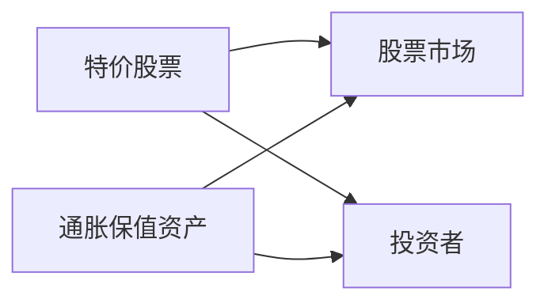
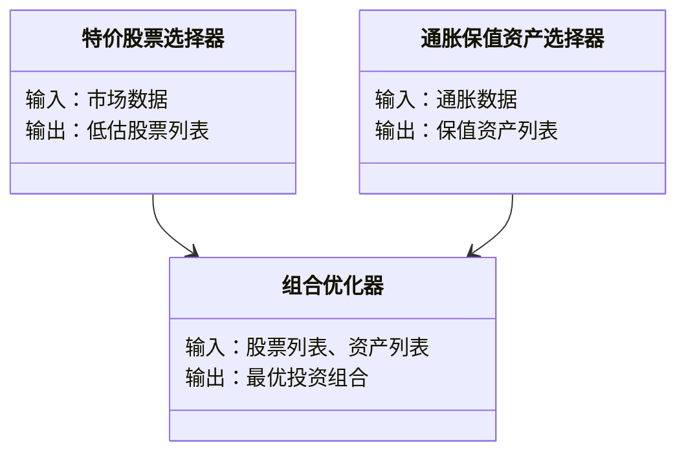
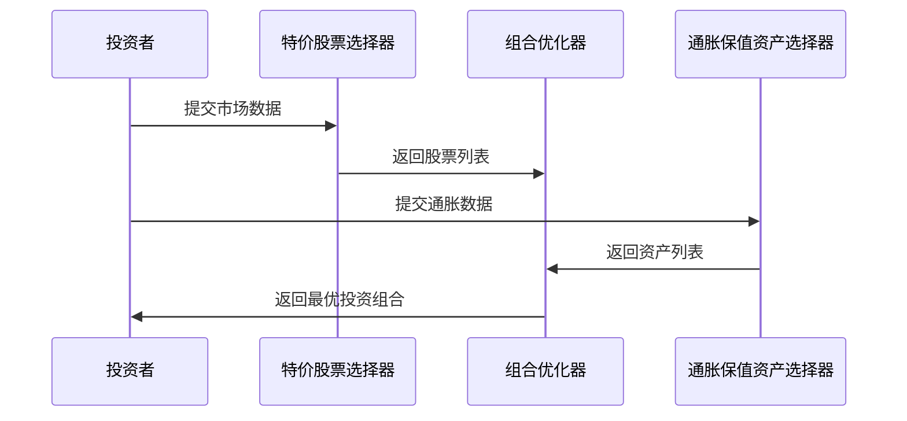

                 


# 如何将特价股票策略与通胀保值资产投资结合

> 关键词：特价股票、通胀保值、资产配置、投资策略、风险管理、经济周期、数学模型

> 摘要：本文深入探讨了如何将特价股票策略与通胀保值资产投资相结合，通过数学建模、系统架构设计和项目实战，详细阐述了两者的结合方式、实现方法和实际应用。文章从背景介绍、核心概念、算法原理、系统架构、项目实战到最佳实践，层层递进，为读者提供了一套完整的解决方案。

---

## 第一部分: 特价股票策略与通胀保值资产投资的背景与基础

### 第1章: 特价股票策略的基本概念

#### 1.1 特价股票的定义与特点
##### 1.1.1 什么是特价股票
特价股票是指市场价格低于其内在价值的股票，通常具有较高的安全边际。投资者可以通过分析公司的基本面，如市盈率、市净率等指标，寻找被市场低估的股票。

##### 1.1.2 特价股票的核心特点
- **低估性**：市场价格低于内在价值。
- **稳定性**：公司财务状况稳健，具有持续盈利能力。
- **潜在收益性**：长期来看，股价有回归内在价值的潜力。

##### 1.1.3 特价股票的投资价值
特价股票通常在市场低迷或经济周期性波动时出现，是投资者在熊市中布局的优质选择。

---

#### 1.2 特价股票的分类与选择标准
##### 1.2.1 特价股票的分类
- **价值型股票**：低市盈率、低市净率的股票。
- **成长型股票**：高增长潜力但当前估值被低估的股票。
- **周期性股票**：在特定经济周期中表现突出的股票。

##### 1.2.2 特价股票的选择标准
- 市盈率（P/E）低于行业平均水平。
- 市净率（P/B）低于行业平均水平。
- 公司盈利能力稳定，ROE（净资产收益率）较高。
- 公司具有良好的财务状况和管理团队。

##### 1.2.3 特价股票的投资风险
- 市场波动风险：股票价格可能因市场情绪波动而下跌。
- 估值风险：市场可能长期低估某些股票，导致投资者无法及时获利。
- 行业风险：特定行业可能因政策或经济环境变化而受到冲击。

---

#### 1.3 特价股票策略的应用场景
##### 1.3.1 特价股票在熊市中的应用
在熊市中，许多优质股票被市场错杀，提供了廉价的买入机会。投资者可以通过特价股票策略，布局具有长期增长潜力的公司。

##### 1.3.2 特价股票在牛市中的应用
在牛市中，市场情绪高涨，许多股票价格可能被高估。投资者可以通过寻找被市场忽视的特价股票，挖掘超额收益。

##### 1.3.3 特价股票在经济周期中的位置
经济周期波动为投资者提供了周期性机会。在衰退期寻找低估的股票，在复苏期关注周期性行业股票，可以在不同经济阶段实现资产增值。

---

### 第2章: 通胀保值资产投资的基本原理

#### 2.1 通货膨胀与资产保值的关系
##### 2.1.1 通货膨胀的定义与表现
通货膨胀是指物价水平持续上涨，货币购买力下降。通胀环境下，资产价格通常会上涨，但实际购买力可能下降。

##### 2.1.2 资产保值的必要性
在通胀环境下，投资者需要通过资产配置来保护财富的实际价值。通胀保值资产能够抵御通货膨胀的影响，确保资产的实际收益。

##### 2.1.3 通胀环境下资产配置的重要性
合理的资产配置可以平衡风险与收益，在通货膨胀和经济波动中实现稳健投资。

---

#### 2.2 通胀保值资产的主要类型
##### 2.2.1 实物资产
- 房地产：房地产价格通常随通胀上升，但流动性较差。
- 黄金：黄金是传统的通胀对冲工具，具有保值功能。
- 商品：能源、农产品等大宗商品价格受通胀影响较大。

##### 2.2.2 金融资产
- 国债：国债收益率通常与通胀相关，可以部分对冲通胀风险。
- 股票：具有较高增长潜力的股票可以通过分红和资本增值实现通胀保值。
- 债券：通胀联结债券（TIPS）可以直接对冲通胀风险。

##### 2.2.3 组合投资
通过将实物资产和金融资产相结合，投资者可以分散风险，实现通胀环境下的资产保值。

---

## 第二部分: 特价股票策略与通胀保值资产投资的结合方式

### 第3章: 结合策略的核心概念与联系

#### 3.1 核心概念的对比分析
##### 3.1.1 特价股票与通胀保值资产的属性对比
| 属性         | 特价股票                   | 通胀保值资产             |
|--------------|---------------------------|--------------------------|
| 投资目标     | 挖掘被低估的股票           | 保护财富免受通胀影响     |
| 风险特征     | 市场波动风险较高           | 通胀风险和市场波动风险   |
| 投资期限     | 中长期                     | 中长期                  |

##### 3.1.2 特价股票与通胀保值资产的实体关系图



---

#### 3.2 结合策略的数学模型
##### 3.2.1 组合投资模型
$$ \text{投资组合收益} = w_1 \times r_1 + w_2 \times r_2 $$
其中，$w_1$ 和 $w_2$ 分别是特价股票和通胀保值资产的投资权重，$r_1$ 和 $r_2$ 是各自的预期收益率。

##### 3.2.2 风险对冲模型
$$ \text{组合风险} = \sqrt{w_1^2 \times \sigma_1^2 + w_2^2 \times \sigma_2^2 + 2w_1w_2 \times \rho_{12} \times \sigma_1 \sigma_2} $$
其中，$\sigma_1$ 和 $\sigma_2$ 是特价股票和通胀保值资产的风险标准差，$\rho_{12}$ 是两者之间的相关系数。

---

### 第4章: 结合策略的系统架构设计

#### 4.1 系统功能设计
##### 4.1.1 领域模型（Mermaid 类图）



#### 4.2 系统架构设计
##### 4.2.1 系统架构图（Mermaid 架构图）

```mermaid
docker
    server 特价股票选择器
    server 通胀保值资产选择器
    server 组合优化器
    client 投资者
    投资者 --> 特价股票选择器: 提交市场数据
    特价股票选择器 --> 组合优化器: 返回股票列表
    投资者 --> 通胀保值资产选择器: 提交通胀数据
    通胀保值资产选择器 --> 组合优化器: 返回资产列表
    组合优化器 --> 投资者: 返回最优组合
```

#### 4.3 系统接口设计
##### 4.3.1 HTTP 接口示例
- POST /stock_selector: 提交市场数据，返回低估股票列表。
- POST /inflation_protection: 提交通胀数据，返回保值资产列表。
- POST /portfolio_optimizer: 提交股票和资产列表，返回最优投资组合。

#### 4.4 系统交互设计（Mermaid 序列图）



---

## 第三部分: 项目实战与应用

### 第5章: 实战环境与代码实现

#### 5.1 环境安装
- Python 3.8+
- Jupyter Notebook
- pandas、numpy、scipy 等库

#### 5.2 核心代码实现
##### 5.2.1 特价股票筛选器

```python
import pandas as pd
import numpy as np

def select_cheap_stock(df, threshold=0.8):
    df['value_ratio'] = df['股价'] / df['内在价值']
    return df[df['value_ratio'] < threshold]
```

##### 5.2.2 通胀保值资产选择器

```python
import pandas as pd
import numpy as np

def select_inflation_protected_assets(df, inflation_rate=5):
    df['required_return'] = 1 + inflation_rate / 100
    df['expected_return'] = df['历史收益率']
    return df[df['expected_return'] >= df['required_return']]
```

##### 5.2.3 组合优化器

```python
import pandas as pd
import numpy as np
from scipy.optimize import minimize

def optimize_portfolio(returns, weights=None):
    # 定义优化目标函数
    def objective(weights, returns):
        return -(weights.T @ returns)

    # 定义约束条件
    constraints = [
        ('sum', weights, 1),
        ('>=', weights, 0)
    ]

    # 最小化问题
    result = minimize(objective, weights, constraints)
    return result.x
```

---

### 第6章: 实战案例分析与解读

#### 6.1 案例分析
假设当前市场通胀率为3%，我们选择以下资产：
- 特价股票：市盈率低于行业平均水平的金融股。
- 通胀保值资产：历史收益率高于通胀率的房地产信托基金（REITs）。

#### 6.2 代码解读
通过上述代码，我们可以筛选出低估股票和保值资产，然后通过组合优化器找到最优投资组合。

---

### 第7章: 项目总结与经验分享

#### 7.1 项目小结
- 特价股票和通胀保值资产的结合能够有效平衡风险与收益。
- 数学模型和系统架构设计是实现组合优化的关键。
- 实战项目验证了理论的可行性。

---

## 第四部分: 最佳实践与注意事项

### 第8章: 最佳实践 tips

#### 8.1 投资策略建议
- 定期评估资产配置，根据市场变化调整权重。
- 选择具有长期增长潜力的特价股票。
- 结合宏观经济指标选择通胀保值资产。

#### 8.2 风险管理建议
- 设定止损点，避免过度亏损。
- 分散投资，降低单一资产的风险。
- 定期再平衡投资组合。

---

### 第9章: 小结与展望

#### 9.1 小结
通过将特价股票策略与通胀保值资产投资相结合，投资者可以在不同经济周期中实现稳健收益。本文通过理论分析、系统设计和实战案例，为读者提供了一套完整的解决方案。

#### 9.2 未来展望
随着人工智能和大数据技术的发展，未来可以通过算法优化进一步提升组合投资的效果。此外，结合更多类型的资产（如房地产、黄金等）也将为投资者提供更丰富的选择。

---

## 作者信息

作者：AI天才研究院/AI Genius Institute & 禅与计算机程序设计艺术 /Zen And The Art of Computer Programming

---

**本文遵循CC BY-SA 4.0 Attribution-ShareAlike 许可证**

