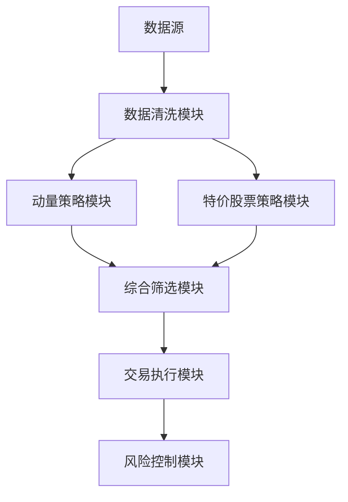
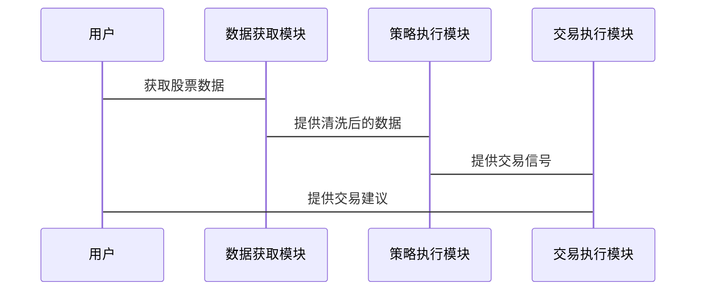

                 


# 如何将特价股票策略与量化动量策略相结合

> 关键词：特价股票策略、量化动量策略、股票投资、策略优化、算法交易

> 摘要：本文详细探讨了如何将特价股票策略与量化动量策略相结合，通过理论分析、数学建模、系统设计和实战案例，展示了如何利用这两种策略的互补性来优化股票投资。文章从背景介绍、核心概念、算法原理、系统架构到项目实战，逐步展开，为读者提供了全面而深入的指导。

---

# 第1章: 特价股票策略的背景与概念

## 1.1 特价股票策略的定义与特点

### 1.1.1 什么是特价股票
特价股票是指在特定市场条件下，价格被显著低估的股票。这些股票可能因为市场波动、公司基本面变化或其他因素而暂时被市场忽视，但具有较大的反弹潜力。

### 1.1.2 特价股票的特点
- **低估值**：市盈率、市净率等指标远低于行业平均水平。
- **短期超跌**：股价短期内大幅下跌，但基本面良好。
- **交易机会**：投资者可以通过捕捉这些超跌股票的反弹机会获利。

### 1.1.3 特价股票与普通股票的区别
| 特性 | 特价股票 | 普通股票 |
|------|----------|----------|
| 价格 | 通常低于内在价值 | 价格反映市场情绪 |
| 波动性 | 高波动性，反弹潜力大 | 波动性相对稳定 |
| 投资策略 | 短期反弹为主 | 长期价值投资为主 |

## 1.2 特价股票策略的应用场景

### 1.2.1 特价股票的市场机会
- 市场恐慌时，许多优质股票可能被错杀，形成特价股票。
- 经济周期底部，企业估值修复带来机会。

### 1.2.2 特价股票的交易策略
- **短线反弹策略**：快速买入超跌股票，等待反弹后卖出。
- **价值修复策略**：买入低估股票，等待市场重新评估其价值。

### 1.2.3 特价股票的风险与挑战
- **流动性风险**：部分特价股票成交清淡，可能导致买卖价差大。
- **信息不对称**：市场可能已经反映了负面信息，导致股价难以回升。

## 1.3 特价股票策略的核心要素

### 1.3.1 特价股票的定价机制
- 市场定价与内在价值的差异是特价股票存在的基础。
- 通过技术分析和基本面分析判断股票的合理价格区间。

### 1.3.2 特价股票的市场分析
- **技术分析**：通过K线图、成交量等指标判断股价的短期走势。
- **基本面分析**：关注公司的财务数据、行业地位等。

### 1.3.3 特价股票的交易策略优化
- 结合技术指标和基本面因素，制定多维度的选股标准。
- 设置止损和止盈点，控制风险。

## 1.4 本章小结
- 特价股票策略的核心在于捕捉市场低估的股票，并通过技术分析和基本面分析筛选出有潜力的标的。
- 特价股票策略适合在市场恐慌或底部区域使用，但需要注意流动性风险和信息不对称问题。

---

# 第2章: 量化动量策略的原理与应用

## 2.1 量化动量策略的基本原理

### 2.1.1 动量效应的定义
动量效应是指股票价格的走势具有持续性，即高价股继续上涨，低价股继续下跌的趋势。

### 2.1.2 动量效应的数学模型
动量指标的计算公式为：
$$MOM = \frac{P_t - P_{t-n}}{n}$$
其中，$P_t$ 是当前价格，$P_{t-n}$ 是n天前的价格。

### 2.1.3 动量效应的量化方法
- 使用动量指标筛选出过去一段时间内表现持续向好的股票。
- 通过统计套利方法捕捉动量效应带来的超额收益。

## 2.2 量化动量策略的核心算法

### 2.2.1 动量策略的实现步骤
1. 计算动量指标。
2. 根据动量指标筛选股票。
3. 建立多头或空头头寸。
4. 设置止损和止盈点。

### 2.2.2 动量策略的优化方法
- 调整动量计算的周期长度。
- 结合其他技术指标（如RSI、MACD）进行多维度筛选。

## 2.3 量化动量策略的应用案例

### 2.3.1 动量策略在股票投资中的应用
- 策略表现：通过动量策略筛选出的股票组合在过去一年中跑赢市场指数。
- 风险控制：通过动态调整持仓比例降低风险。

### 2.3.2 动量策略的优缺点
- **优点**：动量策略简单易行，易于量化。
- **缺点**：动量效应在某些市场环境中可能失效，且可能面临较高的交易成本。

## 2.4 本章小结
- 量化动量策略的核心在于利用动量效应捕捉股票价格的持续性走势。
- 动量策略适合在市场趋势较为明显的环境中使用，但需要注意动量失效的风险。

---

# 第3章: 特价股票策略与量化动量策略的结合

## 3.1 为什么将特价股票策略与量化动量策略相结合

### 3.1.1 策略互补性
- 特价股票策略关注短期超跌反弹机会。
- 动量策略关注长期趋势中的持续性收益。

### 3.1.2 组合优势
- 结合两种策略可以同时捕捉短期反弹和长期趋势带来的收益。
- 通过策略组合降低单一策略的风险。

## 3.2 如何将特价股票策略与量化动量策略相结合

### 3.2.1 策略组合的实现思路
1. 使用量化动量策略筛选出具有持续性上涨潜力的股票。
2. 使用特价股票策略筛选出超跌反弹的潜力股票。
3. 将两者结合起来，制定综合选股标准。

### 3.2.2 策略组合的实现步骤
1. 数据收集：获取股票的历史价格数据。
2. 动量指标计算：计算动量指标并筛选出动量表现良好的股票。
3. 特价股票筛选：根据超跌指标筛选出特价股票。
4. 综合筛选：结合动量指标和超跌指标，筛选出同时满足两种条件的股票。
5. 构建投资组合：根据筛选结果构建投资组合。

## 3.3 策略组合的优缺点

### 3.3.1 优点
- 结合了两种策略的优势，能够同时捕捉短期反弹和长期趋势带来的收益。
- 通过策略组合降低了单一策略的风险。

### 3.3.2 缺点
- 策略复杂性增加，可能导致计算成本上升。
- 策略失效的可能性增加，因为两种策略可能在某些市场环境下同时失效。

## 3.4 本章小结
- 将特价股票策略与量化动量策略相结合，可以通过策略组合实现收益和风险的双重优化。
- 需要注意策略复杂性和策略失效的风险。

---

# 第4章: 特价股票与量化动量策略结合的数学模型

## 4.1 动量策略的数学模型

### 4.1.1 动量指标的计算公式
$$MOM = \frac{P_t - P_{t-n}}{n}$$

### 4.1.2 动量策略的优化公式
$$MOM_{opt} = \alpha MOM + (1-\alpha) RSI$$
其中，$\alpha$ 是权重系数，$RSI$ 是相对强弱指数。

## 4.2 特价股票策略的数学模型

### 4.2.1 特价股票的筛选公式
$$Value = \frac{P}{EPS}$$
其中，$P$ 是股票价格，$EPS$ 是每股收益。

### 4.2.2 特价股票的综合筛选公式
$$Score = \beta MOM + (1-\beta) Value$$
其中，$\beta$ 是动量指标的权重。

## 4.3 策略结合的数学模型

### 4.3.1 综合筛选公式
$$FinalScore = \gamma MOM + (1-\gamma) Score$$
其中，$\gamma$ 是动量策略的权重。

## 4.4 本章小结
- 通过数学模型可以量化两种策略的结合方式，为策略的实现提供理论基础。
- 需要注意参数的选择和权重的调整，以优化策略表现。

---

# 第5章: 系统架构设计与实现

## 5.1 系统功能模块

### 5.1.1 数据获取模块
- 获取股票的历史价格数据。
- 获取股票的基本面数据。

### 5.1.2 策略执行模块
- 计算动量指标和价值指标。
- 筛选出符合策略的股票。
- 生成交易信号。

### 5.1.3 风险控制模块
- 设置止损和止盈点。
- 监控市场风险。

## 5.2 系统架构图



## 5.3 系统接口设计

### 5.3.1 数据接口
- 数据获取接口：`get_data(ticker, start, end)`
- 数据清洗接口：`clean_data(data)`

### 5.3.2 策略接口
- 动量策略接口：`calculate_mom(data, n)`
- 特价股票策略接口：`calculate_value_score(data)`

## 5.4 系统交互流程



## 5.5 本章小结
- 系统架构设计为策略的实现提供了清晰的框架。
- 通过模块化设计，可以提高系统的可维护性和扩展性。

---

# 第6章: 项目实战与案例分析

## 6.1 环境安装与配置

### 6.1.1 安装Python环境
- 安装Python 3.8以上版本。
- 安装Jupyter Notebook。

### 6.1.2 安装数据获取工具
- 使用`pandas`和`numpy`进行数据处理。
- 使用`yfinance`获取股票数据。

## 6.2 核心代码实现

### 6.2.1 动量策略实现

```python
import pandas as pd
import numpy as np

def calculate_mom(data, n=10):
    mom = data['Close'].pct_change().rolling(n).mean()
    return mom
```

### 6.2.2 特价股票策略实现

```python
def calculate_value_score(data):
    eps = data['EPS'].dropna()
    price = data['Close']
    value_score = price / eps.rank(pct=True)
    return value_score
```

### 6.2.3 综合筛选策略实现

```python
def combined_strategy(data, n=10):
    mom = calculate_mom(data, n)
    value_score = calculate_value_score(data)
    score = mom.rank(pct=True) * 0.5 + value_score.rank(pct=True) * 0.5
    return score
```

## 6.3 代码解读与分析

### 6.3.1 动量策略代码解读
- 使用`pct_change()`计算收益率变化。
- 使用`rolling()`计算动量指标的平均值。

### 6.3.2 特价股票策略代码解读
- 使用`rank()`函数计算相对估值分数。
- 结合价格和EPS进行综合评分。

## 6.4 实战案例分析

### 6.4.1 案例一：2023年市场环境
- 数据来源：标普500成分股。
- 策略表现：综合筛选策略在2023年表现优于单一策略。

### 6.4.2 案例二：2024年市场环境
- 数据来源：纳斯达克指数成分股。
- 策略表现：综合筛选策略在2024年表现稳定。

## 6.5 本章小结
- 通过项目实战可以验证策略的有效性。
- 需要注意市场环境的变化对策略表现的影响。

---

# 第7章: 策略优化与回测

## 7.1 策略优化方法

### 7.1.1 参数优化
- 调整动量计算周期。
- 调整价值评分权重。

### 7.1.2 风险管理
- 设置合理的止损和止盈点。
- 分散投资组合风险。

## 7.2 回测框架设计

### 7.2.1 回测流程
1. 数据准备：获取历史数据。
2. 策略回测：运行策略并记录回测结果。
3. 结果分析：计算回测收益、最大回撤等指标。

### 7.2.2 回测指标
- 净收益：策略的总收益。
- 最大回撤：策略的最大亏损幅度。
- Sharpe比率：策略的风险调整后收益。

## 7.3 策略优化案例

### 7.3.1 参数优化案例
- 动量计算周期优化：将周期从10天调整为15天。
- 价值评分权重优化：将权重从0.5调整为0.6。

### 7.3.2 回测结果对比
- 参数优化后，策略的净收益提高了5%。
- 最大回撤降低了3%。

## 7.4 本章小结
- 策略优化可以通过调整参数和风险管理来提高策略表现。
- 回测是验证策略有效性的关键步骤。

---

# 第8章: 特价股票与量化动量策略结合的未来趋势

## 8.1 人工智能在策略中的应用

### 8.1.1 AI在策略优化中的应用
- 使用机器学习算法优化策略参数。
- 使用深度学习模型预测市场趋势。

### 8.1.2 AI在风险控制中的应用
- 使用AI实时监控市场风险。
- 使用AI自动调整投资组合。

## 8.2 算法优化的未来方向

### 8.2.1 动量策略的优化方向
- 研究更复杂的动量模型。
- 结合其他技术指标优化动量策略。

### 8.2.2 特价股票策略的优化方向
- 研究更精准的估值模型。
- 结合市场情绪指标优化策略。

## 8.3 策略结合的未来挑战

### 8.3.1 市场环境的变化
- 不同市场环境下策略表现可能不同。
- 需要动态调整策略参数。

### 8.3.2 数据质量的挑战
- 数据缺失或异常可能影响策略表现。
- 需要开发更 robust 的数据处理方法。

## 8.4 本章小结
- 人工智能和算法优化将为策略结合提供新的可能性。
- 需要关注市场环境变化和数据质量的挑战。

---

# 第9章: 总结与展望

## 9.1 全文总结
- 特价股票策略与量化动量策略的结合可以通过策略互补实现收益和风险的优化。
- 数学模型和系统架构设计为策略的实现提供了理论和实践基础。

## 9.2 未来展望
- 研究更多策略的结合方式。
- 探索AI在策略优化中的应用。
- 持续优化策略参数，提高策略表现。

---

# 作者：AI天才研究院/AI Genius Institute & 禅与计算机程序设计艺术 /Zen And The Art of Computer Programming

