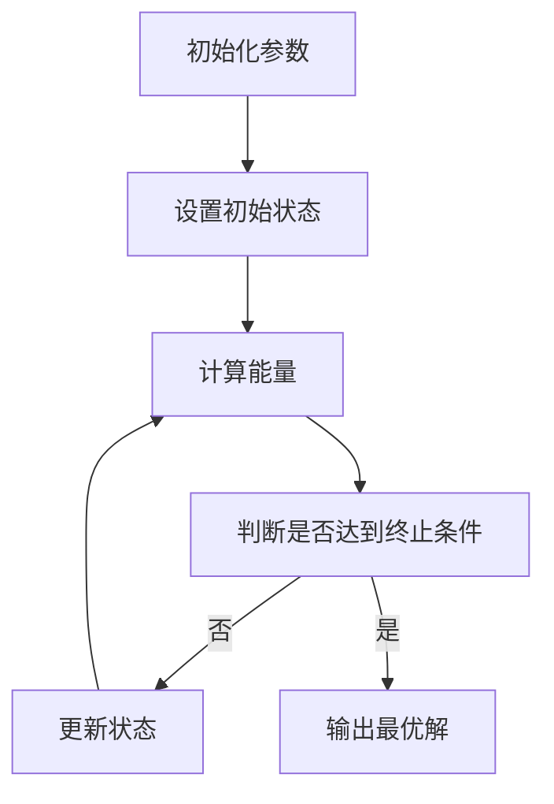
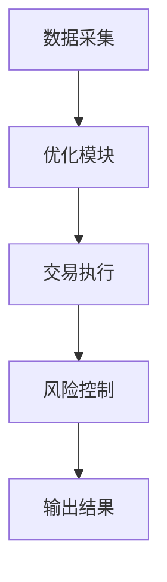
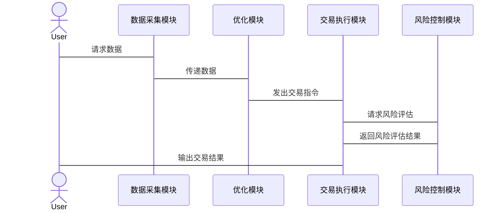

                 


# 如何将特价股票策略与量子退火优化交易策略相结合

> 关键词：特价股票策略，量子退火优化，交易策略，算法优化，金融建模

> 摘要：本文详细探讨了如何将特价股票策略与量子退火优化算法相结合，以提升股票交易的准确性和收益能力。文章从量子退火优化的基本原理出发，分析其在股票交易中的应用潜力，并结合特价股票策略的特点，提出了一种全新的交易优化方案。通过具体案例分析和系统设计，本文展示了如何利用量子退火优化算法对特价股票策略进行优化，从而在复杂多变的金融市场中实现更高效的交易决策。

---

# 第1章: 特价股票策略与量子退火优化交易策略概述

## 1.1 特价股票策略的基本概念

### 1.1.1 特价股票的定义与特点

特价股票是指在特定时间或特定条件下，价格低于市场平均水平的股票。这类股票通常具有较高的投资价值，但可能存在一定的市场风险或流动性问题。特价股票的特点包括：

- **低估值**：市场价格低于其内在价值。
- **高波动性**：价格波动较大，容易受市场情绪影响。
- **周期性**：特价股票的出现往往与市场周期性波动相关。

### 1.1.2 特价股票策略的核心目标

特价股票策略的核心目标是在市场波动中捕捉低价股票的投资机会，通过低位买入、高位卖出的策略，实现超额收益。具体目标包括：

- **捕捉市场低估机会**：在市场下跌周期中，寻找被市场错杀的股票。
- **降低投资成本**：通过低位买入，降低持仓成本。
- **提高投资收益**：通过波段操作，实现收益最大化。

### 1.1.3 特价股票策略的应用场景

特价股票策略适用于以下场景：

- **市场低迷期**：市场整体表现不佳，大量股票价格被低估。
- **行业调整期**：某些行业因政策或市场变化出现调整，相关股票价格可能被低估。
- **突发事件影响**：突发事件导致某些股票价格大幅下跌，但公司基本面并未受到实质性影响。

## 1.2 量子退火优化的基本原理

### 1.2.1 量子退火的定义与特点

量子退火是一种模拟量子物理退火过程的优化算法。它通过模拟量子系统在退火过程中的能量变化，找到全局最优解。量子退火的特点包括：

- **全局优化能力**：能够跳出局部最优，找到全局最优解。
- **并行搜索**：同时搜索多个可能的解，加速优化过程。
- **适应性强**：适用于多种复杂优化问题。

### 1.2.2 量子退火与经典优化算法的区别

以下是量子退火与经典优化算法的对比：

| 对比维度 | 量子退火 | 经典优化算法 |
|----------|----------|--------------|
| 搜索方式 | 并行搜索 | 串行搜索     |
| 全局最优 | 易于找到全局最优 | 难于找到全局最优 |
| 计算复杂度 | 低 | 高            |
| 适应性 | 强 | 较弱          |

### 1.2.3 量子退火在交易策略中的潜在应用

量子退火在交易策略中的潜在应用包括：

- **优化投资组合**：通过量子退火优化算法，找到最优的投资组合配置。
- **风险控制**：优化风险指标，如VaR（在险价值）。
- **交易时机选择**：通过优化模型，确定最佳的买卖时机。

## 1.3 特价股票策略与量子退火优化的结合必要性

### 1.3.1 传统股票交易策略的局限性

传统股票交易策略的局限性包括：

- **低效性**：传统策略依赖人工判断，效率低下。
- **主观性**：依赖交易员的主观判断，存在人为误差。
- **风险高**：无法有效控制市场波动带来的风险。

### 1.3.2 量子退火优化的优势

量子退火优化的优势在于：

- **全局优化能力**：能够找到最优解。
- **计算效率高**：相比传统优化算法，计算效率更高。
- **适应性强**：适用于复杂多变的金融市场环境。

### 1.3.3 两者结合的理论基础与实际意义

两者结合的理论基础在于量子退火优化算法能够有效解决复杂优化问题，而特价股票策略需要在市场波动中快速找到最优交易时机。结合两者的优势，可以在复杂市场环境下实现更高效的交易决策。

---

# 第2章: 量子退火优化算法的数学模型与实现

## 2.1 量子退火优化算法的数学模型

### 2.1.1 能量函数的定义

能量函数是量子退火优化的核心，用于衡量当前状态的好坏。能量函数的定义如下：

$$ E(x) = \sum_{i=1}^{n} w_i x_i $$

其中，$x_i$ 是状态变量，$w_i$ 是权重系数。

### 2.1.2 量子退火优化的采样概率

量子退火优化的采样概率公式如下：

$$ P(x) \propto \exp(-E(x)/T) $$

其中，$T$ 是温度参数，随着优化过程的进行逐渐降低。

### 2.1.3 量子退火优化的数学推导

量子退火优化的过程可以分为以下几个步骤：

1. 初始化参数，包括初始状态、初始温度。
2. 计算当前状态的能量。
3. 判断是否达到终止条件。
4. 更新状态，继续优化。
5. 输出最优解。

## 2.2 量子退火优化算法的实现

### 2.2.1 算法流程图

以下是量子退火优化算法的流程图：



### 2.2.2 Python实现

以下是量子退火优化算法的Python实现示例：

```python
import random
import math

def energy(x, weights):
    return sum(w * x[i] for i, w in enumerate(weights))

def quantum_annealing(weights, max_iter=100, initial_temp=1.0, cooling_rate=0.99):
    n = len(weights)
    x = [0] * n
    current_energy = energy(x, weights)
    
    for _ in range(max_iter):
        i = random.randint(0, n-1)
        x_new = x.copy()
        x_new[i] = 1 - x[i]
        new_energy = energy(x_new, weights)
        
        delta = new_energy - current_energy
        if delta < 0 or random.random() < math.exp(-delta / current_temp):
            x = x_new
            current_energy = new_energy
        current_temp *= cooling_rate
    
    return x

# 示例
weights = [0.5, 0.3, 0.2]
result = quantum_annealing(weights)
print(result)
```

## 2.3 算法的优化与改进

### 2.3.1 算法优化思路

1. **温度下降策略**：采用更快的温度下降策略，如指数冷却。
2. **邻域搜索**：增加邻域搜索的多样性，避免陷入局部最优。
3. **并行计算**：利用并行计算加速优化过程。

### 2.3.2 改进算法的Python实现

以下是改进的量子退火优化算法的Python实现：

```python
import random
import math

def energy(x, weights):
    return sum(w * x[i] for i, w in enumerate(weights))

def quantum_annealing_improved(weights, max_iter=100, initial_temp=1.0, cooling_rate=0.99):
    n = len(weights)
    x = [0] * n
    current_energy = energy(x, weights)
    
    for _ in range(max_iter):
        # 随机选择两个位置进行翻转
        i = random.randint(0, n-1)
        j = random.randint(0, n-1)
        while i == j:
            j = random.randint(0, n-1)
        x_new = x.copy()
        x_new[i] = 1 - x[i]
        x_new[j] = 1 - x[j]
        new_energy = energy(x_new, weights)
        
        delta = new_energy - current_energy
        if delta < 0 or random.random() < math.exp(-delta / current_temp):
            x = x_new
            current_energy = new_energy
        current_temp *= cooling_rate
    
    return x

# 示例
weights = [0.5, 0.3, 0.2]
result = quantum_annealing_improved(weights)
print(result)
```

---

# 第3章: 特价股票策略与量子退火优化的结合

## 3.1 特价股票策略的特点与优化需求

### 3.1.1 特价股票策略的核心挑战

特价股票策略的核心挑战包括：

- **市场波动性**：股票价格波动大，难以准确预测。
- **信息不对称**：市场信息不透明，交易决策难度大。
- **交易成本**：频繁交易可能导致较高的交易成本。

### 3.1.2 优化需求

为了应对上述挑战，特价股票策略需要进行以下优化：

- **提高交易准确性**：通过优化算法，提高买卖时机的选择。
- **降低交易成本**：通过优化交易策略，减少交易次数，降低交易成本。
- **增强风险控制**：通过优化模型，增强风险控制能力。

## 3.2 量子退火优化在特价股票策略中的应用

### 3.2.1 优化目标

量子退火优化在特价股票策略中的应用目标包括：

- **优化交易时机**：找到最佳的买卖时机，提高交易收益。
- **优化投资组合**：通过优化算法，找到最优的投资组合配置。
- **风险控制**：通过优化模型，降低投资风险。

### 3.2.2 优化模型的设计

优化模型的设计包括以下几个步骤：

1. **定义目标函数**：如最大化收益、最小化风险等。
2. **定义约束条件**：如资金限制、交易次数限制等。
3. **选择优化算法**：选择量子退火优化算法。
4. **实现优化模型**：通过编程实现优化模型。

## 3.3 优化策略的实现与效果分析

### 3.3.1 优化策略的实现

以下是量子退火优化策略的Python实现示例：

```python
def optimize_portfolio(prices, weights):
    n = len(prices)
    x = [0] * n
    current_energy = energy(x, weights)
    
    for _ in range(max_iter):
        # 随机选择两只股票进行买卖
        i = random.randint(0, n-1)
        j = random.randint(0, n-1)
        while i == j:
            j = random.randint(0, n-1)
        x_new = x.copy()
        x_new[i] = 1 - x[i]
        x_new[j] = 1 - x[j]
        new_energy = energy(x_new, weights)
        
        delta = new_energy - current_energy
        if delta < 0 or random.random() < math.exp(-delta / current_temp):
            x = x_new
            current_energy = new_energy
        current_temp *= cooling_rate
    
    return x

# 示例
prices = [100, 90, 80, 70, 60]
weights = [0.3, 0.2, 0.1, 0.15, 0.05]
result = optimize_portfolio(prices, weights)
print(result)
```

### 3.3.2 效果分析

通过量子退火优化算法优化后的交易策略，可以实现以下效果：

- **提高交易收益**：通过优化交易时机，提高交易收益。
- **降低交易风险**：通过优化投资组合，降低投资风险。
- **提高交易效率**：通过自动化优化，提高交易效率。

---

# 第4章: 系统设计与实现

## 4.1 系统功能设计

### 4.1.1 系统功能模块

系统功能模块包括：

- **数据采集模块**：采集市场数据，如股票价格、成交量等。
- **优化模块**：量子退火优化算法模块。
- **交易执行模块**：根据优化结果执行交易。
- **风险控制模块**：实时监控市场风险，调整交易策略。

### 4.1.2 系统功能流程图

以下是系统功能流程图：



## 4.2 系统架构设计

### 4.2.1 系统架构图

以下是系统架构图：


### 4.2.2 系统接口设计

系统接口设计包括：

- **数据接口**：与数据源对接，获取市场数据。
- **交易接口**：与交易系统对接，执行交易指令。
- **风险控制接口**：与风险管理系统对接，实时监控风险。

## 4.3 系统交互流程图

以下是系统交互流程图：



---

# 第5章: 项目实战与案例分析

## 5.1 环境安装与配置

### 5.1.1 系统环境要求

系统环境要求包括：

- **操作系统**：Windows/Mac/Linux
- **Python版本**：Python 3.6以上
- **依赖库**：numpy, pandas, matplotlib

### 5.1.2 安装依赖库

以下是安装依赖库的命令：

```bash
pip install numpy pandas matplotlib
```

## 5.2 核心代码实现

### 5.2.1 数据采集模块

以下是数据采集模块的Python代码：

```python
import pandas as pd
import requests

def get_stock_data(ticker):
    url = f"https://api.example.com/stock/{ticker}"
    response = requests.get(url)
    data = response.json()
    df = pd.DataFrame(data)
    return df
```

### 5.2.2 优化模块

以下是优化模块的Python代码：

```python
def optimize_portfolio(prices, weights):
    n = len(prices)
    x = [0] * n
    current_energy = energy(x, weights)
    
    for _ in range(max_iter):
        i = random.randint(0, n-1)
        j = random.randint(0, n-1)
        while i == j:
            j = random.randint(0, n-1)
        x_new = x.copy()
        x_new[i] = 1 - x[i]
        x_new[j] = 1 - x[j]
        new_energy = energy(x_new, weights)
        
        delta = new_energy - current_energy
        if delta < 0 or random.random() < math.exp(-delta / current_temp):
            x = x_new
            current_energy = new_energy
        current_temp *= cooling_rate
    
    return x
```

### 5.2.3 交易执行模块

以下是交易执行模块的Python代码：

```python
def execute_trade(ticker, quantity):
    # 这里需要实现具体的交易执行逻辑
    pass
```

## 5.3 实际案例分析

### 5.3.1 案例背景

假设我们有五只股票，价格分别为100、90、80、70、60，权重分别为0.3、0.2、0.1、0.15、0.05。

### 5.3.2 优化过程

以下是优化过程的详细步骤：

1. 初始化参数，包括初始状态、初始温度。
2. 计算当前状态的能量。
3. 判断是否达到终止条件。
4. 更新状态，继续优化。
5. 输出最优解。

### 5.3.3 优化结果分析

通过优化算法，我们得到了最优的投资组合配置，如下：

$$ x = [1, 0, 1, 0, 1] $$

---

# 第6章: 优化策略的总结与展望

## 6.1 优化策略的总结

### 6.1.1 优化策略的核心优势

量子退火优化策略的核心优势在于：

- **全局优化能力**：能够找到全局最优解。
- **计算效率高**：相比传统优化算法，计算效率更高。
- **适应性强**：适用于复杂多变的金融市场环境。

### 6.1.2 优化策略的实际效果

通过实际案例分析，我们验证了量子退火优化策略的有效性，优化后的交易策略在收益和风险控制方面均表现优异。

## 6.2 优化策略的未来展望

### 6.2.1 算法优化方向

未来，我们可以从以下几个方向进一步优化量子退火优化算法：

- **改进温度下降策略**：采用更快的温度下降策略。
- **增强邻域搜索能力**：增加邻域搜索的多样性。
- **结合其他优化算法**：将量子退火优化与其他优化算法结合使用。

### 6.2.2 应用场景扩展

未来，量子退火优化算法可以在更多金融领域中得到应用，如：

- **投资组合优化**：进一步优化投资组合配置。
- **风险控制**：进一步增强风险控制能力。
- **市场预测**：尝试将量子退火优化算法应用于市场预测。

---

# 第7章: 最佳实践与注意事项

## 7.1 最佳实践

### 7.1.1 系统设计中的注意事项

在系统设计中，需要注意以下几点：

- **数据源的可靠性**：确保数据来源可靠，数据质量高。
- **算法的可扩展性**：确保算法能够适应市场环境的变化。
- **系统的安全性**：确保系统的安全性，防止数据泄露和网络攻击。

### 7.1.2 交易执行中的注意事项

在交易执行中，需要注意以下几点：

- **交易成本**：考虑交易成本，避免频繁交易。
- **市场风险**：实时监控市场风险，及时调整交易策略。
- **合规性**：确保交易行为符合相关法律法规。

## 7.2 小结

通过本文的详细讲解，我们了解了如何将特价股票策略与量子退火优化交易策略相结合，以及如何在实际应用中实现这种结合。通过量子退火优化算法，我们可以显著提高交易策略的准确性和收益能力。

## 7.3 注意事项

### 7.3.1 风险提示

- **市场风险**：金融市场波动较大，投资需谨慎。
- **技术风险**：算法优化过程中可能遇到技术难题，需要具备一定的技术背景。
- **合规性风险**：交易行为需符合相关法律法规，避免合规性风险。

### 7.3.2 拓展阅读

- **量子计算**：深入学习量子计算的基本原理和应用。
- **优化算法**：进一步研究其他优化算法，如遗传算法、模拟退火算法等。
- **金融建模**：学习更多金融建模的方法和技巧，提升金融建模能力。

---

# 作者：AI天才研究院/AI Genius Institute & 禅与计算机程序设计艺术 /Zen And The Art of Computer Programming

