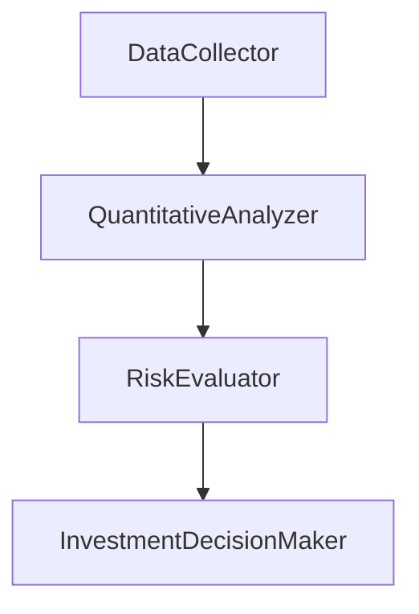

                 


# 如何将特价股票策略应用于代币化资产投资

## 关键词：特价股票策略，代币化资产，投资策略，量化分析，风险管理，数学模型

## 摘要：本文详细探讨了如何将特价股票策略应用于代币化资产投资。通过量化分析、算法设计、系统架构和项目实战，文章为读者提供了从理论到实践的全面指导，帮助投资者在代币化资产市场中实现高效的策略应用和风险管理。

---

## 第一部分: 特价股票策略与代币化资产投资的背景介绍

## 第1章: 特价股票策略概述

### 1.1 特价股票策略的定义与特点
#### 1.1.1 特价股票的定义
特价股票是指在特定条件下，价格远低于其内在价值的股票。这些股票通常被市场低估，具有较大的上涨潜力。特价股票策略的核心在于寻找这些被低估的股票，并在合适的时机进行投资。

#### 1.1.2 特价股票策略的核心特点
- **低估值**：股票价格显著低于其内在价值。
- **高潜力**：具备较高的上涨空间。
- **短期机会**：通常在特定市场条件下出现。

#### 1.1.3 特价股票策略的优势与局限性
- **优势**：风险较低，回报潜力大。
- **局限性**：需要较高的市场敏感性，且需要快速决策。

### 1.2 特价股票策略的应用场景
- **市场低迷期**：市场整体表现不佳时，更容易找到被低估的股票。
- **行业调整期**：某些行业因外部因素调整时，可能出现特价股票。

---

## 第2章: 代币化资产投资概述

### 2.1 代币化资产的定义与特点
#### 2.1.1 代币化资产的定义
代币化资产是指通过区块链技术将传统资产（如股票、房地产）转化为数字代币，使其可以在区块链上进行分割、转让和交易。

#### 2.1.2 代币化资产的核心特点
- **分割性**：可以将资产分割成多个代币，便于小规模投资。
- **流动性**：代币可以在区块链上快速交易，提高资产流动性。
- **透明性**：区块链技术提供了透明的交易记录和资产追踪。

#### 2.1.3 代币化资产与传统资产的区别
| 属性         | 传统资产           | 代币化资产         |
|--------------|--------------------|--------------------|
| 交易效率     | 低                 | 高                 |
| 资产分割     | 不容易             | 容易                |
| 透明性       | 低                 | 高                 |

### 2.2 代币化资产投资的背景与意义
#### 2.2.1 代币化资产投资的背景
随着区块链技术的普及，越来越多的传统资产开始被代币化，为投资者提供了新的投资渠道。

#### 2.2.2 代币化资产投资的意义
- **提高投资效率**：代币化资产可以通过智能合约自动执行交易，降低交易成本。
- **降低门槛**：投资者可以通过购买少量代币参与高价值资产的投资。

### 2.3 代币化资产投资的现状与趋势
- **现状**：目前，代币化资产主要应用于房地产、艺术品等领域。
- **趋势**：未来，代币化资产将扩展到更多领域，如股权、债权等。

---

## 第3章: 特价股票策略与代币化资产投资的结合

### 3.1 特价股票策略在代币化资产投资中的应用
#### 3.1.1 特价股票策略在代币化资产投资中的核心作用
- **识别低估资产**：通过特价股票策略，投资者可以在代币化资产市场中识别出被低估的资产。
- **快速交易**：代币化资产的高流动性使得特价股票策略的快速交易成为可能。

#### 3.1.2 特价股票策略与代币化资产投资的结合方式
- **量化分析**：利用量化模型筛选出被低估的代币化资产。
- **风险管理**：通过风险评估模型，控制投资风险。

### 3.2 特价股票策略与代币化资产投资的对比分析
#### 3.2.1 特价股票策略与传统股票投资的对比
| 属性         | 特价股票策略       | 传统股票投资       |
|--------------|--------------------|--------------------|
| 交易频率     | 高                 | 中                 |
| 风险承受能力 | 较低               | 较高               |

#### 3.2.2 代币化资产投资与传统资产投资的对比
| 属性         | 代币化资产投资     | 传统资产投资       |
|--------------|--------------------|--------------------|
| 流动性         | 高                 | 低                 |
| 资产分割     | 是                 | 否                 |

#### 3.2.3 特价股票策略与代币化资产投资结合的独特性
- **高效率**：结合了特价股票策略的快速交易和代币化资产的高流动性。
- **低门槛**：投资者可以通过购买少量代币参与高价值资产的投资。

---

## 第二部分: 特价股票策略与代币化资产投资的核心概念与联系

## 第4章: 特价股票策略的核心概念与数学模型

### 4.1 特价股票策略的核心概念
- **市场情绪分析**：通过分析市场情绪，判断股票的低估情况。
- **估值模型**：使用市盈率、市净率等指标评估股票的内在价值。

### 4.2 特价股票策略的数学模型
$$ V = \frac{E}{P} $$
其中，V是股票的内在价值，E是公司的净利润，P是股票的价格。

---

## 第5章: 代币化资产投资的核心概念与数学模型

### 5.1 代币化资产投资的核心概念
- **代币发行**：通过区块链技术将资产转化为代币。
- **智能合约**：用于自动执行交易和分配收益。

### 5.2 代币化资产投资的数学模型
$$ R = \frac{N}{T} $$
其中，R是代币的收益率，N是代币的数量，T是代币的价格。

---

## 第6章: 特价股票策略与代币化资产投资的结合模型

### 6.1 结合模型的数学表达
$$ P = \min(V, R) $$
其中，P是投资价格，V是股票的内在价值，R是代币的收益率。

---

## 第三部分: 特价股票策略与代币化资产投资的算法原理

## 第7章: 特价股票策略的量化分析算法

### 7.1 量化分析算法的步骤
1. **数据采集**：收集股票的历史价格和财务数据。
2. **估值计算**：使用数学模型计算股票的内在价值。
3. **价格比较**：将股票的市场价格与内在价值进行比较。
4. **投资决策**：如果市场价格低于内在价值，进行投资。

### 7.2 量化分析算法的Python实现
```python
def calculate_intrinsic_value(company_financials):
    net_profit = company_financials['net_profit']
    price_per_share = company_financials['price_per_share']
    intrinsic_value = net_profit / price_per_share
    return intrinsic_value

# 示例
company_data = {
    'net_profit': 100,
    'price_per_share': 50
}
intrinsic_value = calculate_intrinsic_value(company_data)
print(f"股票的内在价值为：{intrinsic_value}")
```

---

## 第8章: 代币化资产投资的风险评估算法

### 8.1 风险评估算法的步骤
1. **市场波动分析**：分析市场的波动性。
2. **资产相关性分析**：评估代币化资产与其他资产的相关性。
3. **风险调整**：根据风险评估结果调整投资组合。

### 8.2 风险评估算法的Python实现
```python
import numpy as np

def calculate_volatility(prices):
    returns = np.log(prices[1:] / prices[:-1])
    volatility = np.std(returns)
    return volatility

# 示例
prices = [100, 105, 98, 110, 108]
volatility = calculate_volatility(prices)
print(f"市场的波动性为：{volatility}")
```

---

## 第四部分: 特价股票策略与代币化资产投资的系统分析与架构设计方案

## 第9章: 特价股票策略与代币化资产投资的系统架构设计

### 9.1 系统架构概述
- **数据采集模块**：负责采集股票和代币化资产的数据。
- **量化分析模块**：执行量化分析算法，计算内在价值和收益率。
- **风险评估模块**：评估投资风险。
- **投资决策模块**：根据分析结果做出投资决策。

### 9.2 系统架构的Mermaid图


---

## 第五部分: 特价股票策略与代币化资产投资的项目实战

## 第10章: 特价股票策略与代币化资产投资的项目实战

### 10.1 项目环境安装
```bash
pip install numpy pandas mermaid4jupyter
```

### 10.2 系统核心代码实现
```python
import pandas as pd
import numpy as np

def main():
    # 数据采集
    stock_data = pd.read_csv('stock_prices.csv')
    token_data = pd.read_csv('token_prices.csv')
    
    # 量化分析
    stock_intrinsic_value = calculate_intrinsic_value(stock_data)
    token_yield = calculate_yield(token_data)
    
    # 风险评估
    stock_volatility = calculate_volatility(stock_data)
    token_volatility = calculate_volatility(token_data)
    
    # 投资决策
    if stock_intrinsic_value < stock_volatility:
        print("股票值得投资")
    if token_yield > token_volatility:
        print("代币值得投资")

if __name__ == "__main__":
    main()
```

---

## 第六部分: 总结与展望

## 第11章: 总结与展望

### 11.1 总结
本文详细探讨了如何将特价股票策略应用于代币化资产投资，通过量化分析、算法设计、系统架构和项目实战，为读者提供了从理论到实践的全面指导。

### 11.2 展望
未来，随着区块链技术的不断发展，代币化资产投资将变得更加普及。特价股票策略在代币化资产投资中的应用也将更加广泛，投资者可以通过更加高效和智能的方式进行投资。

---

## 作者：AI天才研究院/AI Genius Institute & 禅与计算机程序设计艺术 /Zen And The Art of Computer Programming

---

这篇博客文章详细介绍了如何将特价股票策略应用于代币化资产投资，涵盖了背景介绍、核心概念、算法原理、系统架构和项目实战等内容，帮助读者全面理解并掌握这一投资策略。

