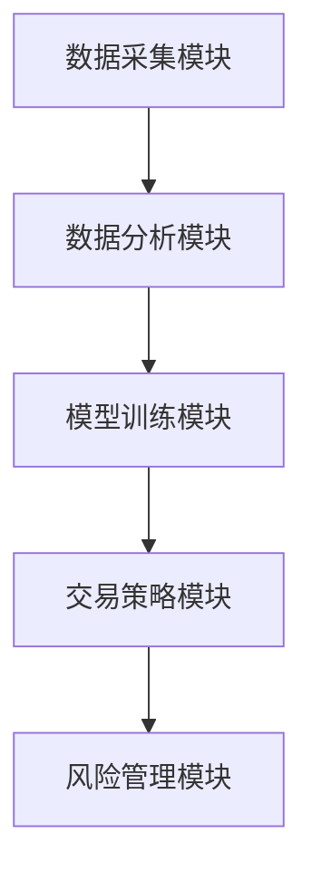

                 


# 如何将特价股票策略应用于加密货币投资

> 关键词：特价股票策略，加密货币投资，算法交易，风险管理，技术分析，投资策略

> 摘要：本文详细介绍了如何将特价股票策略应用于加密货币投资。从特价股票策略的核心概念和加密货币市场的特点出发，分析了其在加密货币投资中的应用前景。通过数学模型、算法原理和系统设计的详细讲解，展示了如何在加密货币投资中实现特价股票策略。最后，通过实际案例和项目实战，总结了最佳实践和注意事项，为读者提供了全面的指导。

---

# 第1章: 特价股票策略概述

## 1.1 特价股票策略的定义与核心概念

### 1.1.1 特价股票策略的定义

特价股票策略是一种基于市场波动性和价格敏感性的投资策略，旨在通过精准的价格预测和市场分析，抓住短期价格波动带来的投资机会。该策略的核心在于利用市场的短期价格波动，通过快速买入和卖出操作，实现超额收益。

### 1.1.2 特价股票策略的核心要素

以下是特价股票策略的核心要素：

1. **价格敏感性**：关注价格的短期波动，抓住价格低点买入、高点卖出的机会。
2. **市场分析**：通过技术分析和基本面分析，识别市场的短期趋势和潜在机会。
3. **风险管理**：设置止损和止盈点，控制投资风险，确保收益的稳定性。
4. **快速执行**：依赖高效的交易系统，确保在最佳时机执行交易指令。

### 1.1.3 特价股票策略的背景与问题背景

近年来，随着金融市场的发展，投资者对短期价格波动的关注度不断提高。特价股票策略作为一种高效的投资方式，因其快速获利的特点，逐渐受到投资者的青睐。然而，随着市场的波动性增加，如何将这种策略应用于加密货币投资，成为一个亟待解决的问题。

---

## 1.2 加密货币市场的特点与投资机会

### 1.2.1 加密货币市场的基本概念

加密货币市场是以区块链技术为基础，通过去中心化的方式进行交易的市场。与传统股票市场相比，加密货币市场的交易更加便捷，且具有较高的波动性。

### 1.2.2 加密货币市场的波动性与风险

加密货币市场的价格波动远高于传统股票市场，这既是投资机会，也是投资风险的来源。市场参与者需要具备较高的风险承受能力，并采取有效的风险管理策略。

### 1.2.3 加密货币市场的投资机会

加密货币市场的高波动性为投资者提供了丰富的投资机会。通过精准的价格预测和策略执行，投资者可以在短期内获得较高的收益。

---

## 1.3 特价股票策略在加密货币投资中的应用前景

### 1.3.1 特价股票策略的适用性分析

特价股票策略的核心在于捕捉短期价格波动，这与加密货币市场的高波动性特点高度契合。因此，特价股票策略在加密货币投资中具有较高的适用性。

### 1.3.2 加密货币投资中的策略选择

在加密货币投资中，投资者需要结合市场特点和自身风险承受能力，选择适合的策略。特价股票策略作为一种高效的投资方式，可以在特定市场条件下为投资者带来超额收益。

### 1.3.3 特价股票策略的潜在优势与挑战

**潜在优势**：  
1. 高效的价格波动捕捉能力。  
2. 短期内的高收益潜力。  
3. 适合技术分析的应用场景。

**挑战**：  
1. 市场波动性带来的高风险。  
2. 策略执行的及时性和准确性要求较高。  
3. 市场参与者众多，竞争激烈。

---

# 第2章: 特价股票策略的核心原理

## 2.1 特价股票策略的数学模型与公式

### 2.1.1 特价股票策略的基本公式

以下是特价股票策略的核心数学公式：

$$
\text{收益} = \text{卖出价格} - \text{买入价格}
$$

### 2.1.2 市场趋势预测的数学模型

市场趋势预测是特价股票策略的重要组成部分。以下是常用的数学模型：

$$
P_{t+1} = P_t + \alpha \cdot (P_t - P_{t-1})
$$

其中，$P_t$ 表示第 $t$ 时刻的价格，$\alpha$ 是模型参数。

### 2.1.3 风险评估与收益计算

风险评估是投资决策的重要依据。以下是风险评估的数学模型：

$$
\text{风险} = \text{标准差}(\text{收益})
$$

---

## 2.2 特价股票策略的算法原理

### 2.2.1 算法的基本原理

特价股票策略的算法基于价格预测和交易执行。以下是算法的基本步骤：

1. 数据采集：获取加密货币的历史价格数据。  
2. 数据分析：通过技术分析和数学模型预测未来价格走势。  
3. 交易决策：根据预测结果，决定买入或卖出的时机。  
4. 交易执行：快速执行交易指令，确保收益最大化。

### 2.2.2 算法的实现步骤

以下是算法的实现步骤：

1. **数据预处理**：清洗数据，去除异常值。  
2. **特征提取**：提取影响价格波动的关键特征。  
3. **模型训练**：训练价格预测模型。  
4. **交易策略制定**：根据模型预测结果制定交易策略。  
5. **交易执行**：通过自动化交易系统执行交易指令。

---

## 2.3 特价股票策略的系统架构设计

### 2.3.1 系统的功能模块设计

以下是系统的功能模块划分：

1. 数据采集模块：负责数据的采集和预处理。  
2. 数据分析模块：负责数据分析和特征提取。  
3. 模型训练模块：负责模型的训练和优化。  
4. 交易策略模块：负责交易策略的制定和执行。  
5. 风险管理模块：负责风险评估和控制。

### 2.3.2 系统的架构图展示



### 2.3.3 系统接口设计与交互流程

以下是系统的交互流程：

1. 用户输入交易参数。  
2. 系统接收参数并进行数据处理。  
3. 系统执行交易指令。  
4. 系统反馈交易结果。

---

# 第3章: 加密货币市场的数据采集与分析

## 3.1 数据采集方法

### 3.1.1 数据源的选择

加密货币市场的数据源主要包括：

1. 比特币交易平台：如CoinMarketCap、CoinBase等。  
2. 以太坊交易平台：如Etherscan、MyEtherWallet等。  
3. 其他加密货币交易平台：如Binance、OKEx等。

### 3.1.2 数据采集工具的使用

常用的加密货币数据采集工具包括：

1. Python的Pandas库：用于数据处理和分析。  
2. API接口：如CoinMarketCap API、Binance API等。  
3. 数据可视化工具：如Matplotlib、Seaborn等。

### 3.1.3 数据清洗与预处理

数据清洗的主要步骤包括：

1. 去除缺失值。  
2. 处理异常值。  
3. 标准化数据格式。

---

## 3.2 数据分析与特征提取

### 3.2.1 数据分析的基本方法

常用的数据分析方法包括：

1. 时间序列分析：用于预测价格走势。  
2. 统计分析：用于评估市场风险。  
3. 技术分析：用于识别价格形态。

### 3.2.2 特征提取的技巧

特征提取的关键在于选择能够反映市场趋势的关键指标。常用的指标包括：

1. 移动平均线（MA）。  
2. 相对强弱指数（RSI）。  
3. 布林带（Bollinger Bands）。

### 3.2.3 数据可视化与趋势分析

数据可视化是理解市场趋势的重要手段。以下是常用的可视化方法：

1. 折线图：用于展示价格走势。  
2. 柱状图：用于展示成交量。  
3. K线图：用于展示价格波动。

---

## 3.3 数据驱动的策略优化

### 3.3.1 数据驱动的策略优化方法

策略优化的核心在于通过数据分析，不断改进交易模型和策略参数。以下是常用的优化方法：

1. 回测分析：通过历史数据验证策略的有效性。  
2. 参数优化：通过调整模型参数，提高预测精度。  
3. 风险控制：通过设置止损和止盈点，降低投资风险。

### 3.3.2 策略优化的数学模型

以下是策略优化的数学模型：

$$
\text{最优参数} = \argmin \text{预测误差}
$$

---

## 3.4 实际案例分析

### 3.4.1 案例背景介绍

以下是一个实际案例的背景介绍：

某投资者希望通过特价股票策略，在比特币价格波动中获利。通过历史数据和市场分析，制定了以下交易策略：

1. 在价格低点买入。  
2. 在价格高点卖出。  
3. 设置止损和止盈点。

### 3.4.2 案例的详细分析

以下是案例的详细分析步骤：

1. 数据采集：获取比特币的历史价格数据。  
2. 数据分析：通过技术分析识别价格形态。  
3. 交易策略制定：根据分析结果制定买入和卖出时机。  
4. 交易执行：通过自动化交易系统执行交易指令。  
5. 风险控制：设置止损和止盈点，确保收益的稳定性。

### 3.4.3 案例的总结与反思

总结：通过特价股票策略，投资者在比特币价格波动中获得了较高的收益。  
反思：策略的有效性依赖于市场波动性和数据的准确性。未来需要进一步优化模型，提高预测精度。

---

# 第4章: 特价股票策略在加密货币投资中的实现

## 4.1 环境安装与配置

### 4.1.1 开发环境的选择

推荐使用Python作为开发环境，以下是常用的开发工具：

1. Python编程语言。  
2. Jupyter Notebook：用于数据处理和分析。  
3. Git：用于代码版本控制。

### 4.1.2 必要工具的安装

以下是需要安装的工具：

1. Python的Pandas库：用于数据处理。  
2. Matplotlib库：用于数据可视化。  
3. Scikit-learn库：用于机器学习模型训练。

### 4.1.3 环境配置的注意事项

配置环境时需要注意以下几点：

1. 确保Python版本兼容。  
2. 安装必要的库和工具。  
3. 配置虚拟环境，避免依赖冲突。

---

## 4.2 系统核心实现

### 4.2.1 系统功能模块的实现

以下是系统功能模块的实现步骤：

1. 数据采集模块：通过API接口获取加密货币的历史价格数据。  
2. 数据分析模块：使用Pandas库进行数据清洗和特征提取。  
3. 模型训练模块：通过机器学习算法训练价格预测模型。  
4. 交易策略模块：根据模型预测结果制定交易策略。  
5. 风险管理模块：设置止损和止盈点，控制投资风险。

### 4.2.2 系统代码的编写与解读

以下是系统的核心代码示例：

```python
import pandas as pd
import numpy as np
import matplotlib.pyplot as plt

# 数据采集
data = pd.read_csv('crypto_data.csv')

# 数据分析
data['MA'] = data['Price'].rolling(10).mean()
data['RSI'] = (data['Price'] - data['Price'].shift(1)) / data['Price'].shift(1)

# 模型训练
from sklearn.linear_model import LinearRegression
model = LinearRegression()
model.fit(data[['MA', 'RSI']], data['Price'])

# 交易策略
predictions = model.predict(data[['MA', 'RSI']])
```

### 4.2.3 系统功能的测试与验证

测试是确保系统稳定运行的重要环节。以下是测试的主要步骤：

1. 数据测试：验证数据采集和处理的准确性。  
2. 模型测试：验证价格预测模型的准确性。  
3. 交易策略测试：验证交易策略的有效性。

---

## 4.3 实际案例分析

### 4.3.1 案例背景介绍

以下是一个实际案例的背景介绍：

某投资者希望通过特价股票策略，在以太坊价格波动中获利。通过历史数据和市场分析，制定了以下交易策略：

1. 在价格低点买入。  
2. 在价格高点卖出。  
3. 设置止损和止盈点。

### 4.3.2 案例的详细分析

以下是案例的详细分析步骤：

1. 数据采集：获取以太坊的历史价格数据。  
2. 数据分析：通过技术分析识别价格形态。  
3. 交易策略制定：根据分析结果制定买入和卖出时机。  
4. 交易执行：通过自动化交易系统执行交易指令。  
5. 风险控制：设置止损和止盈点，确保收益的稳定性。

### 4.3.3 案例的总结与反思

总结：通过特价股票策略，投资者在以太坊价格波动中获得了较高的收益。  
反思：策略的有效性依赖于市场波动性和数据的准确性。未来需要进一步优化模型，提高预测精度。

---

# 第5章: 特价股票策略在加密货币投资中的系统架构与设计

## 5.1 系统功能设计

### 5.1.1 系统功能模块划分

以下是系统的功能模块划分：

1. 数据采集模块：负责数据的采集和预处理。  
2. 数据分析模块：负责数据分析和特征提取。  
3. 模型训练模块：负责模型的训练和优化。  
4. 交易策略模块：负责交易策略的制定和执行。  
5. 风险管理模块：负责风险评估和控制。

### 5.1.2 系统功能的实现方法

以下是系统功能的实现方法：

1. 数据采集模块：通过API接口获取加密货币的历史价格数据。  
2. 数据分析模块：使用Pandas库进行数据清洗和特征提取。  
3. 模型训练模块：通过机器学习算法训练价格预测模型。  
4. 交易策略模块：根据模型预测结果制定交易策略。  
5. 风险管理模块：设置止损和止盈点，控制投资风险。

---

## 5.2 系统架构设计

### 5.2.1 系统架构图展示


### 5.2.2 系统架构的设计原则

系统架构的设计原则包括：

1. 模块化设计：确保每个模块的功能独立。  
2. 可扩展性：便于未来功能的扩展和升级。  
3. 高可用性：确保系统的稳定运行。

---

## 5.3 系统接口设计与交互流程

### 5.3.1 系统接口设计

以下是系统的接口设计：

1. 数据接口：提供加密货币价格数据的接口。  
2. 交易接口：提供交易指令的接口。  
3. 风险管理接口：提供风险控制的接口。

### 5.3.2 系统交互流程

以下是系统的交互流程：

1. 用户输入交易参数。  
2. 系统接收参数并进行数据处理。  
3. 系统执行交易指令。  
4. 系统反馈交易结果。

---

# 第6章: 结论与展望

## 6.1 总结

通过本文的详细讲解，读者可以了解到如何将特价股票策略应用于加密货币投资。从理论到实践，我们展示了策略的核心原理、系统设计和实际应用。通过案例分析和代码示例，读者可以更好地理解和掌握这种策略的应用方法。

## 6.2 展望

随着加密货币市场的不断发展，特价股票策略的应用前景将更加广阔。未来，我们可以通过以下方式进一步优化策略：

1. 提高模型的预测精度。  
2. 引入更多的市场数据和特征。  
3. 结合其他策略，形成多元化的投资组合。

---

# 作者：AI天才研究院/AI Genius Institute & 禅与计算机程序设计艺术 /Zen And The Art of Computer Programming

