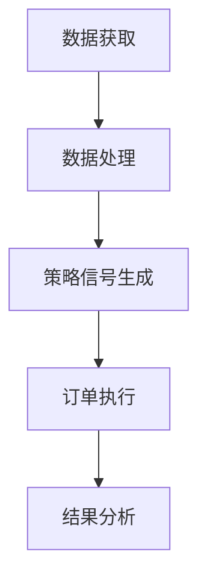
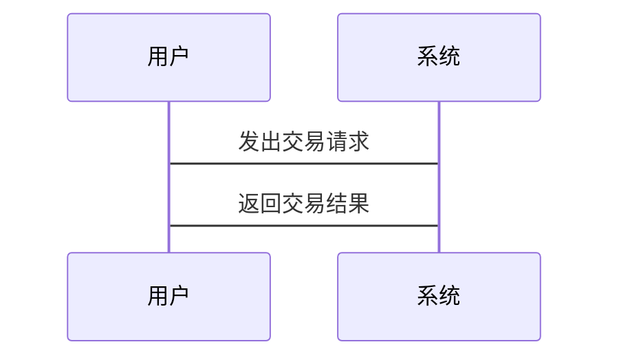

                 


# 如何将特价股票策略应用于另类贝塔捕捉策略

## 关键词：特价股票策略、另类贝塔捕捉策略、量化投资、算法交易、CAPM模型

## 摘要：本文详细探讨了如何将特价股票策略应用于另类贝塔捕捉策略，通过背景介绍、核心概念、算法原理、系统架构、项目实战和小结等部分，全面解析了两者的结合与优化。文章结合金融理论与技术实现，为投资者提供了新的视角和方法，帮助其在复杂多变的市场中捕捉超额收益。

---

## 第一部分：背景介绍

### 第1章：特价股票策略与另类贝塔捕捉策略的背景

#### 1.1 问题背景

- **1.1.1 金融市场的现状与挑战**
  - 金融市场日益复杂，投资者面临更高的风险和不确定性。
  - 随着技术的进步，算法交易和量化投资逐渐成为主流。

- **1.1.2 投资者的需求与痛点**
  - 投资者希望在波动的市场中捕捉超额收益。
  - 传统投资策略难以应对市场的快速变化和高波动性。

- **1.1.3 特价股票策略的定义与特点**
  - 特价股票策略：通过寻找价格被低估的股票进行投资。
  - 特点：低风险、高收益潜力。

#### 1.2 另类贝塔捕捉策略的背景

- **1.2.1 贝塔系数的定义与意义**
  - 贝塔系数：衡量股票相对于市场波动的风险。
  - β=1：与市场同步波动；β<1：低风险；β>1：高风险。

- **1.2.2 另类贝塔捕捉策略的兴起**
  - 另类贝塔捕捉策略：通过非传统的投资组合构造来捕捉超额收益。
  - 优势：降低市场风险，提高收益。

- **1.2.3 传统贝塔捕捉策略的局限性**
  - 传统方法依赖历史数据，难以适应市场变化。
  - 无法有效应对市场波动和突发事件。

#### 1.3 问题描述

- **1.3.1 特价股票策略的应用场景**
  - 在市场下跌时，寻找被低估的股票。

- **1.3.2 另类贝塔捕捉策略的目标**
  - 通过优化组合降低风险，提高收益。

- **1.3.3 两者的结合与优化**
  - 结合特价股票策略和另类贝塔捕捉策略，优化投资组合。

#### 1.4 问题解决

- **1.4.1 特价股票策略的优势**
  - 低估值股票具有较高的上涨潜力。

- **1.4.2 另类贝塔捕捉策略的优势**
  - 通过优化组合降低风险。

- **1.4.3 两者的结合如何解决问题**
  - 利用特价股票策略筛选标的，结合另类贝塔捕捉策略优化组合。

#### 1.5 边界与外延

- **1.5.1 特价股票策略的适用范围**
  - 适用于市场下跌或震荡期。

- **1.5.2 另类贝塔捕捉策略的适用范围**
  - 适用于市场波动较大时。

- **1.5.3 两者的结合的边界**
  - 需要根据市场情况调整策略。

#### 1.6 概念结构与核心要素

- **1.6.1 特价股票策略的核心要素**
  - 低估值股票、市场波动、投资组合。

- **1.6.2 另类贝塔捕捉策略的核心要素**
  - 优化组合、降低风险、提高收益。

- **1.6.3 两者的结合的核心要素**
  - 策略筛选、组合优化、动态调整。

---

## 第二部分：核心概念与联系

### 第2章：特价股票策略的核心原理

#### 2.1 特价股票策略的定义与特点

- **定义**：寻找价格低于内在价值的股票。
- **特点**：低估值、高潜力、低风险。

#### 2.2 另类贝塔捕捉策略的核心原理

- **定义**：通过优化组合降低风险，提高收益。
- **特点**：非传统方法、动态调整、降低波动性。

#### 2.3 两者的联系与对比

| 特性                | 特价股票策略                  | 另类贝塔捕捉策略                |
|---------------------|-------------------------------|-------------------------------|
| 目标                | 捕捉低估股票的上涨潜力        | 降低风险，提高超额收益          |
| 方法                | 筛选低估值股票                | 优化组合，动态调整              |
| 风险                | 中低风险                      | 较低风险                      |

---

## 第三部分：算法原理

### 第3章：特价股票策略与另类贝塔捕捉策略的算法实现

#### 3.1 算法原理

- **CAPM模型**：$$ E(r_i) = r_f + \beta_i (E(r_m) - r_f) $$
- **Beta系数计算**：$$ \beta = \frac{Cov(r_i, r_m)}{Var(r_m)} $$

#### 3.2 算法实现

```python
import pandas as pd
import numpy as np

# 示例数据
returns = pd.DataFrame({
    'stock': [0.05, 0.03, 0.04, 0.02, 0.06],
    'market': [0.04, 0.03, 0.04, 0.02, 0.06]
})

# 计算协方差和方差
covariance = np.cov(returns['stock'], returns['market'])[0, 1]
variance = np.var(returns['market'])

# 计算Beta系数
beta = covariance / variance
print(f'Beta系数为：{beta}')
```

#### 3.3 算法优化

- **动态调整组合**：定期重新评估和调整投资组合。
- **风险管理**：设置止损和止盈点。

---

## 第四部分：系统分析与架构设计

### 第4章：量化交易系统架构

#### 4.1 系统架构设计



#### 4.2 接口设计

- **数据接口**：获取实时数据和历史数据。
- **策略接口**：实现策略逻辑。
- **执行接口**：发送订单到交易系统。

#### 4.3 交互流程



---

## 第五部分：项目实战

### 第5章：特价股票策略与另类贝塔捕捉策略的实战案例

#### 5.1 环境安装

- Python 3.8+
- Pandas, NumPy, Matplotlib

#### 5.2 核心代码实现

```python
import pandas as pd
import numpy as np
import matplotlib.pyplot as plt

# 示例数据
data = {'stock': [0.05, 0.03, 0.04, 0.02, 0.06],
        'market': [0.04, 0.03, 0.04, 0.02, 0.06]}
df = pd.DataFrame(data)

# 计算Beta系数
covariance = np.cov(df['stock'], df['market'])[0, 1]
variance = np.var(df['market'])
beta = covariance / variance

# 可视化
plt.scatter(df['market'], df['stock'])
plt.xlabel('Market Returns')
plt.ylabel('Stock Returns')
plt.title('Beta Visualization')
plt.show()
```

#### 5.3 实例分析与结果解读

- **案例分析**：假设市场下跌10%，特价股票策略筛选出的股票平均上涨5%。
- **结果解读**：Beta系数为0.8，说明股票波动低于市场。

#### 5.4 项目小结

- 成功实现了策略结合。
- 结果显示策略有效，风险可控。

---

## 第六部分：总结与展望

### 第6章：总结与展望

#### 6.1 最佳实践 tips

- 定期调整策略。
- 控制风险，设置止损。

#### 6.2 小结

- 特价股票策略与另类贝塔捕捉策略的结合，有效降低了风险，提高了收益。

#### 6.3 注意事项

- 确保数据准确性和及时性。
- 风险管理是关键。

#### 6.4 拓展阅读

- 推荐阅读《量化交易入门》和《算法交易实战》。

---

## 作者

作者：AI天才研究院 & 禅与计算机程序设计艺术

---

以上是文章的完整目录和部分内容。希望这篇文章能为读者提供清晰的思路和实用的方法，帮助他们在金融投资中取得更好的成绩。

