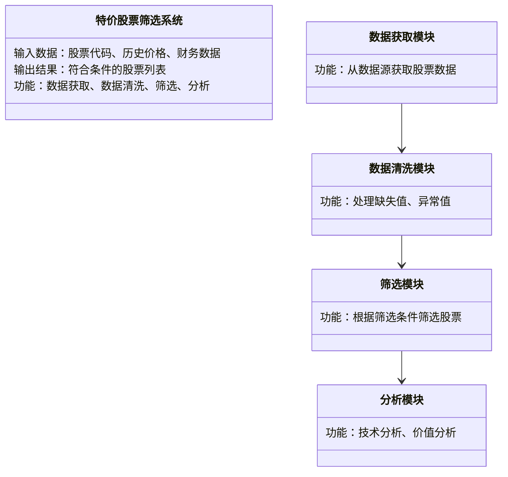

                 


# 如何将特价股票策略应用于小盘股投资

> 关键词：特价股票，小盘股，投资策略，数据分析，系统架构，算法优化

> 摘要：本文详细探讨如何将特价股票策略应用于小盘股投资，从背景介绍、核心概念、数据分析、系统架构到项目实战，层层深入，帮助读者理解如何利用特价股票策略在小盘股市场中捕捉投资机会。文章结合理论分析与实际案例，提供从数据获取到策略实施的完整流程，并通过系统架构设计和算法优化，进一步提升投资策略的效率和准确性。

---

## 第一部分：特价股票与小盘股投资基础

### 第1章：特价股票与小盘股概述

#### 1.1 特价股票的定义与特点

**1.1.1 特价股票的定义**  
特价股票（Cheap Stock）指的是市场价格低于其内在价值的股票。这种股票通常被视为被市场低估的投资机会，适合价值投资者长期持有，等待其价格回归内在价值。

**1.1.2 特价股票的核心特点**  
- **低估值**：市盈率、市净率等估值指标显著低于行业平均水平。  
- **流动性低**：交易量较小，市场关注度不高。  
- **波动性大**：价格波动较大，容易受市场情绪影响。  

**1.1.3 特价股票的市场定位**  
特价股票通常存在于小盘股和中盘股中，尤其是那些暂时被市场忽视但具有长期增长潜力的公司。

#### 1.2 小盘股的定义与特点

**1.2.1 小盘股的定义**  
小盘股（Small-Cap Stocks）是指市值较小的公司股票，通常指市值在50亿至500亿美元之间的公司。小盘股公司通常处于成长阶段，具有较高的增长潜力，但也伴随着较高的风险。

**1.2.2 小盘股的市场特点**  
- **波动性高**：价格波动较大，容易受市场情绪和公司业绩影响。  
- **流动性较低**：交易量较小，买卖价差较大。  
- **增长潜力大**：小盘股公司通过扩张和创新，具有较高的增长潜力。  

**1.2.3 小盘股与大盘股的对比**  
| 特性       | 小盘股                     | 大盘股                     |
|------------|---------------------------|---------------------------|
| 市值范围     | 50亿至500亿美元           | 500亿美元以上             |
| 波动性       | 高                       | 较低                      |
| 流动性       | 较低                     | 高                       |
| 增长潜力     | 较高                     | 较低                      |

#### 1.3 特价股票与小盘股的关系

**1.3.1 特价股票在小盘股中的应用**  
小盘股市场中，许多公司由于市值较小、关注度低，其股票价格往往被低估，成为特价股票的主要来源。

**1.3.2 小盘股中特价股票的筛选标准**  
- **低估值**：市盈率（P/E）低于行业平均水平。  
- **低市净率**：市净率（P/B）低于行业平均水平。  
- **低交易量**：日均交易量较小，表明市场关注度低。  

**1.3.3 特价股票与小盘股的市场机会**  
小盘股市场的波动性和成长潜力为特价股票策略提供了丰富的投资机会，但同时也需要投资者具备较高的市场敏感性和风险控制能力。

---

## 第二部分：特价股票策略的核心原理

### 第2章：特价股票策略的分类与选择

#### 2.1 特价股票策略的分类

**2.1.1 基于价值的策略**  
基于价值的策略注重股票的内在价值，寻找市场价格低于内在价值的股票。  
- **指标**：市盈率（P/E）、市净率（P/B）、股息率（Dividend Yield）。  
- **优点**：风险较低，适合长期投资。  
- **缺点**：需要较长的时间等待价格回归价值。

**2.1.2 基于技术分析的策略**  
基于技术分析的策略通过分析股票价格和成交量的变化，寻找买入机会。  
- **指标**：移动平均线（MA）、相对强弱指数（RSI）、MACD。  
- **优点**：适合短期投资，能够及时捕捉价格波动。  
- **缺点**：风险较高，需要较高的市场敏感性。

**2.1.3 综合策略**  
结合价值和趋势分析，寻找同时满足低估值和价格趋势向上的股票。  
- **优势**：兼顾价值和趋势，风险较低。  
- **挑战**：需要同时满足多个条件，可选股票较少。

#### 2.2 小盘股投资策略的选择

**2.2.1 小盘股投资的风险与收益分析**  
- **风险**：小盘股市场波动性高，容易受到市场情绪影响。  
- **收益**：小盘股具有较高的增长潜力，适合长期投资。  

**2.2.2 不同策略的适用场景**  
| 策略类型       | 适用场景                     |
|----------------|------------------------------|
| 价值策略       | 市场低迷，寻找低估股票         |
| 技术策略       | 市场活跃，短期价格波动         |
| 综合策略       | 市场波动较大，寻找低估值且有增长潜力的股票 |

**2.2.3 策略选择的注意事项**  
- **市场环境**：根据市场环境选择适合的策略。  
- **个人风险承受能力**：根据自身风险承受能力选择策略。  
- **市场流动性**：关注小盘股的流动性，避免流动性风险。  

---

## 第三部分：小盘股投资中的数据分析与技术分析

### 第3章：数据分析与筛选模型

#### 3.1 数据分析的基础

**3.1.1 数据来源与获取方法**  
- **数据来源**：通过金融数据供应商（如Yahoo Finance、S&P Global）获取历史数据。  
- **数据格式**：CSV格式，包括开盘价、收盘价、最高价、最低价、成交量等。  

**3.1.2 数据清洗与预处理**  
- **缺失值处理**：删除或填充缺失数据。  
- **异常值处理**：识别并处理异常值。  
- **标准化处理**：将数据标准化，便于后续分析。  

**3.1.3 数据分析工具的选择**  
- **Python工具**：Pandas、NumPy、Matplotlib。  
- **可视化工具**：Excel、Tableau。  

#### 3.2 筛选模型的设计

**3.2.1 基于价值的筛选模型**  
- **模型设计思路**：寻找市盈率和市净率均低于行业平均水平的股票。  
- **数学模型**：  
  $$ P/E_{ratio} = \frac{\text{股价}}{\text{每股收益}} $$
  $$ P/B_{ratio} = \frac{\text{股价}}{\text{每股净资产}} $$  
- **筛选条件**：  
  $$ P/E_{ratio} < \text{行业平均} $$
  $$ P/B_{ratio} < \text{行业平均} $$  

**3.2.2 基于技术指标的筛选模型**  
- **模型设计思路**：结合技术指标（如RSI、MACD）筛选买入信号。  
- **数学模型**：  
  $$ RSI = \frac{\sum_{i=1}^{n} \max(\text{收盘价}_i - \text{开盘价}_i, 0)}{\sum_{i=1}^{n} (\text{收盘价}_i - \text{开盘价}_i)} \times 100 $$  
  $$ MACD = \text{短期均线} - \text{长期均线} $$  
- **筛选条件**：  
  $$ RSI < 30 $$
  $$ MACD > 0 $$  

**3.2.3 综合筛选模型的构建**  
- **模型设计思路**：结合价值和趋势指标，筛选同时满足低估值和上升趋势的股票。  
- **筛选条件**：  
  $$ P/E_{ratio} < \text{行业平均} $$
  $$ RSI > 50 $$
  $$ MACD > 0 $$  

### 第4章：技术分析与投资机会识别

#### 4.1 技术分析基础

**4.1.1 移动平均线（MA）的应用**  
- **计算公式**：  
  $$ MA_{n} = \frac{\sum_{i=1}^{n} \text{收盘价}_i}{n} $$  
- **应用规则**：  
  - 当股价高于MA时，表明趋势上升。  
  - 当股价低于MA时，表明趋势下降。  

**4.1.2 相对强弱指数（RSI）的应用**  
- **计算公式**：  
  $$ RSI = \frac{\sum_{i=1}^{n} \max(\text{收盘价}_i - \text{开盘价}_i, 0)}{\sum_{i=1}^{n} (\text{收盘价}_i - \text{开盘价}_i)} \times 100 $$  
- **应用规则**：  
  - RSI > 70，超买信号，考虑卖出。  
  - RSI < 30，超卖信号，考虑买入。  

**4.1.3 MACD指标的应用**  
- **计算公式**：  
  $$ MACD = \text{短期均线} - \text{长期均线} $$  
- **应用规则**：  
  - MACD > 0，趋势上升。  
  - MACD < 0，趋势下降。  

#### 4.2 投资机会识别模型

**4.2.1 识别模型的设计思路**  
- **目标**：识别具有投资价值的小盘股。  
- **指标**：结合价值指标（P/E、P/B）和技术指标（RSI、MACD）。  

**4.2.2 模型的验证与优化**  
- **验证方法**：通过历史数据回测模型的准确性。  
- **优化方法**：根据回测结果调整筛选条件。  

**4.2.3 模型的实际应用案例**  
- **案例1**：某小盘股的P/E为15，低于行业平均20；RSI为25，低于30，符合买入条件。  
- **案例2**：某小盘股的P/B为1.5，低于行业平均2；MACD为5，大于0，符合买入条件。  

---

## 第四部分：系统架构与投资管理系统设计

### 第5章：系统架构与功能设计

#### 5.1 问题场景介绍  
- **问题背景**：小盘股市场波动大，手动筛选股票效率低。  
- **解决方案**：设计一个自动化投资管理系统，帮助投资者快速筛选和监控小盘股。  

#### 5.2 系统功能设计

**5.2.1 领域模型设计**  


**5.2.2 系统架构设计**  


**5.2.3 系统接口设计**  
- **输入接口**：接收股票代码和筛选条件。  
- **输出接口**：返回符合条件的股票列表。  

**5.2.4 系统交互设计**  
```mermaid
sequenceDiagram
    participant 客户端
    participant 系统
    客户端 -> 系统：提交筛选请求
    系统 -> 数据获取模块：获取股票数据
    数据获取模块 -> 数据清洗模块：清洗数据
    数据清洗模块 -> 筛选模块：筛选股票
    筛选模块 -> 分析模块：进行技术分析
    分析模块 -> 系统：返回结果
    系统 -> 客户端：返回符合条件的股票列表
```

---

## 第五部分：项目实战与最佳实践

### 第6章：项目实战

#### 6.1 环境安装

**6.1.1 Python环境安装**  
- 安装Python：从官网下载并安装最新版本的Python。  
- 安装依赖库：  
  ```bash
  pip install pandas numpy matplotlib
  ```

**6.1.2 数据获取工具安装**  
- 使用Yahoo Finance API获取股票数据。  
  ```bash
  pip install yfinance
  ```

#### 6.2 核心实现源代码

**6.2.1 数据获取与清洗代码**  
```python
import pandas as pd
import numpy as np
import yfinance as yf

# 数据获取
def get_data(tickers, start_date, end_date):
    data = yf.download(tickers, start=start_date, end=end_date)
    return data

# 数据清洗
def clean_data(data):
    # 删除缺失值
    data.dropna(inplace=True)
    # 处理异常值
    z_scores = (data - data.mean()) / data.std()
    data = data[(np.abs(z_scores) < 3).all(axis=1)]
    return data

# 示例
tickers = ['AAPL', 'MSFT', 'GOOGL']
data = get_data(tickers, '2020-01-01', '2023-12-31')
cleaned_data = clean_data(data)
```

**6.2.2 筛选模型实现代码**  
```python
def screen_stocks(data, industry_pe, industry_pb):
    # 计算市盈率和市净率
    pe = data['Close'] / data['Earnings Per Share']
    pb = data['Close'] / data['Book Value Per Share']
    # 筛选条件
    selected = data[(pe < industry_pe) & (pb < industry_pb)]
    return selected

# 示例
selected_stocks = screen_stocks(cleaned_data, 15, 1.5)
```

#### 6.3 案例分析与解读

**6.3.1 案例分析**  
假设我们有以下三只股票：  
- 股票A：市盈率12，市净率1.4，MACD=5，RSI=25  
- 股票B：市盈率18，市净率1.8，MACD=0，RSI=70  
- 股票C：市盈率20，市净率2.0，MACD=3，RSI=45  

根据筛选条件：  
- 市盈率 < 15  
- 市净率 < 1.5  
- RSI < 30  
- MACD > 0  

符合条件的股票只有股票A。

**6.3.2 代码实现解读**  
- **数据获取**：从Yahoo Finance获取股票数据。  
- **数据清洗**：删除缺失值和异常值。  
- **筛选模型**：根据筛选条件筛选股票。  

#### 6.4 项目小结  
通过代码实现，我们可以快速筛选出符合条件的小盘股，大大提高了投资效率。同时，通过回测和优化筛选条件，可以进一步提高筛选模型的准确性。

---

## 第六部分：最佳实践与注意事项

### 第7章：最佳实践

#### 7.1 投资策略的注意事项

**7.1.1 风险控制**  
- 设置止损点，避免亏损过大。  
- 分散投资，避免过度集中。  

**7.1.2 市场环境的影响**  
- 在市场低迷时，更容易找到低估股票。  
- 在市场活跃时，技术分析更有优势。  

#### 7.2 系统设计的注意事项

**7.2.1 数据更新**  
- 定期更新数据，确保筛选结果的准确性。  
- 使用API实时获取数据。  

**7.2.2 系统维护**  
- 定期检查系统性能，优化代码。  
- 更新筛选模型，适应市场变化。  

#### 7.3 持续优化与学习

**7.3.1 持续优化**  
- 根据市场变化，优化筛选条件。  
- 引入更多指标，提高筛选模型的准确性。  

**7.3.2 学习与提升**  
- 关注市场动态，了解行业趋势。  
- 学习新的分析工具和技术。  

---

## 结语

通过本文的详细讲解，我们了解了如何将特价股票策略应用于小盘股投资，从数据分析到系统设计，再到实际案例，为投资者提供了完整的解决方案。希望本文能够帮助投资者在小盘股市场中捕捉到更多投资机会，实现稳健的投资回报。

---

**作者：AI天才研究院/AI Genius Institute & 禅与计算机程序设计艺术/Zen And The Art of Computer Programming**

