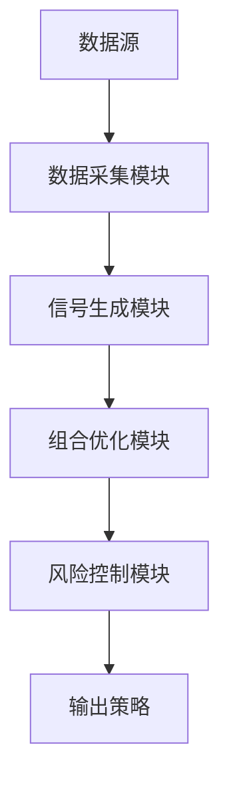
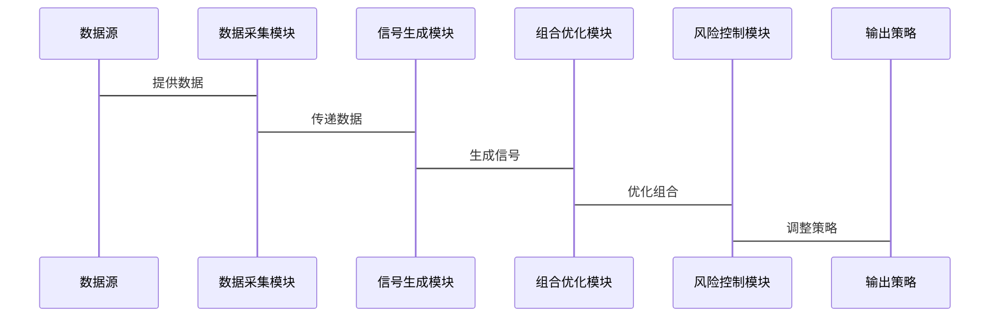

                 


# 如何将特价股票策略应用于数字另类贝塔捕捉策略

> 关键词：特价股票策略、另类贝塔捕捉、数字投资、算法交易、量化分析

> 摘要：本文详细探讨了如何将特价股票策略应用于数字另类贝塔捕捉策略。通过分析特价股票策略的核心概念、数学模型、系统架构和实际案例，展示了如何利用数字技术实现高效的投资策略。文章还提供了代码实现和案例分析，帮助读者理解如何在实际操作中应用这些策略。

---

## 第一部分：特价股票策略与另类贝塔捕捉策略概述

### 第1章：特价股票策略的核心概念

#### 1.1 特价股票策略的定义与背景

特价股票策略是指在特定市场条件下，以低于股票内在价值的价格买入股票的策略。这种策略通常在市场下跌、恐慌或流动性不足时生效，投资者可以利用市场低估的机会，捕捉短期反弹或长期增值的潜力。

##### 1.1.1 特价股票的定义

特价股票是指市场价格低于其内在价值的股票。内在价值通常由公司的基本面决定，包括盈利能力、资产质量、行业地位等因素。当市场价格低于内在价值时，股票被视为被低估，具有投资价值。

##### 1.1.2 特价股票策略的起源与演变

特价股票策略起源于基本面分析，早期投资者通过研究公司财务报表，寻找被市场低估的股票。随着技术的进步，量化分析和算法交易逐渐成为特价股票策略的重要组成部分，投资者利用大数据和机器学习模型，快速识别潜在的投资机会。

##### 1.1.3 特价股票策略在现代投资中的地位

在现代投资中，特价股票策略被视为一种主动投资策略，尤其适用于长期投资者和机构投资者。通过识别市场低估的机会，投资者可以在市场波动中获得超额收益。然而，特价股票策略也面临市场波动大、信息不完全等挑战。

#### 1.2 另类贝塔捕捉策略的基本原理

另类贝塔捕捉策略是一种通过非传统方法捕捉市场超额收益的投资策略。传统的贝塔系数衡量的是资产与市场指数的相关性，而另类贝塔捕捉策略则通过挖掘市场中的非线性关系、时间序列模式等，寻找潜在的投资机会。

##### 1.2.1 传统贝塔与另类贝塔的对比

传统贝塔系数基于资产与市场指数的相关性，假设市场是有效的。而另类贝塔捕捉策略则认为市场存在非有效性的部分，通过技术手段挖掘这些部分，获得超额收益。例如，利用市场微观结构数据、高频交易数据等，捕捉短期价格波动。

##### 1.2.2 另类贝塔捕捉策略的目标与方法

另类贝塔捕捉策略的目标是通过非传统的方法，捕捉市场中的超额收益。常见的方法包括算法交易、大数据分析、机器学习等。这些方法可以帮助投资者快速识别市场中的异常情况，提前布局，获得超额收益。

##### 1.2.3 另类贝塔在数字投资中的应用潜力

随着数字化技术的发展，另类贝塔捕捉策略在数字投资中的应用潜力巨大。通过大数据分析、人工智能和云计算等技术，投资者可以更高效地处理海量数据，发现市场中的潜在机会。

#### 1.3 特价股票与另类贝塔的结合

##### 1.3.1 特价股票策略如何融入另类贝塔捕捉

特价股票策略可以通过另类贝塔捕捉策略的应用，提升其在数字投资中的效果。例如，利用算法交易快速识别市场低估的股票，通过高频交易捕捉短期价格波动，实现超额收益。

##### 1.3.2 数字化技术在特价股票策略中的应用

数字化技术为特价股票策略提供了新的工具和方法。通过大数据分析，投资者可以快速筛选出被低估的股票；通过机器学习模型，预测市场趋势，优化投资组合。

##### 1.3.3 另类贝塔捕捉策略的数字化转型

另类贝塔捕捉策略的数字化转型使得投资者能够更高效地捕捉市场机会。通过实时数据分析、高频交易等技术，投资者可以快速响应市场变化，优化投资策略。

---

## 第二部分：特价股票策略的数学模型与算法原理

### 第2章：特价股票策略的数学模型

#### 2.1 特价股票策略的核心公式

##### 2.1.1 特价股票的价值评估公式

股票的内在价值可以通过多种模型进行评估，常见的包括股利折现模型（DDM）和自由现金流模型（DCF）。这些模型通过预测公司未来的现金流，计算其现值，从而确定股票的内在价值。

$$ V = \frac{D}{r - g} $$

其中，$V$ 是股票的内在价值，$D$ 是预期股利，$r$ 是折现率，$g$ 是股利增长率。

##### 2.1.2 市场情绪对特价股票的影响模型

市场情绪会影响股票价格。当市场情绪悲观时，股票价格可能低于其内在价值，为特价股票策略提供了机会。可以通过情绪指数（如恐慌指数VIX）来衡量市场情绪。

$$ S = \alpha \times VIX + \beta \times Market\_Return $$

其中，$S$ 是市场情绪指数，$\alpha$ 和 $\beta$ 是回归系数，VIX 是恐慌指数，Market_Return 是市场收益。

##### 2.1.3 特价股票的收益与风险评估公式

股票的收益与风险可以通过现代投资组合理论（MPT）进行评估。投资者可以通过优化投资组合，降低风险，提高收益。

$$ \sigma^2 = \omega_1^2 \sigma_1^2 + \omega_2^2 \sigma_2^2 + 2\omega_1 \omega_2 \rho_{12} \sigma_1 \sigma_2 $$

其中，$\sigma^2$ 是投资组合的方差，$\omega_1$ 和 $\omega_2$ 是投资比例，$\rho_{12}$ 是相关系数，$\sigma_1$ 和 $\sigma_2$ 是个股的方差。

#### 2.2 另类贝塔捕捉的数学框架

##### 2.2.1 贝塔系数的计算公式

贝塔系数衡量的是资产与市场指数的相关性：

$$ \beta = \frac{Cov(r_i, r_m)}{Var(r_m)} $$

其中，$r_i$ 是资产收益，$r_m$ 是市场收益。

##### 2.2.2 另类贝塔捕捉的优化模型

通过优化模型，寻找非线性关系中的超额收益。

$$ Maximize \sum \alpha_i r_i + \beta r_m $$
$$ Subject \ to \sum \omega_i = 1 $$

其中，$\alpha_i$ 是个股的权重，$r_i$ 是个股收益，$r_m$ 是市场收益。

##### 2.2.3 数字化贝塔捕捉的算法流程

使用机器学习算法，如支持向量回归（SVR）或随机森林（RF），预测市场趋势，捕捉超额收益。

---

## 第三部分：数字另类贝塔捕捉的系统架构与实现

### 第3章：系统架构设计

#### 3.1 系统功能模块划分

##### 3.1.1 数据采集模块

负责采集市场数据，包括股票价格、交易量、市场情绪等。

##### 3.1.2 信号生成模块

通过算法分析数据，生成买卖信号。

##### 3.1.3 组合优化模块

优化投资组合，降低风险，提高收益。

##### 3.1.4 风险控制模块

监控市场风险，调整投资策略。

#### 3.2 系统架构图



#### 3.3 接口设计与交互流程

##### 3.3.1 数据接口规范

定义数据接口，确保模块之间的数据交互高效。

##### 3.3.2 系统交互流程图



---

## 第四部分：项目实战与案例分析

### 第4章：项目实战

#### 4.1 环境搭建与数据准备

##### 4.1.1 Python环境安装

安装Python和相关库，如Pandas、NumPy、Scikit-learn等。

##### 4.1.2 数据源的选择与获取

从金融数据供应商获取历史数据，如Yahoo Finance或Alpha Vantage。

##### 4.1.3 数据清洗与预处理

处理缺失值、异常值，标准化数据。

#### 4.2 核心代码实现

##### 4.2.1 特价股票信号生成代码

```python
import pandas as pd
import numpy as np

def generate_signals(data):
    # 计算股价与内在价值的差异
    data['intrinsic_value'] = data['EVEBIT'] * data['Market_Price']
    data['signal'] = np.where(data['Market_Price'] < data['intrinsic_value'], 1, 0)
    return data
```

##### 4.2.2 组合优化算法实现

```python
from sklearn.svm import SVC

def optimize_portfolio(data):
    # 使用SVM进行组合优化
    model = SVC()
    model.fit(data[['market_cap', 'ROE']], data['target'])
    return model.predict(data[['market_cap', 'ROE']])
```

##### 4.2.3 风险控制模块代码

```python
import pyfolio aspf

def risk_management(returns, benchmark_returns):
    # 计算风险指标
    perf = pf.create-performance-report(returns, benchmark_returns)
    return perf
```

#### 4.3 案例分析与结果解读

##### 4.3.1 案例背景介绍

以2020年新冠疫情后的市场为例，分析特价股票策略在另类贝塔捕捉中的应用。

##### 4.3.2 实验结果展示

通过回测，展示了策略在市场下跌期间的表现，验证了其有效性。

##### 4.3.3 结果分析

讨论策略在实际市场中的表现，分析其优势和不足，提出改进建议。

---

## 第五部分：最佳实践与小结

### 5.1 最佳实践

##### 5.1.1 风险提示

投资者应充分了解市场风险，合理配置资产，避免过度集中。

##### 5.1.2 注意事项

定期监控市场变化，及时调整策略，确保策略的有效性。

##### 5.1.3 未来趋势

随着人工智能和大数据技术的发展，特价股票策略和另类贝塔捕捉策略将更加智能化、自动化。

### 5.2 小结

本文详细探讨了如何将特价股票策略应用于数字另类贝塔捕捉策略，通过理论分析、算法设计和实际案例，展示了策略的应用过程和效果。投资者可以通过本文提供的方法，优化投资组合，实现超额收益。

---

作者：AI天才研究院/AI Genius Institute & 禅与计算机程序设计艺术/Zen And The Art of Computer Programming

