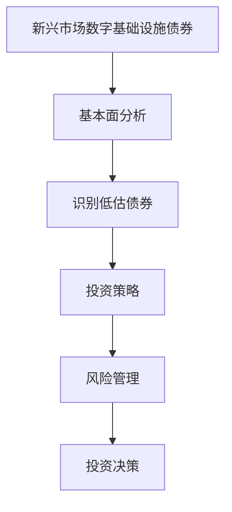
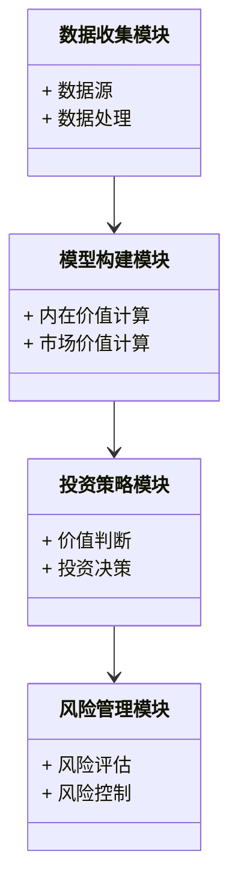
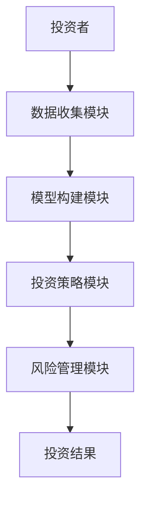
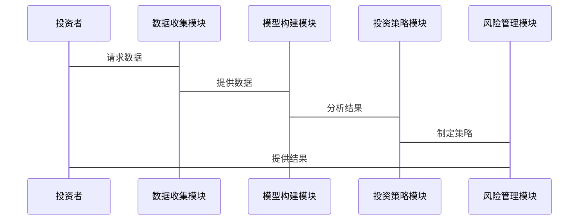

                 


# 如何将特价股票策略应用于新兴市场数字基础设施债券投资

> 关键词：特价股票策略，新兴市场，数字基础设施，债券投资，量化分析

> 摘要：本文探讨了如何将特价股票策略应用于新兴市场数字基础设施债券投资。首先介绍了特价股票策略和新兴市场数字基础设施债券的基本概念和背景。然后详细分析了特价股票策略在新兴市场数字基础设施债券投资中的核心概念与联系，包括相关模型和风险分析。接着讲解了算法原理，包括量化分析方法和风险管理模型。随后，通过数学模型和公式展示了这些策略的实现过程。最后，通过系统架构设计和项目实战，展示了如何构建投资系统，并提供了实际案例分析和最佳实践建议。

---

## 第一部分: 特价股票策略与新兴市场数字基础设施债券投资的背景与基础

### 第1章: 特价股票策略概述

#### 1.1 特价股票的定义与特点

##### 1.1.1 特价股票的定义
特价股票是指在特定市场条件下，价格被低估的股票。这些股票通常具有较高的潜在回报，但当前市场 valuation 可能未能反映其真实价值。特价股票的核心在于“便宜”，即市场价格低于其内在价值。

##### 1.1.2 特价股票的核心特点
- **低估值**：市场价格低于内在价值。
- **高潜力**：具有较高的增长潜力。
- **波动性**：价格波动较大，存在短期下跌风险。
- **周期性**：通常出现在市场低迷或特定行业周期性低谷。

##### 1.1.3 特价股票与普通股票的区别
- 投资逻辑：普通股票基于基本面和技术面分析，而特价股票强调价格低于内在价值。
- 风险收益比：特价股票通常具有更高的风险收益比。
- 投资期限：普通股票适合长期投资，而特价股票适合中短期投资。

#### 1.2 特价股票策略的背景与应用

##### 1.2.1 特价股票策略的背景
特价股票策略起源于价值投资理论，强调以低于内在价值的价格买入优质股票。该策略在市场低迷或行业低谷时尤为有效。

##### 1.2.2 特价股票策略的应用场景
- 市场低迷：市场整体估值较低时，更容易找到特价股票。
- 行业周期性低谷：特定行业在周期性低谷时，企业估值可能被低估。
- 特定事件影响：如公司治理问题、行业政策变化等导致股价短期下跌。

##### 1.2.3 特价股票策略的优缺点
- 优点：潜在高回报，风险收益比高。
- 缺点：需要较高的市场敏感度和行业分析能力，且存在市场风险和流动性风险。

### 第2章: 新兴市场数字基础设施债券投资概述

#### 2.1 新兴市场的定义与特点

##### 2.1.1 新兴市场的定义
新兴市场是指经济正在快速增长，但尚未达到发达国家水平的国家或地区。这些市场通常具有较高的增长潜力，但也伴随着较高的风险。

##### 2.1.2 新兴市场的特点
- 经济增长快：新兴市场国家通常有较高的GDP增长率。
- 市场规模小：相对于发达国家市场，新兴市场规模较小。
- 波动性高：新兴市场受政策、经济周期和外部环境影响较大，价格波动剧烈。
- 风险高：新兴市场存在较高的政治、经济和市场风险。

##### 2.1.3 新兴市场与发达国家市场的区别
- 经济发展阶段：新兴市场处于工业化和城市化阶段，发达国家市场已经完成工业化。
- 市场规模：新兴市场较小，发达国家市场较大。
- 风险水平：新兴市场风险较高，发达国家市场风险相对较低。

#### 2.2 数字基础设施债券的定义与特点

##### 2.2.1 数字基础设施债券的定义
数字基础设施债券是指用于投资数字基础设施项目的债券。这些项目包括5G网络、数据中心、云计算设施、物联网设备等。

##### 2.2.2 数字基础设施债券的核心特点
- 高增长潜力：随着数字化转型的推进，数字基础设施需求将持续增长。
- 高风险：新兴市场的数字基础设施项目可能面临政策、技术和市场风险。
- 长期回报：数字基础设施项目通常具有较长的建设周期和回报周期。

##### 2.2.3 数字基础设施债券与传统债券的区别
- 投资领域：数字基础设施债券投资于数字项目，传统债券投资于实体资产。
- 风险结构：数字基础设施债券风险较高，传统债券风险相对较低。
- 回报周期：数字基础设施债券回报周期较长，传统债券回报周期较短。

#### 2.3 新兴市场数字基础设施债券投资的背景与意义

##### 2.3.1 新兴市场数字基础设施债券投资的背景
随着全球数字化转型的推进，新兴市场国家也在加快数字基础设施建设。数字基础设施债券为投资者提供了参与新兴市场数字经济发展的重要途径。

##### 2.3.2 新兴市场数字基础设施债券投资的意义
- 投资者可以分享新兴市场数字基础设施发展的成果。
- 帮助新兴市场国家加快数字基础设施建设。
- 提供了新的投资渠道，分散投资风险。

##### 2.3.3 新兴市场数字基础设施债券投资的挑战与机遇
- 挑战：新兴市场存在较高的政治、经济和市场风险，数字基础设施项目可能面临技术和政策不确定性。
- 机遇：数字基础设施需求增长快，新兴市场数字基础设施债券具有较高的增长潜力。

---

## 第二部分: 特价股票策略与新兴市场数字基础设施债券投资的核心概念与联系

### 第3章: 特价股票策略在新兴市场数字基础设施债券投资中的应用

#### 3.1 特价股票策略与新兴市场数字基础设施债券投资的联系

##### 3.1.1 特价股票策略的核心思想在新兴市场数字基础设施债券投资中的应用
- 以低于内在价值的价格买入债券，等待价格回升或内在价值提升。
- 通过基本面分析，识别被低估的数字基础设施项目。

##### 3.1.2 特价股票策略在新兴市场数字基础设施债券投资中的具体表现
- 识别被低估的数字基础设施债券。
- 利用市场波动，低位买入，高位卖出。

##### 3.1.3 特价股票策略与新兴市场数字基础设施债券投资的结合点
- 价值发现：通过基本面分析，发现被低估的数字基础设施债券。
- 风险管理：利用特价股票策略中的风险管理方法，控制投资风险。

#### 3.2 特价股票策略在新兴市场数字基础设施债券投资中的具体模型

##### 3.2.1 基于特价股票策略的新兴市场数字基础设施债券投资模型



##### 3.2.2 特价股票策略在新兴市场数字基础设施债券投资中的具体步骤

1. **基本面分析**：分析债券发行方的财务状况、行业地位、政策环境等。
2. **识别低估债券**：找出市场价格低于内在价值的债券。
3. **制定投资策略**：根据分析结果，制定买入、持有和卖出策略。
4. **风险管理**：建立风险管理机制，控制投资风险。

---

## 第三部分: 特价股票策略在新兴市场数字基础设施债券投资中的算法原理

### 第4章: 算法原理讲解

#### 4.1 量化分析方法

##### 4.1.1 量化分析方法的定义
量化分析方法是指通过数学模型和算法，对市场数据进行分析，以寻找投资机会。

##### 4.1.2 量化分析方法在特价股票策略中的应用

```python
def calculate_intrinsic_value(bond):
    # 假设bond是一个债券对象，包含市场价格、面值、票息率、期限等属性
    # 计算内在价值的简化模型
    return bond.face_value * (1 + bond票息率) / (1 + bond市场利率)
```

##### 4.1.3 量化分析方法的具体步骤

1. **数据收集**：收集债券的市场价格、面值、票息率、期限等数据。
2. **模型构建**：建立量化分析模型，计算债券的内在价值。
3. **数据分析**：通过数据分析，识别被低估的债券。
4. **投资决策**：根据分析结果，制定投资策略。

#### 4.2 风险管理模型

##### 4.2.1 风险管理模型的定义
风险管理模型是指通过量化方法，评估和管理投资风险。

##### 4.2.2 风险管理模型在特价股票策略中的应用

```python
def calculate_risk(bond):
    # 计算债券的风险价值
    return bond市场价格 * bond波动率
```

##### 4.2.3 风险管理模型的具体步骤

1. **风险评估**：评估债券的市场风险、信用风险等。
2. **风险控制**：通过分散投资、对冲等方式，控制投资风险。
3. **风险监控**：持续监控投资组合的风险，及时调整投资策略。

---

## 第四部分: 特价股票策略在新兴市场数字基础设施债券投资中的数学模型

### 第5章: 数学模型和公式

#### 5.1 特价股票策略的数学模型

##### 5.1.1 特价股票策略的核心公式

$$ \text{内在价值} = \frac{\text{面值} \times (1 + \text{票息率})}{1 + \text{市场利率}} $$

##### 5.1.2 特价股票策略的扩展公式

$$ \text{内在价值} = \sum_{t=1}^{n} \frac{\text{现金流}_t}{(1 + r)^t} $$

其中，\( r \) 是市场利率，\( \text{现金流}_t \) 是第 \( t \) 年的现金流。

#### 5.2 数字基础设施债券的数学模型

##### 5.2.1 数字基础设施债券的核心公式

$$ \text{内在价值} = \frac{\text{面值} \times (1 + \text{票息率})}{1 + \text{市场利率}} $$

##### 5.2.2 数字基础设施债券的扩展公式

$$ \text{内在价值} = \sum_{t=1}^{n} \frac{\text{现金流}_t}{(1 + r)^t} $$

其中，\( r \) 是市场利率，\( \text{现金流}_t \) 是第 \( t \) 年的现金流。

---

## 第五部分: 特价股票策略在新兴市场数字基础设施债券投资中的系统架构设计

### 第6章: 系统分析与架构设计方案

#### 6.1 问题场景介绍

##### 6.1.1 投资者面临的挑战
- 市场风险高
- 信息不对称
- 投资决策复杂

##### 6.1.2 系统目标
- 提供基于特价股票策略的数字基础设施债券投资解决方案。
- 帮助投资者识别低估债券，制定投资策略。

#### 6.2 项目介绍

##### 6.2.1 项目目标
- 开发一个基于特价股票策略的数字基础设施债券投资系统。
- 提供量化分析工具，帮助投资者制定投资策略。

##### 6.2.2 项目范围
- 数据收集与处理
- 模型构建与分析
- 投资策略制定
- 风险管理

#### 6.3 系统功能设计

##### 6.3.1 系统功能模块
- 数据收集模块
- 模型构建模块
- 投资策略模块
- 风险管理模块

##### 6.3.2 领域模型（Mermaid 类图）



#### 6.4 系统架构设计

##### 6.4.1 系统架构图（Mermaid 架构图）



#### 6.5 系统接口设计

##### 6.5.1 系统接口描述
- 数据接口：从数据源获取债券数据。
- 模型接口：调用量化分析模型，计算内在价值。
- 投资策略接口：根据分析结果，制定投资策略。
- 风险管理接口：评估和控制投资风险。

##### 6.5.2 系统交互流程（Mermaid 序列图）



---

## 第六部分: 特价股票策略在新兴市场数字基础设施债券投资中的项目实战

### 第7章: 项目实战

#### 7.1 环境安装

##### 7.1.1 系统要求
- Python 3.8 或更高版本
- 数据分析库（Pandas, NumPy）
- 可视化库（Matplotlib, Seaborn）
- 量化分析库（Pycaret, Scikit-learn）

##### 7.1.2 安装步骤
```bash
pip install pandas numpy matplotlib seaborn scikit-learn pycaret
```

#### 7.2 系统核心实现源代码

##### 7.2.1 数据收集模块

```python
import pandas as pd

def collect_data():
    # 示例：从CSV文件读取数据
    data = pd.read_csv('bonds.csv')
    return data
```

##### 7.2.2 模型构建模块

```python
from pycaret.regression import *

def build_model(data):
    # 示例：构建回归模型
    model = setup(data, target='市场价格')
    best_model = compare_models()
    return best_model
```

##### 7.2.3 投资策略模块

```python
def investment_strategy(data, model):
    # 示例：根据模型预测结果，制定投资策略
    predictions = predict_model(model, data)
    # 识别低估债券
    undervalued_bonds = data[predictions < data['内在价值']]
    return undervalued_bonds
```

##### 7.2.4 风险管理模块

```python
def risk_management(data, model):
    # 示例：评估和控制投资风险
    predictions = predict_model(model, data)
    # 计算风险价值
    risk_value = data['市场价格'] * data['波动率']
    return risk_value
```

#### 7.3 代码应用解读与分析

##### 7.3.1 数据收集模块的实现
- 从CSV文件读取债券数据，包括市场价格、面值、票息率、期限等。

##### 7.3.2 模型构建模块的实现
- 使用Pycaret构建回归模型，预测债券的市场价格。
- 比较不同模型，选择最佳模型。

##### 7.3.3 投资策略模块的实现
- 根据模型预测结果，识别被低估的债券。
- 制定买入、持有和卖出策略。

##### 7.3.4 风险管理模块的实现
- 计算债券的风险价值。
- 评估和控制投资风险。

#### 7.4 实际案例分析和详细讲解剖析

##### 7.4.1 案例背景
假设我们有新兴市场的数字基础设施债券数据，包括5G网络、数据中心等项目。

##### 7.4.2 数据分析
使用量化分析方法，识别被低估的数字基础设施债券。

##### 7.4.3 投资策略
根据分析结果，制定买入、持有和卖出策略。

##### 7.4.4 风险管理
评估和控制投资风险，确保投资组合的稳健性。

#### 7.5 项目小结

##### 7.5.1 项目总结
通过基于特价股票策略的数字基础设施债券投资系统，投资者可以识别被低估的债券，制定科学的投资策略，控制投资风险。

##### 7.5.2 项目成果
开发了一个基于量化分析的数字基础设施债券投资系统，提供了价值发现和风险管理的解决方案。

##### 7.5.3 项目经验
- 数据收集和处理是关键，需要确保数据的准确性和完整性。
- 模型构建需要结合具体的投资目标和市场环境。
- 投资策略和风险管理需要动态调整，以应对市场的变化。

---

## 第七部分: 特价股票策略在新兴市场数字基础设施债券投资中的最佳实践

### 第8章: 最佳实践 tips、小结、注意事项、拓展阅读

#### 8.1 最佳实践 tips

##### 8.1.1 数据收集
- 确保数据的准确性和完整性。
- 定期更新数据，保持数据的时效性。

##### 8.1.2 模型构建
- 根据具体的投资目标和市场环境，选择合适的模型。
- 定期验证和更新模型，确保模型的有效性。

##### 8.1.3 投资策略
- 结合市场环境和投资目标，制定灵活的投资策略。
- 定期评估投资组合的表现，及时调整投资策略。

##### 8.1.4 风险管理
- 建立完善的风险管理机制，控制投资风险。
- 定期评估和调整风险管理策略，确保投资组合的稳健性。

#### 8.2 小结

本文探讨了如何将特价股票策略应用于新兴市场数字基础设施债券投资。通过背景介绍、核心概念分析、算法原理讲解、数学模型展示、系统架构设计、项目实战和最佳实践总结，为投资者提供了基于价值发现的数字基础设施债券投资解决方案。

#### 8.3 注意事项

##### 8.3.1 市场风险
新兴市场存在较高的政治、经济和市场风险，投资者需要充分认识到这些风险，并采取有效的风险管理措施。

##### 8.3.2 投资策略
投资策略需要根据市场环境和投资目标灵活调整，避免 rigid 投资策略导致的投资损失。

##### 8.3.3 数据质量
数据的准确性和完整性是投资分析的基础，投资者需要确保数据的高质量。

#### 8.4 拓展阅读

##### 8.4.1 相关书籍
- 《投资学》
- 《量化投资：算法与策略》
- 《数字基础设施与经济发展》

##### 8.4.2 相关研究论文
- 《基于价值发现的数字基础设施债券投资策略研究》
- 《新兴市场数字基础设施建设与经济发展》
- 《量化分析在债券投资中的应用》

---

## 作者：AI天才研究院/AI Genius Institute & 禅与计算机程序设计艺术/Zen And The Art of Computer Programming

---

### 总结
本文通过详细分析特价股票策略在新兴市场数字基础设施债券投资中的应用，为投资者提供了基于价值发现的数字基础设施债券投资解决方案。通过量化分析方法、数学模型和系统架构设计，帮助投资者识别被低估的债券，制定科学的投资策略，控制投资风险。希望本文能够为投资者在新兴市场数字基础设施债券投资中提供有价值的参考和指导。

