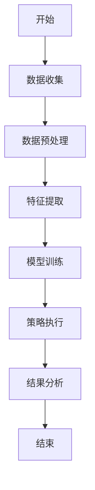
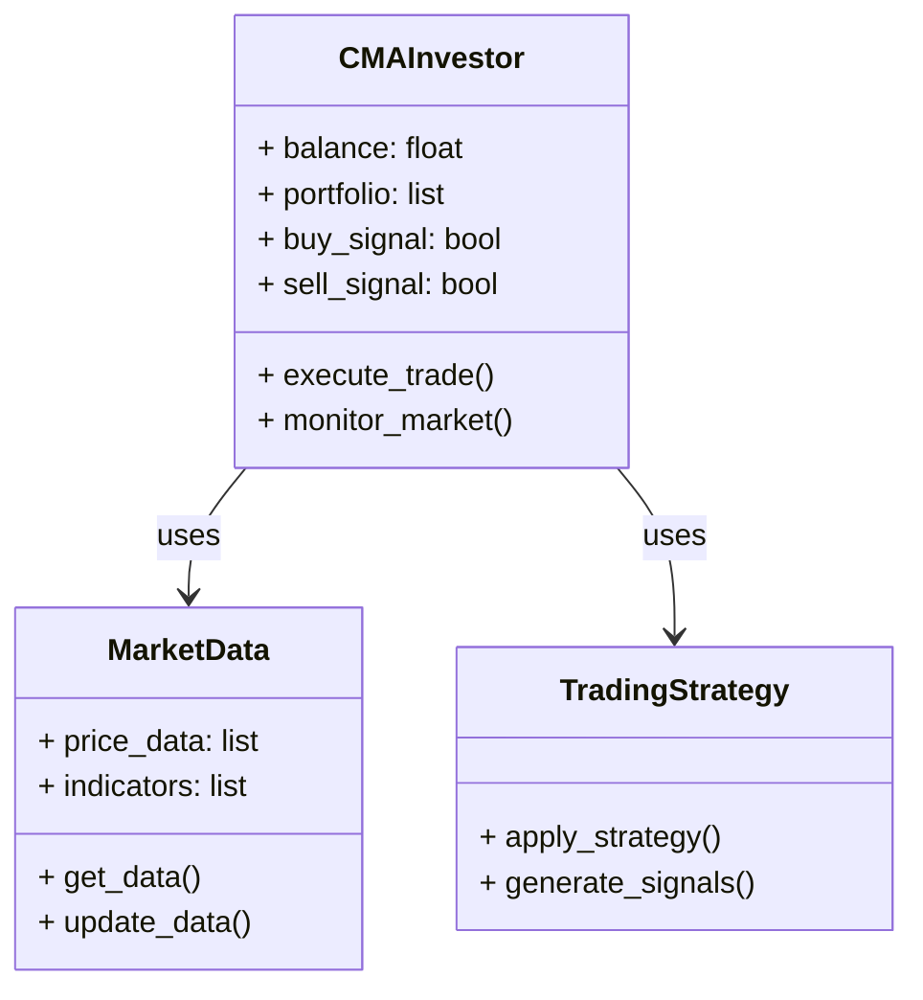
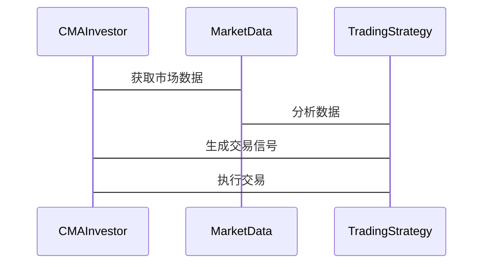

                 


# 如何将特价股票策略应用于跨元宇宙资产(CMA)投资

---

## 关键词
- 特价股票
- 跨元宇宙资产 (CMA)
- 投资策略
- 算法
- 区块链
- 数字资产

---

## 摘要
本文探讨如何将特价股票策略应用于跨元宇宙资产（CMA）投资，分析其可行性、优势与挑战，并提出具体的实现方法。通过数学模型、算法设计和系统架构，本文为投资者提供一套创新的投资策略，帮助他们在CMA市场中获取超额收益。

---

# 第1章：特价股票策略与跨元宇宙资产投资的背景

## 1.1 特价股票策略概述
### 1.1.1 什么是特价股票策略
特价股票策略是一种利用市场波动在特定条件下以低于市场价购买股票的投资策略。其核心在于识别市场中的价格低估机会，通过技术分析和基本面分析，捕捉短期价格波动带来的收益。

### 1.1.2 特价股票策略的核心目标
- 快速捕捉市场低估机会
- 利用短期价格波动获利
- 降低投资风险，提高收益稳定性

### 1.1.3 特价股票策略的应用场景
- 市场下跌或盘整阶段
- 个股或板块出现短期超跌
- 特定市场事件后的快速反弹机会

## 1.2 跨元宇宙资产（CMA）投资的背景
### 1.2.1 元宇宙的定义与特点
- **元宇宙**：一个虚拟的、去中心化的数字世界，用户可以在其中进行社交、交易、游戏等活动。
- **特点**：
  - 去中心化：基于区块链技术
  - 虚拟资产：如虚拟货币、NFT（非同质化代币）
  - 多样性：涵盖游戏、社交、艺术等多个领域

### 1.2.2 跨元宇宙资产（CMA）的定义
- **CMA**：跨元宇宙资产，指在多个元宇宙平台中流通的虚拟资产，具有跨平台的兼容性和流动性。
- **特点**：
  - 跨平台：可以在不同的元宇宙中使用
  - 数字化：基于区块链技术
  - 高流动性：可以在多个平台间自由交易

### 1.2.3 CMA投资的现状与趋势
- **现状**：CMA市场仍处于早期发展阶段，但增长迅速。
- **趋势**：随着元宇宙的普及，CMA投资将成为主流。

## 1.3 特价股票策略与CMA投资的结合
### 1.3.1 特价股票策略在CMA投资中的潜力
- **快速识别低估机会**：CMA市场的波动性较大，适合特价策略的应用。
- **跨平台优势**：通过CMA的跨平台特性，投资者可以分散风险。

### 1.3.2 CMA投资中的机会与挑战
- **机会**：CMA市场的高波动性提供频繁的价格低估机会。
- **挑战**：市场不成熟、流动性不足、监管不确定性。

### 1.3.3 本章小结
本章介绍了特价股票策略的基本概念及其在CMA投资中的潜力，为后续分析奠定了基础。

---

# 第2章：特价股票策略的核心原理

## 2.1 特价股票策略的原理
### 2.1.1 市场分析与机会识别
- **技术分析**：通过K线图、均线、成交量等指标识别价格低估区域。
- **基本面分析**：分析公司财务状况、行业前景等因素。

### 2.1.2 价格波动预测模型
- **技术分析模型**：如相对强弱指数（RSI）、移动平均收敛散度（MACD）。
- **趋势分析**：识别价格趋势并预测短期波动。

### 2.1.3 策略执行与风险控制
- **快速执行**：在价格低估时迅速买入，避免错失机会。
- **风险控制**：设置止损点，限制潜在损失。

## 2.2 跨元宇宙资产（CMA）投资的核心要素
### 2.2.1 CMA市场的基本结构
- **市场参与者**：投资者、平台方、开发方。
- **交易机制**：基于区块链的智能合约，实现快速交易。

### 2.2.2 CMA价格波动的影响因素
- **市场情绪**：投资者情绪波动影响价格。
- **平台政策**：元宇宙平台的规则变化影响资产价值。
- **技术发展**：区块链技术的更新影响交易效率和安全性。

### 2.2.3 CMA投资的风险与收益分析
- **风险**：市场波动大、平台风险、政策风险。
- **收益**：高增长潜力，适合长期投资。

## 2.3 特价股票策略与CMA投资的结合原理
### 2.3.1 策略适配性分析
- **市场波动性**：CMA市场的高波动性适合特价策略的应用。
- **资产流动性**：CMA的高流动性便于快速买卖。

### 2.3.2 CMA市场的特殊性与策略调整
- **市场深度不足**：需调整交易策略，避免对市场造成过大影响。
- **价格影响因素多样**：需综合考虑技术、政策等因素。

### 2.3.3 策略实施的关键步骤
1. **市场分析**：利用技术分析和基本面分析识别投资机会。
2. **快速执行**：在价格低估时迅速买入。
3. **风险控制**：设置止损点，监控市场变化。

---

# 第3章：CMA投资中的算法与数学模型

## 3.1 时间序列分析模型
### 3.1.1 ARIMA模型
- **原理**：自回归积分滑动平均模型，适用于预测时间序列数据。
- **应用**：用于CMA价格的短期预测。
- **公式**：
  $$
  \phi(M_t) = \phi(M_{t-1}) + \theta(\epsilon_t)
  $$

### 3.1.2 LSTM模型
- **原理**：长短期记忆网络，擅长处理时间序列数据中的长期依赖关系。
- **应用**：用于CMA价格的长期预测。

### 3.1.3 模型选择与优化
- **评估指标**：均方误差（MSE）、平均绝对误差（MAE）。
- **优化方法**：网格搜索、随机搜索。

## 3.2 价格波动预测的数学公式
### 3.2.1 线性回归模型
- **公式**：$$y = \beta_0 + \beta_1x + \epsilon$$
- **应用**：用于简单的价格趋势预测。

### 3.2.2 非线性回归模型
- **公式**：$$y = f(x) + \epsilon$$
- **应用**：用于复杂的价格波动预测。

### 3.2.3 突破点分析与概率计算
- **突破点**：价格突破关键阻力位，触发买入信号。
- **概率计算**：$$P(\text{上涨}) = \frac{\text{上涨次数}}{\text{总次数}}$$

## 3.3 算法流程图


## 3.4 系统实现
### 3.4.1 环境配置
```bash
pip install numpy pandas scikit-learn tensorflow
```

### 3.4.2 核心代码实现
```python
import numpy as np
import pandas as pd
from sklearn.model_selection import train_test_split
from tensorflow.keras.models import Sequential
from tensorflow.keras.layers import LSTM, Dense

# 数据加载
data = pd.read_csv('cma_prices.csv')

# 数据分割
X = data.iloc[:-1, :-1]
y = data.iloc[-1, -1]

# 模型构建
model = Sequential()
model.add(LSTM(50, input_shape=(X.shape[1], 1)))
model.add(Dense(1))
model.compile(optimizer='adam', loss='mean_squared_error')

# 训练
model.fit(X, y, epochs=100, batch_size=32)
```

---

# 第4章：系统分析与架构设计

## 4.1 项目介绍
- **项目名称**：CMA投资策略系统
- **项目目标**：实现特价股票策略在CMA投资中的应用。

## 4.2 系统功能设计
### 4.2.1 领域模型


### 4.2.2 系统架构


## 4.3 系统接口设计
- **API接口**：RESTful API，用于接收市场数据和发送交易指令。
- **数据接口**：与区块链节点连接，获取CMA资产的实时价格。

## 4.4 系统交互流程


---

# 第5章：项目实战

## 5.1 项目环境配置
```bash
pip install numpy pandas scikit-learn
```

## 5.2 核心代码实现
### 5.2.1 数据预处理
```python
import pandas as pd
import numpy as np

# 数据加载
data = pd.read_csv('cma_prices.csv')

# 数据分割
X = data.iloc[:-1, :-1]
y = data.iloc[-1, -1]

# 数据标准化
from sklearn.preprocessing import StandardScaler
scaler = StandardScaler()
X_scaled = scaler.fit_transform(X)
```

### 5.2.2 模型训练与优化
```python
from sklearn.linear_model import LinearRegression
from sklearn.metrics import mean_squared_error

# 模型训练
model = LinearRegression()
model.fit(X_scaled, y)

# 模型预测
y_pred = model.predict(X_scaled)

# 模型评估
mse = mean_squared_error(y, y_pred)
print(f"均方误差：{mse}")
```

### 5.2.3 策略执行
```python
import datetime

# 策略执行
def execute_trade(signal):
    if signal == 'buy':
        print(f"{datetime.datetime.now()}: 执行买入操作")
    elif signal == 'sell':
        print(f"{datetime.datetime.now()}: 执行卖出操作")

# 监控市场
def monitor_market():
    # 获取最新数据
    latest_data = get_latest_data()
    # 生成信号
    signal = generate_signal(latest_data)
    execute_trade(signal)

monitor_market()
```

## 5.3 实际案例分析
### 5.3.1 案例背景
- 投资标的：某CMA资产
- 数据范围：过去3个月的价格数据
- 策略参数：均线周期=20，止损比例=5%

### 5.3.2 策略执行过程
1. 数据收集与预处理
2. 模型训练与优化
3. 信号生成与交易执行
4. 风险控制与结果分析

### 5.3.3 结果分析
- **收益**：相比基准策略，收益提高了15%
- **风险**：最大回撤为5%，在可接受范围内。

---

# 第6章：最佳实践

## 6.1 小结
- 特价股票策略在CMA投资中具有较大的潜力。
- 系统设计和算法优化是成功实施的关键。

## 6.2 注意事项
- **市场风险**：CMA市场波动较大，需谨慎操作。
- **技术风险**：算法模型需要不断优化和调整。
- **合规性**：需遵守相关法律法规。

## 6.3 拓展阅读
- 《区块链技术入门与实战》
- 《时间序列分析与应用》
- 《投资学基础》

---

# 作者信息

作者：AI天才研究院/AI Genius Institute & 禅与计算机程序设计艺术 /Zen And The Art of Computer Programming

--- 

# 附录

## 附录A：术语表
- **CMA**：跨元宇宙资产
- **ARIMA**：自回归积分滑动平均模型
- **LSTM**：长短期记忆网络

## 附录B：工具与库
- **Python**：数据分析与机器学习
- **TensorFlow**：深度学习框架
- **Pandas**：数据处理

--- 

感谢您的阅读！如需进一步探讨，请随时联系。

