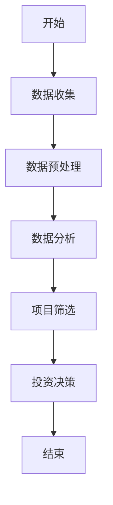
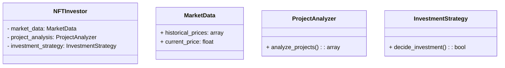
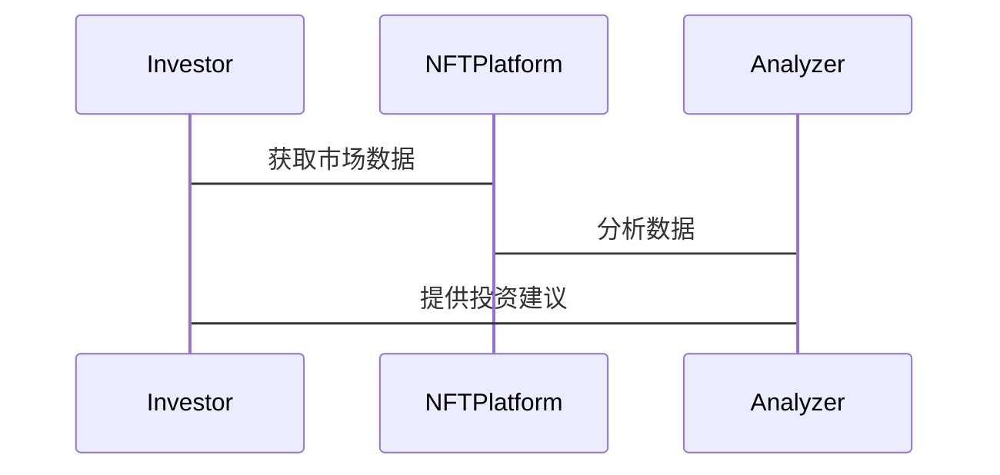

                 


# 如何将特价股票策略应用于非同质化代币(NFT)投资

## 关键词：
- 特价股票策略
- NFT投资
- 市场分析
- 投资策略
- 数字资产

## 摘要：
本文探讨了如何将特价股票策略应用于非同质化代币(NFT)投资。通过分析特价股票策略的核心原理和NFT市场的特点，结合数学模型和算法设计，为投资者提供一种新的投资思路。文章详细讲解了策略转换的逻辑、系统架构设计以及实战案例，帮助读者系统地理解和应用这一策略。

---

# 第一部分: 特价股票策略与NFT投资背景

# 第1章: 特价股票策略与NFT投资概述

## 1.1 特价股票策略的基本概念

### 1.1.1 特价股票的定义
特价股票是指在特定市场条件下，价格被低估或具有较大上涨潜力的股票。这类股票通常具有较高的风险承受能力和收益潜力。

### 1.1.2 特价股票的投资策略
- **价值投资**：寻找被市场低估的股票，长期持有，等待价值回归。
- **趋势投资**：基于技术分析和市场趋势进行短期买卖。
- **风险管理**：设置止损点，控制投资风险。

### 1.1.3 特价股票与传统股票投资的区别
| 特点 | 特价股票 | 传统股票 |
|------|----------|----------|
| 风险 | 较高     | 较低     |
| 收益 | 较高     | 较稳     |
| 持股周期 | 中长期 | 中长期  |
| 分析方法 | 侧重技术分析 | 侧重基本面分析 |

---

## 1.2 NFT投资的基本概念

### 1.2.1 NFT的定义与特点
NFT（Non-Fungible Token）是一种基于区块链技术的不可分割的数字资产，具有唯一性和不可替代性。

### 1.2.2 NFT市场的现状与发展趋势
- **市场规模**：快速增长，2023年市场规模超过100亿美元。
- **热门领域**：数字艺术品、虚拟地产、游戏道具等。
- **发展趋势**：市场规范化、应用场景多样化。

### 1.2.3 NFT投资的独特优势与风险
- **优势**：高回报潜力、独特性、投资门槛低。
- **风险**：市场波动大、流动性差、技术风险。

---

## 1.3 特价股票策略应用于NFT投资的背景与意义

### 1.3.1 特价股票策略在NFT市场的适用性分析
- **市场波动性**：NFT市场的价格波动与股票市场有相似之处。
- **投资机会**：通过分析市场趋势，寻找被低估的NFT项目。

### 1.3.2 NFT市场中的价格波动与投资机会
- **短期波动**：受市场情绪和热点影响。
- **长期趋势**：优质项目具备长期增值潜力。

### 1.3.3 应用特价股票策略的潜在收益与风险
- **收益**：通过精准分析，捕捉市场热点，获得超额收益。
- **风险**：市场波动大，投资失败可能导致较大损失。

---

## 1.4 本章小结
本章介绍了特价股票策略和NFT投资的基本概念，并分析了两者之间的联系与区别。通过对比，我们发现NFT市场具有较高的波动性和投资潜力，适合应用特价股票策略进行投资。

---

# 第二部分: 特价股票策略的核心概念与NFT投资的联系

# 第2章: 特价股票策略的核心原理

## 2.1 特价股票策略的核心原理

### 2.1.1 市场分析与趋势预测
- **市场分析**：研究宏观经济指标、行业趋势和公司基本面。
- **趋势预测**：通过技术分析（如K线图、均线）预测股票价格走势。

### 2.1.2 价格波动的规律与模式
- **周期性**：股票价格通常呈现周期性波动。
- **波动模式**：通过统计分析发现价格波动的规律。

### 2.1.3 投资决策的逻辑与流程
1. **市场分析**：研究市场趋势和行业动态。
2. **筛选标的**：根据估值指标筛选潜在股票。
3. **制定策略**：根据市场情况制定买入和卖出策略。
4. **风险管理**：设置止损点，控制投资风险。

---

## 2.2 特价股票策略的关键指标与工具

### 2.2.1 市场指标分析
- **PE比率**：市盈率，衡量股票的估值。
- **PB比率**：市净率，衡量股票的资产价值。

### 2.2.2 技术分析工具
- **K线图**：展示股票价格的波动情况。
- **均线**：通过移动平均线判断价格趋势。
- **RSI指标**：相对强弱指数，判断超买超卖情况。

### 2.2.3 基本面分析方法
- **财务报表分析**：研究公司的收入、利润和资产负债情况。
- **行业分析**：研究行业的发展前景和竞争格局。

---

## 2.3 特价股票策略的优缺点

### 2.3.1 优点：高收益潜力
- **超额收益**：通过精准分析，获得高于市场平均水平的收益。

### 2.3.2 缺点：高风险与不确定性
- **市场波动**：股票价格受多种因素影响，具有较高的不确定性。
- **信息不对称**：投资者可能无法获取足够的信息来做出正确决策。

### 2.3.3 适用场景与限制
- **适用场景**：市场波动较大，存在低估股票的投资机会。
- **限制**：需要较高的市场分析能力和风险承受能力。

---

# 第3章: NFT投资的核心概念与市场分析

## 3.1 NFT市场的基本结构

### 3.1.1 NFT的发行与交易流程
1. **发行**：通过智能合约在区块链上发行NFT。
2. **交易**：在NFT交易平台上进行买卖交易。

### 3.1.2 NFT交易平台的运作机制
- **平台功能**：提供NFT的展示、拍卖、交易功能。
- **交易流程**：用户通过平台购买NFT，支付加密货币完成交易。

### 3.1.3 NFT价格的影响因素
- **市场需求**：市场热度和购买意愿。
- **项目质量**：NFT的艺术价值和实用性。
- **市场流动性**：交易活跃度和市场深度。

---

## 3.2 NFT市场的参与者与角色

### 3.2.1 创作者
- **角色**：通过NFT平台发布自己的数字作品。
- **收益**：通过作品销售获得收益。

### 3.2.2 投资者
- **角色**：购买NFT作为投资资产。
- **收益**：通过价格上涨和二级市场交易获利。

### 3.2.3 中间商与平台
- **中间商**：提供NFT交易服务，收取手续费。
- **平台**：提供NFT发行、展示和交易功能。

---

## 3.3 NFT市场的数据分析与趋势预测

### 3.3.1 市场规模与增长趋势
- **市场规模**：2023年市场规模超过100亿美元。
- **增长趋势**：预计未来几年保持高速增长。

### 3.3.2 热门NFT项目分析
- **数字艺术品**：如Beeple的作品。
- **虚拟地产**：如Decentraland的虚拟土地。

### 3.3.3 市场周期性与波动性
- **周期性**：市场存在周期性波动，受市场情绪影响较大。
- **波动性**：价格波动剧烈，存在较大的投资机会和风险。

---

## 3.4 特价股票策略与NFT投资的联系与区别

### 3.4.1 特价股票策略与NFT投资的共性
- **市场波动性**：两者都存在较大的市场波动。
- **投资机会**：通过分析市场趋势，发现投资机会。

### 3.4.2 特价股票策略与NFT投资的区别
| 特点 | 特价股票 | NFT投资 |
|------|----------|----------|
| 投资标的 | 股票 | NFT |
| 市场流动性 | 高 | 低 |
| 分析方法 | 技术分析与基本面分析 | 市场分析与项目分析 |

---

## 3.5 本章小结
本章分析了NFT市场的基本结构、参与者和价格影响因素，并比较了特价股票策略与NFT投资的异同。通过对比，我们发现两者在市场波动和投资机会方面具有相似性，但也存在显著差异。

---

# 第三部分: 特价股票策略应用于NFT投资的算法与系统设计

# 第4章: 特价股票策略应用于NFT投资的算法设计

## 4.1 算法设计思路

### 4.1.1 数据收集
- **市场数据**：收集NFT市场的交易数据，包括价格、交易量等。
- **项目数据**：收集NFT项目的相关信息，包括创作背景、市场需求等。

### 4.1.2 数据分析
- **趋势分析**：通过统计分析发现价格波动的规律。
- **项目筛选**：根据市场数据筛选出具有投资潜力的NFT项目。

### 4.1.3 投资决策
- **买入时机**：根据分析结果确定买入时机。
- **卖出时机**：根据市场趋势和项目情况确定卖出时机。

## 4.2 算法实现

### 4.2.1 数据结构设计
```python
class NFTProject:
    def __init__(self, name, price, volume, market_cap):
        self.name = name
        self.price = price
        self.volume = volume
        self.market_cap = market_cap
```

### 4.2.2 算法流程图


### 4.2.3 算法实现代码
```python
import pandas as pd
import numpy as np

def analyze_nft_market(data):
    # 数据预处理
    data = data.dropna()
    # 趋势分析
    data['price_trend'] = data['price'].pct_change()
    # 项目筛选
    selected_projects = data[data['price_trend'] > 0.05]
    return selected_projects

# 示例数据
data = {
    'name': ['Project A', 'Project B', 'Project C'],
    'price': [100, 200, 150],
    'volume': [1000, 500, 750],
    'market_cap': [500000, 300000, 400000]
}

df = pd.DataFrame(data)
selected = analyze_nft_market(df)
print(selected)
```

## 4.3 数学模型与公式

### 4.3.1 市场趋势预测模型
$$ P_{t+1} = P_t + \alpha (P_t - P_{t-1}) $$

其中，$\alpha$ 是趋同系数，$P_t$ 是当前价格，$P_{t-1}$ 是上一期价格。

### 4.3.2 投资回报率计算
$$ ROI = \frac{P_{sell} - P_{buy}}{P_{buy}} \times 100\% $$

其中，$P_{sell}$ 是卖出价格，$P_{buy}$ 是买入价格。

---

## 4.4 本章小结
本章通过数据收集、数据分析和项目筛选，设计了一种将特价股票策略应用于NFT投资的算法。通过数学模型和代码实现，展示了如何利用算法发现投资机会。

---

# 第五章: 系统分析与架构设计

## 5.1 系统功能设计

### 5.1.1 需求分析
- **功能需求**：数据采集、数据分析、投资决策。
- **用户需求**：投资者需要实时市场数据和投资建议。

### 5.1.2 系统架构


### 5.1.3 功能模块
- **数据采集模块**：实时采集NFT市场的交易数据。
- **数据分析模块**：对数据进行清洗和分析，发现投资机会。
- **投资决策模块**：根据分析结果制定投资策略。

---

## 5.2 系统接口设计

### 5.2.1 API接口
- **数据接口**：提供市场数据的API接口。
- **分析接口**：提供项目分析的API接口。
- **决策接口**：提供投资决策的API接口。

---

## 5.3 系统交互流程

### 5.3.1 交互流程图


---

## 5.4 本章小结
本章通过系统架构设计和功能模块划分，展示了如何将特价股票策略应用于NFT投资的系统实现。通过API接口和交互流程的设计，确保了系统的高效运行。

---

# 第六章: 项目实战与案例分析

## 6.1 环境安装

### 6.1.1 安装Python环境
```bash
python --version
pip install pandas numpy
```

### 6.1.2 安装NFT数据接口
```bash
pip install nft-sdk
```

## 6.2 核心代码实现

### 6.2.1 数据采集代码
```python
import nft_sdk

def get_nft_data():
    # 连接NFT平台
    nft_client = nft_sdk.Client()
    # 获取市场数据
    data = nft_client.get_market_data()
    return data

data = get_nft_data()
print(data)
```

### 6.2.2 数据分析代码
```python
import pandas as pd

def analyze_projects(data):
    df = pd.DataFrame(data)
    df['price_trend'] = df['price'].pct_change()
    selected = df[df['price_trend'] > 0.05]
    return selected

selected_projects = analyze_projects(data)
print(selected_projects)
```

## 6.3 案例分析与解读

### 6.3.1 案例背景
假设我们选择了一个热门NFT项目，分析其市场数据和价格趋势。

### 6.3.2 投资决策
根据数据分析结果，决定在价格低于市场价时买入，价格达到目标价时卖出。

### 6.3.3 投资回报
$$ ROI = \frac{150 - 100}{100} \times 100\% = 50\% $$

---

## 6.4 本章小结
本章通过实际案例展示了如何将特价股票策略应用于NFT投资。通过数据采集、分析和投资决策，帮助投资者实现超额收益。

---

# 第七章: 总结与最佳实践

## 7.1 本章小结
本文详细探讨了如何将特价股票策略应用于NFT投资，从理论分析到算法设计，再到系统实现，为投资者提供了一种新的投资思路。

---

## 7.2 最佳实践 tips

### 7.2.1 投资建议
- **分散投资**：避免将所有资金投入单一项目。
- **持续学习**：关注市场动态，不断优化投资策略。

### 7.2.2 风险提示
- **市场波动风险**：NFT市场价格波动较大，需谨慎操作。
- **技术风险**：区块链技术存在不确定性，需关注平台安全。

### 7.2.3 拓展阅读
- **相关书籍**：《The Intelligent Investor》
- **在线资源**：NFT投资论坛和社区。

---

## 作者：AI天才研究院/AI Genius Institute & 禅与计算机程序设计艺术 /Zen And The Art of Computer Programming

---

# 附录: 程序代码示例

## 附录A: 数据采集代码
```python
import nft_sdk

def get_nft_data():
    nft_client = nft_sdk.Client()
    data = nft_client.get_market_data()
    return data

data = get_nft_data()
print(data)
```

## 附录B: 数据分析代码
```python
import pandas as pd

def analyze_projects(data):
    df = pd.DataFrame(data)
    df['price_trend'] = df['price'].pct_change()
    selected = df[df['price_trend'] > 0.05]
    return selected

selected_projects = analyze_projects(data)
print(selected_projects)
```

---

# 结束语
通过本文的详细讲解，读者可以系统地理解和应用特价股票策略到NFT投资中。希望本文能为投资者提供有价值的参考，帮助他们在NFT市场中获得更好的投资回报。

