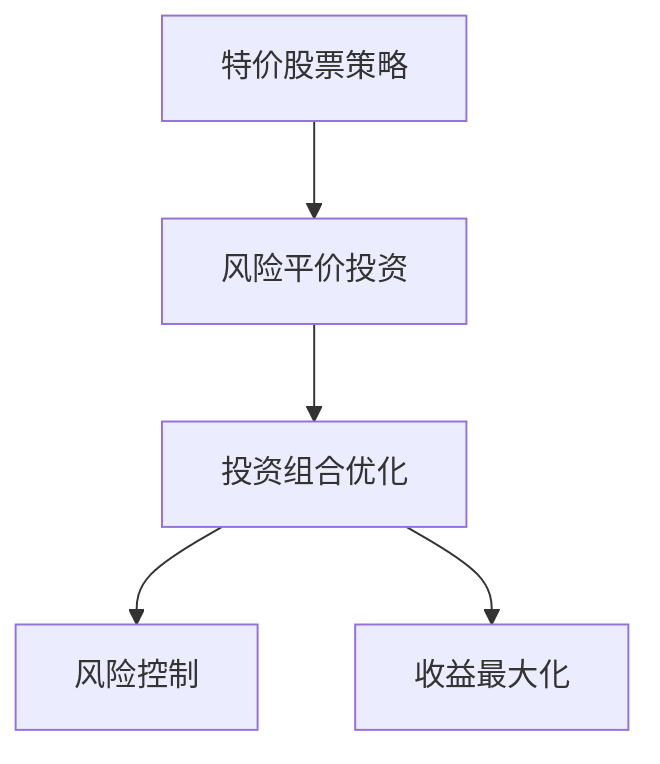
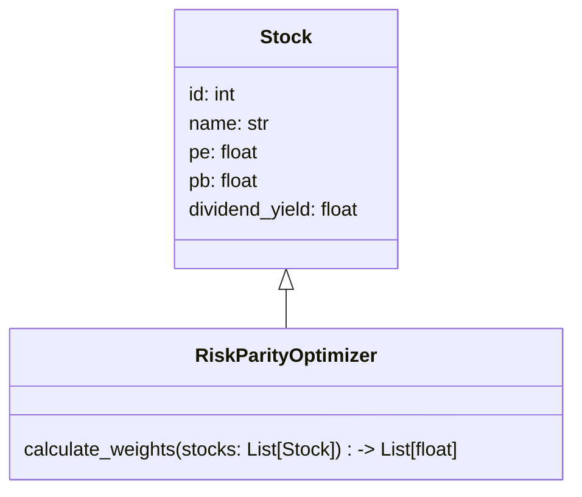

                 


```markdown
# 如何将特价股票策略应用于风险平价投资

> 关键词：特价股票策略，风险平价投资，算法原理，数学模型，系统架构，项目实战

> 摘要：本文详细探讨了如何将特价股票策略应用于风险平价投资。首先，我们介绍了特价股票策略和风险平价投资的基本概念及其结合的背景。接着，我们深入分析了两者的核心原理，并通过对比表格和ER实体关系图展示了它们的联系。随后，我们详细讲解了风险平价投资的数学模型和算法实现，并提供了Python代码示例。我们还设计了系统架构，包括领域模型和交互流程图。最后，我们通过实际案例展示了如何将理论应用于实战，并总结了最佳实践。

---

# 第一部分: 特价股票策略与风险平价投资的背景介绍

# 第1章: 特价股票策略与风险平价投资概述

## 1.1 特价股票策略的定义与特点
### 1.1.1 特价股票的定义
特价股票是指市场价格低于其内在价值的股票，通常被认为是被市场低估的投资机会。这种策略的核心在于识别这些被低估的股票并进行投资。

### 1.1.2 特价股票策略的核心要素
- **价值评估**：通过基本面分析确定股票的内在价值。
- **市场择时**：寻找市场价格低于内在价值的时机。
- **风险管理**：控制投资组合中的风险。

### 1.1.3 特价股票策略的优势与局限性
- **优势**：潜在的高回报，长期稳定的表现。
- **局限性**：市场波动可能导致短期亏损，需要长期持有。

## 1.2 风险平价投资的原理
### 1.2.1 风险平价的定义
风险平价是一种投资组合优化方法，旨在使每种资产对组合的风险贡献相等。这种方法通过调整资产权重来实现风险的均衡分配。

### 1.2.2 风险平价与传统投资策略的区别
- **传统投资策略**：通常基于收益最大化，忽视风险的分散。
- **风险平价**：强调风险的分散和均衡，注重风险与收益的平衡。

### 1.2.3 风险平价在投资组合中的作用
- **降低整体风险**：通过分散风险，减少投资组合的波动性。
- **提高收益稳定性**：在不同市场条件下保持稳定的收益。

## 1.3 特价股票策略与风险平价投资的结合
### 1.3.1 结合的背景与动机
随着市场的波动加剧，投资者寻求在高风险环境下实现稳定的收益。特价股票策略提供了潜在的高回报，而风险平价投资提供了风险控制的机制，两者的结合旨在实现收益与风险的最佳平衡。

### 1.3.2 结合的理论基础
- **市场有效性**：假设市场存在套利机会，可以通过风险平价优化实现收益。
- **风险分散**：通过投资多个特价股票，降低个股风险。

### 1.3.3 结合的实际意义
- **优化收益**：通过风险平价优化，提高投资组合的收益。
- **降低风险**：分散投资于多个特价股票，降低组合风险。

## 1.4 本章小结
本章介绍了特价股票策略和风险平价投资的基本概念，并探讨了两者的结合方式及其潜在的优势。通过结合，投资者可以在追求高收益的同时，有效控制投资风险。

---

# 第二部分: 核心概念与联系

# 第2章: 特价股票策略的核心概念与原理

## 2.1 特价股票策略的核心原理
### 2.1.1 市场有效性的假设
市场存在套利机会，投资者可以通过识别低估股票进行投资。

### 2.1.2 价值投资与市场择时的结合
- **价值投资**：基于股票的内在价值进行投资。
- **市场择时**：选择合适的时机进行买卖。

### 2.1.3 特价股票的筛选标准
- **低市盈率**：市盈率低于行业平均水平。
- **低市净率**：市净率低于行业平均水平。
- **高股息率**：股息率高于行业平均水平。

## 2.2 风险平价投资的数学模型
### 2.2.1 风险平价的定义公式
$$ \text{风险平价权重} = \frac{\sigma_i}{\sum_j \sigma_j} $$
其中，$\sigma_i$ 是资产 $i$ 的波动率。

### 2.2.2 风险平价与投资权重的关系
- 风险平价权重用于确定每种资产在投资组合中的权重，以实现风险的均衡分配。

### 2.2.3 风险平价的优化模型
$$ \min \sum_{i=1}^n w_i^2 \sigma_i^2 $$
$$ \text{subject to} \quad \sum_{i=1}^n w_i = 1 $$
其中，$w_i$ 是资产 $i$ 的权重，$\sigma_i$ 是资产 $i$ 的波动率。

## 2.3 特价股票策略与风险平价投资的联系
### 2.3.1 理论上的互补性
- 特价股票策略提供潜在的高收益机会。
- 风险平价投资提供风险控制机制。

### 2.3.2 实际操作中的协同效应
- 通过风险平价优化，提高特价股票投资组合的稳定性。
- 通过分散投资，降低个股风险。

### 2.3.3 结合后的风险收益特征
- **收益**：潜在的高回报。
- **风险**：通过风险平价优化，降低整体风险。

# 第3章: 核心概念的对比与联系

## 3.1 特价股票策略与风险平价投资的对比
### 3.1.1 策略目标的对比
- 特价股票策略：追求高收益。
- 风险平价投资：追求风险与收益的平衡。

### 3.1.2 风险管理的对比
- 特价股票策略：通过分散投资降低风险。
- 风险平价投资：通过权重调整实现风险均衡。

### 3.1.3 投资期限的对比
- 特价股票策略：长期投资。
- 风险平价投资：适用于不同投资期限。

## 3.2 两种策略的属性特征对比表格
| 属性         | 特价股票策略                          | 风险平价投资                          |
|--------------|--------------------------------------|--------------------------------------|
| 策略目标     | 追求高收益                            | 风险与收益平衡                        |
| 风险管理     | 分散投资，降低个股风险                | 权重调整，风险均衡                    |
| 投资期限     | 长期                                  | 短期和长期                            |

## 3.3 实体关系图


---

# 第三部分: 算法原理讲解

# 第4章: 风险平价投资的算法原理

## 4.1 风险平价投资的优化模型
### 4.1.1 均值-方差优化模型
$$ \text{收益} = \sum_{i=1}^n w_i \mu_i $$
$$ \text{风险} = \sum_{i=1}^n \sum_{j=1}^n w_i w_j \sigma_{ij} $$
其中，$\mu_i$ 是资产 $i$ 的期望收益，$\sigma_{ij}$ 是资产 $i$ 和 $j$ 的协方差。

### 4.1.2 风险平价权重计算公式
$$ w_i = \frac{\sigma_i}{\sum_j \sigma_j} $$
其中，$\sigma_i$ 是资产 $i$ 的波动率。

### 4.1.3 算法步骤与流程图


### 4.1.4 算法实现的Python代码示例
```python
import numpy as np

def calculate_risk_parity_weights(cov_matrix):
    sigma = np.sqrt(np.diag(cov_matrix))
    total_sigma = np.sum(sigma)
    weights = sigma / total_sigma
    return weights
```

## 4.2 数学模型和公式
### 4.2.1 风险平价优化的数学模型
$$ \min \sum_{i=1}^n w_i^2 \sigma_i^2 $$
$$ \text{subject to} \quad \sum_{i=1}^n w_i = 1 $$

### 4.2.2 优化模型的求解方法
- 使用拉格朗日乘数法求解约束条件下的优化问题。

---

# 第5章: 特价股票策略的算法实现

## 5.1 特价股票筛选算法
### 5.1.1 筛选标准
- 市盈率低于行业平均水平。
- 市净率低于行业平均水平。
- 股息率高于行业平均水平。

### 5.1.2 筛选步骤


### 5.1.3 算法实现的Python代码示例
```python
def screen_cheap_stocks(stocks):
    selected = []
    for stock in stocks:
        if stock.pe < industry_pe and stock.pb < industry_pb and stock.dividend_yield > industry_dividend_yield:
            selected.append(stock)
    return selected
```

---

# 第四部分: 数学模型与公式

# 第6章: 风险平价投资的数学模型

## 6.1 风险平价权重的计算公式
$$ w_i = \frac{\sigma_i}{\sum_j \sigma_j} $$

## 6.2 风险平价优化模型的数学推导
- 通过拉格朗日乘数法求解约束条件下的优化问题。

---

# 第五部分: 系统分析与架构设计方案

# 第7章: 系统分析与架构设计方案

## 7.1 项目背景介绍
- 本文旨在探讨如何将特价股票策略应用于风险平价投资，构建一个高效的投资组合优化系统。

## 7.2 系统功能设计
### 7.2.1 领域模型


### 7.2.2 系统架构设计


## 7.3 系统接口设计
- 输入接口：接收股票数据和参数。
- 输出接口：输出优化后的投资组合权重。

---

# 第六部分: 项目实战

# 第8章: 项目实战

## 8.1 环境安装
- 安装Python和相关库（如numpy、pandas、scipy）。

## 8.2 核心代码实现
### 8.2.1 风险平价权重计算代码
```python
import numpy as np

def calculate_risk_parity_weights(cov_matrix):
    sigma = np.sqrt(np.diag(cov_matrix))
    total_sigma = np.sum(sigma)
    weights = sigma / total_sigma
    return weights
```

### 8.2.2 特价股票筛选代码
```python
def screen_cheap_stocks(stocks, industry_pe, industry_pb, industry_dividend_yield):
    selected = []
    for stock in stocks:
        if stock.pe < industry_pe and stock.pb < industry_pb and stock.dividend_yield > industry_dividend_yield:
            selected.append(stock)
    return selected
```

## 8.3 案例分析
- 通过具体案例分析如何将特价股票策略应用于风险平价投资。

## 8.4 项目总结
- 总结项目的实施过程和取得的成果。

---

# 第七部分: 最佳实践与总结

# 第9章: 最佳实践与总结

## 9.1 最佳实践
- 定期调整投资组合，适应市场变化。
- 结合技术分析和基本面分析，提高投资决策的准确性。

## 9.2 小结
本文详细探讨了如何将特价股票策略应用于风险平价投资，通过理论分析和实战案例，展示了两者的结合如何优化投资组合的风险收益特征。

## 9.3 注意事项
- 风险平价投资需要定期调整权重，以适应市场变化。
- 特价股票筛选需要结合市场环境和行业特点。

## 9.4 拓展阅读
- 风险平价投资的进一步优化。
- 其他投资策略与风险平价投资的结合。

---

# 作者

作者：AI天才研究院/AI Genius Institute & 禅与计算机程序设计艺术 /Zen And The Art of Computer Programming
```

