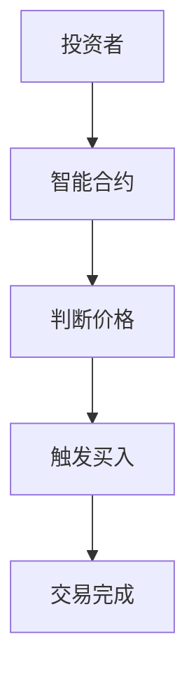
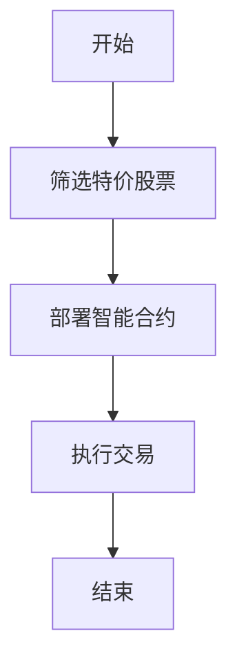
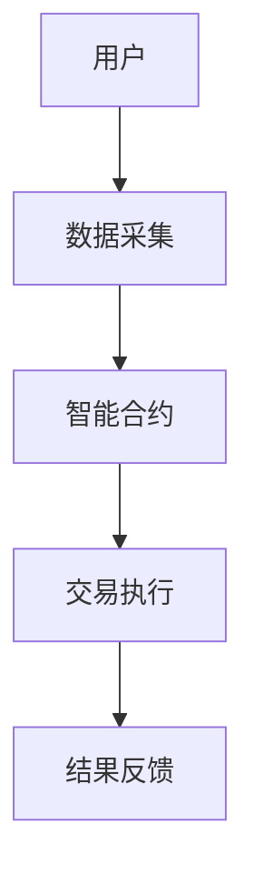
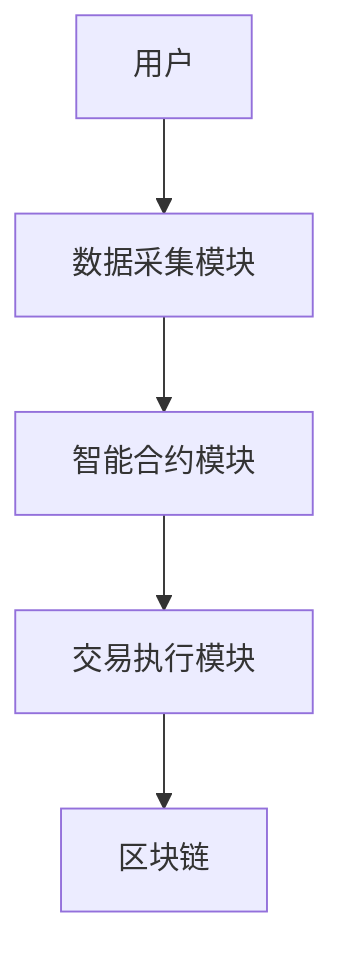
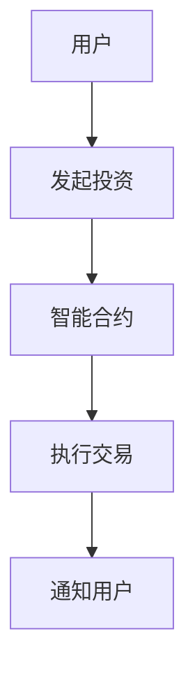

                 


# 如何将特价股票策略融入去中心化自治投资(DAI)

> 关键词：特价股票策略，去中心化自治投资，DAI，智能合约，区块链技术

> 摘要：本文详细探讨了如何将特价股票策略融入去中心化自治投资（DAI）系统中。通过分析特价股票策略的核心原理、DAI的技术架构，以及两者的结合方式，本文为投资者提供了从理论到实践的全面指导。文章内容涵盖背景介绍、核心概念、算法实现、系统架构设计、项目实战以及最佳实践等部分。

---

# 第一部分: 特价股票策略与DAI的背景与概念

# 第1章: 特价股票策略的核心概念

## 1.1 特价股票的定义与特点
### 1.1.1 特价股票的定义
特价股票是指在特定市场条件下，价格被低估的股票。这些股票通常具有较高的投资价值，但市场价格尚未被市场充分发现。

### 1.1.2 特价股票的特点
- **低估值**：市盈率、市净率等估值指标低于行业平均水平。
- **高潜力**：具有较高的成长性和盈利能力。
- **市场流动性较低**：交易量较小，价格波动相对平缓。

### 1.1.3 特价股票策略的核心目标
通过筛选和投资于被市场低估的股票，获取超额收益。

---

## 1.2 DAI的核心概念
### 1.2.1 去中心化自治投资（DAI）的定义
DAI是一种基于区块链技术的投资模式，通过智能合约实现投资决策的自动化和去中心化。

### 1.2.2 DAI的主要特点
- **去中心化**：没有中心化的机构或个人控制投资过程。
- **自治性**：通过智能合约自动执行投资策略。
- **透明性**：所有交易记录在区块链上，公开透明。

### 1.2.3 DAI与传统金融投资的区别
| 特性 | DAI | 传统金融 |
|------|------|------------|
| 控制权 | 去中心化 | 中心化 |
| 透明性 | 高 | 较低 |
| 成本 | 低 | 较高 |

---

## 1.3 特价股票策略与DAI的结合背景
### 1.3.1 特价股票策略在传统投资中的局限性
- **依赖人工判断**：需要大量经验和数据分析能力。
- **效率低下**：手动筛选股票耗时耗力。
- **信息不对称**：中小投资者难以获取实时数据。

### 1.3.2 DAI在现代投资中的兴起
- **技术进步**：区块链技术和智能合约的发展为自动化投资提供了基础。
- **市场需求**：投资者对低门槛、高效率的投资方式的需求增加。

### 1.3.3 两者的结合带来的投资机会
- **自动化筛选**：DAI可以通过智能合约自动筛选特价股票。
- **高效执行**：投资决策可以快速执行，抓住市场机会。

---

## 1.4 本章小结
本章介绍了特价股票策略和DAI的核心概念，并分析了两者结合的背景和优势。接下来，我们将深入探讨如何将特价股票策略的核心原理融入DAI的智能合约中。

---

# 第2章: 特价股票策略与DAI的核心概念与联系

## 2.1 特价股票策略的核心原理
### 2.1.1 基于技术分析的选股模型
- **技术指标**：如MACD、KDJ等。
- **趋势分析**：识别股票价格趋势。

### 2.1.2 基于基本面分析的选股模型
- **财务指标**：如市盈率、ROE等。
- **行业分析**：分析行业前景。

### 2.1.3 组合优化算法
- **目标函数**：最大化收益，最小化风险。
- **约束条件**：如投资比例、风险承受能力。

---

## 2.2 DAI的核心机制
### 2.2.1 智能合约的执行逻辑
智能合约是DAI的核心，负责自动执行投资策略。例如，当某个股票的价格低于设定阈值时，智能合约会自动执行买入指令。

### 2.2.2 投票机制
DAI中的决策通常需要通过投票机制达成共识。例如，决定是否将某个股票加入投资组合。

### 2.2.3 收益分配机制
收益按照投资者的贡献比例进行分配。

---

## 2.3 特价股票策略与DAI的结合
### 2.3.1 策略实施流程
1. **筛选特价股票**：基于技术分析和基本面分析筛选出被低估的股票。
2. **部署智能合约**：将筛选逻辑写入智能合约。
3. **自动执行交易**：当触发条件满足时，智能合约自动执行交易。

### 2.3.2 智能合约的实现
```solidity
// 示例智能合约代码：自动购买特价股票
contract CheapStockInvestment {
    uint public threshold = 10; // 设定的价格阈值

    function buyStock(address stockContract) external {
        if (getStockPrice(stockContract) < threshold) {
            invest(stockContract, msg.sender);
        }
    }

    function getStockPrice(address stockContract) internal returns (uint) {
        // 实现获取股票价格的逻辑
    }

    function invest(address stockContract, address investor) internal {
        // 实现投资逻辑
    }
}
```

---

## 2.4 本章小结
本章详细介绍了特价股票策略的核心原理和DAI的核心机制，并展示了两者结合的实现方式。接下来，我们将从算法的角度，进一步探讨如何实现这一结合。

---

# 第3章: 特价股票策略与DAI的算法实现

## 3.1 特价股票策略的算法模型
### 3.1.1 基于技术分析的算法
- **输入**：股票价格数据。
- **输出**：是否为特价股票。

### 3.1.2 基于基本面分析的算法
- **输入**：公司财务数据。
- **输出**：是否为特价股票。

---

## 3.2 DAI中的智能合约算法
### 3.2.1 智能合约的触发条件
- **价格触发**：当股票价格低于阈值时触发买入。
- **时间触发**：在特定时间点执行操作。

### 3.2.2 智能合约的执行流程


---

## 3.3 特价股票策略与DAI结合的算法流程
### 3.3.1 算法流程图


### 3.3.2 Python代码实现
```python
# 示例代码：基于技术分析的选股算法
import pandas as pd
import numpy as np

def select_cheap_stocks(data, threshold):
    return data[data['price'] < threshold]

# 示例数据
data = {'price': [10, 12, 8, 15, 7]}
df = pd.DataFrame(data)
result = select_cheap_stocks(df, 10)
print(result)
```

---

## 3.4 本章小结
本章通过算法的角度，详细探讨了如何将特价股票策略融入DAI的智能合约中。接下来，我们将从系统架构的角度，进一步分析实现这一目标的技术细节。

---

# 第4章: 特价股票策略与DAI的系统架构设计

## 4.1 系统功能设计
### 4.1.1 系统模块划分
- **数据采集模块**：采集股票价格数据。
- **智能合约模块**：执行投资策略。
- **用户界面模块**：供投资者查看和管理投资。

### 4.1.2 系统功能流程


---

## 4.2 系统架构设计
### 4.2.1 系统架构图


### 4.2.2 系统接口设计
- **输入接口**：用户输入投资策略参数。
- **输出接口**：显示投资结果和收益。

---

## 4.3 系统交互设计
### 4.3.1 交互流程图


---

## 4.4 本章小结
本章从系统架构的角度，详细设计了如何将特价股票策略融入DAI的系统中。接下来，我们将通过实际案例，展示如何将这一理论应用到实践中。

---

# 第5章: 特价股票策略与DAI的项目实战

## 5.1 环境安装与配置
### 5.1.1 安装区块链环境
- **以太坊**：安装Geth或其他节点客户端。
- **智能合约开发工具**：如Solidity和Remix。

### 5.1.2 安装数据分析工具
- **Python**：安装Pandas、NumPy等库。

---

## 5.2 核心功能实现
### 5.2.1 特价股票筛选功能
```python
import pandas as pd

def select_cheap_stocks(data, threshold):
    return data[data['price'] < threshold]

# 示例数据
data = {'price': [10, 12, 8, 15, 7]}
df = pd.DataFrame(data)
result = select_cheap_stocks(df, 10)
print(result)
```

### 5.2.2 智能合约部署功能
```solidity
// 智能合约代码：自动购买特价股票
contract CheapStockInvestment {
    uint public threshold = 10;

    function buyStock(address stockContract) external {
        if (getStockPrice(stockContract) < threshold) {
            invest(stockContract, msg.sender);
        }
    }

    function getStockPrice(address stockContract) internal returns (uint) {
        // 实现获取股票价格的逻辑
    }

    function invest(address stockContract, address investor) internal {
        // 实现投资逻辑
    }
}
```

---

## 5.3 实际案例分析
### 5.3.1 案例背景
假设我们有以下股票价格数据：
| 股票代码 | 价格 |
|----------|------|
| A        | 8    |
| B        | 12   |
| C        | 7    |
| D        | 15   |

### 5.3.2 智能合约执行
设定阈值为10，智能合约自动筛选出价格低于10的股票（A和C），并执行买入操作。

---

## 5.4 代码实现与解读
### 5.4.1 数据分析部分
```python
# 数据分析部分
import pandas as pd

def select_cheap_stocks(data, threshold):
    return data[data['price'] < threshold]

# 示例数据
data = {'price': [10, 12, 8, 15, 7]}
df = pd.DataFrame(data)
result = select_cheap_stocks(df, 10)
print(result)
```

### 5.4.2 智能合约部分
```solidity
// 智能合约部分
contract CheapStockInvestment {
    uint public threshold = 10;

    function buyStock(address stockContract) external {
        if (getStockPrice(stockContract) < threshold) {
            invest(stockContract, msg.sender);
        }
    }

    function getStockPrice(address stockContract) internal returns (uint) {
        // 实现获取股票价格的逻辑
    }

    function invest(address stockContract, address investor) internal {
        // 实现投资逻辑
    }
}
```

---

## 5.5 本章小结
本章通过实际案例和代码实现，展示了如何将特价股票策略融入DAI的系统中。接下来，我们将总结最佳实践，为读者提供实用的建议。

---

# 第6章: 最佳实践与总结

## 6.1 小结
- **核心思想**：通过智能合约实现特价股票策略的自动化投资。
- **技术优势**：去中心化、高效、透明。

## 6.2 注意事项
- **风险控制**：确保智能合约的逻辑正确，避免漏洞。
- **合规性**：遵守相关法律法规。

## 6.3 拓展阅读
- 推荐阅读《智能合约与区块链投资》、《去中心化金融的理论与实践》。

---

# 第7章: 总结与展望

## 7.1 本章总结
本文详细探讨了如何将特价股票策略融入DAI系统中，从理论到实践，为投资者提供了全面的指导。

## 7.2 未来展望
随着区块链技术的不断发展，DAI在投资领域的应用前景广阔。未来，可以通过引入更多复杂的算法和数据分析技术，进一步优化投资策略。

---

# 作者：AI天才研究院/AI Genius Institute & 禅与计算机程序设计艺术 /Zen And The Art of Computer Programming

---

以上是完整的技术博客文章内容，涵盖从理论到实践的各个方面，帮助读者全面理解如何将特价股票策略融入去中心化自治投资（DAI）中。

