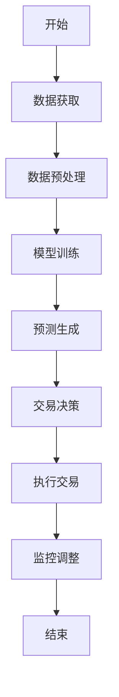
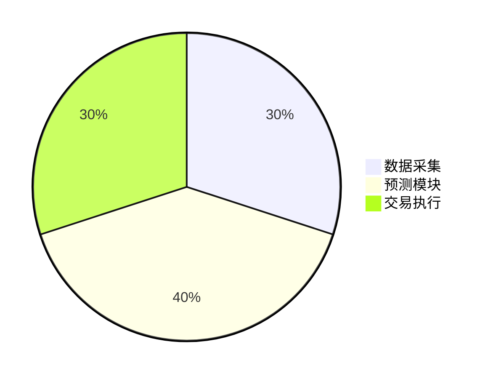
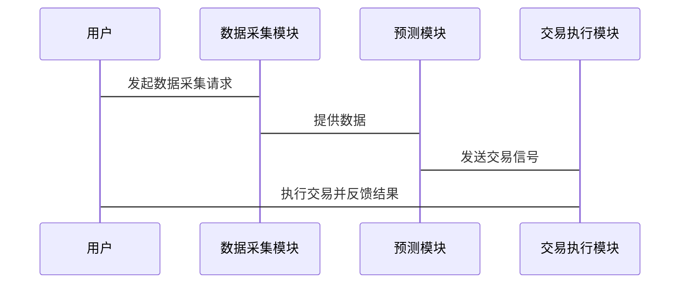

                 


# 《如何将特价股票策略融入去中心化预测市场投资》

## 关键词：特价股票策略, 去中心化预测市场, 套利机会, 交易策略, 区块链技术

## 摘要：本文深入探讨如何将特价股票策略与去中心化预测市场相结合，分析其核心概念、算法原理、系统设计及项目实战，帮助读者理解并应用这一创新投资策略。

---

# 第一部分: 特价股票策略与去中心化预测市场概述

## 第1章: 特价股票策略与去中心化预测市场的概述

### 1.1 特价股票策略的定义与特点
#### 1.1.1 特价股票策略的定义
特价股票策略是一种基于市场波动和价格变化的交易策略，旨在通过低买高卖或套利机会获取收益。

#### 1.1.2 特价股票策略的核心特点
- **价格敏感性**：依赖价格波动，寻找短期套利机会。
- **数据驱动**：利用市场数据和分析模型预测价格走势。
- **快速决策**：要求交易系统能够快速响应市场变化。

#### 1.1.3 特价股票策略的应用场景
- 股票市场
- 加密货币市场
- 商品期货市场

### 1.2 去中心化预测市场的定义与特点
#### 1.2.1 去中心化预测市场的定义
去中心化预测市场是基于区块链技术，允许用户对各种事件进行预测并进行交易的平台。

#### 1.2.2 去中心化预测市场的核心特点
- **去中心化**：无中心机构控制，依赖区块链技术实现信任。
- **透明性**：所有交易和数据公开可查，增强信任。
- **激励机制**：通过激励措施鼓励用户提供准确的预测。

#### 1.2.3 去中心化预测市场的优势与劣势
- **优势**：透明、抗审查、高效。
- **劣势**：依赖技术实现，存在一定的进入门槛。

### 1.3 特价股票策略与去中心化预测市场的结合
#### 1.3.1 结合的背景与意义
随着区块链技术的发展，去中心化预测市场为特价股票策略提供了新的应用场景。

#### 1.3.2 结合的核心机制
通过分析链上数据和市场波动，利用去中心化预测市场的特性，优化交易策略。

#### 1.3.3 结合的潜在价值与挑战
- **价值**：提高交易效率，降低交易成本。
- **挑战**：数据处理复杂性，交易策略的实时性要求。

## 1.4 本章小结
本章概述了特价股票策略和去中心化预测市场的核心概念，分析了它们结合的背景、核心机制及潜在价值与挑战。

---

# 第二部分: 特价股票策略的核心概念与原理

## 第2章: 特价股票策略的核心概念

### 2.1 特价股票策略的关键要素
#### 2.1.1 市场分析
- **技术分析**：通过K线图、均线等技术指标预测价格走势。
- **基本面分析**：分析公司财务状况、行业趋势等影响股价的因素。

#### 2.1.2 价格波动预测
- **短期波动预测**：利用算法模型预测短期内的价格变化。
- **长期趋势预测**：结合市场周期和宏观经济因素预测长期趋势。

#### 2.1.3 交易时机选择
- **买入时机**：价格低点附近。
- **卖出时机**：价格高点附近或套利机会出现时。

### 2.2 去中心化预测市场的核心机制
#### 2.2.1 预测市场的基本原理
- 用户对特定事件进行预测，通过交易 token 的价格反映预测结果。
- 预测结果的准确性决定了用户的收益。

#### 2.2.2 链上数据源的利用
- 利用区块链上的交易数据、智能合约执行情况等链上数据，辅助预测模型的构建。

#### 2.2.3 预测结果的激励机制
- 提供准确预测的用户获得奖励。
- 错误预测的用户损失部分 token。

### 2.3 特价股票策略与去中心化预测市场的关联
#### 2.3.1 数据流的整合
- 将市场波动数据与链上数据相结合，构建更全面的预测模型。

#### 2.3.2 预测模型的构建
- 利用机器学习模型分析市场数据，预测价格走势。
- 通过链上数据验证预测结果的准确性。

#### 2.3.3 交易策略的优化
- 根据预测结果调整交易策略，优化套利机会的选择。

## 2.4 本章小结
本章详细探讨了特价股票策略和去中心化预测市场的核心概念，分析了它们的关联及如何通过数据整合和模型构建优化交易策略。

---

# 第三部分: 去中心化预测市场中的特价股票策略实现

## 第3章: 特价股票策略的算法原理

### 3.1 预测模型的构建
#### 3.1.1 数据预处理
- 数据清洗、标准化、特征选择等步骤。
- 示例：使用 Pandas 和 Scikit-learn 进行数据处理。

#### 3.1.2 模型选择
- 线性回归、支持向量机（SVM）、随机森林、LSTM 等模型的比较。
- 示例：选择 LSTM 模型进行时间序列预测。

#### 3.1.3 模型训练与优化
- 调参、交叉验证、网格搜索等方法优化模型性能。
- 示例：使用 Keras 或 PyTorch 进行模型训练。

### 3.2 套利机会的识别
#### 3.2.1 套利的基本原理
- 利用不同市场或时间的价格差异进行无风险或低风险套利。

#### 3.2.2 数据源的多维度分析
- 分析多个市场、多种资产的价格走势，寻找套利机会。
- 示例：利用比特币在不同交易所的价格差异进行套利。

#### 3.2.3 套利信号的触发机制
- 设置价格阈值或波动率指标，触发套利交易。
- 示例：当价格差异超过一定阈值时，自动执行套利交易。

### 3.3 交易策略的自动化实现
#### 3.3.1 自动化交易的流程
- 数据采集 → 预测模型 → 交易决策 → 执行交易。
- 示例：使用 QuantLib 或 Backtrader 进行策略回测。

#### 3.3.2 交易规则的制定
- 设置止损、止盈、仓位限制等规则，控制交易风险。
- 示例：设定最大仓位比例和风险承受水平。

#### 3.3.3 交易执行的监控与调整
- 实时监控交易执行情况，动态调整交易策略。
- 示例：根据市场变化调整预测模型参数。

### 3.4 算法实现的 mermaid 流程图


### 3.5 本章小结
本章详细讲解了特价股票策略的算法原理，包括预测模型的构建、套利机会的识别和交易策略的自动化实现，并通过 mermaid 流程图展示了交易流程。

---

# 第四部分: 数学模型与系统设计

## 第4章: 特价股票策略的数学模型与系统设计

### 4.1 特价股票策略的数学模型
#### 4.1.1 时间序列分析
- ARIMA 模型：用于预测未来的价格走势。
- LSTM 模型：捕捉时间序列中的长期依赖关系。
- 示例：使用 ARIMA 模型预测股票价格。

#### 4.1.2 回归分析
- 线性回归：预测价格与多个自变量之间的关系。
- 逻辑回归：预测价格变动的方向。

#### 4.1.3 风险评估模型
- VaR（Value at Risk）：评估投资组合的风险。
- CVaR（Conditional Value at Risk）：进一步量化尾部风险。

### 4.2 系统设计
#### 4.2.1 系统功能设计
- 数据采集模块：实时采集市场数据和链上数据。
- 预测模块：构建和训练预测模型，生成交易信号。
- 交易执行模块：根据预测结果执行交易，监控交易情况。

#### 4.2.2 系统架构设计


#### 4.2.3 系统交互设计


### 4.3 本章小结
本章详细探讨了特价股票策略的数学模型和系统设计，包括系统功能、架构和交互设计，为实际应用提供了理论基础。

---

# 第五部分: 项目实战

## 第5章: 特价股票策略的项目实战

### 5.1 环境搭建
#### 5.1.1 开发环境
- 操作系统：Windows/Mac/Linux
- 开发工具：PyCharm、VS Code
- 数据库：MySQL、MongoDB
- 区块链框架：Ethereum、Solana

#### 5.1.2 依赖安装
- Python 包：pandas、numpy、scikit-learn、keras、backtrader
- 区块链开发工具：web3.py、ethers.js

### 5.2 核心代码实现
#### 5.2.1 数据预处理
```python
import pandas as pd
import numpy as np

def preprocess_data(data):
    # 数据清洗
    data = data.dropna()
    # 标准化
    data = (data - data.mean()) / data.std()
    return data
```

#### 5.2.2 预测模型实现
```python
from keras.models import Sequential
from keras.layers import LSTM, Dense

def build_model(input_shape):
    model = Sequential()
    model.add(LSTM(64, input_shape=input_shape))
    model.add(Dense(1, activation='sigmoid'))
    model.compile(loss='binary_crossentropy', optimizer='adam')
    return model
```

#### 5.2.3 交易策略实现
```python
from backtrader import Strategy

class StockStrategy(Strategy):
    def __init__(self):
        self.data = self.datas[0]
        self.buy_price = None
        self.sell_price = None

    def next(self):
        if not self.position:
            if self.data.close > self.data.close.mean():
                self.buy()
        else:
            if self.data.close < self.data.close.mean():
                self.sell()
```

### 5.3 案例分析与优化
#### 5.3.1 案例分析
- 选取某段时间内的市场数据，进行回测，评估交易策略的收益和风险。
- 示例：使用历史数据回测 LSTM 模型的预测准确性。

#### 5.3.2 策略优化
- 调整模型参数，优化预测准确率。
- 优化交易规则，降低交易成本。

### 5.4 本章小结
本章通过实际项目案例，详细讲解了特价股票策略的实现过程，包括环境搭建、核心代码实现和策略优化。

---

# 第六部分: 最佳实践与总结

## 第6章: 最佳实践与总结

### 6.1 最佳实践
#### 6.1.1 数据源的选择与处理
- 确保数据的准确性和及时性。
- 多数据源的融合，提高预测模型的准确性。

#### 6.1.2 模型的选择与优化
- 根据具体场景选择合适的模型。
- 通过网格搜索和交叉验证优化模型性能。

#### 6.1.3 系统的监控与维护
- 实时监控交易执行情况。
- 定期更新模型和策略，适应市场变化。

### 6.2 小结
本文详细探讨了如何将特价股票策略融入去中心化预测市场投资，从核心概念到算法实现，再到项目实战，为读者提供了全面的指导。

### 6.3 注意事项
- 风险控制：设定合理的止损和止盈机制。
- 数据安全：确保数据的隐私和安全。
- 法律合规：遵守相关法律法规，确保交易的合法性。

### 6.4 拓展阅读
- 《Blockchain Basics: A Non-Technical Introduction to Blockchain》
- 《Machine Learning for Asset Managers》

---

# 作者

作者：AI天才研究院/AI Genius Institute & 禅与计算机程序设计艺术 /Zen And The Art of Computer Programming

