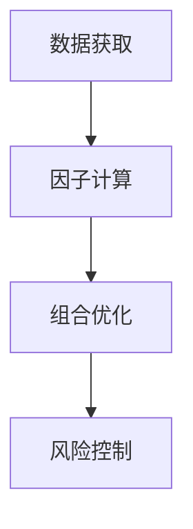
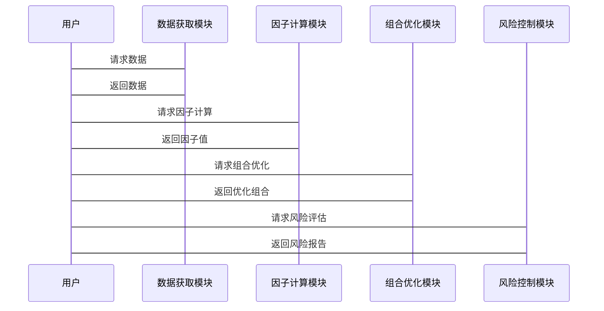

                 


# 如何将特价股票策略融入因子投资

## 关键词：特价股票策略，因子投资，股票投资，价值投资，投资策略

## 摘要：  
本文详细探讨了如何将特价股票策略融入因子投资的方法，从背景介绍、核心概念、算法原理到系统设计与项目实战，全面解析了如何结合这两种投资策略。通过分析价值投资的基本原理、因子投资的数学模型、系统架构设计以及实际案例，本文为读者提供了一种新的视角来优化投资组合。

---

## 第一部分: 特价股票策略与因子投资背景

## 第1章: 特价股票策略与因子投资概述

### 1.1 特价股票策略的基本概念
#### 1.1.1 特价股票的定义与特征
- 特价股票是指市场价格低于其内在价值的股票。
- 其特征包括低市盈率、低市净率、高股息率等。

#### 1.1.2 特价股票策略的核心思想
- 买入低估股票，长期持有，等待价值回归。
- 重点关注公司基本面，如盈利能力、成长性等。

#### 1.1.3 特价股票策略在投资中的作用
- 减少市场波动对投资组合的影响。
- 提高投资组合的防御性，降低风险。

### 1.2 因子投资的基本概念
#### 1.2.1 因子投资的定义与特点
- 因子投资是基于特定因子（如价值、动量、规模等）的投资策略。
- 其特点是通过量化方法筛选股票，构建投资组合。

#### 1.2.2 因子投资的核心思想
- 通过因子分解，发现影响股票收益的主要因素。
- 利用这些因子构建多元化的投资组合，分散风险。

#### 1.2.3 因子投资与传统投资策略的区别
- 传统投资策略依赖于基本面分析或技术分析。
- 因子投资基于可量化的因子，具有系统性和科学性。

### 1.3 特价股票策略与因子投资的结合
#### 1.3.1 特价股票策略融入因子投资的背景
- 传统因子投资可能忽略个股的特殊价值。
- 特价股票策略可以帮助筛选出更具投资价值的股票。

#### 1.3.2 特价股票策略与因子投资的契合点
- 价值因子与特价股票策略的核心思想一致。
- 因子投资为特价股票策略提供了系统化的框架。

#### 1.3.3 本文的核心目标与意义
- 探讨如何将特价股票策略与因子投资相结合。
- 提供一种新的投资策略，优化投资组合的表现。

---

## 第二部分: 因子投资的核心概念与原理

## 第2章: 因子投资的原理与方法

### 2.1 因子投资的基本原理
#### 2.1.1 因子的定义与分类
- **价值因子**：如低市盈率、低市净率。
- **动量因子**：如过去一年的收益表现。
- **规模因子**：如公司市值大小。
- **流动性因子**：如换手率。

#### 2.1.2 因子投资的核心假设
- 特定因子能够解释股票收益的大部分。
- 因子之间具有一定的相关性，但可以通过组合优化降低风险。

#### 2.1.3 因子投资的数学基础
- 因子模型：$$ R_i = \beta_0 + \beta_1 F_1 + \beta_2 F_2 + \cdots + \beta_n F_n + \epsilon $$
  - $R_i$：股票i的收益
  - $F_j$：因子j
  - $\beta_j$：因子的回归系数
  - $\epsilon$：误差项

### 2.2 常用因子的介绍与分析
#### 2.2.1 价值因子（Value）
- **市盈率（P/E）**：$$ P/E = \frac{\text{股价}}{\text{每股收益}} $$
- **市净率（P/B）**：$$ P/B = \frac{\text{股价}}{\text{每股净资产}} $$

#### 2.2.2 动量因子（Momentum）
- 过去12个月的收益表现。
- 动量因子的计算：$$ M = R_{12m} $$

#### 2.2.3 尺度因子（Size）
- 市值（Market Cap）：$$ \text{市值} = \text{股价} \times \text{流通股数量} $$

#### 2.2.4 流动性因子（Liquidity）
- 换手率：$$ \text{换手率} = \frac{\text{成交量}}{\text{流通股数量}} $$

### 2.3 因子投资的构建方法
#### 2.3.1 单一因子投资策略
- 仅基于一个因子构建投资组合。
- 例如，仅基于价值因子选择股票。

#### 2.3.2 多因子投资策略
- 结合多个因子构建投资组合。
- 例如，同时考虑价值因子和动量因子。

#### 2.3.3 因子权重的确定方法
- 等权分配：每个因子对最终收益的贡献权重相同。
- 优化分配：通过数学优化确定最优权重。

---

## 第三部分: 特价股票策略融入因子投资的核心方法

## 第3章: 特价股票策略的因子化分析

### 3.1 特价股票的因子化特征
#### 3.1.1 特价股票的估值指标分析
- 低市盈率、低市净率、高股息率等。

#### 3.1.2 特价股票的市场情绪分析
- 市场恐慌时，特价股票可能被低估。

#### 3.1.3 特价股票的市场周期分析
- 经济衰退期，特价股票更具投资价值。

### 3.2 特价股票策略的因子筛选
#### 3.2.1 因子筛选的标准与方法
- 筛选与特价股票相关的因子，如价值因子、动量因子。

#### 3.2.2 常用的因子筛选工具与指标
- **价值因子**：P/E、P/B。
- **动量因子**：过去一年的收益。

#### 3.2.3 特价股票策略的因子优先级
- 优先选择价值因子，其次考虑动量因子。

### 3.3 特价股票策略的因子优化
#### 3.3.1 因子权重的优化
- 通过回归分析确定各因子的权重。

#### 3.3.2 多因子组合优化
- 使用数学优化方法构建最优因子组合。

---

## 第四部分: 系统分析与架构设计

## 第4章: 系统架构与实现

### 4.1 问题场景介绍
- 投资者希望基于特价股票策略和因子投资构建一个自动化投资系统。

### 4.2 系统功能设计
- 数据获取模块：获取股票数据。
- 因子计算模块：计算各因子值。
- 组合优化模块：基于因子构建投资组合。
- 风险控制模块：监控和管理投资组合的风险。

### 4.3 系统架构设计


### 4.4 系统接口设计
- 数据接口：与数据源对接。
- 计算接口：因子计算模块的接口。
- 优化接口：组合优化模块的接口。

### 4.5 系统交互设计


---

## 第五部分: 项目实战

## 第5章: 项目实战与分析

### 5.1 环境安装
- 安装Python、Pandas、NumPy、Scipy、Plotly、FinDataAPI等工具。

### 5.2 系统核心实现
```python
# 数据获取
import pandas as pd
import requests

# 下载数据
response = requests.get("https://example.com/data")
data = pd.read_csv(response.content)
data.to_csv("stock_data.csv", index=False)

# 因子计算
def calculate_factor(data):
    data['PE'] = data['股价'] / data['每股收益']
    data['PB'] = data['股价'] / data['每股净资产']
    return data

# 组合优化
from scipy.optimize import minimize

def optimize_portfolio(factor_matrix, returns):
    n = factor_matrix.shape[1]
    # 定义目标函数
    def objective(weights):
        return -returns.dot(weights)
    # 定义约束条件
    constraints = [{'type': 'eq', 'fun': lambda w: sum(w) - 1}]
    # 最优化
    result = minimize(objective, [0.0]*n, constraints=constraints)
    return result.x

# 风险控制
def calculate_risk(returns, weights):
    return np.sqrt(weights.T.dot(returns.cov()).dot(weights))
```

### 5.3 代码应用解读与分析
- 数据获取模块：从数据源获取股票数据。
- 因子计算模块：计算各因子值，如P/E和P/B。
- 组合优化模块：基于因子计算投资组合的最优权重。
- 风险控制模块：计算投资组合的风险。

### 5.4 实际案例分析
- 数据来源：某时间段内的股票数据。
- 因子计算：计算P/E和P/B等因子。
- 组合优化：基于因子构建最优投资组合。
- 回测分析：验证投资组合的表现。

### 5.5 项目小结
- 通过实际案例展示了如何将特价股票策略融入因子投资。
- 代码实现了一个完整的投资系统，包括数据获取、因子计算、组合优化和风险控制。

---

## 第六部分: 最佳实践与总结

## 第6章: 最佳实践与注意事项

### 6.1 最佳实践
- 定期调整投资组合，适应市场变化。
- 结合市场环境，动态调整因子权重。

### 6.2 小结
- 本文详细探讨了如何将特价股票策略融入因子投资。
- 通过系统设计和项目实战，展示了实现这一策略的具体方法。

### 6.3 注意事项
- 数据质量至关重要，确保数据的准确性和完整性。
- 模型选择需谨慎，避免过拟合。
- 风险控制是投资成功的关键，需持续监控。

### 6.4 拓展阅读
- 《因子投资法》
- 《投资学》
- 《量化投资入门》

---

## 作者：AI天才研究院/AI Genius Institute & 禅与计算机程序设计艺术 /Zen And The Art of Computer Programming

---

以上是完整的文章目录和内容大纲，您可以根据此结构进一步撰写具体章节内容。希望对您有所帮助！

