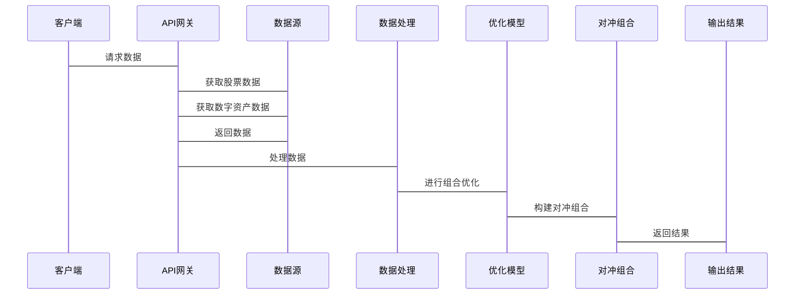

                 


# 如何将特价股票策略融入多元化数字资产对冲组合

## 关键词：特价股票策略，数字资产，对冲组合，投资组合优化，风险管理，套利机会

## 摘要：本文详细探讨了如何将特价股票策略与数字资产对冲相结合，构建一个多元化、低风险的投资组合。通过分析特价股票的特性、数字资产对冲的原理以及两者的结合方式，本文提出了一个基于现代投资组合理论的优化模型，并结合实际案例，展示了如何在数字资产市场中实现套利机会，同时降低投资风险。

---

# 第一部分: 特价股票策略与数字资产对冲的基础

## 第1章: 特价股票策略与数字资产对冲概述

### 1.1 特价股票策略的定义与特点

#### 1.1.1 特价股票的定义
特价股票是指市场价格低于其内在价值的股票。通常，这类股票被市场低估，存在套利机会。

#### 1.1.2 特价股票的核心特点
- **低估性**：市场价格低于内在价值。
- **套利潜力**：存在价格回归内在价值的可能性。
- **低流动性风险**：通常流动性较高，便于快速交易。

#### 1.1.3 特价股票与传统股票投资的区别
| 特性 | 特价股票 | 传统股票 |
|------|----------|-----------|
| 投资目标 | 套利机会 | 长期增值 | 
| 风险 | 较低 | 较高 |
| 持股时间 | 短期 | 长期 |

### 1.2 数字资产与对冲策略的定义

#### 1.2.1 数字资产的定义与分类
数字资产是指以数字形式存在的资产，主要包括比特币、以太坊等加密货币，以及一些代币化资产。

#### 1.2.2 对冲策略的基本概念
对冲策略是一种通过同时买入和卖出相关资产来降低风险的投资策略。其核心在于利用资产之间的相关性来抵消价格波动的风险。

#### 1.2.3 数字资产对冲与传统金融对冲的对比
| 特性 | 数字资产对冲 | 传统金融对冲 |
|------|--------------|----------------|
| 市场波动 | 高 | 较低 |
| 交易成本 | 低 | 较高 |
| 技术依赖 | 高 | 较低 |

### 1.3 特价股票策略融入数字资产对冲的意义

#### 1.3.1 提高投资组合的收益
通过利用数字资产市场的高波动性，特价股票策略可以在对冲组合中创造额外收益。

#### 1.3.2 降低投资组合的风险
数字资产的高波动性可以通过对冲策略部分抵消，从而降低整体投资组合的风险。

#### 1.3.3 数字资产市场的独特优势
数字资产市场的高流动性、24/7交易时间和去中心化特点，为特价股票策略的应用提供了独特优势。

### 1.4 本章小结
本章介绍了特价股票策略和数字资产对冲的基本概念，并分析了两者结合的必要性和优势。

---

## 第2章: 特价股票策略的核心概念与原理

### 2.1 特价股票策略的核心概念

#### 2.1.1 市场无效性与套利机会
市场无效性是指市场价格未能反映其真实价值的情况，这种情况下存在套利机会。

#### 2.1.2 特价股票的识别方法
- **基本面分析**：分析公司的财务状况、行业地位等。
- **技术分析**：通过K线图、成交量等技术指标判断股票价格是否被低估。

#### 2.1.3 特价股票的持有策略
- **短期持有**：利用价格回归内在价值的机会快速获利。
- **长期持有**：等待市场重新发现其价值。

### 2.2 数字资产对冲的核心原理

#### 2.2.1 数字资产价格波动的特性
数字资产价格波动剧烈，适合通过对冲策略来降低风险。

#### 2.2.2 对冲机制在数字资产中的应用
- **多空对冲**：同时买入和卖出相关资产，抵消价格波动。
- **篮子对冲**：通过组合多种资产来分散风险。

#### 2.2.3 数字资产对冲的风险管理
- **止损机制**：设定止损点，避免过度亏损。
- **风险分散**：通过多元化投资降低风险。

### 2.3 特价股票策略与数字资产对冲的结合

#### 2.3.1 理论基础
- **现代投资组合理论（MPT）**：通过组合不同资产降低风险。
- **套利定价理论（APT）**：利用市场套利机会定价资产。

#### 2.3.2 实践应用
- **数字资产选择**：选择与特价股票相关的数字资产进行对冲。
- **组合优化**：通过数学模型优化投资组合。

#### 2.3.3 组合优化
- **风险调整后的收益最大化**：在给定风险水平下最大化收益。
- **数字资产与传统资产的混合优化**：结合数字资产和传统资产构建最优组合。

### 2.4 本章小结
本章详细讲解了特价股票策略和数字资产对冲的核心概念，并分析了它们的结合方式和理论基础。

---

## 第3章: 特价股票策略与数字资产对冲的数学模型

### 3.1 特价股票策略的数学模型

#### 3.1.1 市场价与内在价值的计算公式
市场价：$$P$$  
内在价值：$$V$$  
套利空间：$$V - P$$

#### 3.1.2 套利机会的量化方法
套利机会的收益：$$ (V - P) \times \text{数量}$$

#### 3.1.3 特价股票选择的优化模型
最大化收益：$$ \max \sum (V_i - P_i) \times Q_i$$  
约束条件：$$ \sum P_i \times Q_i \leq \text{预算}$$

### 3.2 数字资产对冲的数学模型

#### 3.2.1 数字资产价格波动的统计模型
价格波动：$$ \sigma = \sqrt{\sum (P_t - \bar{P})^2 / n}$$  
其中，$$P_t$$ 是第 $$t$$ 时刻的价格，$$\bar{P}$$ 是平均价格，$$n$$ 是时间窗口长度。

#### 3.2.2 对冲组合的构建公式
对冲比例：$$ \beta = \frac{\text{股票波动性}}{\text{资产波动性}} \times \text{相关性}$$

#### 3.2.3 风险收益比的数学表达
风险收益比：$$ \text{收益} / \text{标准差}$$

### 3.3 组合优化的数学模型

#### 3.3.1 现代投资组合理论（MPT）的应用
收益最大化：$$ \max \sum w_i \times r_i$$  
风险最小化：$$ \min \sum w_i \times w_j \times \sigma_{i,j}$$  
约束条件：$$ \sum w_i = 1$$

#### 3.3.2 风险调整后的收益最大化模型
夏普比率：$$ \text{夏普比率} = \frac{\text{收益} - \text{无风险利率}}{\text{标准差}}$$

#### 3.3.3 数字资产与传统资产的混合优化
混合比例：$$ w_d \times w_t = 1$$  
其中，$$w_d$$ 是数字资产权重，$$w_t$$ 是传统资产权重。

### 3.4 本章小结
本章通过数学模型详细讲解了特价股票策略和数字资产对冲的量化方法，为后续的算法实现奠定了基础。

---

## 第4章: 特价股票策略与数字资产对冲的算法实现

### 4.1 特价股票筛选算法

#### 4.1.1 数据采集与清洗
- 数据源：股票价格、财务数据、市场数据。
- 数据清洗：去除缺失值、异常值。

#### 4.1.2 市场价与内在价值的计算
使用基本面分析计算内在价值，比较市场价格与内在价值的差异。

#### 4.1.3 套利机会的识别
根据市场价与内在价值的差异，识别套利机会。

### 4.2 数字资产对冲算法

#### 4.2.1 对冲组合的构建
根据数字资产的相关性，构建对冲组合。

#### 4.2.2 风险管理
设置止损、止盈机制，控制仓位。

### 4.3 组合优化算法

#### 4.3.1 优化模型的实现
使用Python优化库（如scipy）实现组合优化。

#### 4.3.2 算法步骤
1. 数据采集与预处理。
2. 计算资产的相关性和波动性。
3. 构建优化模型。
4. 求解优化问题。
5. 实施对冲策略。

### 4.4 本章小结
本章通过算法实现，展示了如何将特价股票策略与数字资产对冲结合起来，构建一个优化的投资组合。

---

## 第5章: 系统分析与架构设计方案

### 5.1 问题场景介绍
数字资产市场的高波动性和高风险，需要通过对冲策略来降低风险。

### 5.2 系统功能设计

#### 5.2.1 领域模型


### 5.3 系统架构设计


### 5.4 系统接口设计
- 数据接口：API接口获取股票和数字资产数据。
- 优化接口：API接口优化投资组合。

### 5.5 系统交互



### 5.6 本章小结
本章通过系统分析和架构设计，展示了如何构建一个高效的对冲系统。

---

## 第6章: 项目实战

### 6.1 环境安装

#### 6.1.1 安装Python
```bash
python --version
pip install --upgrade pip
```

#### 6.1.2 安装依赖库
```bash
pip install numpy pandas scipy matplotlib
```

### 6.2 核心实现

#### 6.2.1 数据采集
```python
import pandas as pd
import requests

url = "https://api.example.com/stocks"
response = requests.get(url)
data = response.json()
df = pd.DataFrame(data)
```

#### 6.2.2 优化模型实现
```python
from scipy.optimize import minimize

def objective(x, cov_matrix, return_vec):
    return np.dot(x, return_vec) - 0.5 * np.dot(x, cov_matrix.dot(x.T))

constraint = {
    'type': 'eq',
    'fun': lambda x: sum(x) - 1
}

result = minimize(objective, init_guess, method='SLSQP', constraints=[constraint])
```

#### 6.2.3 对冲策略实现
```python
def backtest(stocks, portfolio):
    returns = stocks.pct_change()
    portfolio_returns = (returns * portfolio).sum(axis=1)
    return portfolio_returns.mean(), portfolio_returns.std()
```

### 6.3 案例分析
假设我们有两只数字资产，比特币和以太坊，以及一只特价股票。通过优化模型，我们可以计算出最佳的组合权重，实现风险收益比最优。

### 6.4 本章小结
本章通过具体案例展示了如何将特价股票策略与数字资产对冲结合起来，实现套利机会。

---

## 第7章: 总结与展望

### 7.1 总结
本文详细探讨了如何将特价股票策略与数字资产对冲结合起来，构建一个多元化、低风险的投资组合。通过数学模型和算法实现，展示了如何在数字资产市场中实现套利机会，同时降低投资风险。

### 7.2 最佳实践 tips
- 定期监控市场变化，及时调整投资组合。
- 合理设置止损、止盈机制，控制风险。
- 结合市场趋势和突发事件，灵活调整策略。

### 7.3 注意事项
- 数字资产市场波动较大，需谨慎操作。
- 优化模型需根据实际情况调整参数。
- 确保数据源的可靠性和及时性。

### 7.4 拓展阅读
- 《数字资产投资策略》
- 《对冲基金的数学建模》
- 《现代投资组合理论》

### 7.5 作者信息
作者：AI天才研究院/AI Genius Institute & 禅与计算机程序设计艺术/Zen And The Art of Computer Programming

---

# 附录

## 附录A: 术语表
- 特价股票：市场价格低于内在价值的股票。
- 数字资产：以数字形式存在的资产，如比特币、以太坊等。

## 附录B: 参考文献
- Fama, E. F. (1970). Efficient Markets: A Review of Theory and Practice. The Journal of Finance.
- Markowitz, H. (1952). Portfolio Selection. The Journal of Finance.

---

通过以上内容，读者可以系统地了解如何将特价股票策略融入多元化数字资产对冲组合，并通过实际案例和数学模型，掌握具体的实现方法。

