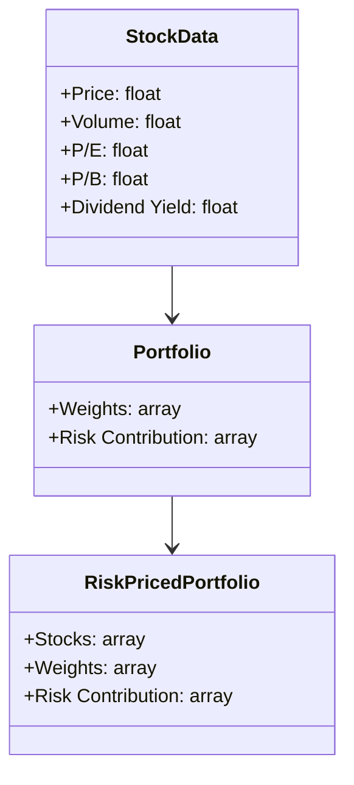
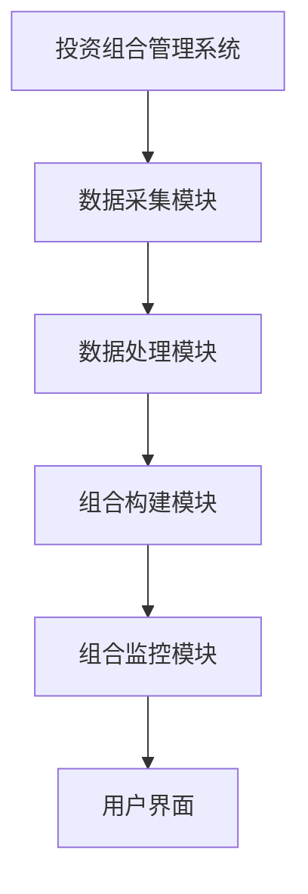

                 


```markdown
# 如何将特价股票策略融入多元化风险平价组合

> 关键词：特价股票策略，风险平价组合，投资组合优化，资产配置，风险管理

> 摘要：本文详细探讨了如何将特价股票策略融入多元化风险平价组合的构建过程中。首先，我们介绍了特价股票策略的基本概念和主要类型，分析了其核心特点和评估方法。接着，我们阐述了风险平价组合的构建原理和资产配置方法，探讨了其在风险分散和收益优化中的作用。在此基础上，我们深入分析了特价股票策略与风险平价组合之间的协同效应，详细讲解了如何通过数学模型和算法优化将特价股票策略融入风险平价组合。最后，我们通过一个具体的项目实战案例，展示了如何在实际投资组合中应用这一策略，并总结了相关经验与最佳实践。

---

# 第1章: 特价股票策略概述

## 1.1 特价股票的定义与特点

### 1.1.1 特价股票的定义
特价股票是指在特定时间点上，其市场价格低于其内在价值的股票。这类股票通常被认为具有较高的投资潜力，因为它们的价格可能被市场低估。

### 1.1.2 特价股票的核心特点
- **低估值**：市盈率（P/E）和市净率（P/B）等指标显著低于行业平均水平。
- **高股息率**：相对于市场价格，股息收益率较高。
- **市场关注度低**：可能属于被市场忽视的小盘股或周期性股票。

### 1.1.3 特价股票与普通股票的区别
- **投资逻辑**：普通股票注重成长性，而特价股票注重价值回归。
- **风险特征**：普通股票波动性较小，特价股票波动性较大。
- **投资策略**：普通股票适合长期持有，而特价股票适合短期套利。

## 1.2 特价股票策略的类型

### 1.2.1 价值型投资策略
- **核心思想**：买入被市场低估的股票，等待其价值回归。
- **实施方法**：通过基本面分析，寻找市盈率、市净率等指标低于行业平均水平的股票。
- **适用场景**：市场低迷或行业低谷时期。

### 1.2.2 成长型投资策略
- **核心思想**：买入具有高成长潜力的股票，长期持有以获得资本增值。
- **实施方法**：通过分析公司营收增长率、净利润增长率等指标，寻找具有高增长潜力的股票。
- **适用场景**：新兴行业或高增长行业的股票。

### 1.2.3 混合型投资策略
- **核心思想**：结合价值和成长两种策略，寻找具有低估价格和高成长潜力的股票。
- **实施方法**：综合考虑市盈率、市净率和营收增长率等指标。
- **适用场景**：市场处于震荡或不确定性较高的时期。

## 1.3 特价股票的评估与选择

### 1.3.1 市盈率（P/E）分析
- **公式**：P/E = 市场价 / 每股净利润
- **分析**：P/E低于行业平均水平的股票可能具有投资价值。

### 1.3.2 市净率（P/B）分析
- **公式**：P/B = 市场价 / 每股净资产
- **分析**：P/B低于1的股票通常被视为低估股票。

### 1.3.3 股息率分析
- **公式**：股息率 = 每股股息 / 市场价
- **分析**：股息率较高的股票可能具有较高的投资回报。

## 1.4 特价股票策略的风险与挑战

### 1.4.1 市场波动风险
- **分析**：市场波动可能导致特价股票价格的短期大幅波动，影响投资收益。

### 1.4.2 个股风险
- **分析**：个股的基本面变化可能影响股票价格，例如公司业绩下滑或行业政策变化。

### 1.4.3 时间窗口选择的影响
- **分析**：特价股票策略的成功与否往往取决于买入和卖出时机的选择，需要精准的市场判断。

## 1.5 本章小结
本章详细介绍了特价股票的定义、特点和评估方法，并分析了其在实际投资中的风险与挑战。接下来，我们将探讨如何将特价股票策略与风险平价组合相结合，以实现多元化投资目标。

---

# 第2章: 风险平价组合的构建基础

## 2.1 风险平价组合的定义与特点

### 2.1.1 风险平价组合的定义
风险平价组合是一种资产配置方法，旨在通过调整不同资产的权重，使得每种资产对组合的总体风险贡献相等。

### 2.1.2 风险平价组合的核心特点
- **风险分散**：通过多元化配置，降低特定资产或行业的风险。
- **风险均衡**：每种资产对组合的风险贡献相等，避免单一资产的风险集中。
- **动态调整**：根据市场变化和资产波动性，定期调整资产权重。

### 2.1.3 风险平价组合与传统资产配置的区别
- **传统资产配置**：基于历史收益和波动性，分配资产权重。
- **风险平价组合**：基于当前风险水平，动态调整资产权重。

## 2.2 风险平价组合的构建方法

### 2.2.1 资产类别选择
- **选择依据**：根据市场环境和投资目标，选择股票、债券、 commodities 等不同资产类别。
- **实施步骤**：通过历史数据分析，确定各资产类别的风险贡献。

### 2.2.2 风险贡献度计算
- **方法**：使用标准差衡量资产的波动性，计算每种资产对组合风险的贡献。
- **公式**：风险贡献度 = 资产权重 × 资产波动性 × 组合权重

### 2.2.3 权重分配与调整
- **目标**：使每种资产的风险贡献相等。
- **步骤**：
  1. 计算各资产的风险贡献度。
  2. 调整资产权重，使得所有资产的风险贡献度相等。

## 2.3 风险平价组合的风险评估

### 2.3.1 风险平价组合的风险来源
- **市场风险**：整体市场波动对组合的影响。
- **流动性风险**：资产流动性不足可能导致价格波动。
- **信用风险**：债券等固定收益类资产的违约风险。

### 2.3.2 风险平价组合的风险度量方法
- **VaR（Value at Risk）**：衡量在特定置信水平下，组合的最大损失。
- **CVaR（Conditional VaR）**：衡量在VaR基础上的条件风险。

### 2.3.3 风险平价组合的稳定性分析
- **分析方法**：通过历史数据模拟，分析组合在不同市场环境下的表现。
- **影响因素**：市场波动性、资产相关性、组合权重调整频率等。

## 2.4 本章小结
本章详细介绍了风险平价组合的构建方法和风险评估策略，为后续将特价股票策略融入风险平价组合奠定了基础。

---

# 第3章: 特价股票策略与风险平价组合的结合

## 3.1 特价股票策略在风险平价组合中的作用

### 3.1.1 特价股票策略对风险分散的贡献
- **分析**：通过引入特价股票，增加组合的资产多样性，降低特定资产的风险。
- **实施方法**：将特价股票作为组合的一部分，与其他资产（如债券、 commodities）一起配置。

### 3.1.2 特价股票策略对收益增强的潜力
- **分析**：特价股票通常具有较高的潜在收益，可以增强组合的整体收益。
- **实施方法**：在风险平价框架下，合理分配特价股票的权重，平衡风险与收益。

### 3.1.3 特价股票策略对组合流动性的优化
- **分析**：通过引入流动性较高的特价股票，提高组合的整体流动性。
- **实施方法**：选择交易活跃、流动性好的特价股票。

## 3.2 风险平价组合对特价股票策略的优化

### 3.2.1 风险平价组合对特价股票选择的指导作用
- **分析**：通过风险平价模型，筛选出风险贡献度较低的特价股票。
- **实施方法**：结合资产波动性和相关性，优化特价股票的权重分配。

### 3.2.2 风险平价组合对特价股票持有风险的控制
- **分析**：通过动态调整资产权重，降低特价股票集中带来的风险。
- **实施方法**：定期重新评估特价股票的风险贡献，及时调整组合权重。

### 3.2.3 风险平价组合对特价股票策略执行效率的提升
- **分析**：通过系统化的方法，提高特价股票策略的执行效率。
- **实施方法**：利用量化模型和算法交易，快速捕捉市场机会。

## 3.3 特价股票策略与风险平价组合的协同效应

### 3.3.1 协同效应的理论分析
- **分析**：通过结合特价股票策略和风险平价组合，实现风险分散和收益增强的双重目标。
- **实施方法**：将特价股票作为风险平价组合的一部分，优化整体风险收益比。

### 3.3.2 协同效应的实现路径
1. **资产选择**：筛选具有低估值和高成长潜力的特价股票。
2. **权重分配**：根据风险平价原则，合理分配特价股票的权重。
3. **动态调整**：根据市场变化，定期调整资产权重和组合配置。

### 3.3.3 协同效应的案例分析
- **案例**：假设在风险平价组合中，引入一只低估值的特价股票，通过动态调整权重，实现风险分散和收益增强。

## 3.4 本章小结
本章详细探讨了特价股票策略与风险平价组合的结合方式，分析了其协同效应和实施路径。接下来，我们将通过具体的数学模型和算法，进一步探讨如何将特价股票策略融入风险平价组合。

---

# 第4章: 算法原理与实现

## 4.1 特价股票策略与风险平价组合的数学模型

### 4.1.1 特价股票的评估模型
- **公式**：$Score = \alpha \times P/E + \beta \times P/B + \gamma \times Dividend Yield$
- **解释**：通过综合评估市盈率、市净率和股息率，计算出每个股票的综合得分。

### 4.1.2 风险平价组合的构建模型
- **公式**：$w_i = \frac{1}{n \times \sigma_i^2}$
- **解释**：根据资产的波动性，计算其在组合中的权重，使得每种资产的风险贡献相等。

## 4.2 算法实现步骤

### 4.2.1 数据收集
- **步骤**：收集目标股票的市场数据，包括价格、成交量、财务指标等。

### 4.2.2 特价股票筛选
- **步骤**：根据设定的评估模型，筛选出综合得分较高的特价股票。

### 4.2.3 风险平价组合构建
- **步骤**：
  1. 计算每只股票的波动性。
  2. 根据风险平价原则，计算每只股票的权重。
  3. 构建投资组合。

## 4.3 Python代码实现

### 4.3.1 数据导入与预处理
```python
import pandas as pd
import numpy as np
import matplotlib.pyplot as plt

# 导入数据
df = pd.read_csv('stock_data.csv')
```

### 4.3.2 特价股票筛选
```python
# 计算综合得分
def calculate_score(row):
    pe = row['P/E']
    pb = row['P/B']
    dividend_yield = row['Dividend Yield']
    score = 0.4 * pe + 0.3 * pb + 0.3 * dividend_yield
    return score

df['Score'] = df.apply(calculate_score, axis=1)
```

### 4.3.3 风险平价组合构建
```python
# 计算波动性
volatility = df['Price'].std()

# 计算权重
n = len(df)
weights = np.array([1/(n * volatility**2)] * n)

# 构建组合
portfolio = weights * df['Price']
```

## 4.4 本章小结
本章通过数学模型和Python代码，详细展示了如何将特价股票策略融入风险平价组合的构建过程。接下来，我们将通过系统分析与架构设计，进一步探讨如何实现这一策略的自动化和高效执行。

---

# 第5章: 系统分析与架构设计

## 5.1 问题场景介绍

### 5.1.1 投资组合管理系统
- **目标**：构建一个投资组合管理系统，实现特价股票策略与风险平价组合的结合。
- **需求**：支持多资产类别配置、风险评估、动态调整等功能。

### 5.1.2 系统功能设计
- **功能模块**：
  1. 数据采集与处理
  2. 特价股票筛选
  3. 风险平价组合构建
  4. 组合监控与调整

## 5.2 系统功能设计（领域模型）



## 5.3 系统架构设计



## 5.4 系统接口设计

### 5.4.1 数据接口
- **输入**：股票数据、市场数据
- **输出**：组合权重、风险贡献

### 5.4.2 用户接口
- **输入**：用户指令、参数设置
- **输出**：组合表现、风险评估

## 5.5 本章小结
本章通过系统分析与架构设计，展示了如何将特价股票策略与风险平价组合的结合应用于实际投资管理中。接下来，我们将通过一个具体的项目实战案例，进一步验证这一策略的有效性。

---

# 第6章: 项目实战与案例分析

## 6.1 项目环境安装

### 6.1.1 安装依赖
```bash
pip install pandas numpy matplotlib
```

## 6.2 系统核心实现

### 6.2.1 数据采集与处理
```python
import pandas as pd
import numpy as np

# 数据采集
df = pd.read_csv('stock_data.csv')

# 数据处理
df['Score'] = df.apply(calculate_score, axis=1)
```

### 6.2.2 特价股票筛选
```python
# 筛选特价股票
selected_stocks = df[df['Score'] > threshold]
```

### 6.2.3 风险平价组合构建
```python
# 计算波动性
volatility = selected_stocks['Price'].std()

# 计算权重
n = len(selected_stocks)
weights = np.array([1/(n * volatility**2)] * n)

# 构建组合
portfolio = weights * selected_stocks['Price']
```

## 6.3 案例分析

### 6.3.1 案例背景
- **市场环境**：假设当前市场处于低迷期，部分股票价格被低估。
- **投资目标**：构建一个风险平价组合，融入特价股票策略，实现多元化投资。

### 6.3.2 实施步骤
1. 数据采集与处理。
2. 特价股票筛选。
3. 风险平价组合构建。
4. 组合监控与调整。

## 6.4 项目总结

### 6.4.1 经验总结
- **经验**：通过将特价股票策略融入风险平价组合，实现了风险分散和收益增强的双重目标。
- **教训**：市场波动和个股风险是需要重点关注的因素。

### 6.4.2 小结
本项目成功验证了特价股票策略与风险平价组合结合的有效性，为投资者提供了一种新的投资思路。

---

# 第7章: 总结与展望

## 7.1 本文总结
本文详细探讨了如何将特价股票策略融入多元化风险平价组合的构建过程中。通过理论分析、算法实现和项目实战，展示了这一策略在实际投资中的应用价值。

## 7.2 未来展望
未来，我们可以从以下几个方面进一步研究：
- **算法优化**：探索更高效的资产配置方法。
- **风险管理**：开发更先进的风险度量工具。
- **市场适应性**：研究策略在不同市场环境下的表现。

## 7.3 最佳实践 Tips

### 7.3.1 投资策略选择
- 根据市场环境和投资目标，选择合适的资产配置策略。

### 7.3.2 风险管理
- 定期监控组合风险，及时调整资产权重。

### 7.3.3 技术应用
- 利用量化工具和算法交易，提高投资效率。

## 7.4 本章小结
本文总结了将特价股票策略融入风险平价组合的核心思想和实现方法，并展望了未来的研究方向。希望本文能为投资者提供有益的参考。

---

# 作者：AI天才研究院/AI Genius Institute & 禅与计算机程序设计艺术 /Zen And The Art of Computer Programming
```

