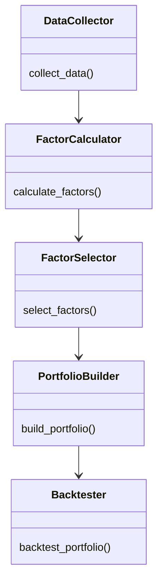
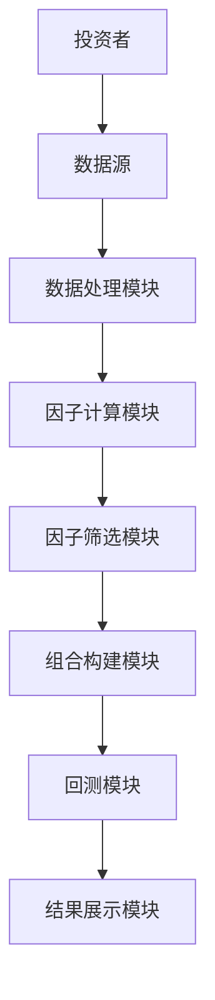
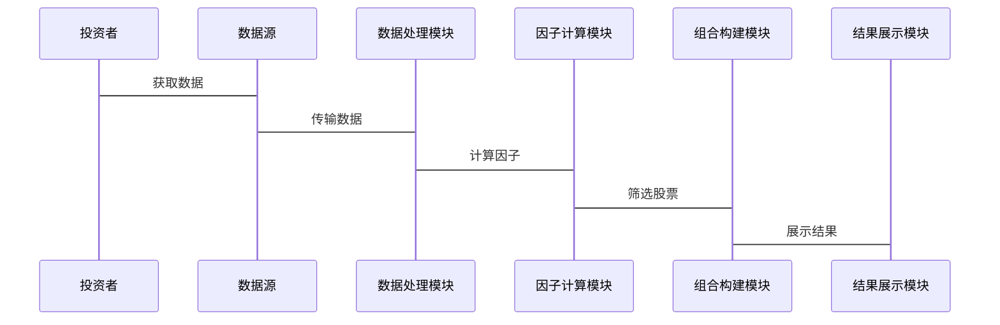

                 


# 如何将特价股票策略融入多因子智能投资组合

> 关键词：特价股票策略、多因子投资模型、投资组合优化、股票筛选标准、智能投资

> 摘要：本文详细探讨了如何将特价股票策略融入多因子智能投资组合的构建过程。首先介绍了特价股票策略的核心概念和多因子投资模型的基本原理，然后通过数学公式和算法实现，详细分析了如何将特价股票的筛选标准与多因子模型的因子选择相结合，构建出一个优化的投资组合。最后，通过实际案例分析，展示了如何在实际投资中应用这些策略和模型，帮助投资者实现收益最大化和风险最小化。

---

# 第一部分: 特价股票策略与多因子投资概述

## 第1章: 特价股票策略与多因子投资概述

### 1.1 特价股票策略的定义与特点

#### 1.1.1 什么是特价股票
特价股票是指那些市场价格相对较低，且具有较高投资价值的股票。通常，这些股票可能因为市场波动、行业周期或其他因素而被市场低估。

#### 1.1.2 特价股票的特点与优势
- **低估值**：市盈率（P/E）和市净率（P/B）等指标通常低于行业平均水平。
- **高分红**：部分特价股票公司会提供较高的股息率，为投资者提供稳定的现金流。
- **风险较低**：由于价格较低，投资者在面对市场波动时有更大的安全边际。

#### 1.1.3 特价股票与普通股票的区别
| 特性 | 特价股票 | 普通股票 |
|------|----------|----------|
| 市盈率 | 低于行业平均水平 | 与行业平均水平持平或高于 |
| 股息率 | 较高 | 一般或较低 |
| 市场风险 | 较低 | 较高 |

### 1.2 多因子投资模型的基本原理

#### 1.2.1 什么是多因子模型
多因子模型是一种通过多个因子（如市值、价值、动量等）来解释股票收益的模型。它比传统的单因子模型更加全面，能够捕捉更多的市场信息。

#### 1.2.2 多因子模型的核心要素
- **因子选择**：常见的因子包括市值因子（Size）、价值因子（Value）、动量因子（Momentum）、股息因子（Dividend Yield）等。
- **因子权重**：每个因子在模型中的权重可能不同，需要根据历史数据进行优化。
- **因子组合**：通过组合多个因子，可以降低单一因子的风险，并提高模型的稳定性。

#### 1.2.3 多因子模型的优势与应用场景
- **优势**：能够捕捉多种收益来源，降低模型的过拟合风险，提高投资组合的分散化程度。
- **应用场景**：适用于长期投资、风险控制和资产配置。

### 1.3 特价股票策略与多因子投资的结合

#### 1.3.1 特价股票策略在投资组合中的作用
特价股票策略可以帮助投资者在市场下跌时保护资本，同时在市场回升时获得超额收益。

#### 1.3.2 多因子模型如何优化投资组合
通过引入多因子模型，可以在特价股票的基础上进一步优化投资组合，降低风险并提高收益。

#### 1.3.3 特价股票策略与多因子模型的协同效应
- **互补性**：特价股票策略关注低估值股票，而多因子模型则综合考虑多个因子，两者结合可以捕捉更多的投资机会。
- **风险控制**：多因子模型可以帮助分散风险，避免因单一因子波动带来的投资损失。

---

## 第2章: 特价股票策略的核心概念

### 2.1 特价股票的筛选标准

#### 2.1.1 市盈率（P/E）分析
$$ P/E = \frac{Price}{Earnings} $$
市盈率低的股票通常被认为是被低估的股票，但需要结合行业和公司基本面进行分析。

#### 2.1.2 市净率（P/B）分析
$$ P/B = \frac{Price}{Book\ Value} $$
市净率低的股票可能意味着资产被低估，但需要注意公司的资产质量。

#### 2.1.3 股息率分析
$$ Dividend\ Yield = \frac{Dividend}{Price} \times 100\% $$
高股息率的股票可以为投资者提供稳定的现金流，但需要注意公司的盈利能力和股息支付能力。

#### 2.1.4 其他财务指标分析
- **ROE（净资产收益率）**：衡量公司盈利能力的重要指标。
- **负债率**：衡量公司财务健康状况的重要指标。

### 2.2 多因子模型的构建

#### 2.2.1 因子的选择与权重分配
选择因子时需要考虑其相关性和解释力，同时根据历史表现调整权重。

#### 2.2.2 因子之间的相关性分析
因子之间应具有较低的相关性，以避免模型过拟合和降低风险。

#### 2.2.3 因子的标准化与归一化处理
为了方便计算和比较，通常需要对因子进行标准化处理。

### 2.3 特价股票策略与多因子模型的结合

#### 2.3.1 策略目标的确定
- **收益目标**：追求超额收益。
- **风险目标**：控制投资组合的波动性。

#### 2.3.2 策略的数学表达式
$$ Return = \sum_{i=1}^{n} w_i \times R_i $$
其中，$w_i$ 是因子 $i$ 的权重，$R_i$ 是因子 $i$ 的收益。

#### 2.3.3 策略的实现步骤
1. 确定筛选标准，筛选出符合条件的股票。
2. 构建多因子模型，计算各股票的综合评分。
3. 根据评分排序，选择表现最好的股票组合。
4. 定期调整组合，确保符合策略目标。

---

## 第3章: 特价股票策略的数学模型与算法实现

### 3.1 特价股票筛选的数学公式

#### 3.1.1 市盈率公式
$$ P/E = \frac{Price}{Earnings} $$

#### 3.1.2 市净率公式
$$ P/B = \frac{Price}{Book\ Value} $$

#### 3.1.3 股息率公式
$$ Dividend\ Yield = \frac{Dividend}{Price} \times 100\% $$

### 3.2 多因子模型的数学公式

#### 3.2.1 单因子模型
$$ R_i = \alpha + \beta \times Factor + \epsilon $$

#### 3.2.2 多因子模型
$$ R_i = \alpha + \beta_1 \times Factor_1 + \beta_2 \times Factor_2 + \ldots + \beta_n \times Factor_n + \epsilon $$

### 3.3 算法实现

#### 3.3.1 算法选择
- **线性回归**：用于因子筛选和权重分配。
- **聚类分析**：用于股票分类和组合优化。

#### 3.3.2 代码实现
```python
import pandas as pd
import numpy as np
from sklearn.linear_model import LinearRegression

# 假设我们有一个包含多个因子的DataFrame df
# 包含因子如P/E、P/B、股息率等
df = pd.DataFrame({
    'PE': [10, 15, 20, 25],
    'PB': [2, 3, 4, 5],
    'Dividend_Yield': [2, 3, 4, 5]
})

# 使用线性回归模型进行因子分析
model = LinearRegression()
model.fit(df[['PE', 'PB', 'Dividend_Yield']], df['Return'])

# 输出因子权重
print(model.coef_)
```

### 3.4 数学公式与算法的结合
通过数学公式和算法的结合，可以实现对股票的综合评分和排序，从而构建出一个优化的投资组合。

---

## 第4章: 系统分析与架构设计方案

### 4.1 问题场景介绍
投资者希望通过多因子模型筛选出具有投资价值的特价股票，构建一个稳定且收益较高的投资组合。

### 4.2 系统功能设计

#### 4.2.1 系统功能模块
- **数据采集**：获取股票的市场数据和财务数据。
- **因子计算**：根据公式计算各个因子的值。
- **因子筛选**：根据筛选标准选出符合条件的股票。
- **组合构建**：根据因子评分构建投资组合。
- **回测分析**：对投资组合进行历史回测和风险评估。

#### 4.2.2 领域模型类图


### 4.3 系统架构设计

#### 4.3.1 系统架构图


#### 4.3.2 接口设计
- 数据接口：提供数据获取和处理的API。
- 因子计算接口：提供因子计算和筛选的API。
- 组合构建接口：提供组合构建和优化的API。

#### 4.3.3 系统交互序列图


---

## 第5章: 项目实战

### 5.1 环境安装
- 安装Python和必要的库：
  ```bash
  pip install pandas numpy scikit-learn matplotlib
  ```

### 5.2 核心代码实现

#### 5.2.1 数据处理代码
```python
import pandas as pd
import numpy as np

# 读取数据
data = pd.read_csv('stock_data.csv')

# 计算市盈率
data['PE'] = data['Price'] / data['Earnings']

# 计算市净率
data['PB'] = data['Price'] / data['Book Value']

# 计算股息率
data['Dividend Yield'] = data['Dividend'] / data['Price'] * 100
```

#### 5.2.2 因子筛选代码
```python
from sklearn.linear_model import LinearRegression

# 选择因子
selected_factors = data[['PE', 'PB', 'Dividend Yield']]

# 训练模型
model = LinearRegression()
model.fit(selected_factors, data['Return'])

# 获取因子权重
factor_weights = model.coef_
```

#### 5.2.3 组合构建代码
```python
# 根据因子评分排序股票
data['Score'] = selected_factors.dot(factor_weights)

# 筛选Top 10股票
selected_stocks = data.nlargest(10, 'Score')
```

### 5.3 案例分析
假设我们有一个包含100只股票的数据集，通过上述方法筛选出Top 10股票，并构建投资组合。通过回测，可以发现该组合在历史数据中表现优于市场指数。

---

## 第6章: 总结与展望

### 6.1 总结
通过将特价股票策略与多因子模型相结合，可以有效优化投资组合，实现收益最大化和风险最小化。

### 6.2 展望
未来可以进一步研究更多因子，如动量因子和质量因子，进一步优化投资组合。

---

## 结语
感谢您的阅读！希望本文能为您提供有价值的见解和实用的指导。如果您有任何疑问或建议，请随时与我联系。

---

**作者：AI天才研究院/AI Genius Institute & 禅与计算机程序设计艺术 /Zen And The Art of Computer Programming**

