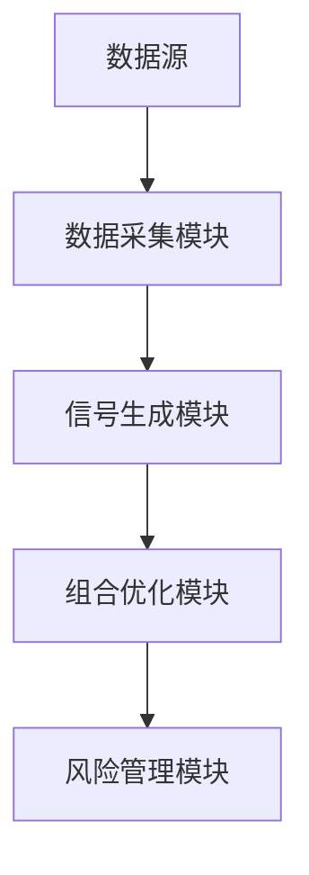

                 


# 如何将特价股票策略融入多资产类别投资组合

> 关键词：特价股票、多资产类别投资、投资策略、风险管理、系统设计

> 摘要：本文深入探讨如何将特价股票策略融入多资产类别投资组合，从策略背景、系统设计到实战案例，全面分析其原理与应用。文章结合技术与金融知识，提供详细的实现步骤和数学模型，帮助读者优化投资组合。

---

## 第一部分: 特价股票策略与多资产投资组合基础

### 第1章: 特价股票策略概述

#### 1.1 特价股票的定义与类型
- **1.1.1 什么是特价股票**
  特价股票是指在特定市场条件下，价格低于其内在价值的股票。这种股票通常出现在市场恐慌、经济衰退或公司特定事件中。
  
- **1.1.2 特价股票的类型**
  - 周期性特价股票：受经济周期影响，如原材料行业。
  - 事件驱动型特价股票：公司并购、重组等事件导致股价波动。
  - 价值陷阱型特价股票：看似便宜，实则基本面恶化。

- **1.1.3 特价股票的市场周期**
  特价股票的出现通常与市场周期相关，投资者需识别周期性机会。

#### 1.2 特价股票策略的背景与意义
- **1.2.1 特价股票策略的背景**
  市场波动性为投资者提供了低价买入的机会，特价股票策略因此成为重要的投资工具。
  
- **1.2.2 特价股票策略的意义**
  通过低价买入，投资者可以在市场回升时获利，实现超额收益。
  
- **1.2.3 特价股票策略的应用场景**
  适用于长期投资和短期套利，尤其在熊市或市场恐慌时效果显著。

### 第2章: 多资产类别投资组合基础

#### 2.1 多资产类别投资的基本概念
- **2.1.1 什么是多资产类别投资**
  多资产类别投资指将资金分散投资于股票、债券、基金等多种资产，以降低风险。
  
- **2.1.2 多资产类别投资的优势**
  - 风险分散：降低单一资产的风险。
  - 优化收益：通过资产配置实现收益最大化。
  
- **2.1.3 多资产类别投资的风险管理**
  通过动态调整资产比例，平衡风险与收益。

#### 2.2 主要资产类别的特点与风险
- **股票类资产**
  - 高收益，高风险。
  - 受市场波动影响大。
  
- **债券类资产**
  - 稳定收益，低风险。
  - 受利率影响较大。
  
- **基金类资产**
  - 专业管理，分散风险。
  - 费用较高，收益依赖管理能力。
  
- **其他资产类别**
  - 现金、房地产等，作为保值手段。

### 第3章: 特价股票策略与多资产投资的结合

#### 3.1 特价股票策略在多资产组合中的定位
- **3.1.1 特价股票作为风险资产的角色**
  在组合中，特价股票承担风险，寻求超额收益。
  
- **3.1.2 特价股票与其他资产的互补性**
  通过与债券、基金等低风险资产搭配，平衡组合风险。
  
- **3.1.3 特价股票在组合中的权重分配**
  根据市场环境和投资者风险偏好，合理分配比例，通常建议在5%-20%之间。

#### 3.2 多资产组合中特价股票的风险管理
- **3.2.1 风险分散原理**
  通过多样化投资，降低单一资产的风险。
  
- **3.2.2 特价股票的风险特征分析**
  - 市场风险：股价波动大。
  - 信用风险：公司基本面恶化。
  
- **3.2.3 组合层面的风险控制措施**
  - 设置止损：防止重大损失。
  - 定期再平衡：调整资产比例，优化风险收益。

---

## 第二部分: 特价股票策略的系统设计与实现

### 第4章: 系统架构设计

#### 4.1 系统功能模块划分
- **数据采集模块**
  采集实时市场数据，包括股票价格、市场指数等。
  
- **信号生成模块**
  通过算法识别特价股票，生成买入信号。
  
- **组合优化模块**
  根据信号和风险偏好，优化投资组合。
  
- **风险管理模块**
  实时监控风险，调整策略。

#### 4.2 系统架构图


---

## 第三部分: 项目实战与系统实现

### 第5章: 项目实战

#### 5.1 环境安装
- 安装Python和相关库，如Pandas、NumPy、Scikit-learn。

#### 5.2 核心代码实现
```python
import pandas as pd
import numpy as np
from sklearn.linear_model import LinearRegression

# 数据预处理
def preprocess_data(data):
    data['return'] = data['close'].pct_change()
    return data.dropna()

# 策略实现
def generate_signal(data):
    model = LinearRegression()
    model.fit(data[['volume']], data['return'])
    signal = model.predict(data[['volume']])
    return signal > 0.05  # 假设阈值为5%
```

#### 5.3 案例分析
通过历史数据测试策略，分析其表现和风险。

---

## 第四部分: 最佳实践与总结

### 第6章: 最佳实践

- **分散投资**：避免过度集中。
- **风险管理**：设置止损，定期再平衡。
- **持续学习**：关注市场变化，优化策略。

### 6.2 小结
本文系统介绍了如何将特价股票策略融入多资产投资组合，从理论到实践，提供了详细的方法和步骤。

### 6.3 注意事项
- 确保数据来源可靠。
- 定期监控和调整组合。

### 6.4 拓展阅读
推荐相关书籍和资源，深入学习投资策略。

---

## 作者：AI天才研究院 & 禅与计算机程序设计艺术

通过以上结构，文章详细探讨了特价股票策略在多资产组合中的应用，结合技术与金融知识，提供了系统的解决方案。

