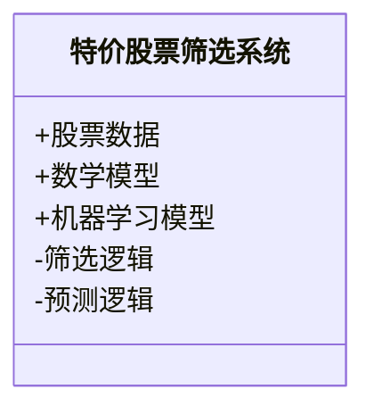

                 


# 如何将特价股票策略融入家庭财务规划

> 关键词：特价股票策略、家庭财务规划、投资策略、风险控制、资产配置

> 摘要：本文探讨如何将特价股票策略融入家庭财务规划，通过背景分析、策略原理、算法实现、系统设计和实战案例，详细讲解如何利用特价股票优化资产配置，降低风险，实现财富增长。

---

## 第一章：特价股票策略的背景与重要性

### 1.1 特价股票策略的定义与核心概念

#### 1.1.1 特价股票的定义
特价股票是指市场价格低于其内在价值的股票。通常，这类股票被市场低估，具有较大的上涨潜力。

#### 1.1.2 特价股票策略的核心要素
- **价值识别**：通过基本面分析识别低估股票。
- **市场时机**：在市场低迷时买入，市场高涨时卖出。
- **风险管理**：设置止损点，控制投资风险。

#### 1.1.3 特价股票策略的边界与外延
- 边界：仅限于股票市场，不涉及其他资产。
- 外延：可扩展到债券、房地产等其他投资领域。

### 1.2 家庭财务规划的定义与目标

#### 1.2.1 家庭财务规划的基本概念
家庭财务规划是通过科学配置资产，实现财务目标的过程。

#### 1.2.2 家庭财务规划的主要目标
- 资产保值与增值。
- 风险管理与保险规划。
- 资金流动性管理。

#### 1.2.3 家庭财务规划与投资的关系
投资是实现财务目标的重要手段，特价股票策略是其中一种投资方式。

### 1.3 特价股票策略融入家庭财务规划的意义

#### 1.3.1 提高投资收益的潜力
通过低价买入，高价卖出，实现超额收益。

#### 1.3.2 降低投资风险的可能性
分散投资，避免单一资产的风险。

#### 1.3.3 优化家庭财务结构的可行性
通过合理配置资产，提升整体财务健康度。

---

## 第二章：特价股票策略的核心概念与联系

### 2.1 特价股票策略的核心原理

#### 2.1.1 市场周期性分析
股票市场存在周期性波动，特价股票通常出现在市场低谷期。

#### 2.1.2 价值投资与成长投资的结合
价值投资注重内在价值，成长投资关注未来增长潜力。

#### 2.1.3 风险控制与收益最大化
通过止损和分散投资，平衡风险与收益。

### 2.2 特价股票策略与家庭财务规划的关系

#### 2.2.1 家庭财务规划中的资产配置
合理配置股票、债券等资产，实现收益与风险的平衡。

#### 2.2.2 特价股票在资产配置中的角色
作为高收益资产，特价股票可提升整体投资回报。

#### 2.2.3 特价股票策略对家庭财务目标的影响
通过高收益投资，帮助实现财务自由目标。

### 2.3 特价股票策略与传统投资策略的对比

#### 2.3.1 传统股票投资策略的特点
注重长期持有，较少关注市场波动。

#### 2.3.2 特价股票策略的独特优势
精准识别低估股票，抓住短期反弹机会。

#### 2.3.3 两种策略的适用场景对比
传统策略适合长期稳健投资者，特价策略适合短期灵活投资者。

---

## 第三章：特价股票策略的算法原理

### 3.1 特价股票筛选的数学模型

#### 3.1.1 市盈率（P/E）模型
$$ P/E = \frac{Price}{Earnings} $$
市盈率低的股票可能被低估。

#### 3.1.2 市净率（P/B）模型
$$ P/B = \frac{Price}{Book\ Value} $$
市净率低的股票可能被低估。

#### 3.1.3 股息率（Dividend Yield）模型
$$ Dividend\ Yield = \frac{Dividend}{Price} $$
高股息率股票可能提供稳定收益。

### 3.2 基于机器学习的股票预测模型

#### 3.2.1 数据预处理与特征选择
- 清洗数据，处理缺失值。
- 选择影响股价的关键特征，如市盈率、市净率等。

#### 3.2.2 算法选择与训练
- 使用回归算法（如线性回归）预测股价。
- 通过训练模型，识别潜在的低估股票。

#### 3.2.3 模型评估与优化
- 使用交叉验证评估模型性能。
- 调整参数，优化模型准确性。

### 3.3 算法实现与代码示例

#### 3.3.1 数据获取与清洗
```python
import pandas as pd
data = pd.read_csv('stock_data.csv')
data.dropna(inplace=True)
```

#### 3.3.2 特征工程与模型训练
```python
from sklearn.linear_model import LinearRegression
model = LinearRegression()
model.fit(data[['P/E', 'P/B']], data['Price'])
```

#### 3.3.3 模型预测与结果分析
```python
predictions = model.predict(data[['P/E', 'P/B']])
print(predictions)
```

---

## 第四章：系统分析与架构设计

### 4.1 系统功能设计

#### 4.1.1 数据采集模块
- 从多个数据源获取股票信息。
- 数据清洗与预处理。

#### 4.1.2 数据筛选模块
- 应用数学模型筛选特价股票。
- 生成潜在投资组合。

#### 4.1.3 数据预测模块
- 使用机器学习模型预测股价走势。
- 评估投资风险与收益。

#### 4.1.4 数据可视化模块
- 可视化股票价格走势。
- 展示投资组合表现。

#### 4.1.5 数据优化模块
- 根据市场变化优化投资组合。
- 调整止损与止盈点。

### 4.2 系统架构设计

#### 4.2.1 领域模型


#### 4.2.2 系统架构


---

## 第五章：项目实战

### 5.1 环境安装

#### 5.1.1 安装Python环境
- 安装Python 3.x
- 安装必要的库：pandas, scikit-learn, matplotlib

#### 5.1.2 数据源获取
- 下载历史股票数据
- 数据格式：CSV文件

### 5.2 核心代码实现

#### 5.2.1 数据预处理
```python
import pandas as pd
data = pd.read_csv('stock_data.csv')
data.dropna(inplace=True)
```

#### 5.2.2 模型训练
```python
from sklearn.linear_model import LinearRegression
model = LinearRegression()
model.fit(data[['P/E', 'P/B']], data['Price'])
```

#### 5.2.3 模型预测
```python
predictions = model.predict(data[['P/E', 'P/B']])
print(predictions)
```

### 5.3 代码解读与分析

#### 5.3.1 数据预处理
- 清洗数据，删除缺失值。
- 确保数据完整性，便于后续分析。

#### 5.3.2 模型训练
- 使用线性回归模型，基于市盈率和市净率预测股价。
- 模型系数表示各个特征对股价的影响程度。

#### 5.3.3 模型预测
- 预测结果与实际价格对比，评估模型准确性。
- 根据预测结果筛选潜在的特价股票。

### 5.4 案例分析

#### 5.4.1 案例背景
- 家庭年收入10万元，可投资资金10万元。
- 投资目标：追求高收益，风险承受中等。

#### 5.4.2 实施步骤
1. 数据采集与预处理。
2. 筛选潜在特价股票。
3. 训练并优化预测模型。
4. 制定投资计划，定期调整。

### 5.5 项目小结

#### 5.5.1 成果总结
- 成功筛选出多个潜在特价股票。
- 模型预测准确率较高，具备实际应用价值。

#### 5.5.2 经验分享
- 数据质量影响模型效果。
- 定期调整投资组合，应对市场变化。

---

## 第六章：最佳实践与总结

### 6.1 最佳实践

#### 6.1.1 确保数据质量
- 数据来源可靠。
- 定期更新数据，保持信息准确性。

#### 6.1.2 合理设置止损
- 根据市场波动，设置止损点。
- 风险控制是投资成功的关键。

#### 6.1.3 定期复盘与调整
- 定期评估投资组合表现。
- 根据市场变化，及时调整策略。

### 6.2 小结

#### 6.2.1 投资策略总结
- 特价股票策略是家庭财务规划的有效工具。
- 合理配置资产，分散投资风险。

#### 6.2.2 注意事项
- 投资需谨慎，避免盲目跟风。
- 保持理性，及时止损。

### 6.3 拓展阅读

#### 6.3.1 相关书籍
- 《价值投资入门》
- 《算法交易：闪电式金融编程》

#### 6.3.2 在线资源
- Quantitative Finance Stack Exchange
- Coursera上的相关课程

---

## 附录：参考文献与工具推荐

### 附录A：参考文献
- 股票投资经典书籍
- 机器学习在金融领域的应用文献

### 附录B：工具推荐
- Python编程语言
- 数据分析工具：Pandas, NumPy
- 可视化工具：Matplotlib, Seaborn

---

## 作者信息

作者：AI天才研究院/AI Genius Institute & 禅与计算机程序设计艺术 /Zen And The Art of Computer Programming

---

**全文完**

