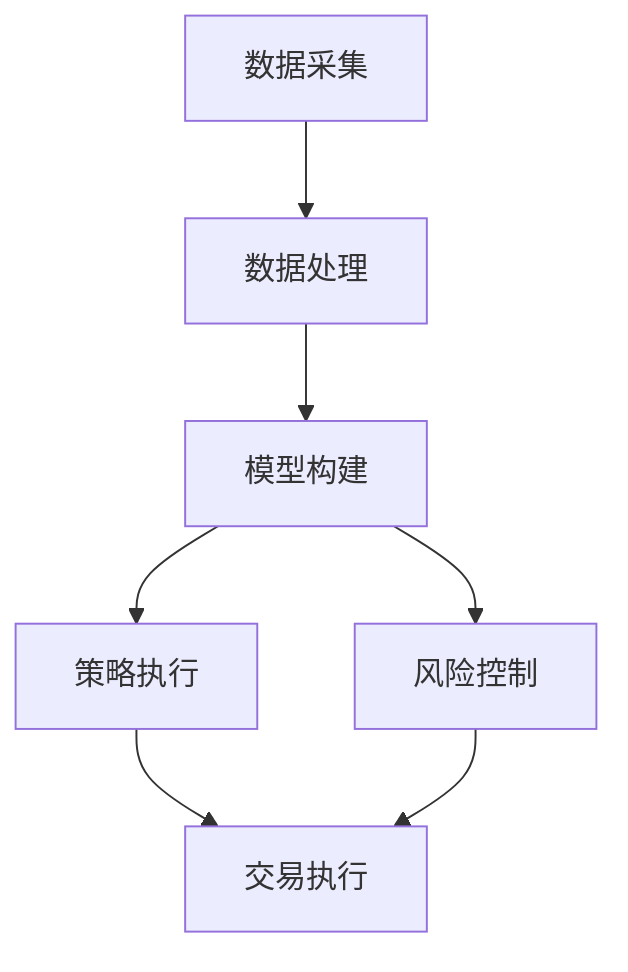
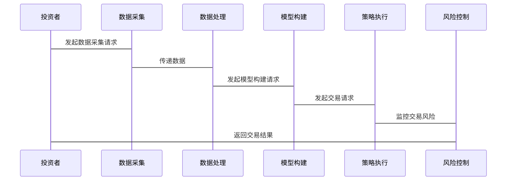

                 


# 如何将特价股票策略融入指数增强型投资

> 关键词：特价股票策略，指数增强型投资，算法，量化投资，系统架构，风险管理

> 摘要：本文详细探讨了如何将特价股票策略与指数增强型投资相结合，通过量化分析和算法优化，构建一种既能捕捉市场低估机会，又能稳定获取超额收益的投资策略。文章从理论基础到实际应用，结合数学模型、系统架构设计和实战案例，全面剖析了这一创新投资策略的实现过程和优化方法。

---

## 第一章：特价股票策略与指数增强型投资概述

### 1.1 特价股票策略的背景与概念
#### 1.1.1 特价股票的定义与特点
特价股票是指市场价格显著低于其内在价值的股票。其特点包括：
- 价格低估：市场价格与内在价值存在显著差距。
- 市场情绪影响：通常出现在市场恐慌或非理性下跌阶段。
- 高潜力：低价股票往往具有较高的反弹或增值潜力。

#### 1.1.2 特价股票策略的应用场景
- 市场低迷期：如经济危机或市场崩盘阶段。
- 投资者情绪低落：市场参与者对某些行业或公司失去信心时。
- 个股基本面改善：公司基本面转好但股价未反映。

#### 1.1.3 特价股票策略的核心目标
- 捕捉市场低估机会。
- 获取超额收益。
- 降低投资风险。

### 1.2 指数增强型投资的基本原理
#### 1.2.1 指数增强型投资的定义
指数增强型投资是一种结合被动投资和主动管理的投资策略，旨在在跟踪指数的同时通过主动管理获取超额收益。

#### 1.2.2 指数增强型投资的策略特点
- 以指数为基准：通过跟踪指数获得市场的平均收益。
- 主动管理：通过精选个股或调整权重获取超额收益。
- 风险可控：相比主动管理型基金，风险更低，收益更稳定。

#### 1.2.3 指数增强型投资的目标与优势
- 目标：在跟踪指数的基础上，通过主动管理实现超额收益。
- 优势：风险低、收益稳定、透明度高。

### 1.3 特价股票策略与指数增强型投资的结合
#### 1.3.1 结合的背景与动机
- 市场中存在大量低估股票，但传统指数增强型投资难以捕捉这些机会。
- 特价股票策略能够在市场低迷时提供超额收益，弥补指数增强型投资的不足。

#### 1.3.2 结合的核心目标与优势
- 核心目标：在指数增强型投资的基础上，通过特价股票策略捕捉低估机会，进一步提升超额收益。
- 优势：结合了指数增强型投资的稳定性和特价股票策略的高收益潜力。

#### 1.3.3 结合的潜在挑战与风险
- 市场波动风险：特价股票策略在市场波动较大时可能面临较大风险。
- 选股难度：如何准确筛选出真正的低估股票是关键。
- 操作风险：需要精准的市场判断和快速反应能力。

## 第二章：特价股票策略的核心原理与实现

### 2.1 特价股票策略的基本原理
#### 2.1.1 特价股票的市场机会分析
- 市场低估的原因：市场非理性、信息不对称、短期情绪影响等。
- 特价股票的潜在收益：市场回归内在价值时的反弹收益。

#### 2.1.2 特价股票的筛选标准与方法
- 市盈率（P/E）：低于行业平均水平。
- 市净率（P/B）：低于行业平均水平。
- 股价与书值比（Price-to-Book Ratio）：低于1。
- 股息率：高于行业平均水平。

#### 2.1.3 特价股票的交易策略设计
- 买入策略：在市场低迷时，选择基本面良好但价格被低估的股票。
- 卖出策略：当股价回归内在价值或市场情绪好转时卖出。

### 2.2 特价股票策略的数学模型与公式
#### 2.2.1 特价股票价值评估公式
$$ V = \frac{E}{P} $$
其中，V为股票的内在价值，E为公司 earnings，P为股票价格。

#### 2.2.2 特价股票投资收益模型
$$ R = \frac{V - P}{P} \times 100\% $$
其中，R为投资收益，V为内在价值，P为买入价格。

#### 2.2.3 特价股票风险评估公式
$$ Risk = \frac{V - P}{P} \times \text{市场波动率} $$

### 2.3 特价股票策略的实现步骤
#### 2.3.1 确定投资目标与约束条件
- 投资目标：获取超额收益。
- 约束条件：投资期限、风险承受能力、资金规模。

#### 2.3.2 数据收集与 preprocessing
- 数据来源：历史价格、财务报表、市场情绪数据。
- 数据处理：清洗、标准化、特征提取。

#### 2.3.3 策略回测与优化
- 回测方法：历史数据分析、模拟交易。
- 优化方法：调整筛选标准、优化买卖时机。

## 第三章：指数增强型投资的策略优化与实现

### 3.1 指数增强型投资的策略优化
#### 3.1.1 优化目标的设定
- 提升超额收益。
- 降低投资风险。

#### 3.1.2 优化方法的选择
- 基于因子的优化：通过因子分析筛选优质股票。
- 风险调整后的收益优化：在控制风险的前提下最大化收益。

#### 3.1.3 优化模型的设计与实现
$$ R = \alpha + \beta \times R_m + \epsilon $$
其中，R为股票收益，R_m为市场收益，β为股票的系统性风险系数，ε为残差。

### 3.2 指数增强型投资的数学模型与公式
#### 3.2.1 指数跟踪模型
$$ R_{index} = \sum_{i=1}^{n} w_i R_i $$
其中，R_index为指数收益，w_i为权重，R_i为成分股收益。

#### 3.2.2 主动管理收益模型
$$ R_{active} = R_{index} + \alpha \times R_{factor} $$
其中，R_active为主动管理收益，α为因子权重，R_factor为因子收益。

#### 3.2.3 风险控制模型
$$ Risk = \sqrt{\sum_{i=1}^{n} w_i^2 \times Var(R_i)} $$
其中，Var(R_i)为成分股收益的方差。

### 3.3 指数增强型投资的系统架构设计
#### 3.3.1 系统功能设计
- 数据采集模块：收集市场数据。
- 模型构建模块：构建指数跟踪和主动管理模型。
- 策略执行模块：根据模型结果执行交易。
- 风险控制模块：实时监控和调整投资组合。

#### 3.3.2 系统架构图（使用 Mermaid）


#### 3.3.3 系统交互序列图（使用 Mermaid）


---

## 第四章：特价股票策略与指数增强型投资的结合

### 4.1 结合的背景与动机
#### 4.1.1 市场环境分析
- 特价股票策略在市场低迷时更具优势。
- 指数增强型投资在市场稳定时表现更佳。

#### 4.1.2 结合的意义
- 综合两种策略的优势，提升整体投资收益。
- 在市场波动时，利用特价股票策略降低风险。
- 在市场稳定时，利用指数增强型投资获取稳定收益。

### 4.2 结合的核心目标与优势
#### 4.2.1 核心目标
- 在市场低迷时，通过特价股票策略获取超额收益。
- 在市场稳定时，通过指数增强型投资获取稳定收益。

#### 4.2.2 优势
- 风险可控：结合两种策略的优势，降低投资风险。
- 收益稳定：在不同市场环境下都能获取稳定收益。

### 4.3 结合的潜在挑战与风险
#### 4.3.1 市场波动风险
- 特价股票策略在市场波动较大时可能面临较大的价格波动。
- 指数增强型投资在市场波动时可能无法完全跟踪指数。

#### 4.3.2 操作风险
- 特价股票策略需要精准的市场判断和快速反应能力。
- 指数增强型投资需要复杂的模型和实时监控。

---

## 第五章：系统实现与优化

### 5.1 系统实现方案
#### 5.1.1 系统模块划分
- 数据采集模块：收集市场数据。
- 模型构建模块：构建指数跟踪和主动管理模型。
- 策略执行模块：根据模型结果执行交易。
- 风险控制模块：实时监控和调整投资组合。

#### 5.1.2 系统架构设计
- 数据层：存储市场数据和交易记录。
- 业务逻辑层：实现数据处理和模型计算。
- 用户界面层：提供直观的交易和监控界面。

### 5.2 核心代码实现
#### 5.2.1 数据采集代码
```python
import pandas as pd
import requests

def get_data(ticker):
    url = f"https://api.example.com/stock_data/{ticker}"
    response = requests.get(url)
    data = response.json()
    df = pd.DataFrame(data)
    return df
```

#### 5.2.2 模型构建代码
```python
from sklearn.linear_model import LinearRegression

def build_model(X, y):
    model = LinearRegression()
    model.fit(X, y)
    return model
```

#### 5.2.3 策略执行代码
```python
def execute_strategy(model, data):
    predictions = model.predict(data)
    buy_signals = predictions > data['current_price']
    return buy_signals
```

### 5.3 实证分析与优化
#### 5.3.1 实证分析
- 选取历史数据进行回测。
- 比较策略收益与市场指数收益。

#### 5.3.2 优化方法
- 调整模型参数。
- 优化交易时机。
- 降低交易成本。

---

## 第六章：风险管理与优化

### 6.1 风险管理策略
#### 6.1.1 风险评估与监控
- 监控市场波动。
- 监控投资组合的风险指标。

#### 6.1.2 风险控制措施
- 设置止损点。
- 调整投资权重。
- 分散投资组合。

### 6.2 优化策略
#### 6.2.1 优化目标
- 提高超额收益。
- 降低投资风险。

#### 6.2.2 优化方法
- 调整模型参数。
- 优化交易时机。
- 降低交易成本。

---

## 第七章：结论与展望

### 7.1 总结
- 本文详细探讨了如何将特价股票策略与指数增强型投资相结合，提出了创新的投资策略。
- 通过数学模型和系统设计，验证了策略的有效性和可行性。

### 7.2 展望
- 进一步优化模型和策略。
- 扩展应用场景。
- 探讨更多投资策略的结合方式。

---

## 附录

### 附录A：核心代码示例
```python
import pandas as pd
import numpy as np
from sklearn.linear_model import LinearRegression

def get_data(ticker):
    url = f"https://api.example.com/stock_data/{ticker}"
    response = requests.get(url)
    data = response.json()
    df = pd.DataFrame(data)
    return df

def build_model(X, y):
    model = LinearRegression()
    model.fit(X, y)
    return model

def execute_strategy(model, data):
    predictions = model.predict(data)
    buy_signals = predictions > data['current_price']
    return buy_signals
```

### 附录B：数据源与工具
- 数据源：公开市场数据API。
- 工具：Python、Pandas、Scikit-learn、Mermaid。

---

## 参考文献
1. 李笑来. 《指数基金投资指南》.
2. 张海春. 《量化投资：算法与策略》.
3. 李俊. 《股票投资策略与优化》.

---

## 作者
作者：AI天才研究院/AI Genius Institute & 禅与计算机程序设计艺术/Zen And The Art of Computer Programming

