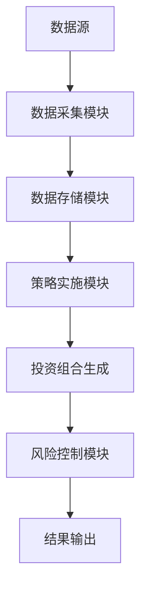

                 


```markdown
# 如何将特价股票策略融入指数增强型投资

> 关键词：特价股票策略，指数增强型投资，资产定价模型，夏普比率，均值回归，动量策略，系统架构

> 摘要：本文详细探讨了如何将特价股票策略融入指数增强型投资，通过理论分析、算法设计、系统架构和实战案例，系统地阐述了两者结合的原理、方法和应用。

---

## 第一部分: 背景与基础

### 第1章: 特价股票策略概述

#### 1.1 特价股票的定义与特点
- 1.1.1 特价股票的定义
  - 特价股票是指在特定市场条件下，价格被低估的股票。
  - 通常表现为市盈率、市净率等估值指标低于行业平均水平。
- 1.1.2 特价股票的特点
  - 价格低估，具有较高的安全边际。
  - 可能存在短期市场波动带来的投资机会。
  - 适合长期持有，追求价值回归。
- 1.1.3 特价股票的分类
  - 按行业分类：金融、科技、消费等。
  - 按市值分类：小盘、中盘、大盘。
  - 按估值指标分类：低市盈率、低市净率、高股息率。

#### 1.2 指数增强型投资的定义与特点
- 1.2.1 指数增强型投资的定义
  - 指数增强型投资是一种主动管理的投资策略，旨在通过主动管理超越基准指数的表现。
  - 通常以沪深300、标普500等指数为基准。
- 1.2.2 指数增强型投资的特点
  - 风险可控：通过跟踪指数分散个股风险。
  - 收益增强：通过主动管理获取超额收益。
  - 成本较低：相比主动管理基金，指数增强型产品的管理费率较低。
- 1.2.3 指数增强型投资的优势
  - 长期收益稳定：通过指数化投资降低波动性。
  - 分散风险：投资于多个行业和公司，降低个股风险。
  - 简单易懂：投资者只需选择合适的指数增强产品即可。

#### 1.3 特价股票策略与指数增强型投资的结合
- 1.3.1 结合的意义
  - 提高投资组合的超额收益。
  - 利用特价股票的低估特性，增强组合的收益潜力。
- 1.3.2 结合的可行性
  - 指数增强型投资需要主动管理，可以融入特价股票策略。
  - 特价股票策略需要长期持有，适合指数增强型投资的长期策略。
- 1.3.3 结合的挑战
  - 市场波动可能导致策略失效。
  - 特价股票的识别和选择需要较高的研究能力。
  - 需要平衡短期收益和长期价值。

---

## 第二部分: 理论基础与策略制定

### 第2章: 资产定价模型与风险收益平衡

#### 2.1 资产定价模型
- 2.1.1 均值-方差模型
  - 投资组合的最优配置需要在收益和风险之间找到平衡。
  - 使用方差衡量风险，期望收益最大化。
- 2.1.2 资本资产定价模型（CAPM）
  - CAPM公式：$$ E(R_i) = R_f + \beta_i (R_m - R_f) $$
  - R_f：无风险利率
  - R_m：市场预期收益率
  - β：个股的贝塔系数，衡量个股的系统性风险。
- 2.1.3 Fama-French三因子模型
  - 在CAPM基础上加入市值因子和动量因子。
  - $$ E(R_i) = R_f + \beta_i (R_m - R_f) + 0.3 SMB + 0.3 HML $$

#### 2.2 风险收益平衡
- 2.2.1 风险调整后的收益
  - 使用夏普比率衡量投资组合的风险调整后收益。
  - 夏普比率公式：$$ \text{夏普比率} = \frac{E[R_p - R_f]}{\sigma_p} $$
  - E[R_p - R_f]：投资组合的超额收益
  - σ_p：投资组合的收益波动率
- 2.2.2 风险分层与收益预测
  - 根据个股的贝塔系数和行业特性进行风险调整。
  - 通过历史数据分析，预测个股的潜在收益。
- 2.2.3 风险与收益的动态平衡
  - 定期调整投资组合，保持风险收益平衡。
  - 根据市场变化，动态优化投资组合。

### 第3章: 特价股票策略的核心概念

#### 3.1 特价股票的市场分析
- 3.1.1 市场趋势分析
  - 使用技术分析和基本面分析判断市场趋势。
  - 通过移动平均线、MACD等技术指标预测市场走势。
- 3.1.2 市场情绪分析
  - 使用市场情绪指标，如恐慌指数、投资者情绪指数等。
  - 通过新闻、社交媒体等数据源分析市场情绪。
- 3.1.3 市场波动性分析
  - 使用波动率指标，如标准差、VIX指数等。
  - 波动率高的市场可能蕴含更多机会。

#### 3.2 特价股票的估值方法
- 3.2.1 市盈率法
  - 市盈率（P/E）= 股价 / 每股收益
  - 低于行业平均市盈率的股票具有吸引力。
- 3.2.2 市净率法
  - 市净率（P/B）= 股价 / 每股净资产
  - 低于行业平均市净率的股票具有吸引力。
- 3.2.3 股息率法
  - 股息率 = 每股股息 / 股价
  - 高股息率的股票可能具有吸引力。

### 第4章: 策略制定与优化

#### 4.1 策略目标设定
- 4.1.1 短期目标
  - 利用市场波动，快速捕捉低估股票的反弹机会。
- 4.1.2 中期目标
  - 通过持有低估股票，实现价值回归带来的收益。
- 4.1.3 长期目标
  - 构建一个低估值、高成长的股票组合，实现长期超额收益。

#### 4.2 策略实施步骤
- 4.2.1 数据收集与清洗
  - 收集历史价格、财务数据、行业数据等。
  - 清洗数据，处理缺失值和异常值。
- 4.2.2 策略开发与回测
  - 使用历史数据回测策略，验证策略的有效性。
  - 计算回测结果的收益、风险指标。
- 4.2.3 风险控制与优化
  - 设置止损点，控制单只股票的仓位。
  - 根据市场变化，动态调整投资组合。

---

## 第三部分: 算法与数学模型

### 第5章: 算法与数学模型

#### 5.1 算法原理
- 5.1.1 均值回归策略
  - 基于均值回归理论，寻找价格偏离长期趋势的股票。
  - 使用Z-score指标衡量个股偏离程度。
- 5.1.2 动量策略
  - 选择过去一段时间表现优异的股票，继续持有。
  - 使用动量因子作为选股依据。

#### 5.2 数学模型
- 5.2.1 均值回归模型
  - 使用Z-score公式：$$ Z = \frac{X - \mu}{\sigma} $$
  - X：当前价格
  - μ：历史平均价格
  - σ：历史价格标准差
- 5.2.2 动量模型
  - 使用动量因子：$$ \text{动量因子} = \frac{R_{n-1} + R_{n-2} + \dots + R_{n-12}}{12} $$
  - R表示过去12个月的收益。

#### 5.3 算法实现
- 5.3.1 数据预处理
  - 收集并清洗数据，确保数据的完整性和准确性。
- 5.3.2 策略回测
  - 使用历史数据回测策略，计算收益和风险指标。
- 5.3.3 模型优化
  - 调整参数，优化策略表现。

---

## 第四部分: 系统分析与架构设计

### 第6章: 系统架构与设计

#### 6.1 系统功能设计
- 6.1.1 数据采集模块
  - 采集市场数据，包括价格、财务数据等。
- 6.1.2 策略实施模块
  - 根据策略筛选股票，生成投资组合。
- 6.1.3 风险控制模块
  - 实时监控市场风险，调整投资组合。

#### 6.2 系统架构图


#### 6.3 接口设计
- 6.3.1 数据接口
  - 提供REST API接口，方便数据交互。
- 6.3.2 策略接口
  - 提供策略参数配置接口，支持定制化策略。

---

## 第五部分: 项目实战与案例分析

### 第7章: 项目实战

#### 7.1 环境配置
- 7.1.1 数据源选择
  - 使用公开的股票数据，如Yahoo Finance、Wind等。
- 7.1.2 工具安装
  - 安装Python，使用Pandas、NumPy等库。
  - 使用Jupyter Notebook进行数据分析和可视化。

#### 7.2 核心代码实现
- 7.2.1 数据采集
  ```python
  import pandas as pd
  import numpy as np

  def get_data(ticker, start, end):
      # 获取股票数据
      data = pd.DataFrame()
      return data
  ```

- 7.2.2 策略回测
  ```python
  def backtest策略(策略参数):
      # 回测策略实现
      pass
  ```

- 7.2.3 风险控制
  ```python
  def risk_control(投资组合):
      # 风险控制策略
      pass
  ```

#### 7.3 案例分析
- 7.3.1 数据分析与策略选择
  - 通过数据分析，选择低估股票。
- 7.3.2 投资组合构建
  - 根据策略生成投资组合，计算收益和风险指标。
- 7.3.3 策略优化与调整
  - 根据回测结果，优化策略参数，提升收益。

---

## 第六部分: 总结与展望

### 第8章: 最佳实践与注意事项

#### 8.1 最佳实践
- 定期调整投资组合，保持策略的有效性。
- 严格控制风险，避免过度集中。
- 结合市场环境，灵活调整策略。

#### 8.2 注意事项
- 避免过度依赖单一策略，应结合多种策略。
- 注意市场风险，避免在极端市场条件下盲目操作。
- 定期回顾策略表现，及时调整。

### 第9章: 小结与展望

#### 9.1 小结
- 本文详细探讨了如何将特价股票策略融入指数增强型投资。
- 通过理论分析、算法设计、系统架构和实战案例，系统地阐述了两者结合的原理和方法。

#### 9.2 未来展望
- 结合人工智能技术，进一步优化策略。
- 研究更多的策略组合，提升投资收益。
- 探索更多的市场机会，实现长期超额收益。

---

## 作者

作者：AI天才研究院/AI Genius Institute & 禅与计算机程序设计艺术 /Zen And The Art of Computer Programming

---

### END
```

