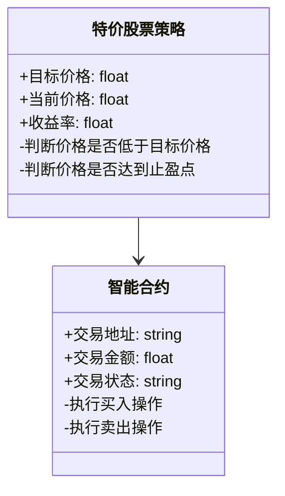
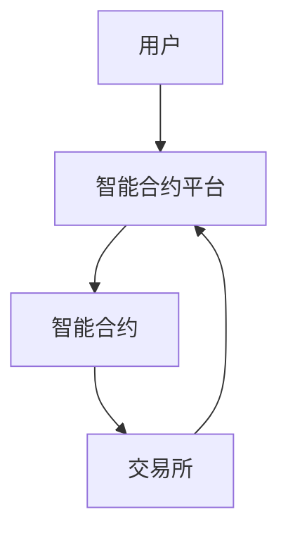
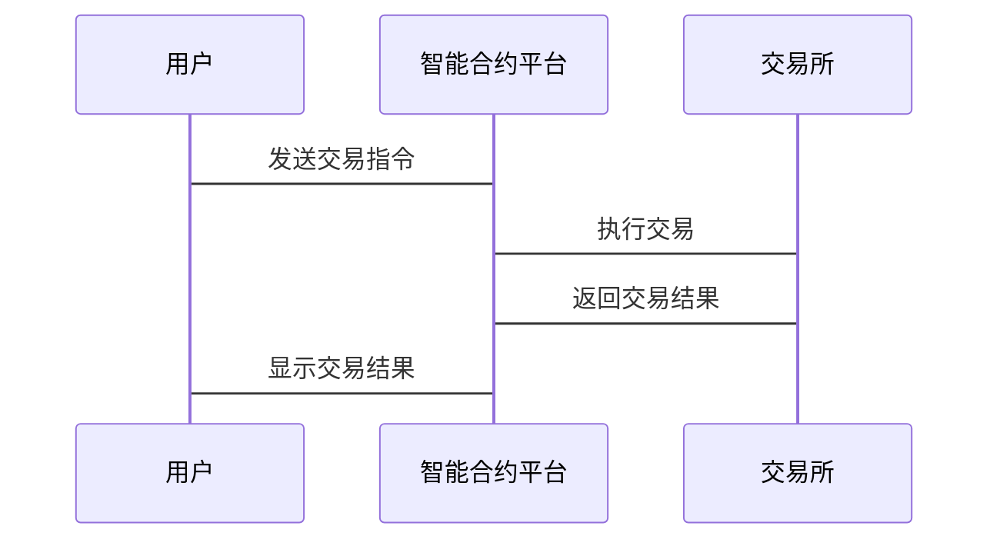

                 


# 如何将特价股票策略融入智能合约自动化投资

## 关键词：智能合约, 特价股票, 自动化投资, 去中心化金融, 区块链技术

## 摘要：  
本文详细探讨了如何将特价股票策略与智能合约相结合，实现自动化投资。文章首先介绍了特价股票策略的核心原理和智能合约的基本概念，然后分析了两者结合的必要性和实现方法。通过详细讲解智能合约的算法原理、系统架构设计和项目实战，本文为读者提供了一套完整的解决方案，帮助投资者利用区块链技术实现高效、自动化的股票投资。

---

# 第1章: 特价股票策略与智能合约概述

## 1.1 特价股票策略的定义与特点

### 1.1.1 特价股票策略的定义  
特价股票策略是一种基于市场波动和股票价格分析的投资策略，旨在通过识别价格异常波动的股票，以低于市场价买入，待价格回升后卖出，从而实现盈利。  

### 1.1.2 特价股票策略的核心特点  
- **价格敏感性**：依赖于股票价格的波动，寻找价格被低估的股票。  
- **自动化执行**：通过预设条件自动触发买卖指令。  
- **风险管理**：通过设定止损点和止盈点，控制投资风险。  

### 1.1.3 特价股票策略与传统投资策略的对比  

| 特性          | 特价股票策略                | 传统投资策略              |
|---------------|-----------------------------|---------------------------|
| 执行方式      | 自动化触发                  | 人工决策                  |
| 响应速度      | 实时执行                    | 较慢                      |
| 风险控制      | 系统自动管理                | 需要人工干预              |

---

## 1.2 智能合约的基本概念

### 1.2.1 智能合约的定义  
智能合约是一种基于区块链的自动执行程序，能够根据预设的条件自动执行和管理交易。它运行在区块链节点上，无需中心化机构的干预。  

### 1.2.2 智能合约的核心特点  
- **去中心化**：无需依赖中心化机构。  
- **自动执行**：根据预设条件自动触发操作。  
- **透明性**：代码公开透明，可追溯。  

### 1.2.3 智能合约在区块链中的作用  
智能合约是区块链生态系统的核心，广泛应用于金融、法律和商业领域，能够实现自动化交易、支付和合约管理。  

---

## 1.3 自动化投资的背景与意义

### 1.3.1 自动化投资的定义  
自动化投资是指通过预设的算法和策略，自动执行买卖指令的投资方式。  

### 1.3.2 自动化投资的优势  
- **高效性**：实时监控市场，快速执行交易。  
- **稳定性**：减少人为情绪干扰，确保策略严格执行。  
- **可扩展性**：支持大规模投资和多种策略的组合应用。  

### 1.3.3 特价股票策略与自动化投资的结合  
通过将特价股票策略融入智能合约，投资者可以实现自动化、高效的股票交易，同时利用区块链技术确保交易的安全性和透明性。  

---

## 1.4 本章小结  
本章介绍了特价股票策略和智能合约的基本概念，并分析了两者结合的背景和意义。通过对比传统投资策略和自动化投资的差异，我们明确了智能合约在自动化投资中的重要性。

---

# 第2章: 特价股票策略的核心原理

## 2.1 特价股票策略的基本原理

### 2.1.1 特价股票的定义  
特价股票是指价格被市场低估，具有较大上涨潜力的股票。  

### 2.1.2 特价股票的识别方法  
- **相对价值分析**：比较股票的市盈率、市净率等指标，寻找低估股票。  
- **技术分析**：通过K线图、均线等技术指标识别价格底部。  
- **市场情绪分析**：利用市场情绪指标判断股票的买卖时机。  

### 2.1.3 特价股票的投资逻辑  
- **买入时机**：当股票价格低于其内在价值时买入。  
- **卖出时机**：当股票价格达到预设的止盈点时卖出。  

---

## 2.2 智能合约在股票交易中的应用

### 2.2.1 智能合约在股票交易中的作用  
智能合约可以自动执行股票买卖指令，确保交易的安全性和及时性。  

### 2.2.2 智能合约的执行流程  
1. 监测市场数据。  
2. 判断是否满足预设条件。  
3. 执行交易指令。  
4. 记录交易结果。  

### 2.2.3 智能合约与传统交易方式的对比  

| 特性          | 智能合约                | 传统交易                |
|---------------|-------------------------|-------------------------|
| 执行效率      | 高                      | 低                      |
| 成交速度      | 实时                    | 较慢                    |
| 成本           | 低                      | 高                      |

---

## 2.3 特价股票策略与智能合约的结合

### 2.3.1 特价股票策略如何融入智能合约  
- **数据输入**：智能合约接收市场数据，判断是否符合特价股票的条件。  
- **触发交易**：当满足条件时，智能合约自动执行买卖指令。  
- **风险管理**：设定止损和止盈点，确保投资安全。  

### 2.3.2 智能合约如何实现自动化投资  
- **数据采集**：通过API获取实时股票数据。  
- **策略执行**：根据预设策略自动触发交易。  
- **记录与反馈**：记录交易结果并提供反馈。  

### 2.3.3 特价股票策略在智能合约中的实现细节  
- **数据源**：支持多种数据源，包括交易所API和第三方数据服务。  
- **触发条件**：支持多种触发条件，如价格波动、成交量变化等。  
- **执行机制**：支持多种执行方式，如限价单、市价单等。  

---

## 2.4 本章小结  
本章详细讲解了特价股票策略的核心原理，并分析了智能合约在股票交易中的应用。通过结合两者的优点，我们提出了将特价股票策略融入智能合约的具体方法。

---

# 第3章: 智能合约与特价股票策略的核心概念与联系

## 3.1 智能合约的核心概念

### 3.1.1 智能合约的执行环境  
智能合约运行在区块链网络中，由多个节点共同维护。  

### 3.1.2 智能合约的编程语言  
常用的智能合约编程语言包括Solidity、Vyper等。  

### 3.1.3 智能合约的安全性  
智能合约的安全性依赖于代码的正确性和区块链网络的去中心化特性。  

---

## 3.2 特价股票策略的核心概念

### 3.2.1 特价股票的识别标准  
- **估值指标**：市盈率、市净率等。  
- **技术指标**：均线、RSI等。  

### 3.2.2 特价股票的投资策略  
- **长期投资**：买入并持有，等待价值回归。  
- **短期投资**：快速买入，短线获利。  

### 3.2.3 特价股票的风险控制  
- **止损策略**：设定止损点，避免重大损失。  
- **分散投资**：通过投资多种股票降低风险。  

---

## 3.3 智能合约与特价股票策略的联系

### 3.3.1 智能合约如何实现特价股票策略  
- **数据处理**：智能合约接收并分析股票数据。  
- **条件判断**：根据预设条件判断是否触发交易。  
- **交易执行**：自动执行买卖指令。  

### 3.3.2 智能合约在特价股票策略中的优势  
- **自动化**：减少人工干预，提高交易效率。  
- **透明性**：交易记录可追溯，确保公平公正。  
- **安全性**：区块链技术确保交易安全。  

### 3.3.3 特价股票策略与智能合约的结合案例  
某投资者通过智能合约设置条件，当某股票的价格低于其估值指标时自动买入，当价格达到目标价时自动卖出，从而实现自动化投资。

---

## 3.4 本章小结  
本章分析了智能合约和特价股票策略的核心概念，并探讨了两者的联系与结合方式。通过具体案例，我们展示了智能合约在实现特价股票策略中的潜力和优势。

---

# 第4章: 智能合约与特价股票策略的算法原理

## 4.1 智能合约的算法原理

### 4.1.1 智能合约的执行流程  
1. 接收外部输入（如市场数据）。  
2. 调用智能合约函数进行处理。  
3. 根据处理结果触发相应操作（如交易）。  

### 4.1.2 智能合约的事件  
- **交易事件**：记录交易的具体信息。  
- **状态更新**：更新智能合约的状态。  

### 4.1.3 智能合约的代码实现  
```python
def buy_stock(price, target_price):
    if price < target_price:
        execute_buy()
    else:
        do NOTHING
```

---

## 4.2 特价股票策略的算法步骤

### 4.2.1 特价股票的识别算法  
- **输入**：实时股票价格。  
- **处理**：计算估值指标，判断是否低于目标价格。  
- **输出**：触发买入信号。  

### 4.2.2 特价股票的交易逻辑  
- **买入条件**：价格低于目标价。  
- **卖出条件**：价格达到止盈点或触发止损点。  

### 4.2.3 特价股票策略的数学模型  
$$ \text{买入条件} = \text{当前价格} < \text{目标价格} $$  
$$ \text{卖出条件} = \text{当前价格} > \text{目标价格} \times (1 + \text{收益率}) $$  

---

## 4.3 智能合约与特价股票策略的结合算法  

### 4.3.1 智能合约的触发条件  
- **价格波动**：当股票价格低于目标价时触发买入。  
- **价格回升**：当股票价格达到止盈点时触发卖出。  

### 4.3.2 智能合约的交易流程  
1. 监测市场数据。  
2. 判断是否满足买入条件。  
3. 如果满足，执行买入操作。  
4. 监测市场数据。  
5. 判断是否满足卖出条件。  
6. 如果满足，执行卖出操作。  

---

## 4.4 本章小结  
本章详细讲解了智能合约和特价股票策略的算法原理，并展示了两者的结合方式。通过具体的代码示例和数学公式，我们明确了智能合约在实现特价股票策略中的技术细节。

---

# 第5章: 智能合约与特价股票策略的系统分析与架构设计

## 5.1 项目背景与目标

### 5.1.1 项目背景  
本项目旨在通过智能合约实现特价股票策略的自动化投资，提高投资效率和安全性。  

### 5.1.2 项目目标  
- 实现智能合约与股票交易的无缝对接。  
- 提供一个安全、透明的自动化投资平台。  

---

## 5.2 系统功能设计

### 5.2.1 领域模型设计  


### 5.2.2 系统功能模块  
- 数据采集模块：采集实时股票数据。  
- 策略执行模块：根据预设策略自动触发交易。  
- 交易记录模块：记录交易历史和结果。  

---

## 5.3 系统架构设计

### 5.3.1 系统架构图  


### 5.3.2 系统接口设计  
- 用户接口：接收用户输入和显示交易结果。  
- 智能合约接口：与交易所交互，执行交易指令。  

### 5.3.3 系统交互流程  


---

## 5.4 本章小结  
本章分析了系统的背景和目标，设计了系统的功能模块和架构图。通过系统的交互流程，我们明确了智能合约与特价股票策略结合的实现方式。

---

# 第6章: 智能合约与特价股票策略的项目实战

## 6.1 项目环境安装

### 6.1.1 安装以太坊开发环境  
- 下载并安装以太坊节点。  
- 安装Solidity编程语言和编译工具。  

### 6.1.2 安装股票数据接口  
- 使用第三方API获取实时股票数据。  

---

## 6.2 系统核心实现

### 6.2.1 智能合约的核心代码  
```solidity
// SPDX-License-Identifier: MIT
pragma solidity ^0.8.0;

contract StockTrader {
    address payable public owner;
    uint256 public targetPrice;
    uint256 public currentPrice;

    constructor(uint256 _targetPrice) {
        owner = payable(msg.sender);
        targetPrice = _targetPrice;
    }

    function buyStock(uint256 _currentPrice) public {
        if (_currentPrice < targetPrice) {
            owner.transfer(msg.value);
        }
    }

    function sellStock(uint256 _currentPrice) public {
        if (_currentPrice > targetPrice) {
            owner.transfer(msg.value);
        }
    }
}
```

### 6.2.2 特价股票策略的实现代码  
```python
import requests

def get_stock_price(symbol):
    response = requests.get(f"https://api.example.com/stock/{symbol}")
    return response.json()['price']

def execute_trade(symbol, price, target_price):
    if price < target_price:
        buy_stock(symbol, target_price)
    elif price > target_price * 1.1:
        sell_stock(symbol, target_price)

def main():
    symbol = "AAPL"
    target_price = 100
    price = get_stock_price(symbol)
    execute_trade(symbol, price, target_price)

if __name__ == "__main__":
    main()
```

---

## 6.3 项目运行与测试

### 6.3.1 环境配置  
- 配置智能合约的交易地址和API密钥。  
- 设置目标价格和止损点。  

### 6.3.2 系统运行  
运行Python脚本，智能合约自动执行交易指令。  

### 6.3.3 测试结果分析  
- 记录交易历史和收益情况。  
- 分析策略的有效性和风险控制。  

---

## 6.4 本章小结  
本章通过具体的代码实现，展示了如何将特价股票策略融入智能合约的自动化投资中。通过项目的运行与测试，我们验证了策略的有效性和系统的稳定性。

---

# 第7章: 智能合约与特价股票策略的优化与展望

## 7.1 系统优化建议

### 7.1.1 性能优化  
- 提高数据采集速度和交易执行效率。  
- 优化智能合约的代码逻辑，减少交易延迟。  

### 7.1.2 功能扩展  
- 支持多种股票策略的组合应用。  
- 引入机器学习算法，提高策略的智能化水平。  

---

## 7.2 未来展望

### 7.2.1 技术发展  
随着区块链技术的不断发展，智能合约将更加智能化和高效化。  

### 7.2.2 应用场景  
智能合约与特价股票策略的结合将推动金融行业的自动化和智能化发展。  

---

## 7.3 本章小结  
本章提出了系统的优化建议，并展望了未来的发展方向。通过不断的技术创新和应用扩展，智能合约与特价股票策略的结合将为投资者带来更高效、更安全的投资体验。

---

# 作者：AI天才研究院/AI Genius Institute & 禅与计算机程序设计艺术/Zen And The Art of Computer Programming

