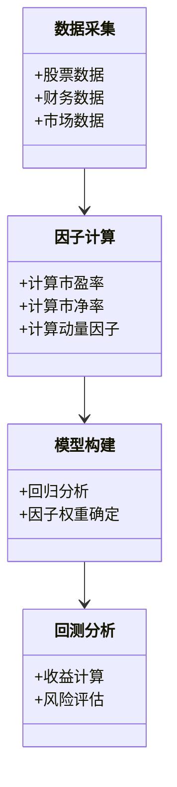
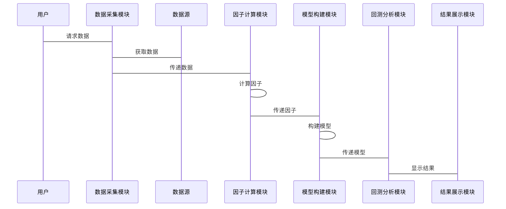

                 


# 如何构建基于特价股票的多因子投资模型

## 关键词
多因子投资模型, 特价股票, 量化投资, 股票分析, 金融建模

## 摘要
本文详细讲解了如何构建基于特价股票的多因子投资模型，从背景介绍、核心概念、算法原理到系统设计、项目实战，层层深入，帮助读者掌握多因子投资模型的构建方法。通过实际案例分析和代码实现，本文为读者提供了从理论到实践的完整指导，适用于金融从业者、学生和投资者。

---

# 第1章: 特价股票与多因子投资模型的背景与概念

## 1.1 特价股票的定义与特点
### 1.1.1 特价股票的定义
特价股票是指价格低于其内在价值，具有潜在投资价值的股票。这类股票通常被市场低估，可能因为市场情绪、短期波动或其他因素导致价格偏离其真实价值。

### 1.1.2 特价股票的特点
| 特性 | 描述 |
|------|------|
| 低估值 | 市盈率、市净率等指标低于行业平均水平 |
| 高分红 | 相对于股价，股息率较高 |
| 高质量 | 公司财务状况健康，具备持续盈利能力 |

### 1.1.3 特价股票的投资价值
- **低估值**：特价股票通常具有较高的安全边际，风险较低。
- **高回报潜力**：一旦市场重新发现其价值，股价可能大幅回升。
- **防御性**：在市场下跌时，低估值股票可能表现相对稳定。

## 1.2 多因子投资模型的背景
### 1.2.1 传统投资模型的局限性
- **单一因子模型**：仅考虑单一因素（如市盈率），无法全面反映股票价值。
- **忽略市场波动**：无法解释市场短期波动对股票价格的影响。
- **局限性**：无法捕捉多维度的投资机会。

### 1.2.2 多因子模型的兴起
- **数据驱动**：随着大数据技术的发展，多因子模型逐渐兴起。
- **量化投资**：通过量化方法捕捉多维度投资机会，提高投资效率。
- **学术研究**：多因子模型在学术界得到了广泛研究和验证。

### 1.2.3 多因子模型在股票投资中的优势
- **多维度分析**：通过多个因子（如市盈率、市净率、股息率等）全面分析股票价值。
- **分散风险**：通过多个因子的综合考虑，降低单一因子波动带来的风险。
- **提高收益**：通过优化因子组合，提升投资收益。

## 1.3 多因子投资模型的核心概念
### 1.3.1 多因子模型的定义
多因子模型是一种通过多个因子（如市值、价值、动量等）来解释股票收益的模型。它通过综合考虑多个因子，捕捉股票价格的波动规律。

### 1.3.2 多因子模型的核心要素
| 要素 | 描述 |
|------|------|
| 因子 | 影响股票收益的因素，如市盈率、市净率、动量等 |
| 因子权重 | 每个因子在模型中的重要性 |
| 模型构建 | 将因子综合起来，构建股票收益预测模型 |

### 1.3.3 多因子模型的分类
- **基于统计的多因子模型**：通过统计方法提取因子，如Fama-French三因子模型。
- **基于机器学习的多因子模型**：利用机器学习算法（如随机森林、神经网络）构建因子模型。
- **混合型模型**：结合统计和机器学习方法的多因子模型。

## 1.4 本章小结
本章介绍了特价股票的基本概念及其投资价值，探讨了多因子投资模型的背景和优势，并总结了多因子模型的核心概念和分类。

---

# 第2章: 多因子投资模型的核心原理

## 2.1 多因子模型的原理
### 2.1.1 多因子模型的基本假设
- 股票收益可以被多个因子解释。
- 每个因子对股票收益的贡献可以通过回归分析确定。

### 2.1.2 多因子模型的数学表达
$$ R_i = \beta_0 + \beta_1 F_1 + \beta_2 F_2 + ... + \beta_n F_n + \epsilon $$
其中，$R_i$ 是股票i的收益，$F_j$ 是因子j，$\beta_j$ 是因子j的系数，$\epsilon$ 是误差项。

### 2.1.3 多因子模型的实现步骤
1. **数据收集**：收集股票的历史价格、财务数据等。
2. **因子选择**：筛选出影响股票收益的因子。
3. **因子权重确定**：通过回归分析确定每个因子的权重。
4. **模型构建**：构建多因子回归模型。
5. **模型验证**：通过回测验证模型的性能。

## 2.2 多因子模型的因子选择
### 2.2.1 常见因子的分类
| 类别 | 示例因子 |
|------|----------|
| 价值因子 | 市盈率（P/E）、市净率（P/B） |
| 动量因子 | 过去12个月的收益率 |
| 股息因子 | 股息率（Dividend Yield） |
| 市场因子 | 市场指数收益 |

### 2.2.2 因子选择的标准
- **相关性**：因子之间应尽量低相关，避免多重共线性。
- **稳定性**：因子在不同时间段内表现稳定。
- **可解释性**：因子应具有明确的经济意义。

### 2.2.3 因子权重的确定
- **等权分配**：每个因子权重相等。
- **回归权重**：通过回归分析确定每个因子的权重。
- **风险中性化**：根据因子的风险调整权重。

## 2.3 多因子模型的优缺点
### 2.3.1 多因子模型的优点
- **分散风险**：通过多个因子的综合考虑，降低单一因子波动带来的风险。
- **捕捉多维度信息**：能够捕捉多个因子对股票收益的影响。
- **提高收益**：通过优化因子组合，提升投资收益。

### 2.3.2 多因子模型的缺点
- **复杂性**：模型构建和维护较为复杂。
- **数据需求**：需要大量的历史数据支持。
- **计算成本**：因子计算和模型优化需要较高的计算资源。

### 2.3.3 多因子模型的应用场景
- **长期投资**：适合用于长期投资策略。
- **短期交易**：可以通过调整因子权重，适应短期市场波动。
- **风险管理**：通过多因子模型分散投资风险。

## 2.4 本章小结
本章详细讲解了多因子投资模型的核心原理，包括模型的数学表达、因子选择标准、因子权重确定方法，以及模型的优缺点和应用场景。

---

# 第3章: 多因子模型的算法原理

## 3.1 多因子模型的数学公式
### 3.1.1 多因子模型的线性回归公式
$$ R_i = \beta_0 + \beta_1 F_1 + \beta_2 F_2 + ... + \beta_n F_n + \epsilon $$
其中，$\beta_j$ 是因子j的回归系数，$\epsilon$ 是误差项。

### 3.1.2 因子权重的计算公式
$$ w_i = \frac{1}{\sum_{j=1}^{n} |F_{ij}|} $$
其中，$w_i$ 是股票i的权重，$F_{ij}$ 是因子j的值。

## 3.2 多因子模型的实现步骤
### 3.2.1 数据收集与预处理
- **数据收集**：收集股票的历史价格、财务数据等。
- **数据清洗**：处理缺失值、异常值等。
- **数据标准化**：对数据进行标准化处理，确保不同因子具有可比性。

### 3.2.2 因子选择
- **相关性分析**：计算因子之间的相关性，剔除高度相关的因子。
- **因子筛选**：根据因子的表现（如历史收益、稳定性等）筛选出优质因子。

### 3.2.3 模型构建
- **回归分析**：通过线性回归确定每个因子的回归系数。
- **因子权重确定**：根据回归系数确定因子权重。

### 3.2.4 模型验证
- **回测**：通过历史数据验证模型的收益和风险表现。
- **绩效评估**：计算模型的夏普比率、最大回撤等绩效指标。

## 3.3 代码实现
### 3.3.1 数据导入与预处理
```python
import pandas as pd
import numpy as np

# 数据导入
data = pd.read_csv('stock_data.csv')

# 数据清洗
data.dropna(inplace=True)
data = data.iloc[:100]  # 取前100条数据
```

### 3.3.2 因子选择与计算
```python
# 计算市盈率（P/E）
data['PE'] = data['Price'] / data['Earnings']

# 计算市净率（P/B）
data['PB'] = data['Price'] / data['Book Value']

# 计算动量因子（过去12个月的收益率）
data['Momentum'] = data['Price'].pct_change().rolling(12).mean()
```

### 3.3.3 模型构建与回归分析
```python
from sklearn.linear_model import LinearRegression

# 选取因子
X = data[['PE', 'PB', 'Momentum']]
y = data['Return']

# 线性回归
model = LinearRegression()
model.fit(X, y)

# 回归系数
print(model.coef_)
```

## 3.4 数学公式与代码解读
### 3.4.1 回归分析公式
$$ y = \beta_0 + \beta_1 x_1 + \beta_2 x_2 + ... + \beta_n x_n + \epsilon $$
其中，$y$ 是目标变量（股票收益），$x_j$ 是因子，$\beta_j$ 是回归系数。

### 3.4.2 代码实现
- **数据导入与预处理**：使用Pandas导入数据，并清洗数据。
- **因子计算**：计算市盈率、市净率、动量因子等。
- **回归分析**：使用Scikit-learn库进行线性回归分析，确定因子的回归系数。

## 3.5 本章小结
本章通过数学公式和代码实现，详细讲解了多因子投资模型的算法原理，包括数据预处理、因子选择、模型构建和回归分析的实现步骤。

---

# 第4章: 系统分析与架构设计

## 4.1 项目场景介绍
- **目标**：构建一个基于特价股票的多因子投资模型。
- **用户**：投资者、基金公司、量化研究员。
- **功能需求**：数据采集、因子计算、模型构建、回测分析。

## 4.2 系统功能设计
### 4.2.1 领域模型（Mermaid 类图）


### 4.2.2 系统架构设计（Mermaid 架构图）
```mermaid
container 数据源 {
    数据采集模块
    数据存储模块
}
container 处理模块 {
    因子计算模块
    模型构建模块
}
container 输出模块 {
    回测分析模块
    结果展示模块
}
```

### 4.2.3 系统接口设计
- **数据接口**：从数据库或API获取数据。
- **计算接口**：因子计算接口、模型构建接口。
- **展示接口**：回测结果展示接口。

### 4.2.4 系统交互流程（Mermaid 序列图）


## 4.3 本章小结
本章通过系统分析与架构设计，详细介绍了多因子投资模型的项目场景、功能需求、系统架构和接口设计，为后续的代码实现提供了理论基础。

---

# 第5章: 项目实战

## 5.1 环境安装
```bash
pip install pandas numpy scikit-learn matplotlib
```

## 5.2 核心代码实现
### 5.2.1 数据采集与预处理
```python
import pandas as pd
import numpy as np

# 数据导入
data = pd.read_csv('stock_data.csv')

# 数据清洗
data.dropna(inplace=True)
data = data.iloc[:100]
```

### 5.2.2 因子计算
```python
# 计算市盈率
data['PE'] = data['Price'] / data['Earnings']

# 计算市净率
data['PB'] = data['Price'] / data['Book Value']

# 计算动量因子
data['Momentum'] = data['Price'].pct_change().rolling(12).mean()
```

### 5.2.3 模型构建与回归分析
```python
from sklearn.linear_model import LinearRegression

# 选取因子
X = data[['PE', 'PB', 'Momentum']]
y = data['Return']

# 线性回归
model = LinearRegression()
model.fit(X, y)

# 回归系数
print(model.coef_)
```

## 5.3 案例分析与详细讲解
### 5.3.1 数据来源
- 数据来源：假设我们使用了某家股票交易平台提供的历史数据。

### 5.3.2 数据分析
- 计算各因子的回归系数，确定每个因子对股票收益的贡献。

### 5.3.3 模型优化
- 通过调整因子权重，优化模型的收益和风险表现。

## 5.4 本章小结
本章通过实际案例分析，详细讲解了多因子投资模型的代码实现和项目实战，帮助读者掌握从理论到实践的全过程。

---

# 第6章: 模型优化与改进

## 6.1 模型优化方法
### 6.1.1 因子筛选优化
- **特征选择**：使用Lasso回归进行特征选择，剔除不重要的因子。
- **因子轮换**：根据市场变化，动态调整因子组合。

### 6.1.2 参数优化
- **网格搜索**：通过网格搜索找到最佳参数组合。
- **随机搜索**：随机选取参数组合，寻找最优解。

### 6.1.3 风险管理优化
- **风险中性化**：根据因子的风险特性，调整因子权重。
- **止盈止损**：设定止盈和止损点，控制投资风险。

## 6.2 模型改进策略
### 6.2.1 动态调整因子权重
- 根据市场变化，动态调整因子权重，适应市场波动。

### 6.2.2 引入机器学习算法
- **随机森林**：使用随机森林进行因子筛选和模型构建。
- **神经网络**：利用神经网络捕捉复杂的非线性关系。

## 6.3 本章小结
本章探讨了多因子投资模型的优化与改进策略，包括因子筛选优化、参数优化、风险管理优化以及引入机器学习算法等方法，帮助读者进一步提升模型的性能和稳健性。

---

# 第7章: 最佳实践与小结

## 7.1 最佳实践
### 7.1.1 数据质量
- 确保数据的完整性和准确性，避免因数据问题导致模型误差。

### 7.1.2 因子选择
- 根据市场环境和投资目标，灵活选择和调整因子。

### 7.1.3 模型验证
- 通过回测和绩效评估，验证模型的有效性和稳健性。

## 7.2 投资策略与风险管理
### 7.2.1 投资策略
- **多因子组合投资**：通过组合多个因子，分散投资风险。
- **风险中性化投资**：根据因子风险特性，调整投资组合权重。

### 7.2.2 风险管理
- **止损与止盈**：设定止损点和止盈点，控制投资风险。
- **定期调整**：定期审查和调整投资组合，适应市场变化。

## 7.3 未来展望
- **人工智能**：引入更高级的人工智能算法，提升模型的预测能力。
- **大数据分析**：利用大数据技术，挖掘更多潜在的因子和投资机会。
- **动态调整**：开发实时监控系统，动态调整因子权重和投资组合。

## 7.4 本章小结
本章总结了多因子投资模型的最佳实践，提出了投资策略与风险管理的建议，并展望了未来的发展方向。

---

# 附录: 扩展阅读与参考文献

## 附录A: 数据来源与工具安装
- **数据来源**：建议使用 Yahoo Finance、Google Finance 等平台获取股票数据。
- **工具安装**：安装 Python、Pandas、NumPy、Scikit-learn 等工具。

## 附录B: 常用因子列表
- **价值因子**：市盈率、市净率。
- **动量因子**：过去12个月的收益率。
- **股息因子**：股息率。

## 附录C: 参考文献
- Fama, E. F., & French, K. R. (1993). Common risk factors in stock returns. Journal of Financial Economics, 33(1), 3-58.
- Campbell, J. Y., & Shiller, R. J. (1988). Stock prices, earnings, and expected dividends. Journal of Finance, 43(3), 661-690.

---

# 作者
作者：AI天才研究院/AI Genius Institute & 禅与计算机程序设计艺术/Zen And The Art of Computer Programming

---

# 结语
本文详细讲解了如何构建基于特价股票的多因子投资模型，从背景介绍、核心概念、算法原理到系统设计、项目实战，层层深入，帮助读者掌握多因子投资模型的构建方法。通过实际案例分析和代码实现，本文为读者提供了从理论到实践的完整指导，适用于金融从业者、学生和投资者。

