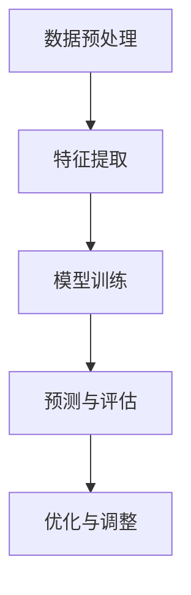

                 


# 如何构建基于特价股票的智能投顾系统

> 关键词：智能投顾，特价股票，机器学习，系统架构，股票预测

> 摘要：本文详细探讨了如何构建基于特价股票的智能投顾系统，从背景介绍、核心概念、算法原理到系统架构设计，再到项目实战和优化，全面解析了系统的构建过程。通过实际案例分析和代码实现，帮助读者掌握构建智能投顾系统的方法和技巧。

---

# 第1章：特价股票与智能投顾系统概述

## 1.1 特价股票的定义与特点

### 1.1.1 特价股票的定义

特价股票是指在特定时间内，价格低于正常市场价的股票。这些股票通常出现在市场波动、公司业绩不佳或特殊市场活动（如促销）时。特价股票的核心特点是价格波动大、风险高、收益潜力大。

### 1.1.2 特价股票的特点与分类

特价股票具有以下特点：
1. **价格波动性**：价格波动大，容易受市场情绪影响。
2. **高风险性**：由于价格波动大，投资风险较高。
3. **短期机会**：特价股票通常为短期投资机会，需快速决策。

特价股票可以分为以下几类：
- **市场波动型**：由于市场波动导致的价格下跌。
- **业绩不佳型**：公司业绩不佳导致的股价下跌。
- **促销活动型**：公司为吸引投资者而进行的促销活动。

### 1.1.3 特价股票的投资价值分析

投资特价股票需要考虑以下因素：
1. **市场趋势**：了解当前市场趋势，判断是否为买入时机。
2. **公司基本面**：分析公司的财务状况、盈利能力等基本面因素。
3. **技术分析**：通过技术指标（如K线图、均线）判断股票走势。

---

## 1.2 智能投顾的基本概念

### 1.2.1 智能投顾的定义

智能投顾是一种基于人工智能和大数据分析的投资顾问服务。它通过算法和模型，为投资者提供个性化的投资建议，帮助投资者做出更明智的投资决策。

### 1.2.2 智能投顾的核心功能与优势

智能投顾的核心功能包括：
1. **资产配置**：根据投资者的风险承受能力和投资目标，制定个性化的资产配置方案。
2. **风险评估**：通过数据分析，评估投资者的投资风险，并提供相应的风险管理策略。
3. **市场预测**：利用机器学习算法，预测市场走势，为投资者提供投资建议。

智能投顾的优势在于其高效性、精准性和可扩展性。它能够快速处理大量数据，提供实时的投资建议，同时可以根据市场变化动态调整投资策略。

### 1.2.3 智能投顾与传统投顾的区别

| 特性                | 智能投顾                              | 传统投顾                              |
|---------------------|--------------------------------------|--------------------------------------|
| 投顾方式            | 基于算法和数据驱动                   | 人工分析和建议                        |
| 服务效率            | 高效，实时响应                       | 低效，依赖人工                        |
| 投顾成本            | 成本低，适合大规模服务               | 成本高，服务范围有限                  |
| 投顾精准度          | 高，基于大数据分析                   | 较低，依赖人工经验                    |

---

## 1.3 特价股票智能投顾的背景与需求

### 1.3.1 特价股票市场的现状与趋势

随着市场的波动加剧，特价股票市场呈现出以下趋势：
1. **市场波动加剧**：全球经济不确定性增加，市场波动加剧。
2. **投资者需求多样化**：投资者对个性化投资建议的需求增加。
3. **技术驱动投资**：大数据和人工智能技术的应用越来越广泛。

### 1.3.2 智能投顾在特价股票中的应用前景

智能投顾在特价股票中的应用前景广阔：
1. **快速决策支持**：智能投顾可以帮助投资者快速做出买入或卖出决策。
2. **风险控制**：通过智能投顾，投资者可以更好地控制投资风险。
3. **个性化服务**：智能投顾可以根据投资者的个性化需求，提供定制化的投资建议。

### 1.3.3 投资者需求与系统目标

投资者对智能投顾的需求主要体现在以下方面：
- **实时数据分析**：快速获取市场数据，做出及时决策。
- **个性化投资建议**：根据自身风险偏好，获得定制化的投资建议。
- **风险管理**：通过智能投顾，降低投资风险。

系统目标是构建一个基于特价股票的智能投顾系统，为投资者提供高效、精准的投资建议。

---

## 1.4 本章小结

本章介绍了特价股票和智能投顾的基本概念，分析了特价股票的特点与分类，探讨了智能投顾的核心功能与优势，并总结了智能投顾在特价股票中的应用前景和系统目标。

---

# 第2章：智能投顾的核心概念与算法原理

## 2.1 智能投顾的核心概念

### 2.1.1 数据驱动的投顾模型

数据驱动的投顾模型是智能投顾的核心，它基于大量历史数据和实时数据，利用机器学习算法进行分析，为投资者提供投资建议。

### 2.1.2 机器学习在投顾中的应用

机器学习在智能投顾中的应用主要体现在以下方面：
1. **市场预测**：利用机器学习算法预测市场走势。
2. **风险评估**：通过机器学习模型评估投资风险。
3. **资产配置**：基于机器学习算法优化资产配置。

### 2.1.3 特价股票的特征提取与分析

特征提取与分析是智能投顾的关键步骤。通过对历史数据的分析，提取影响股票价格的关键特征，如成交量、市盈率、市净率等。

---

## 2.2 智能投顾的算法原理

### 2.2.1 机器学习算法在投顾中的应用

机器学习算法在智能投顾中的应用包括：
- **线性回归**：用于预测股票价格。
- **支持向量机（SVM）**：用于分类问题，如判断股票是否为特价股票。
- **随机森林**：用于特征重要性分析。

### 2.2.2 时间序列分析在股票预测中的作用

时间序列分析是股票预测的重要方法。常用的时间序列模型包括ARIMA、GARCH等。

#### 2.2.2.1 ARIMA模型

ARIMA（自回归积分滑动平均模型）是一种常用的时间序列预测模型。其数学公式为：

$$ ARIMA(p, d, q) $$

其中：
- \( p \) 是自回归阶数。
- \( d \) 是差分阶数。
- \( q \) 是移动平均阶数。

### 2.2.3 风险评估与投资组合优化

风险评估与投资组合优化是智能投顾的重要组成部分。常用的风险评估模型包括CAPM（资本资产定价模型）和APT（套利定价理论）。

#### 2.2.3.1 CAPM模型

CAPM模型用于评估资产的预期收益，其数学公式为：

$$ R_i = R_f + \beta_i (R_m - R_f) $$

其中：
- \( R_i \) 是资产的预期收益。
- \( R_f \) 是无风险利率。
- \( \beta_i \) 是资产的贝塔系数。
- \( R_m \) 是市场预期收益。

---

## 2.3 算法原理的数学模型与公式

### 2.3.1 线性回归模型

线性回归模型用于预测股票价格，其数学公式为：

$$ y = \beta_0 + \beta_1x + \epsilon $$

其中：
- \( y \) 是预测的股票价格。
- \( x \) 是自变量（如成交量）。
- \( \beta_0 \) 和 \( \beta_1 \) 是回归系数。
- \( \epsilon \) 是误差项。

### 2.3.2 时间序列模型（ARIMA）

ARIMA模型用于时间序列预测，其数学公式为：

$$ ARIMA(p, d, q) $$

### 2.3.3 风险评估模型（CAPM）

CAPM模型用于评估资产的预期收益，其数学公式为：

$$ R_i = R_f + \beta_i (R_m - R_f) $$

---

## 2.4 算法流程图

以下是智能投顾系统的算法流程图：



---

## 2.5 本章小结

本章详细介绍了智能投顾的核心概念和算法原理，包括数据驱动的投顾模型、机器学习在投顾中的应用、时间序列分析在股票预测中的作用以及风险评估与投资组合优化。

---

# 第3章：系统架构设计

## 3.1 系统功能模块划分

### 3.1.1 数据采集模块

数据采集模块负责采集市场数据，包括股票价格、成交量、市场指数等。

### 3.1.2 数据处理模块

数据处理模块对采集的数据进行清洗、转换和特征提取。

### 3.1.3 模型训练模块

模型训练模块利用机器学习算法对数据进行训练，生成预测模型。

### 3.1.4 预测与优化模块

预测与优化模块利用训练好的模型进行股票预测，并优化投资组合。

---

## 3.2 系统架构设计

### 3.2.1 分层架构设计

智能投顾系统的分层架构包括数据层、计算层、应用层和用户层。

### 3.2.2 微服务架构设计

采用微服务架构设计，将系统划分为多个独立的服务模块，如数据采集服务、模型训练服务、预测服务等。

### 3.2.3 数据流与服务交互设计

数据流与服务交互设计包括数据采集、数据处理、模型训练、预测与优化等环节。

---

## 3.3 系统架构图

以下是智能投顾系统的架构图：


---

## 3.4 本章小结

本章详细介绍了智能投顾系统的架构设计，包括功能模块划分和系统架构图。

---

# 第4章：项目实战与代码实现

## 4.1 环境搭建

### 4.1.1 安装Python

安装Python 3.x版本，并安装以下库：
- numpy
- pandas
- scikit-learn
- matplotlib

### 4.1.2 数据源获取

从金融数据API（如Yahoo Finance）获取历史数据。

---

## 4.2 核心代码实现

### 4.2.1 数据预处理

```python
import pandas as pd
import numpy as np

# 读取数据
data = pd.read_csv('stock_data.csv')

# 数据清洗
data.dropna(inplace=True)
data = data.iloc[:, [0, 1, 2, 3, 4]]
```

### 4.2.2 特征提取

```python
from sklearn.preprocessing import StandardScaler

# 特征提取
X = data[['open', 'high', 'low', 'volume']]
y = data['close']

# 标准化
scaler = StandardScaler()
X_scaled = scaler.fit_transform(X)
```

### 4.2.3 模型训练

```python
from sklearn.linear_model import LinearRegression

# 训练模型
model = LinearRegression()
model.fit(X_scaled, y)

# 预测
y_pred = model.predict(X_scaled)
```

---

## 4.3 案例分析

### 4.3.1 数据分析

分析模型的预测结果，评估模型的准确率。

### 4.3.2 模型优化

通过调整模型参数，优化预测准确率。

---

## 4.4 项目总结

本章通过实际案例分析，展示了智能投顾系统的构建过程，包括环境搭建、数据预处理、模型训练和案例分析。

---

# 第5章：系统优化与扩展

## 5.1 系统优化策略

### 5.1.1 模型优化

通过交叉验证和网格搜索，优化模型的参数。

### 5.1.2 系统扩展

采用分布式架构，提高系统的处理能力。

---

## 5.2 安全性与合规性

确保系统的数据安全和合规性，符合金融监管要求。

---

## 5.3 本章小结

本章讨论了系统的优化策略和安全性，确保系统的高效性和合规性。

---

# 第6章：总结与展望

## 6.1 本章总结

本文详细介绍了如何构建基于特价股票的智能投顾系统，从背景介绍到系统架构设计，再到项目实战和优化，全面解析了系统的构建过程。

## 6.2 未来展望

未来，随着人工智能和大数据技术的发展，智能投顾系统将更加智能化和个性化，为投资者提供更加精准的投资建议。

---

# 作者：AI天才研究院/AI Genius Institute & 禅与计算机程序设计艺术 /Zen And The Art of Computer Programming

---

**注意：由于篇幅限制，上述内容仅为部分章节的示例，完整文章将包含更多详细内容和代码实现。**

