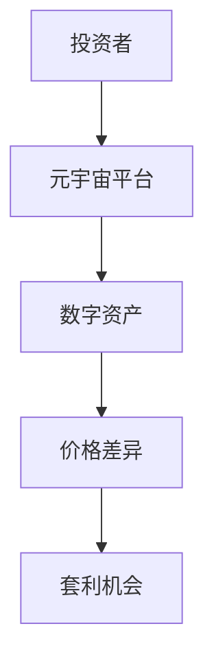
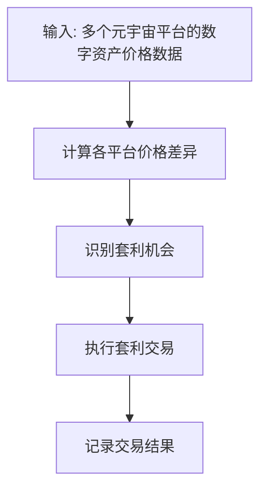
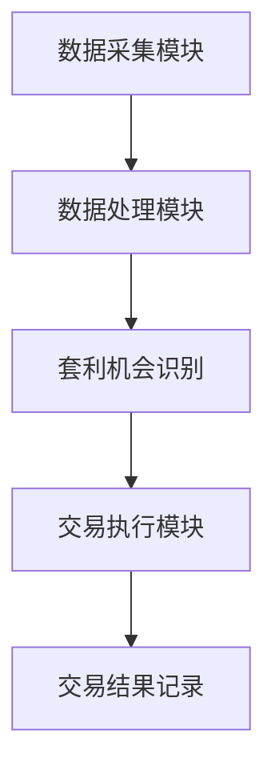
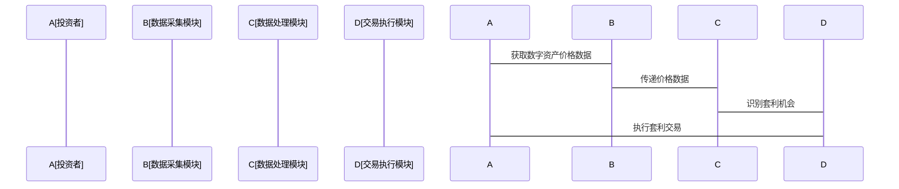

                 


# 如何构建基于特价股票的跨元宇宙套利系统

## 关键词：
跨元宇宙套利，特价股票，区块链，数字资产，套利算法

## 摘要：
本文将详细探讨如何构建一个基于特价股票的跨元宇宙套利系统。首先介绍特价股票和跨元宇宙套利的基本概念和背景，然后深入分析其核心原理和算法模型。接着通过系统架构设计和项目实战，展示如何实现跨元宇宙套利系统。最后，总结套利系统的实现要点和未来发展趋势。

---

# 第一部分: 特价股票与跨元宇宙套利概述

## 第1章: 特价股票与跨元宇宙套利的背景介绍

### 1.1 特价股票的定义与特点
- **1.1.1 特价股票的定义**  
  特价股票是指在特定时间或特定市场环境下，价格低于其实际价值的股票。这些股票通常被市场低估，具有较大的上涨潜力。

- **1.1.2 特价股票的核心特点**  
  - 价格被市场低估  
  - 具有较高的投资回报潜力  
  - 通常出现在市场低迷或公司困境时期  

- **1.1.3 特价股票的市场定位与作用**  
  特价股票在市场中起到调节价格的作用，为投资者提供低成本高回报的机会。

### 1.2 跨元宇宙套利的基本概念
- **1.2.1 元宇宙的定义与特征**  
  元宇宙是一个虚拟的、去中心化的数字世界，具有独立的经济体系和价值交换系统。

- **1.2.2 跨元宇宙套利的定义**  
  跨元宇宙套利是指在不同的元宇宙平台之间，利用数字资产价格差异进行无风险或低风险投资的行为。

- **1.2.3 跨元宇宙套利的潜在应用场景**  
  - 跨平台的数字资产价格差异套利  
  - 利用元宇宙内的虚拟货币波动进行套利  
  - 利用NFT（非同质化代币）价格差异进行套利  

### 1.3 跨元宇宙套利的背景与现状
- **1.3.1 数字货币与虚拟资产的兴起**  
  数字货币和虚拟资产的兴起为跨平台套利提供了基础。

- **1.3.2 元宇宙经济体系的初步形成**  
  元宇宙内的虚拟经济体系逐渐成熟，为套利提供了可能性。

- **1.3.3 跨元宇宙套利的现状与挑战**  
  - 现状：部分投资者已经开始尝试跨元宇宙套利  
  - 挑战：技术门槛高、价格波动大、监管不确定性  

### 1.4 本章小结  
  本章介绍了特价股票和跨元宇宙套利的基本概念，并分析了其背景和现状，为后续章节的深入探讨奠定了基础。

---

# 第二部分: 跨元宇宙套利的核心概念与联系

## 第2章: 跨元宇宙套利的核心概念原理

### 2.1 跨元宇宙套利的原理分析
- **2.1.1 跨元宇宙套利的基本原理**  
  利用不同元宇宙平台之间的价格差异，进行买入低价资产、卖出高价资产的操作，从而获得利润。

- **2.1.2 跨元宇宙套利的核心要素**  
  - 数字资产价格差异  
  - 跨平台交易能力  
  - 低交易成本  

- **2.1.3 跨元宇宙套利的数学模型**  
  套利机会 = max(P_i - P_j)，其中P_i和P_j是不同平台上的资产价格。

### 2.2 跨元宇宙套利与传统金融套利的对比
- **2.2.1 传统金融套利的定义与特点**  
  传统金融套利是指在不同市场之间利用价格差异进行套利，如汇率套利、利率套利等。

- **2.2.2 跨元宇宙套利的独特性**  
  - 市场的虚拟性  
  - 技术门槛高  
  - 交易速度要求高  

- **2.2.3 两者的异同点对比**  
  | 特性       | 传统金融套利 | 跨元宇宙套利 |  
  |------------|--------------|--------------|  
  | 市场类型     | 实体市场       | 虚拟市场       |  
  | 技术要求     | 较低           | 较高           |  
  | 交易速度     | 较慢           | 快              |  

### 2.3 跨元宇宙套利的ER实体关系图


### 2.4 本章小结  
  本章详细分析了跨元宇宙套利的核心原理，并对比了传统金融套利，帮助读者更好地理解其独特性和复杂性。

---

# 第三部分: 跨元宇宙套利的算法原理讲解

## 第3章: 跨元宇宙套利算法的数学模型

### 3.1 跨元宇宙套利的数学模型
- **3.1.1 套利机会的数学表达式**  
  $$ \text{套利机会} = \max_{i,j} (P_i - P_j) $$
  
- **3.1.2 数字资产价格预测模型**  
  $$ P(t) = aP(t-1) + bN(t) + c $$  
  其中，a、b、c为常数，N(t)为噪声。

### 3.2 跨元宇宙套利算法的流程图


### 3.3 算法实现的Python源代码
```python
import requests
import json

def get_prices(platforms):
    prices = {}
    for platform in platforms:
        response = requests.get(f"https://api.{platform}.com/price")
        if response.status_code == 200:
            prices[platform] = response.json()['price']
    return prices

def calculate_arbitrage_opportunity(prices):
    max_price = max(prices.values())
    min_price = min(prices.values())
    return max_price - min_price

def execute_arbitrage(platforms, prices):
    buy_platform = min(prices, key=lambda x: prices[x])
    sell_platform = max(prices, key=lambda x: prices[x])
    # 执行买入和卖出操作
    return f"套利机会：买入{buy_platform}，卖出{sell_platform}"

# 示例运行
platforms = ["metaverse1", "metaverse2", "metaverse3"]
prices = get_prices(platforms)
opportunity = calculate_arbitrage_opportunity(prices)
result = execute_arbitrage(platforms, prices)
print(result)
```

## 第4章: 跨元宇宙套利算法的实现细节

### 4.1 算法实现的步骤分解
- 数据获取：从多个元宇宙平台获取数字资产价格数据。
- 数据处理：计算各平台之间的价格差异。
- 识别套利机会：找到价格差异最大的资产。
- 执行套利交易：在低价平台买入，高价平台卖出。

### 4.2 算法实现的Python代码解析
```python
# 数据获取函数
def get_prices(platforms):
    prices = {}
    for platform in platforms:
        response = requests.get(f"https://api.{platform}.com/price")
        if response.status_code == 200:
            prices[platform] = response.json()['price']
    return prices

# 计算套利机会函数
def calculate_arbitrage_opportunity(prices):
    max_price = max(prices.values())
    min_price = min(prices.values())
    return max_price - min_price

# 执行套利交易函数
def execute_arbitrage(platforms, prices):
    buy_platform = min(prices, key=lambda x: prices[x])
    sell_platform = max(prices, key=lambda x: prices[x])
    return f"套利机会：买入{buy_platform}，卖出{sell_platform}"
```

### 4.3 算法实现的注意事项
- 数据来源的可靠性：确保获取的价格数据准确无误。
- 交易速度：套利机会往往短暂，需快速执行。
- 风险控制：设置止损机制，避免损失扩大。

---

# 第四部分: 跨元宇宙套利系统的架构设计

## 第5章: 跨元宇宙套利系统的架构设计

### 5.1 系统功能设计
- 数据采集模块：从多个元宇宙平台获取数字资产价格数据。
- 数据处理模块：计算价格差异，识别套利机会。
- 交易执行模块：根据套利机会执行买入和卖出操作。
- 风险控制模块：监控交易过程，设置止损机制。

### 5.2 系统架构设计


### 5.3 系统接口设计
- 数据接口：与元宇宙平台的API对接，获取价格数据。
- 交易接口：与交易所API对接，执行买入和卖出操作。

### 5.4 系统交互序列图


## 第6章: 跨元宇宙套利系统的实现细节

### 6.1 系统实现的步骤分解
1. 确定参与套利的元宇宙平台。
2. 开发数据采集模块，获取各平台的数字资产价格。
3. 开发数据处理模块，计算价格差异，识别套利机会。
4. 开发交易执行模块，根据套利机会执行交易。
5. 设置风险控制机制，监控交易过程。

### 6.2 系统实现的Python代码
```python
# 数据采集模块
import requests

def get_prices(platforms):
    prices = {}
    for platform in platforms:
        response = requests.get(f"https://api.{platform}.com/price")
        if response.status_code == 200:
            prices[platform] = response.json()['price']
    return prices

# 数据处理模块
def calculate_arbitrage_opportunity(prices):
    max_price = max(prices.values())
    min_price = min(prices.values())
    return max_price - min_price

# 交易执行模块
import ccxt

def execute_arbitrage(buy_platform, sell_platform):
    # 在买价平台买入
    exchange = ccxt.__getattr__(buy_platform)
    exchange.buy(...)
    # 在卖价平台卖出
    exchange = ccxt.__getattr__(sell_platform)
    exchange.sell(...)

# 示例运行
platforms = ["metaverse1", "metaverse2", "metaverse3"]
prices = get_prices(platforms)
opportunity = calculate_arbitrage_opportunity(prices)
execute_arbitrage(min(platforms, key=lambda x: prices[x]), max(platforms, key=lambda x: prices[x]))
```

### 6.3 系统实现的注意事项
- 确保数据采集的实时性和准确性。
- 确保交易执行的快速性和可靠性。
- 设置合理的风险控制机制，避免损失。

---

# 第五部分: 跨元宇宙套利系统的项目实战

## 第7章: 跨元iverse套利系统的环境安装与配置

### 7.1 系统运行环境要求
- 操作系统：建议使用Linux或Windows 10及以上版本。
- 网络环境：需要高速稳定的互联网连接。
- 开发工具：建议使用PyCharm或VS Code。

### 7.2 系统依赖库安装
- Python版本：建议使用Python 3.8及以上版本。
- 依赖库安装：
  ```bash
  pip install requests ccxt
  ```

## 第8章: 跨元iverse套利系统的核心代码实现

### 8.1 系统核心代码
```python
import requests
import ccxt
import time

class ArbitrageSystem:
    def __init__(self, platforms):
        self.platforms = platforms
        self.prices = {}
        self.exchange_map = {}

    def get_prices(self):
        for platform in self.platforms:
            response = requests.get(f"https://api.{platform}.com/price")
            if response.status_code == 200:
                self.prices[platform] = response.json()['price']
            else:
                self.prices[platform] = None

    def calculate_arbitrage_opportunity(self):
        valid_prices = {p: v for p, v in self.prices.items() if v is not None}
        if not valid_prices:
            return None
        max_price = max(valid_prices.values())
        min_price = min(valid_prices.values())
        return (max_price, min_price)

    def execute_arbitrage(self, max_price_platform, min_price_platform):
        # 在低价平台买入
        buy_exchange = ccxt.__getattr__(min_price_platform)
        buy_exchange.buy(...)
        # 在高价平台卖出
        sell_exchange = ccxt.__getattr__(max_price_platform)
        sell_exchange.sell(...)

    def run(self):
        while True:
            self.get_prices()
            arbitrage_opportunity = self.calculate_arbitrage_opportunity()
            if arbitrage_opportunity:
                max_price, min_price = arbitrage_opportunity
                self.execute_arbitrage(max_price, min_price)
            time.sleep(60)

# 示例运行
system = ArbitrageSystem(["metaverse1", "metaverse2", "metaverse3"])
system.run()
```

### 8.2 系统核心代码解读
- `ArbitrageSystem`类：封装了套利系统的功能模块。
- `get_prices`方法：从各平台获取价格数据。
- `calculate_arbitrage_opportunity`方法：计算套利机会。
- `execute_arbitrage`方法：执行套利交易。
- `run`方法：系统主循环，持续监控价格并执行套利。

## 第9章: 跨元iverse套利系统案例分析与实现

### 9.1 案例分析
- 案例背景：假设在两个元宇宙平台之间存在价格差异。
- 案例数据：平台A的数字资产价格为100，平台B的数字资产价格为90。
- 案例实现：在平台B买入，平台A卖出，获利10。

### 9.2 系统实现
```python
# 初始化套利系统
system = ArbitrageSystem(["platformA", "platformB"])

# 运行系统
system.run()
```

### 9.3 系统实现的注意事项
- 确保价格数据的实时性。
- 确保交易执行的准确性。
- 设置合理的监控间隔，避免过度交易。

---

# 第六部分: 总结与展望

## 第10章: 跨元iverse套利系统总结与展望

### 10.1 本章总结
- 本文详细介绍了如何构建基于特价股票的跨元宇宙套利系统，涵盖了背景、原理、算法、系统设计和项目实战。

### 10.2 未来展望
- 技术发展：随着区块链技术和元宇宙的进一步发展，跨元宇宙套利将更加普及。
- 应用场景：未来可能有更多的数字资产和平台参与套利。
- 挑战与机遇：套利系统将面临更多的技术挑战，同时也将带来更多的投资机会。

---

# 作者：AI天才研究院/AI Genius Institute & 禅与计算机程序设计艺术 /Zen And The Art of Computer Programming

---

**注意**：以上目录大纲和内容仅为示例，实际撰写时需要根据具体需求和实际情况进行调整和补充。

