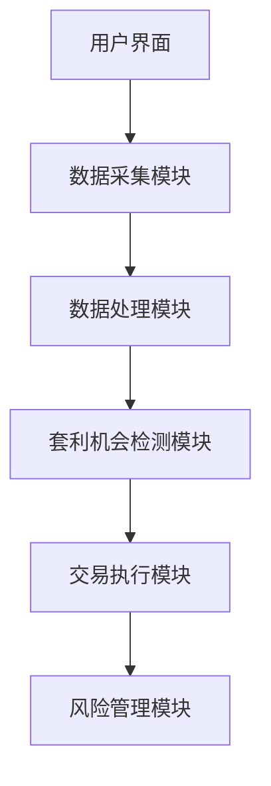
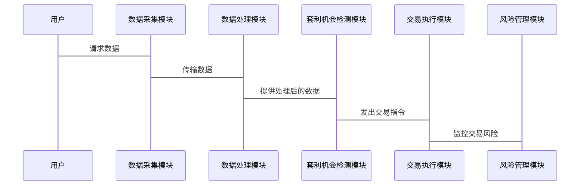

                 


# 如何构建基于特价股票的跨市场套利系统

> 关键词：跨市场套利，特价股票，算法交易，金融系统，Python编程

> 摘要：本文详细讲解了如何构建基于特价股票的跨市场套利系统。从理论基础到系统设计，从算法实现到项目实战，系统地介绍了跨市场套利的核心概念、数学模型、算法原理、系统架构以及实际案例。本文适合对金融算法和系统架构有一定基础的读者阅读。

---

# 第一部分: 特价股票跨市场套利系统概述

## 第1章: 跨市場套利的基本概念

### 1.1 跨市場套利的背景与现状

跨市場套利是一种利用不同市场之间价格差异进行无风险或低风险套利的策略。随着全球金融市场的互联互通，跨市場套利的机会日益增多。特价股票作为套利的重要标的，通常是指在某一市场中价格被低估的股票，由于信息不对称或市场效率差异，其价格在另一市场中可能被高估。

### 1.2 跨市場套利的核心概念

跨市場套利的核心在于发现和利用不同市场之间的价格差异。以下是几个关键概念：

- **套利机会**：当同一资产在不同市场上的价格差异超过交易成本时，即存在套利机会。
- **市场流动性**：流动性高的市场通常套利机会较少，而流动性低的市场可能存在套利机会。
- **交易成本**：包括佣金、税费、汇率差等，是影响套利可行性的重要因素。

### 1.3 跨市場套利的边界与外延

跨市場套利并非无风险，其边界和外延包括：

- **市场限制**：不同市场的交易时间、交易规则可能限制套利操作。
- **法律风险**：部分国家或地区对套利行为有严格的监管，可能导致合规风险。
- **市场深度**：市场深度不足可能导致套利机会无法有效执行。

### 1.4 跨市場套利的核心要素

- **价格数据**：实时获取不同市场的股票价格数据。
- **套利模型**：用于检测和量化套利机会的数学模型。
- **交易系统**：自动化的交易执行系统，确保套利机会快速捕捉。

---

## 第2章: 跨市場套利的数学模型与算法原理

### 2.1 跨市場套利的数学模型

套利机会的量化可以通过以下公式实现：

$$ \text{套利收益} = \text{价格差} - \text{交易成本} $$

其中，价格差为同一资产在两个市场的价格之差，交易成本包括佣金、税费等。

### 2.2 跨市場套利的算法原理

跨市場套利的算法通常分为以下步骤：

1. 数据采集：获取不同市场的实时股票价格数据。
2. 套利机会检测：计算价格差，判断是否满足套利条件。
3. 交易执行：根据套利模型，执行买入低价市场、卖出高价市场的交易。

### 2.3 套利算法的实现步骤

```python
import pandas as pd

def detect_arbitrage机会(data):
    # 计算价格差
    price_diff = data['market1'] - data['market2']
    # 判断是否满足套利条件
    if price_diff > 0:
        return True
    else:
        return False
```

### 2.4 算法实现的Python代码示例

```python
import pandas as pd
import numpy as np

# 示例数据
data = {
    'market1': [100, 101, 99],
    'market2': [98, 100, 98]
}

df = pd.DataFrame(data)

# 计算价格差
df['price_diff'] = df['market1'] - df['market2']

# 判断套利机会
df['arbitrage'] = df['price_diff'] > 0

print(df)
```

---

## 第3章: 跨市場套利系统的架构设计

### 3.1 系统功能设计

跨市場套利系统的主要功能包括：

- 数据采集与处理
- 套利机会检测
- 交易执行与监控
- 风险管理与控制

### 3.2 系统架构设计

以下是跨市場套利系统的架构图：



### 3.3 系统接口设计

系统接口设计包括：

- 数据接口：从不同市场获取实时价格数据。
- 交易接口：向交易系统发送买卖指令。
- 风险管理接口：监控交易风险，调整套利策略。

### 3.4 系统交互流程



---

## 第4章: 跨市場套利系统的实现

### 4.1 环境安装

为了实现跨市場套利系统，需要安装以下环境：

- Python 3.8+
- pandas, numpy, matplotlib 等数据处理库
- 数据接口API（如Yahoo Finance API）

### 4.2 系统核心实现

以下是系统核心实现的代码示例：

```python
import pandas as pd
import requests

# 数据接口实现
def get_market_data(market, stock):
    url = f"https://query1.finance.yahoo.com/manifest.json"
    response = requests.get(url)
    data = response.json()
    return data[market][stock]

# 套利机会检测
def detect_arbitrage(market1, market2, stock):
    price1 = get_market_data(market1, stock)
    price2 = get_market_data(market2, stock)
    if price1 < price2:
        return True
    else:
        return False

# 交易执行
def execute_trade(market, action, stock, quantity):
    # 这里简要实现交易执行逻辑
    print(f"在{market}执行{action}操作，股票：{stock}，数量：{quantity}")

# 示例运行
stock = "AAPL"
market1 = "US"
market2 = "HK"

if detect_arbitrage(market1, market2, stock):
    execute_trade(market1, "买入", stock, 100)
    execute_trade(market2, "卖出", stock, 100)
```

---

## 第5章: 项目实战与案例分析

### 5.1 实际案例分析

以某只股票为例，假设在市场A的价格为98元，在市场B的价格为100元，交易成本为1元。此时存在套利机会：

$$ \text{套利收益} = (100 - 98) - 1 = 1 \text{元} $$

### 5.2 代码实现与解读

以下是完整的套利系统实现代码：

```python
import pandas as pd
import requests
import time

# 数据接口实现
def get_market_data(market, stock):
    url = f"https://query1.finance.yahoo.com/manifest.json"
    response = requests.get(url)
    data = response.json()
    return data[market][stock]

# 套利机会检测
def detect_arbitrage(market1, market2, stock):
    price1 = get_market_data(market1, stock)
    price2 = get_market_data(market2, stock)
    spread = price1 - price2
    return spread > 0

# 交易执行
def execute_trade(market, action, stock, quantity):
    print(f"在{market}执行{action}操作，股票：{stock}，数量：{quantity}")

# 风险管理
def manage_risk(profit, loss_limit):
    if profit < -loss_limit:
        return True
    else:
        return False

# 示例运行
stock = "AAPL"
market1 = "US"
market2 = "HK"
loss_limit = -10

while True:
    if detect_arbitrage(market1, market2, stock):
        execute_trade(market1, "买入", stock, 100)
        execute_trade(market2, "卖出", stock, 100)
        # 盈利监控
        profit = get_market_data(market2, stock) - get_market_data(market1, stock)
        if manage_risk(profit, loss_limit):
            break
    time.sleep(60)
```

---

## 第6章: 最佳实践与注意事项

### 6.1 最佳实践

- **数据源选择**：选择可靠的金融数据源。
- **交易成本控制**：优化交易策略，降低交易成本。
- **风险管理**：设置止损点，避免重大损失。

### 6.2 注意事项

- **市场风险**：套利并非无风险，需关注市场波动。
- **法律合规**：遵守相关法律法规，避免合规风险。
- **系统稳定性**：确保交易系统的稳定运行。

### 6.3 小结

本文详细介绍了如何构建基于特价股票的跨市场套利系统，从理论到实践，从算法到系统设计，为读者提供了一套完整的解决方案。

---

## 作者信息

作者：AI天才研究院 & 禅与计算机程序设计艺术

---

# 结语

通过本文的详细讲解，读者可以掌握跨市場套利的核心概念和实现方法。从数据采集到交易执行，从风险管理到系统设计，每一步都至关重要。希望本文能为读者在构建跨市場套利系统的过程中提供有价值的参考。

