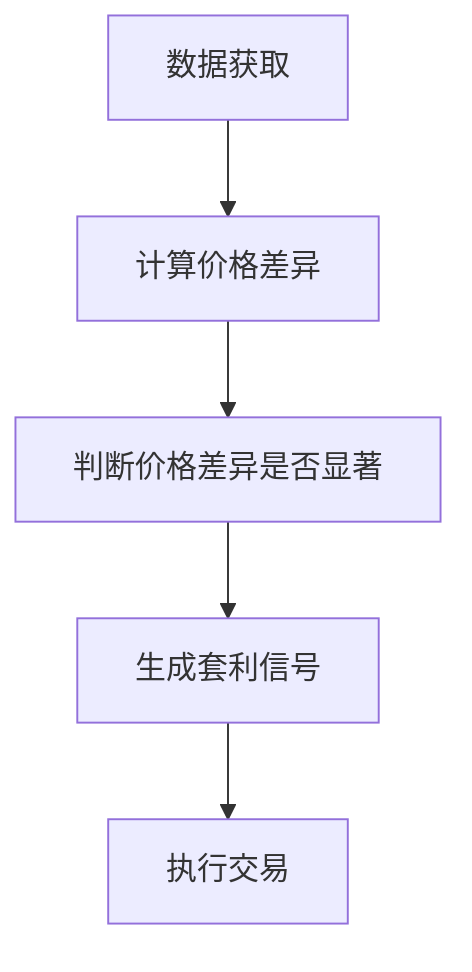
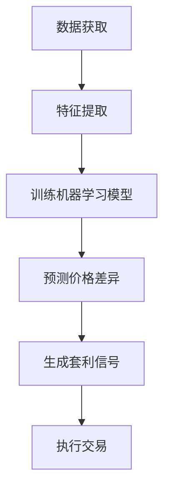
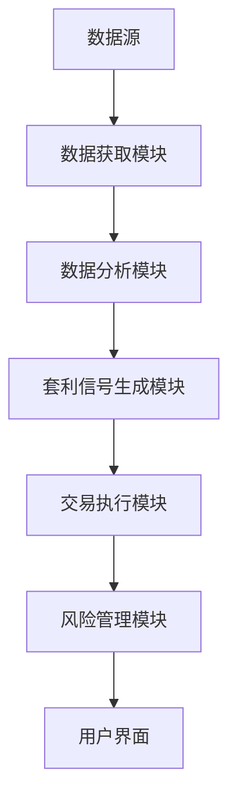
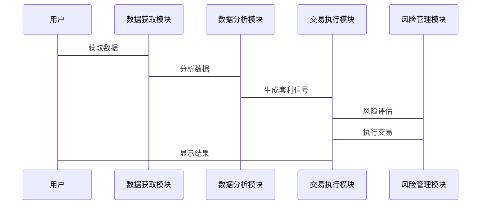

                 


# 如何构建基于特价股票的跨维度套利系统

**关键词**：特价股票、跨维度套利、量化交易、算法设计、系统架构、风险管理

**摘要**：本文系统地探讨了如何构建基于特价股票的跨维度套利系统，从理论基础到实际应用，涵盖了套利的核心概念、数学模型、系统架构、算法实现和风险管理等多个方面。通过详细的技术分析和案例研究，本文为读者提供了一套完整的套利系统构建方法论，帮助投资者在复杂多变的市场中捕捉套利机会，实现稳健收益。

---

# 第一部分: 特价股票套利系统概述

## 第1章: 特价股票套利的背景与核心概念

### 1.1 问题背景与目标
#### 1.1.1 什么是特价股票
特价股票是指在不同市场、时间或产品维度上出现价格差异的股票，这种价格差异为套利提供了基础。例如，同一股票在A股和港股市场因汇率差异或信息不对称导致的价格差异。

#### 1.1.2 套利的基本概念
套利是指利用资产在不同市场、时间或产品之间的价格差异，以低买高卖的方式获利。套利的核心在于发现价格差异，并在价格回归合理水平时实现收益。

#### 1.1.3 跨维度套利的定义与特点
跨维度套利是指在多个维度（如时间、空间、产品）上同时进行套利，以降低单维度套利的风险，并提高收益的稳定性。其特点包括多维度分析、高实时性、低交易成本和复杂性。

#### 1.1.4 套利的目标与边界
套利的目标是通过捕捉市场价差实现无风险或低风险收益。套利的边界包括市场深度、交易成本、法律法规和市场风险。

### 1.2 特价股票套利的类型
#### 1.2.1 时间维度套利
利用同一股票在不同时间点的价格差异进行套利，例如利用隔夜市场价差。

#### 1.2.2 空间维度套利
利用同一股票在不同市场的价格差异进行套利，例如A股和港股市场的套利。

#### 1.2.3 产品维度套利
利用同一股票在不同金融产品（如股票和期权）之间的价格差异进行套利。

#### 1.2.4 跨市场套利
在多个市场之间进行套利，利用市场间的价格差异和流动性差异。

### 1.3 跨维度套利的核心要素
#### 1.3.1 数据源的选择
包括多个市场的实时数据源，如股票价格、汇率、市场指数等。

#### 1.3.2 市场分析模型
包括统计套利模型、时间序列分析和机器学习模型。

#### 1.3.3 交易策略的设计
包括套利信号生成、交易时机选择和仓位管理。

#### 1.3.4 风险控制机制
包括止损策略、风险对冲和流动性管理。

### 1.4 本章小结
本章介绍了特价股票套利的核心概念、类型和实现要素，为后续章节的深入分析奠定了基础。

---

## 第2章: 跨维度套利的数学模型与算法原理

### 2.1 套利机会的量化模型
#### 2.1.1 统计套利模型
统计套利模型通过分析资产价格的历史波动性和相关性，寻找价格回归的套利机会。例如，使用均值回归模型。

#### 2.1.2 时间序列分析
时间序列分析用于预测价格趋势，例如ARIMA模型和GARCH模型。

#### 2.1.3 无风险套利的数学公式
无风险套利的条件是满足$ \text{价格差异} = 0 $，即$ \text{买价} = \text{卖价} $。

#### 2.1.4 套利机会的评估指标
包括套利收益、套利风险、套利频率和交易成本。

### 2.2 跨维度套利的算法实现
#### 2.2.1 基于统计的套利算法
统计套利算法通过分析资产价格的协方差矩阵，寻找价格差异的套利机会。

#### 2.2.2 基于机器学习的套利算法
使用机器学习模型（如随机森林和神经网络）预测价格差异，生成套利信号。

#### 2.2.3 套利信号的生成与优化
套利信号的生成需要考虑市场深度、交易成本和执行时间。

### 2.3 数学公式与模型
#### 2.3.1 套利收益计算公式
套利收益可以通过以下公式计算：
$$ \text{收益} = \text{卖出价} - \text{买入价} $$

#### 2.3.2 市场中性模型
市场中性模型通过构造零净头寸组合，消除市场风险，例如：
$$ \sum w_i = 0 $$

#### 2.3.3 风险对冲模型
风险对冲模型通过使用衍生品对冲价格波动风险，例如：
$$ \text{对冲比例} = \frac{\text{套利头寸}}{\text{衍生品头寸}} $$

#### 2.3.4 套利机会的筛选公式
套利机会的筛选可以通过以下条件：
$$ \text{价格差异} > \text{交易成本} $$

### 2.4 算法流程图
#### 2.4.1 统计套利算法流程图


#### 2.4.2 机器学习套利算法流程图


### 2.5 本章小结
本章详细介绍了套利机会的量化模型和算法实现，为后续的系统设计提供了理论基础。

---

## 第3章: 跨维度套利系统架构设计

### 3.1 系统架构概述
#### 3.1.1 系统功能模块划分
包括数据获取模块、数据分析模块、交易执行模块和风险管理模块。

#### 3.1.2 系统架构设计
使用分层架构，包括数据层、业务逻辑层和用户界面层。

#### 3.1.3 系统性能优化
包括高效的数据处理、并行计算和低延迟交易。

### 3.2 数据流与接口设计
#### 3.2.1 数据源接口设计
包括股票价格接口、汇率接口和市场指数接口。

#### 3.2.2 算法模块接口设计
包括套利信号生成接口和风险管理接口。

#### 3.2.3 交易执行接口设计
包括订单提交接口和交易状态查询接口。

#### 3.2.4 风险控制接口设计
包括风险预警接口和止损触发接口。

### 3.3 系统架构图


### 3.4 系统交互序列图


### 3.5 本章小结
本章详细描述了跨维度套利系统的架构设计和数据流，为系统的实现提供了清晰的蓝图。

---

## 第4章: 跨维度套利系统的实战案例

### 4.1 项目实战
#### 4.1.1 环境配置
包括Python、Pandas、NumPy和QuantLib的安装。

#### 4.1.2 系统核心实现
包括数据接口实现、套利算法实现和交易执行实现。

#### 4.1.3 代码实现
```python
import pandas as pd
import numpy as np

def get_data():
    # 获取数据
    return pd.DataFrame({'price': [100, 105, 98, 102], 'market': ['A', 'A', 'B', 'B']})

def calculate_arbitrage():
    data = get_data()
    # 计算价格差异
    diff = data.groupby('market')['price'].mean().apply(lambda x: x.max() - x.min())
    return diff

calculate_arbitrage()
```

#### 4.1.4 案例分析
通过实际案例分析套利机会的识别和交易执行。

#### 4.1.5 系统优化
包括算法优化、数据源优化和交易成本优化。

### 4.2 本章小结
本章通过实战案例展示了跨维度套利系统的实现过程，帮助读者更好地理解和应用相关技术。

---

## 第5章: 跨维度套利系统的高级主题

### 5.1 算法优化与改进
包括算法的优化、参数调整和性能提升。

### 5.2 高频交易与实时套利
介绍高频交易的技术实现和实时套利的策略设计。

### 5.3 套利系统的风险管理
包括VaR模型、波动性分析和压力测试。

### 5.4 合规性与法律风险
讨论套利的合规性问题和法律风险。

### 5.5 本章小结
本章介绍了跨维度套利系统的高级主题，帮助读者进一步优化系统并降低风险。

---

## 第6章: 总结与展望

### 6.1 总结
总结全文的主要内容和关键点。

### 6.2 展望
展望跨维度套利系统的未来发展方向和研究热点。

### 6.3 注意事项
提醒读者注意套利的风险和法律合规性。

### 6.4 拓展阅读
推荐相关书籍和论文，供读者进一步学习。

### 6.5 本章小结
本章总结了全文并提出了未来的研究方向。

---

## 附录

### 附录A: 常用工具与库
包括Python库、数据接口工具和交易执行工具。

### 附录B: 数据源列表
包括股票数据源、汇率数据源和市场指数数据源。

### 附录C: 参考文献
列出本文参考的书籍、论文和在线资源。

---

**作者：AI天才研究院/AI Genius Institute & 禅与计算机程序设计艺术 /Zen And The Art of Computer Programming**

