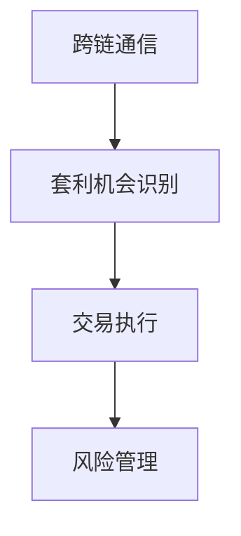
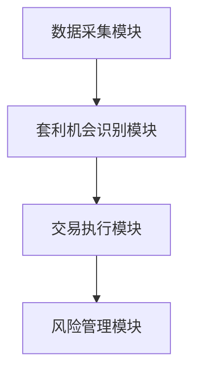
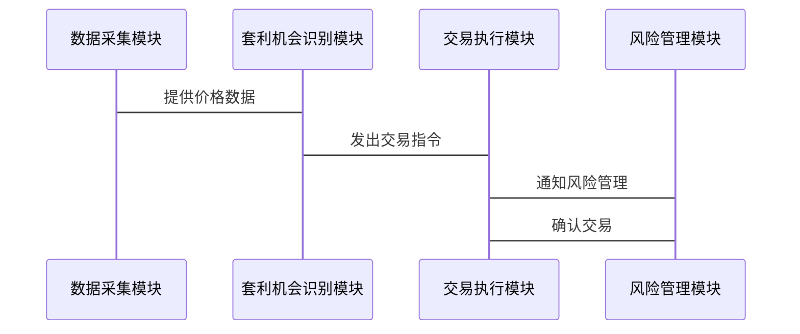

                 

# 如何构建基于特价股票的跨链套利系统

> 关键词：跨链套利，特价股票，智能合约，区块链，分布式系统

> 摘要：本文详细探讨了如何构建基于特价股票的跨链套利系统，涵盖背景介绍、核心概念、算法原理、系统架构、项目实战以及最佳实践。通过分析跨链技术的原理和套利机会的识别，结合实际案例和代码实现，为读者提供全面的技术指导。

---

## 第1章: 跨鏈套利系統的背景介紹

### 1.1 跨鏈套利的定義與背景
跨链套利是一种利用不同区块链之间价格差异进行获利的交易策略。特价股票作为跨链套利的主要标的，其价格波动为套利提供了机会。跨链技术的出现使得不同区块链之间的资产能够互操作，从而为套利者提供了新的可能性。

#### 1.1.1 跨鏈套利的定義
跨链套利是指在不同的区块链之间，利用同一资产在不同链上的价格差异，通过快速交易来获利的行为。这种套利活动依赖于跨链技术，能够实时捕捉并利用价格差异。

#### 1.1.2 特價股票的定義與特性
特价股票是指在特定时间或特定条件下，价格低于市场价的股票。其特性包括价格波动大、流动性高和易于交易等特点，使其成为跨链套利的理想标的。

#### 1.1.3 跨鏈技術的技術背景
跨链技术允许不同的区块链之间进行通信和数据交换，解决了传统区块链系统中的“孤岛”问题。通过跨链技术，可以实现资产在不同链之间的转移和交易。

#### 1.1.4 跨鏈套利的應用價值
跨链套利不仅能够为投资者带来利润，还能促进不同区块链之间的流动性和价值转移，增强区块链生态的互联互通。

---

### 1.2 跨鏈套利的核心問題
跨链套利的核心问题在于如何高效地识别和捕捉套利机会，同时控制交易风险和成本。

#### 1.2.1 套利機會的來源
套利机会来源于不同区块链上同一资产的价格差异。这种差异可能由于市场信息不对称、交易延迟或市场参与者行为不同导致。

#### 1.2.2 跨鏈交易的挑戰
跨链交易面临技术挑战，如跨链通信延迟、不同链的共识机制差异以及交易确认时间不同。这些挑战可能导致套利机会的快速消失或交易失败。

#### 1.2.3 特價股票的市場特性
特价股票的高波动性和高流动性为套利提供了频繁的机会，但也带来了市场风险和价格波动的不确定性。

#### 1.2.4 系統設計的核心問題
系统设计的核心问题是如何高效地识别套利机会，快速执行交易，并确保交易的安全性和可靠性。这需要结合跨链技术、算法优化和风险管理策略。

---

### 1.3 跨鏈套利的邊界與外延
跨链套利的边界和外延决定了其应用场景和限制条件。

#### 1.3.1 跨鏈套利的邊界條件
套利机会仅在不同链上同一资产的价格差异足够大时才存在。此外，交易成本和时间限制也会影响套利的可行性。

#### 1.3.2 跨鏈套利的外延應用
跨链套利的应用范围不仅限于股票，还可以扩展到其他资产类型，如加密货币、债券等。此外，套利策略可以结合多种技术手段，如人工智能和大数据分析。

#### 1.3.3 系統設計的限制條件
系统设计需要考虑技术限制，如跨链通信的延迟、不同链的兼容性问题以及数据同步的复杂性。这些限制条件影响了套利系统的效率和可靠性。

#### 1.3.4 跨鏈套利的法律與道德邊界
跨链套利涉及多个司法管辖区，需要遵守不同国家的法律法规。此外，套利行为可能影响市场公平性，需要在道德和法律框架内进行。

---

### 1.4 跨鏈套利的核心要素與概念結構
跨链套利的核心要素和概念结构是系统设计的基础。

#### 1.4.1 跨鏈套利的核心要素
- **跨链通信**：实现不同区块链之间的数据交换和交易确认。
- **智能合约**：用于自动化交易和资产转移。
- **套利机会识别**：通过算法实时检测价格差异。
- **风险管理**：控制交易风险，确保系统稳定运行。

#### 1.4.2 概念結構的架構
跨链套利系统由多个模块组成，包括数据采集、套利机会识别、交易执行和风险管理。各模块之间通过跨链通信协同工作。

#### 1.4.3 核心要素的相互關聯
跨链通信模块负责接收不同链上的资产价格数据，套利机会识别模块分析数据以发现价格差异，交易执行模块通过智能合约进行资产转移，风险管理模块监控交易风险。

#### 1.4.4 概念結構的可視化展示
使用Mermaid图展示跨链套利系统的概念结构：

---

### 1.5 本章小結
本章详细介绍了跨链套利的背景、核心问题、边界条件和概念结构。理解这些内容是构建跨链套利系统的基础。

---

## 第2章: 跨鏈套利的核心概念與原理

### 2.1 跨鏈套利的機制與流程
跨链套利的机制和流程是系统设计的关键。

#### 2.1.1 跨鏈交易的基本流程
1. 数据采集：实时获取不同链上同一资产的价格数据。
2. 套利机会识别：通过算法检测价格差异。
3. 交易执行：通过智能合约自动执行交易。
4. 结算与确认：完成交易后进行结算和确认。

#### 2.1.2 套利機會的識別與捕捉
套利机会识别依赖于高效的数据处理和算法优化。通过分析历史数据和实时价格，系统可以预测和捕捉套利机会。

#### 2.1.3 跨鏈交易的執行與結算
交易执行需要协调不同链上的智能合约和交易流程。结算和确认需要考虑不同链的共识机制和时间延迟。

#### 2.1.4 套利風險的控制與管理
套利系统需要具备风险管理功能，包括止损机制、交易限制和异常处理，以确保系统稳定运行。

---

### 2.2 跨鏈技術的核心原理
跨链技术是实现跨链套利的核心。

#### 2.2.1 跨鏈通信的實現原理
跨链通信通过中继链或API接口实现不同链之间的数据交换。通信协议需要确保数据的准确性和实时性。

#### 2.2.2 跨鏈智能合約的設計與執行
智能合约用于自动化交易和资产转移。跨链智能合约需要兼容不同链的编程模型和共识机制。

#### 2.2.3 跨鏈身份認證與權限管理
跨链系统需要实现统一的身份认证和权限管理，确保交易的安全性和合法性。

#### 2.2.4 跨鏈數據同步與一致性保障
跨链数据同步需要解决数据一致性问题，确保不同链上的数据同步准确无误。

---

### 2.3 跨鏈套利的實現方式
跨链套利可以通过多种方式实现。

#### 2.3.1 基於智能合約的跨鏈套利
智能合约自动执行交易，减少人工干预，提高效率。

#### 2.3.2 基於中繼鏈的跨鏈橋接
中继链作为桥梁，连接不同链，实现资产转移和交易确认。

#### 2.3.3 基於API的跨鏈數據交互
API接口实现不同链之间的数据交互，适用于需要快速响应的套利场景。

#### 2.3.4 跨鏈套利的多種實現模式
根据具体需求，跨链套利可以采用单一链、多链组合或混合模式。

---

### 2.4 跨鏈套利的核心算法與數據結構
跨链套利需要高效的算法和数据结构支持。

#### 2.4.1 跨鏈交易的算法實現
通过高效的算法实现套利机会的快速识别和交易执行。

#### 2.4.2 跨鏈數據同步的算法設計
设计高效的算法实现跨链数据同步和一致性保障。

#### 2.4.3 跨鏈智能合約的數據結構
智能合约需要设计合理的数据结构，支持跨链交易的高效执行。

#### 2.4.4 跨鏈套利的算法優化
通过算法优化提高交易效率和准确性，减少交易成本。

---

### 2.5 本章小結
本章详细介绍了跨链套利的机制、实现方式和核心算法。这些内容为系统设计提供了理论基础和技术支持。

---

## 第3章: 跨鏈套利的算法原理與數學模型

### 3.1 跨鏈套利的數學模型
数学模型是跨链套利算法的核心。

#### 3.1.1 跨鏈交易的數學模型
通过数学模型描述跨链交易的过程和结果，为算法设计提供理论依据。

#### 3.1.2 套利機會的數學建模
建立数学模型，分析价格差异和交易成本，预测套利机会。

#### 3.1.3 跨鏈智能合約的數學表達
通过数学表达式描述智能合约的执行逻辑和交易规则。

#### 3.1.4 跨鏈數據同步的數學模型
设计数学模型，确保跨链数据同步的准确性和一致性。

---

### 3.2 跨鏈套利的核心算法
核心算法是实现跨链套利的关键。

#### 3.2.1 跨鏈交易算法的實現
通过高效的算法实现跨链交易的快速执行。

#### 3.2.2 套利機會檢測算法
算法实时检测套利机会，捕捉价格差异。

#### 3.2.3 跨鏈智能合約的執行算法
智能合约的执行算法确保交易的自动化和可靠性。

#### 3.2.4 跨鏈數據同步算法
算法实现跨链数据的高效同步和一致性保障。

---

### 3.3 跨鏈套利的數學公式與示例
数学公式是算法实现的基础。

#### 3.3.1 跨鏈交易的數學公式
$$ \text{收益} = \text{卖出价格} - \text{买入价格} $$

#### 3.3.2 套利機會的數學建模
假设在链A和链B上，同一资产的价格分别为P_A和P_B，当P_A < P_B时，存在套利机会。

#### 3.3.3 跨鏈智能合約的數學表達
智能合约通过数学表达式描述交易规则，例如：
$$ \text{如果} P_A < P_B \text{，则执行买入A和卖出B} $$

---

### 3.4 本章小結
本章通过数学模型和算法设计，详细介绍了跨链套利的实现原理。数学公式和算法流程图为系统设计提供了理论支持。

---

## 第4章: 跨鏈套利的系統架構與實現

### 4.1 系統架構設計
系统架构是跨链套利系统的核心。

#### 4.1.1 系統功能設計
系统功能包括数据采集、套利机会识别、交易执行和风险管理。

#### 4.1.2 系統架構類圖
使用Mermaid图展示系统架构：

#### 4.1.3 系統交互序列圖
展示系统交互流程：

---

### 4.2 系統實現技術
系统实现技术是跨链套利的关键。

#### 4.2.1 跨鏈通信技術
使用中继链或API接口实现跨链通信。

#### 4.2.2 智能合约技術
在不同链上部署智能合约，实现自动化交易。

#### 4.2.3 跨鏈數據同步技術
通过区块链技术实现跨链数据同步和一致性保障。

#### 4.2.4 系統安全技術
确保系统安全，防止攻击和数据泄露。

---

### 4.3 系統實現步驟
系统实现需要遵循以下步骤。

#### 4.3.1 環境安裝
安装必要的开发工具和区块链节点。

#### 4.3.2 系統核心實現
实现数据采集、套利机会识别和交易执行模块。

#### 4.3.3 系統測試
进行全面的系统测试，确保各模块协同工作。

#### 4.3.4 系統優化
优化系统性能，提高交易效率和准确性。

---

### 4.4 本章小結
本章详细介绍了跨链套利系统的架构设计和实现技术，为实际开发提供了指导。

---

## 第5章: 跨鏈套利的項目實戰

### 5.1 項目背景介紹
项目背景包括跨链套利的市场需求和技术可行性。

#### 5.1.1 項目目標
实现基于特价股票的跨链套利系统。

#### 5.1.2 項目需求
明确系统功能需求和性能需求。

#### 5.1.3 項目限制條件
项目实施的限制条件，如技术难度和成本预算。

---

### 5.2 項目實現方案
项目实现方案包括技术选型和开发计划。

#### 5.2.1 技術選型
选择合适的区块链平台和开发工具。

#### 5.2.2 開發計劃
制定详细的开发计划和时间表。

#### 5.2.3 系統設計
详细设计系统架构和功能模块。

---

### 5.3 項目核心實現
项目核心实现包括数据采集、套利机会识别和交易执行。

#### 5.3.1 数据采集實現
通过API接口实时采集不同链上的股票价格数据。

#### 5.3.2 套利機會識別實現
使用算法分析价格差异，识别套利机会。

#### 5.3.3 交易執行實現
通过智能合约自动执行交易，确保交易安全和高效。

---

### 5.4 項目測試與優化
项目测试与优化包括功能测试、性能优化和系统调优。

#### 5.4.1 功能測試
测试系统各功能模块的正确性和稳定性。

#### 5.4.2 性能優化
优化系统性能，提高交易效率和响应速度。

#### 5.4.3 系統調優
调整系统参数，确保系统稳定运行。

---

### 5.5 本章小結
本章通过项目实战，详细介绍了跨链套利系统的实现过程，为读者提供了实际操作的指导。

---

## 第6章: 跨鏈套利的最佳實踐與小結

### 6.1 最佳實踐
最佳实践包括技术选型、系统设计和风险管理。

#### 6.1.1 技術選型的建議
选择合适的区块链平台和开发工具，确保系统兼容性和扩展性。

#### 6.1.2 系統設計的優化
优化系统架构，提高系统性能和可维护性。

#### 6.1.3 風險管理的策略
制定有效的风险管理策略，控制交易风险和系统风险。

---

### 6.2 系統小結
系统总结包括项目成果、系统优势和未来展望。

#### 6.2.1 項目成果
实现了一个高效的跨链套利系统，能够实时捕捉套利机会，自动化执行交易。

#### 6.2.2 系統優勢
系统优势包括高效性、可靠性和可扩展性。

#### 6.2.3 未來展望
未来可以进一步优化系统性能，扩展应用范围，探索更多跨链套利的可能场景。

---

## 作者：AI天才研究院/AI Genius Institute & 禅与计算机程序设计艺术 /Zen And The Art of Computer Programming

