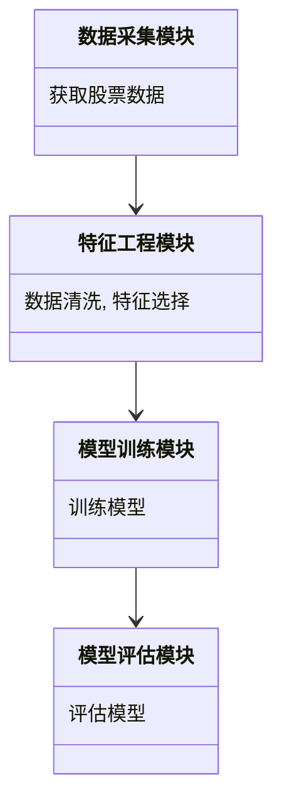
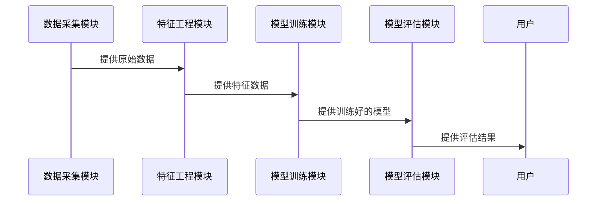

                 


# 如何构建高效的特价股票筛选模型

## 关键词：特价股票筛选模型、股票投资、数据驱动、机器学习、金融技术

## 摘要：本文将详细介绍如何构建一个高效的特价股票筛选模型。通过分析股票市场的基本概念、特价股票的筛选指标、数据预处理、算法选择以及模型实现，本文将为投资者提供一种基于技术的方法来优化股票选择过程。文章从背景介绍、核心概念、算法原理、系统架构到项目实战，全面解析构建高效特价股票筛选模型的关键步骤和方法。

---

# 第一部分: 特价股票筛选模型的背景与概念

## 第1章: 股票市场与特价股票概述

### 1.1 股票市场的基本概念

#### 1.1.1 股票市场的定义与功能
股票市场是投资者进行股票买卖的场所，其主要功能包括价格发现、资本筹集和投资渠道。股票价格反映了市场的供需关系和公司基本面。

#### 1.1.2 股票价格波动的规律
股票价格受多种因素影响，包括宏观经济环境、公司业绩、行业趋势和市场情绪等。理解这些波动规律有助于投资者制定策略。

#### 1.1.3 特价股票的定义与特点
特价股票通常指价格被市场低估的股票，具有较高的投资回报潜力。其特点包括低市盈率、低市净率和高股息率。

### 1.2 投资者的需求与挑战

#### 1.2.1 投资者的类型与目标
投资者根据风险偏好和投资目标可分为保守型、稳健型和激进型。不同类型的投资者需要不同的股票筛选策略。

#### 1.2.2 特价股票筛选的必要性
投资者需要通过筛选模型快速找到具有投资价值的股票，避免手动筛选的低效和主观性。

#### 1.2.3 现有筛选方法的局限性
传统筛选方法依赖于经验判断，可能存在主观性和片面性。数据驱动的筛选方法更具客观性和高效性。

### 1.3 模型构建的背景与意义

#### 1.3.1 数据驱动的投资决策
通过分析大量历史数据，数据驱动的方法能够发现潜在的投资机会和风险。

#### 1.3.2 技术在金融领域的应用
技术的进步使得机器学习和大数据分析能够应用于金融领域，帮助投资者做出更科学的决策。

#### 1.3.3 特价股票筛选模型的价值
构建高效的筛选模型能够帮助投资者快速识别具有投资价值的股票，提高投资效率和收益。

### 1.4 本章小结
本章介绍了股票市场的基本概念、特价股票的定义及筛选的重要性，为后续模型构建奠定了基础。

---

## 第2章: 特价股票筛选的核心指标

### 2.1 财务指标分析

#### 2.1.1 市盈率（P/E）的计算与意义
市盈率=股票价格/每股收益，用于衡量股票的估值水平。低市盈率可能意味着股票被低估。

#### 2.1.2 市净率（P/B）的计算与意义
市净率=股票价格/每股净资产，用于衡量股票相对于账面价值的高低。低市净率可能意味着股票被低估。

#### 2.1.3 股息率的计算与意义
股息率=每股股息/股票价格，用于衡量股票的分红能力。高股息率可能意味着稳定的收益。

### 2.2 技术指标分析

#### 2.2.1 移动平均线（MA）的定义与应用
移动平均线是一定时期内股票价格的平均值，用于平滑价格波动，判断趋势方向。

#### 2.2.2 相对强弱指数（RSI）的定义与应用
RSI用于衡量股票的超买或超卖状态，RSI低于30表示超卖，高于70表示超买。

#### 2.2.3 成交量分析的意义
成交量是价格变动的确认指标，高成交量伴随价格上涨可能意味着趋势强劲。

### 2.3 综合指标评价体系

#### 2.3.1 指标权重的确定方法
通过分析各指标对股票价值的影响程度，确定各指标的权重。

#### 2.3.2 综合评分模型的构建
将各指标进行加权评分，计算综合得分，确定股票的优先级。

#### 2.3.3 指标之间的相互关系
分析各指标之间的相关性，避免重复或冲突，优化评价体系。

### 2.4 本章小结
本章详细讲解了财务指标和技术指标的计算与应用，构建了综合指标评价体系，为后续模型构建提供了依据。

---

## 第3章: 特价股票筛选模型的构建原理

### 3.1 数据预处理与特征提取

#### 3.1.1 数据清洗的必要性
去除异常值和缺失值，确保数据的完整性和准确性。

#### 3.1.2 特征选择的方法
通过相关性分析和主成分分析，选择最具影响力的特征。

#### 3.1.3 数据增强的策略
通过数据标准化和归一化，确保模型的泛化能力。

### 3.2 算法选择与实现

#### 3.2.1 机器学习算法的选择
基于模型的复杂度和数据规模，选择适合的算法，如线性回归或随机森林。

#### 3.2.2 模型训练与优化
通过交叉验证和网格搜索，优化模型参数，提高预测准确率。

#### 3.2.3 模型评估与验证
使用混淆矩阵、精确率和召回率等指标，评估模型的性能。

### 3.3 数学模型与公式

#### 3.3.1 线性回归模型
$$ y = \beta_0 + \beta_1x_1 + \beta_2x_2 + \dots + \beta_nx_n $$

#### 3.3.2 随机森林模型
随机森林通过集成学习，提高模型的鲁棒性和准确性。

### 3.4 本章小结
本章介绍了数据预处理、算法选择和数学模型的构建过程，为模型实现提供了理论基础。

---

## 第4章: 系统分析与架构设计

### 4.1 问题场景介绍
投资者需要一个高效的工具，快速筛选出具有投资价值的特价股票。

### 4.2 项目介绍

#### 4.2.1 项目目标
构建一个高效的特价股票筛选模型，帮助投资者做出科学的决策。

#### 4.2.2 项目范围
涵盖数据采集、特征工程、模型训练和结果展示等模块。

### 4.3 系统功能设计

#### 4.3.1 数据采集模块
负责从多个数据源获取股票数据。

#### 4.3.2 特征工程模块
对数据进行清洗、特征选择和数据增强。

#### 4.3.3 模型训练模块
基于选定的算法，训练筛选模型。

#### 4.3.4 模型评估模块
评估模型的性能，优化参数。

### 4.4 系统架构设计

#### 4.4.1 类图


#### 4.4.2 序列图


### 4.5 本章小结
本章通过系统分析和架构设计，明确了各模块的功能和交互关系，为后续的实现提供了指导。

---

## 第5章: 项目实战

### 5.1 环境配置

#### 5.1.1 安装必要的库
使用Python的pandas、numpy、scikit-learn等库。

```bash
pip install pandas numpy scikit-learn
```

### 5.2 核心实现

#### 5.2.1 数据预处理
```python
import pandas as pd
import numpy as np

# 数据清洗
data = pd.read_csv('stock_data.csv')
data.dropna()
data = data[~data['volume'].isin([0])]
```

#### 5.2.2 模型训练
```python
from sklearn.ensemble import RandomForestClassifier
from sklearn.model_selection import train_test_split

# 特征选择
features = ['pe', 'pb', 'dividend_yield']
X = data[features]
y = data['target']

# 数据分割
X_train, X_test, y_train, y_test = train_test_split(X, y, test_size=0.2)

# 模型训练
model = RandomForestClassifier()
model.fit(X_train, y_train)
```

### 5.3 案例分析

#### 5.3.1 模型评估
```python
from sklearn.metrics import classification_report

# 模型预测
y_pred = model.predict(X_test)

# 模型评估
print(classification_report(y_test, y_pred))
```

#### 5.3.2 结果解读
通过评估结果，优化模型参数，提高筛选准确率。

### 5.4 本章小结
本章通过实际案例，展示了模型的实现过程和效果，验证了模型的有效性。

---

## 第6章: 最佳实践与总结

### 6.1 本章小结
总结了构建高效特价股票筛选模型的关键步骤和方法。

### 6.2 注意事项
在实际应用中，需注意数据质量和模型的实时更新。

### 6.3 拓展阅读
推荐阅读《Python机器学习实战》和《股票技术分析入门》。

---

## 作者：AI天才研究院 & 禅与计算机程序设计艺术

---

通过以上步骤，我们详细讲解了如何构建高效的特价股票筛选模型，从背景介绍到项目实战，为投资者提供了一种科学的方法来优化股票筛选过程。希望本文能够为读者在股票投资领域提供有价值的参考和指导。

