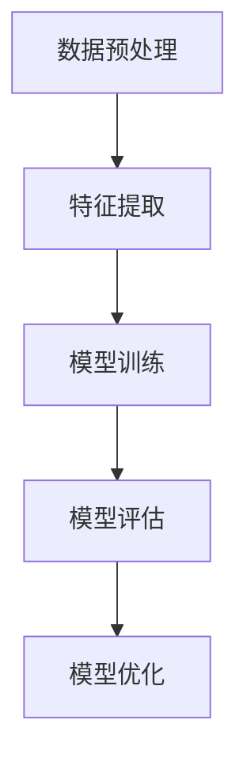
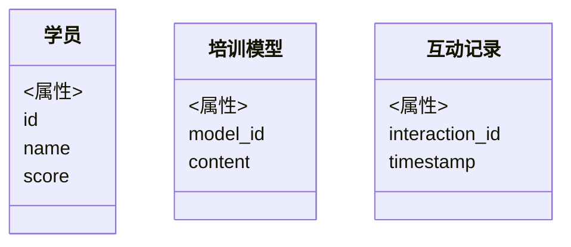
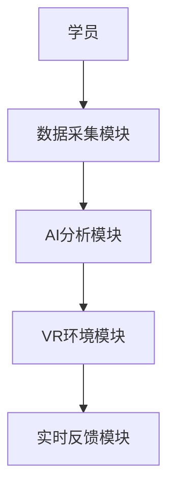

                 


# 如何评估企业的AI驱动的虚拟现实培训系统

## 关键词：AI驱动，虚拟现实，培训系统，评估方法，企业应用，技术实现

## 摘要：本文详细探讨如何评估企业中的AI驱动虚拟现实培训系统，涵盖系统核心概念、算法原理、系统架构、项目实战以及总结与建议，帮助读者全面理解并有效实施评估。

---

## 第一章：AI驱动的虚拟现实培训系统概述

### 1.1 问题背景与描述

#### 1.1.1 传统企业培训的痛点与挑战
传统的企业培训存在以下问题：
- **成本高昂**：线下培训需要场地、讲师和学员的时间，成本较高。
- **效果难测**：缺乏实时反馈，难以评估培训效果。
- **内容单一**：难以提供个性化的学习体验。
- **参与度低**：学员可能因为枯燥的内容而分心。

#### 1.1.2 AI与虚拟现实技术的结合如何解决这些问题
AI和虚拟现实技术的结合为企业培训带来了革命性的变化：
- **个性化学习**：AI分析学员行为，提供定制化的学习路径。
- **沉浸式体验**：VR技术创造逼真的虚拟环境，提升学习效果。
- **实时反馈**：AI系统可以实时监测学员表现，提供即时反馈。
- **数据驱动优化**：通过收集和分析大量数据，不断优化培训内容。

#### 1.1.3 问题解决的思路与方法
AI驱动的VR培训系统通过以下步骤解决问题：
1. **数据收集**：收集学员的行为数据和反馈。
2. **模型训练**：利用机器学习模型分析数据，生成个性化学习计划。
3. **虚拟环境构建**：使用VR技术创建沉浸式培训场景。
4. **实时互动**：AI系统与学员实时互动，提供反馈和指导。
5. **效果评估**：通过数据分析评估培训效果，持续优化系统。

### 1.2 系统的核心概念与组成

#### 1.2.1 核心概念的定义
- **AI驱动**：利用机器学习算法分析数据，提供智能化决策。
- **虚拟现实**：创建虚拟环境，提供沉浸式体验。
- **培训系统**：整合AI和VR技术，提供个性化培训解决方案。

#### 1.2.2 系统的边界与外延
- **边界**：系统专注于培训过程，不涉及企业日常运营的其他方面。
- **外延**：可以扩展到员工入职培训、技能提升等多个领域。

#### 1.2.3 组成要素及相互关系
- **数据采集模块**：收集学员行为数据。
- **AI分析模块**：分析数据，生成个性化学习计划。
- **VR环境模块**：构建虚拟场景，提供沉浸式体验。
- **实时反馈模块**：实时监测学员表现，提供反馈。

---

## 第二章：AI与虚拟现实技术基础

### 2.1 AI技术在培训系统中的应用

#### 2.1.1 机器学习在个性化培训中的应用
机器学习算法用于分析学员数据，预测学习效果，优化学习路径。

#### 2.1.2 自然语言处理在交互中的作用
自然语言处理技术用于理解学员的输入，生成个性化的反馈和建议。

### 2.2 虚拟现实技术的核心原理
虚拟现实技术通过计算机生成模拟环境，使学员能够在虚拟场景中进行交互和学习。

---

## 第三章：核心概念的原理与联系

### 3.1 AI与VR的结合原理

#### 3.1.1 AI如何驱动VR系统的运行
AI系统分析学员数据，生成VR环境中的动态内容，例如虚拟导师的形象和对话。

#### 3.1.2 VR如何提供沉浸式的学习环境
VR技术创建逼真的虚拟场景，学员可以在其中进行实践操作，提升学习效果。

### 3.2 核心概念属性对比表

| 比较维度 | AI驱动的VR培训系统 | 传统培训方式 |
|----------|--------------------|--------------|
| 个性化   | 高                 | 低           |
| 互动性   | 高                 | 低           |
| 效率     | 高                 | 低           |
| 成本     | 中等               | 高           |

### 3.3 ER实体关系图
```mermaid
er
actor: 学员
model: 培训模型
interaction: 互动记录
```

---

## 第四章：算法原理与数学模型

### 4.1 算法原理

#### 4.1.1 基于机器学习的评估模型
机器学习算法用于预测学员的学习效果，优化培训内容。

#### 4.1.2 算法流程
1. 数据预处理：清洗和归一化数据。
2. 模型训练：使用监督学习算法训练模型。
3. 模型评估：使用交叉验证评估模型性能。
4. 模型优化：调整参数，提升模型准确率。

#### 4.1.3 算法流程图


#### 4.1.4 代码实现
```python
from sklearn import datasets
from sklearn.tree import DecisionTreeClassifier
from sklearn.model_selection import train_test_split
from sklearn.metrics import accuracy_score

# 加载数据集
iris = datasets.load_iris()
X = iris.data
y = iris.target

# 数据分割
X_train, X_test, y_train, y_test = train_test_split(X, y, test_size=0.3)

# 模型训练
model = DecisionTreeClassifier()
model.fit(X_train, y_train)

# 模型预测
y_pred = model.predict(X_test)

# 模型评估
print("准确率:", accuracy_score(y_test, y_pred))
```

---

## 第五章：系统分析与架构设计方案

### 5.1 问题场景介绍

#### 5.1.1 项目介绍
AI驱动的VR培训系统旨在为企业提供个性化的虚拟培训解决方案。

### 5.1.2 系统功能设计
- **用户界面**：提供个性化的学习界面。
- **评估模块**：实时评估学员表现。
- **数据处理模块**：收集和分析学员数据。

### 5.2 系统架构设计

#### 5.2.1 领域模型


#### 5.2.2 系统架构图


---

## 第六章：项目实战

### 6.1 环境安装

#### 6.1.1 安装Python和必要的库
```bash
pip install numpy scikit-learn matplotlib
```

### 6.2 核心代码实现

#### 6.2.1 数据预处理
```python
import pandas as pd
from sklearn.preprocessing import StandardScaler

# 加载数据集
data = pd.read_csv('train.csv')

# 数据预处理
scaler = StandardScaler()
data_scaled = scaler.fit_transform(data)
```

#### 6.2.2 模型训练
```python
from sklearn.ensemble import RandomForestClassifier

# 模型训练
model = RandomForestClassifier()
model.fit(X_train, y_train)
```

---

## 第七章：总结与最佳实践

### 7.1 小结
AI驱动的虚拟现实培训系统通过结合AI和VR技术，为企业提供高效、个性化的培训解决方案。

### 7.2 注意事项
- **数据安全**：确保学员数据的安全性。
- **系统维护**：定期更新系统，保持性能稳定。

### 7.3 未来发展趋势
- **更智能的AI算法**：如深度学习的应用。
- **更逼真的VR体验**：如高分辨率和交互性的提升。

### 7.4 拓展阅读
- 推荐书籍：《机器学习实战》、《虚拟现实开发入门》。

---

## 作者：AI天才研究院 & 禅与计算机程序设计艺术

---

通过以上步骤，您可以系统地评估企业的AI驱动的虚拟现实培训系统，从背景、技术、算法、系统架构到项目实战，全面了解和实施评估。

