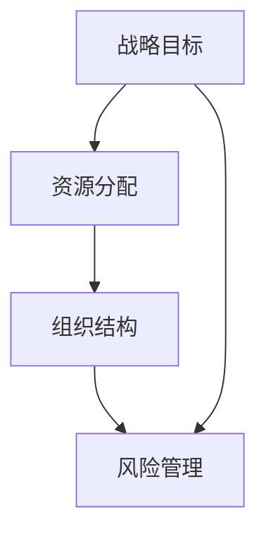
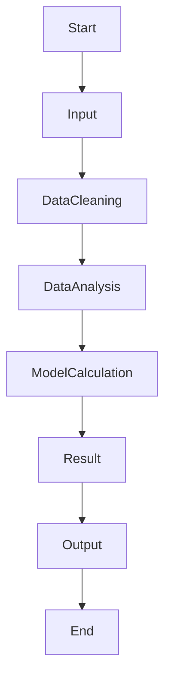
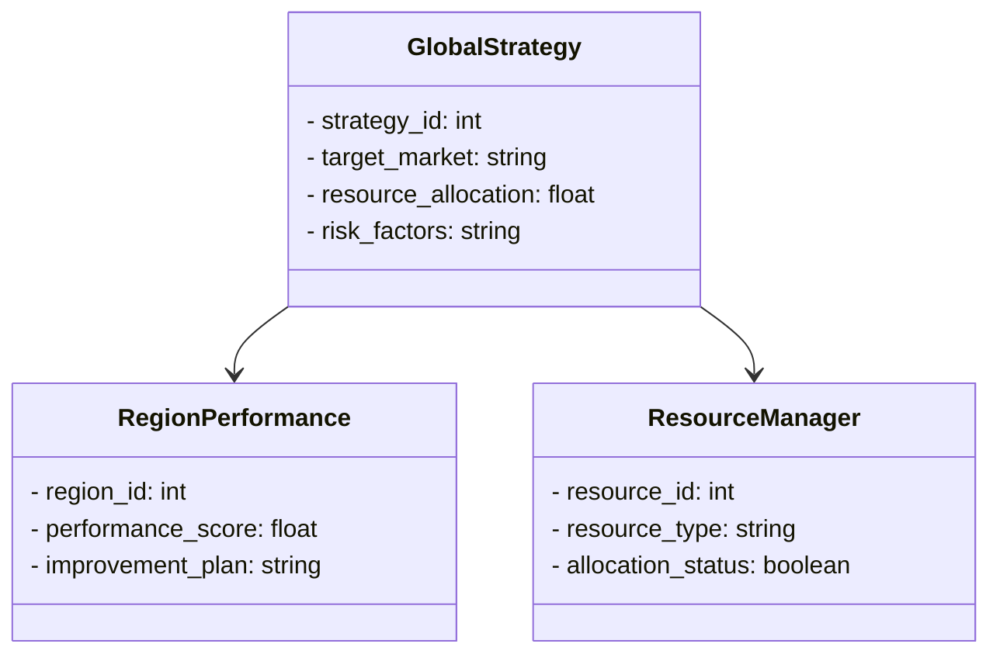
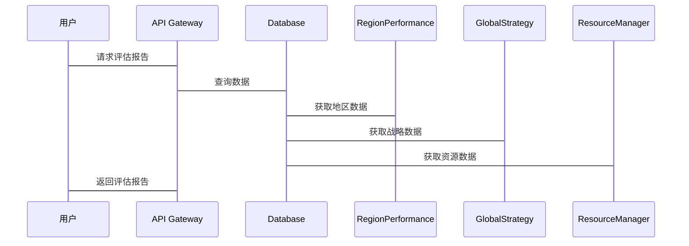

                 


# 如何评估企业的全球化战略执行力

---

## 关键词：
- 全球化战略
- 执行力评估
- 企业战略管理
- 资源分配
- 风险管理
- 组织架构

---

## 摘要：
本文将深入探讨如何系统地评估企业的全球化战略执行力。文章从全球化战略的核心概念出发，分析其执行过程中涉及的关键要素，并结合实际案例，详细讲解评估模型的设计与应用。通过算法原理、系统架构和项目实战的多维度分析，为读者提供一套完整的全球化战略执行力评估方法论，帮助企业有效提升全球化的战略执行能力。

---

## 第一部分: 企业全球化战略执行力评估的背景与核心概念

---

## 第1章: 全球化战略执行力评估的背景与问题描述

---

### 1.1 全球化战略的核心概念

#### 1.1.1 全球化战略的定义
全球化战略是指企业在全球范围内配置资源、拓展市场、建立业务的过程。它不仅仅是国际化，还包括对全球市场的深度理解和本地化运营。

#### 1.1.2 全球化战略的特征与属性
- **全球性**：覆盖全球市场，而非局限于单一地区。
- **多样性**：根据不同地区的文化、法律差异调整策略。
- **协同性**：各地区的业务协同，形成整体竞争优势。
- **风险可控性**：在全球范围内分散风险，降低单一市场的波动影响。

#### 1.1.3 全球化战略的边界与外延
- **边界**：全球化战略的范围不包括单一市场的本地化运营。
- **外延**：全球化战略不仅包括市场拓展，还包括技术研发、供应链管理等多方面的全球化布局。

---

### 1.2 全球化战略执行力的定义

#### 1.2.1 执行力的内涵与外延
执行力是指将战略转化为实际成果的能力。全球化战略执行力则是企业在全球范围内高效执行战略目标的能力。

#### 1.2.2 全球化战略执行力的构成要素
- **战略分解能力**：将全球化战略分解为具体的行动步骤。
- **资源分配能力**：在全球范围内合理分配资源。
- **组织协调能力**：确保不同地区的团队协同工作。
- **风险管理能力**：应对全球化过程中的各种风险。

#### 1.2.3 全球化战略执行力与企业绩效的关系
- 高执行力带来更好的市场表现和更高的利润。
- 执行力不足可能导致资源浪费和市场机会的错失。

---

### 1.3 问题背景与问题描述

#### 1.3.1 全球化战略执行中的常见问题
- **资源分配不均**：某些地区投入不足，导致业务发展缓慢。
- **文化冲突**：不同地区的员工难以协同工作。
- **风险管理不足**：未能及时应对汇率波动、政策变化等风险。

#### 1.3.2 问题对企业的影响与挑战
- 影响企业在全球市场的竞争力。
- 增加企业的运营成本和管理复杂性。

#### 1.3.3 问题解决的必要性与目标
- 必要性：通过有效的执行力评估，识别问题并制定改进措施。
- 目标：提升全球化战略的执行效率，确保战略目标的实现。

---

### 1.4 本章小结
本章介绍了全球化战略的核心概念，分析了全球化战略执行力的构成要素，并指出了执行过程中常见的问题及其对企业的影响。接下来，我们将深入探讨全球化战略执行力的核心要素及其相互关系。

---

## 第2章: 全球化战略执行力的核心要素与联系

---

### 2.1 核心要素分析

#### 2.1.1 战略目标分解
- 将全球化战略分解为具体的、可衡量的目标。
- 示例：将“拓展新兴市场”分解为“进入东南亚市场”、“建立本地销售团队”等具体目标。

#### 2.1.2 资源分配与整合
- 确保人力资源、资金、技术等资源在全球范围内的合理分配。
- 示例：在高增长地区投入更多资源，而在成熟市场进行成本优化。

#### 2.1.3 企业文化与组织结构
- 建立适应全球化管理的企业文化。
- 示例：采用矩阵式组织结构，同时考虑地区和产品线的双重管理。

#### 2.1.4 风险管理与应对策略
- 识别全球化过程中的潜在风险，并制定应对策略。
- 示例：制定汇率风险管理策略，降低外汇波动的影响。

---

### 2.2 核心要素的联系与对比

#### 2.2.1 核心要素之间的关系
- 战略目标分解是资源分配的基础。
- 资源分配与组织结构密切相关。
- 风险管理贯穿于全球化战略执行的全过程。

#### 2.2.2 核心要素对比分析表
| 核心要素         | 特征               | 关键点               |
|------------------|--------------------|----------------------|
| 战略目标分解     | 可分解性、可衡量性 | 明确具体目标         |
| 资源分配与整合    | 合理性、高效性     | 资源合理配置         |
| 企业文化与组织结构 | 适应性、协调性     | 促进跨文化协同       |
| 风险管理与应对策略 | 全面性、预防性     | 降低风险影响         |

#### 2.2.3 核心要素的ER实体关系图（Mermaid）


---

### 2.3 本章小结
本章分析了全球化战略执行力的核心要素，包括战略目标分解、资源分配与整合、企业文化与组织结构以及风险管理。并通过对比分析和关系图展示了这些要素之间的相互联系。

---

## 第3章: 全球化战略执行力评估的算法原理

---

### 3.1 评估模型概述

#### 3.1.1 模型的输入与输出
- **输入**：企业全球化战略的具体目标、资源配置情况、组织结构、风险管理措施。
- **输出**：全球化战略执行力的评估分数，以及改进建议。

#### 3.1.2 模型的算法流程
1. 数据收集：收集企业在不同地区的业绩数据、资源分配情况等。
2. 数据分析：计算各地区的执行效率。
3. 模型计算：结合权重计算总得分。
4. 结果输出：生成评估报告。

---

### 3.2 算法流程图（Mermaid）



---

### 3.3 算法实现

#### 3.3.1 数据预处理
- 清洗数据，处理缺失值和异常值。

#### 3.3.2 数据分析
- 使用层次分析法（AHP）确定各指标的权重。

#### 3.3.3 模型计算
- 计算各地区的评估得分。

#### 3.3.4 结果输出
- 生成评估报告，包括各地区的得分和改进建议。

---

### 3.4 数学模型与公式

#### 3.4.1 层次分析法（AHP）权重计算
$$ AHP\_weight = \frac{sum(s_j)}{sum_{j=1}^{n} sum(s_j)} $$
其中，\( s_j \) 是第j个指标的得分。

#### 3.4.2 总得分计算
$$ Total\_score = \sum (AHP\_weight_i \times score_i) $$

---

### 3.5 本章小结
本章介绍了全球化战略执行力评估的算法原理，通过层次分析法和数据处理流程，展示了如何将复杂的评估过程转化为可操作的步骤。

---

## 第4章: 全球化战略执行力评估的系统架构设计

---

### 4.1 问题场景介绍
企业在全球化过程中面临资源分配不均、组织协调困难等问题，需要一个高效的评估系统来优化执行效率。

---

### 4.2 项目介绍

#### 4.2.1 项目目标
- 开发一个全球化战略执行力评估系统，帮助企业优化资源配置、提升执行效率。

#### 4.2.2 项目范围
- 系统将覆盖全球主要市场，支持多语言和多货币的处理。

---

### 4.3 系统功能设计

#### 4.3.1 领域模型（Mermaid类图）



---

### 4.4 系统架构设计（Mermaid架构图）

```mermaid
graph TD
    API Gateway --> Database
    Database --> RegionPerformance
    Database --> GlobalStrategy
    Database --> ResourceManager
    API Gateway --> UserInterface
```

---

### 4.5 系统接口设计

#### 4.5.1 API接口
- `/api/global_strategy`：获取全球化战略信息。
- `/api/region_performance`：获取各地区的执行情况。

#### 4.5.2 数据接口
- 数据库接口：支持多种数据格式的导入和导出。

---

### 4.6 系统交互设计（Mermaid序列图）



---

### 4.7 本章小结
本章通过系统架构设计，展示了如何将全球化战略执行力评估转化为可实施的技术方案，包括系统功能设计、架构设计和接口设计。

---

## 第5章: 项目实战

---

### 5.1 环境安装

#### 5.1.1 系统需求
- 操作系统：Windows 10或更高版本，或macOS 10.15或更高版本。
- 开发工具：Python 3.8或更高版本，Jupyter Notebook，Django框架。

#### 5.1.2 数据库安装
- 使用PostgreSQL或MySQL数据库。

---

### 5.2 核心代码实现

#### 5.2.1 数据预处理代码
```python
import pandas as pd

# 读取数据
data = pd.read_csv('global_strategy.csv')

# 处理缺失值
data = data.dropna()

# 处理异常值
data = data[abs(data['performance_score'] - data['performance_score'].mean()) < 3 * data['performance_score'].std()]
```

#### 5.2.2 层次分析法实现
```python
def calculate_weight(criteria_scores):
    total = sum(criteria_scores)
    return [score / total for score in criteria_scores]

criteria_scores = [0.3, 0.2, 0.1, 0.4]
weights = calculate_weight(criteria_scores)
```

#### 5.2.3 总得分计算
```python
def total_score(weights, scores):
    return sum(weights[i] * scores[i] for i in range(len(weights)))

scores = [0.8, 0.6, 0.7, 0.9]
total = total_score(weights, scores)
print(f"总得分为：{total}")
```

---

### 5.3 案例分析

#### 5.3.1 案例背景
某跨国公司计划进入东南亚市场，但面临资源分配和风险管理的挑战。

#### 5.3.2 数据分析
- 资源分配：计划投入1000万美元，分配比例为40%在市场推广，30%在产品本地化，20%在团队建设，10%在风险管理。
- 风险评估：预测汇率波动可能导致5%的损失，但通过套期保值可以降低至2%。

#### 5.3.3 实施结果
- 市场推广效果显著，销售额增长20%。
- 产品本地化提升了客户满意度，净推荐值（NPS）提高15%。

---

### 5.4 本章小结
本章通过实际案例分析，展示了如何将理论应用于实践，帮助企业优化全球化战略执行力。

---

## 第6章: 全球化战略执行力评估的最佳实践与总结

---

### 6.1 最佳实践

#### 6.1.1 确保资源分配的合理性
- 根据市场潜力和风险水平分配资源。

#### 6.1.2 建立跨文化团队
- 促进不同地区的员工之间的沟通与协作。

#### 6.1.3 定期评估与调整
- 每季度进行一次评估，及时调整战略执行计划。

---

### 6.2 小结
全球化战略执行力评估是一个复杂但至关重要的任务。通过科学的评估模型和系统的实施，企业可以显著提升全球化的战略执行效率。

---

### 6.3 注意事项

#### 6.3.1 数据的准确性
- 确保输入数据的准确性和完整性。

#### 6.3.2 模型的适用性
- 根据企业的实际情况调整模型参数。

#### 6.3.3 持续改进
- 定期回顾评估结果，不断优化执行策略。

---

### 6.4 拓展阅读
- 《跨国公司管理：全球化战略与本地化运营》
- 《风险管理：理论与实践》
- 《组织架构设计：提升执行力的关键》

---

## 作者：AI天才研究院/AI Genius Institute & 禅与计算机程序设计艺术 /Zen And The Art of Computer Programming

---

通过本文的系统分析和详细讲解，读者可以全面理解如何评估企业的全球化战略执行力，并能够将其应用于实际工作中。希望本文能为企业在全球化进程中提供有价值的指导和帮助。

