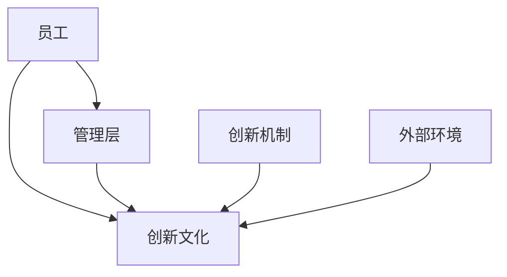
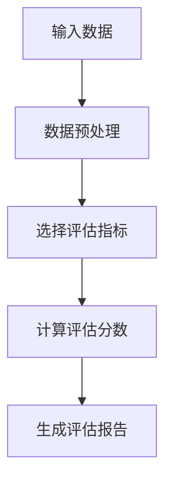
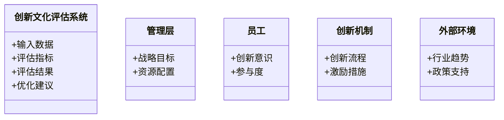
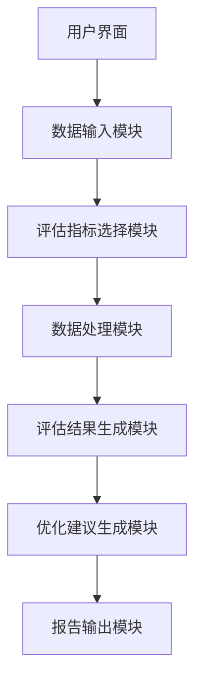
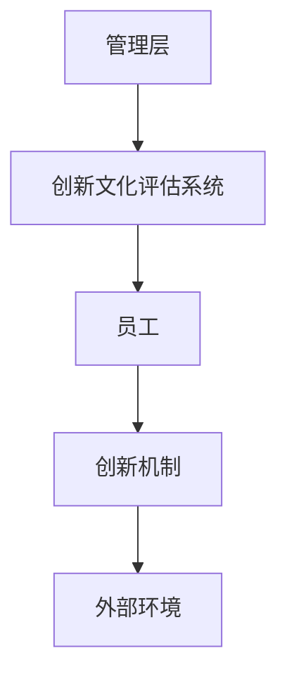

                 


# 如何评估企业的创新文化

> 关键词：创新文化，企业评估，创新机制，员工参与，文化塑造

> 摘要：本文详细探讨了如何系统地评估企业的创新文化，从背景分析、核心概念、评估框架、系统设计到实际案例，为读者提供了全面的指导和实用的方法。通过本文，读者可以掌握如何构建和优化企业的创新文化，从而提升企业的竞争力和创新能力。

---

# 第一部分：创新文化评估的背景与重要性

## 第1章：创新文化的定义与重要性

### 1.1 创新文化的定义

#### 1.1.1 创新文化的内涵
创新文化是指企业在组织内部营造的一种鼓励员工提出新想法、探索新方法、尝试新策略的工作氛围。它不仅包括技术上的创新，还包括管理方式、商业模式、流程优化等多方面的创新。

#### 1.1.2 创新文化的核心要素
- **开放性**：员工可以自由表达想法，管理层愿意倾听并采纳。
- **鼓励冒险**：允许失败，并从中学习。
- **知识共享**：促进信息的流通和团队协作。
- **灵活性**：能够快速适应市场变化和新技术的出现。

#### 1.1.3 创新文化与企业绩效的关系
创新文化是企业绩效的核心驱动力之一。通过创新文化，企业可以更快地响应市场需求，提高产品和服务的质量，从而在竞争中占据优势。

---

## 第2章：创新文化评估的背景与问题背景

### 2.1 创新文化评估的背景

#### 2.1.1 全球化与数字化的挑战
在全球化和数字化的背景下，企业需要不断创新以应对市场的变化和技术的进步。创新文化评估成为企业保持竞争力的重要手段。

#### 2.1.2 企业创新文化的核心地位
创新文化是企业战略实施和长期发展的重要支撑。它不仅影响企业的创新能力，还关系到员工的满意度和企业的可持续发展。

#### 2.1.3 创新文化评估的必要性
通过评估创新文化，企业可以发现自身在创新过程中的优势和不足，从而有针对性地进行改进。

---

## 第3章：创新文化评估的核心概念与联系

### 3.1 核心概念的定义与属性

#### 3.1.1 创新文化的属性特征对比表格
| 属性       | 描述                                   |
|------------|--------------------------------------|
| 灵活性     | 适应变化的能力                         |
| 开放性     | 接受不同观点的意愿                     |
| 鼓励冒险   | 容忍失败的氛围                         |
| 知识共享   | 信息流通的顺畅程度                     |

---

### 3.2 实体关系图（ER图）



---

### 3.3 算法原理与数学模型

#### 3.3.1 创新文化评估的算法流程



#### 3.3.2 创新文化评估的数学模型

$$
\text{创新文化指数} = \sum_{i=1}^{n} w_i \cdot x_i
$$

其中，$w_i$ 是第 $i$ 个指标的权重，$x_i$ 是第 $i$ 个指标的评分。

---

# 第二部分：创新文化评估的系统分析与架构设计

## 第4章：创新文化评估的系统分析

### 4.1 问题场景介绍

创新文化评估系统的目标是帮助企业识别其创新文化现状，并提供改进建议。该系统需要结合企业的实际运营情况，提供个性化的评估和优化方案。

---

### 4.2 领域模型（Mermaid 类图）



---

### 4.3 系统架构设计

#### 4.3.1 系统功能设计



#### 4.3.2 系统架构设计



---

## 第5章：创新文化评估的项目实战

### 5.1 项目介绍

假设我们为一家科技公司设计创新文化评估系统，该公司希望优化其创新流程，提升员工的参与度。

---

### 5.2 系统核心实现源代码

以下是创新文化评估系统的核心代码示例：

```python
def calculate_innovation_score(employees, management, mechanism, environment):
    # 评估员工创新意识
    employee_score = sum([e['innovation意识'] for e in employees]) / len(employees)
    # 评估管理层支持
    management_score = sum([m['资源配置'] for m in management]) / len(management)
    # 评估创新机制
    mechanism_score = sum([m['激励措施'] for m in mechanism]) / len(mechanism)
    # 评估外部环境影响
    environment_score = sum([e['政策支持'] for e in environment]) / len(environment)
    # 计算综合创新文化指数
    innovation_index = (employee_score + management_score + 
                        mechanism_score + environment_score) / 4
    return innovation_index

# 示例数据
employees = [{'innovation意识': 85}, {'innovation意识': 90}, {'innovation意识': 88}]
management = [{'资源配置': 75}, {'资源配置': 80}]
mechanism = [{'激励措施': 65}, {'激励措施': 70}]
environment = [{'政策支持': 70}, {'政策支持': 75}]

# 计算创新文化指数
score = calculate_innovation_score(employees, management, mechanism, environment)
print(f"创新文化指数：{score:.2f}")
```

---

### 5.3 代码应用解读与分析

上述代码通过输入员工、管理层、创新机制和外部环境的数据，计算企业的创新文化指数。该指数反映了企业在创新文化方面的综合表现，帮助企业识别其在创新过程中的优势和不足。

---

## 第6章：创新文化评估的最佳实践与总结

### 6.1 最佳实践 tips

- **领导层支持**：管理层需要积极参与创新文化的设计和推动。
- **员工参与**：鼓励员工提出新想法，并为其提供实现的机会。
- **持续改进**：定期评估创新文化，根据结果进行优化。

---

## 6.2 项目小结

通过本文的分析和实践，我们了解了如何系统地评估企业的创新文化，并通过具体案例展示了如何应用这些评估方法。创新文化评估不仅是企业提升竞争力的重要手段，也是实现可持续发展的关键。

---

# 作者：AI天才研究院/AI Genius Institute & 禅与计算机程序设计艺术 /Zen And The Art of Computer Programming

