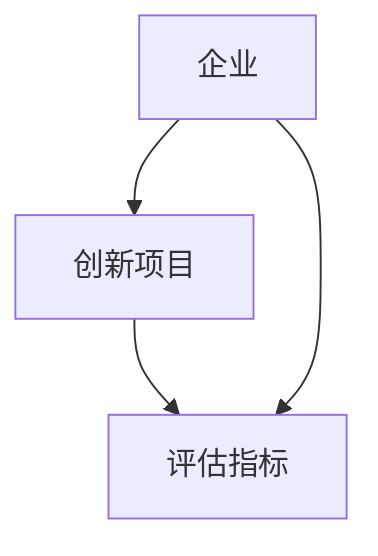
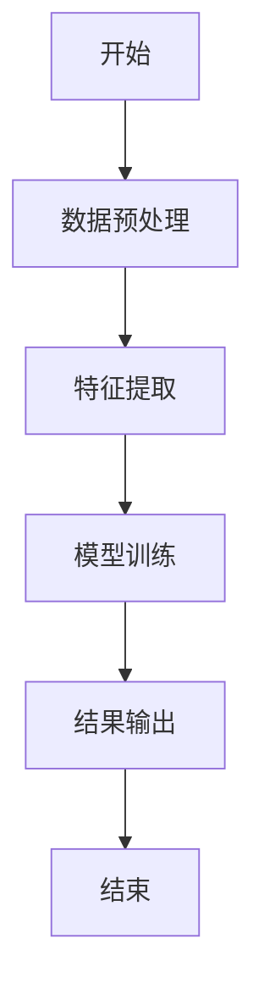
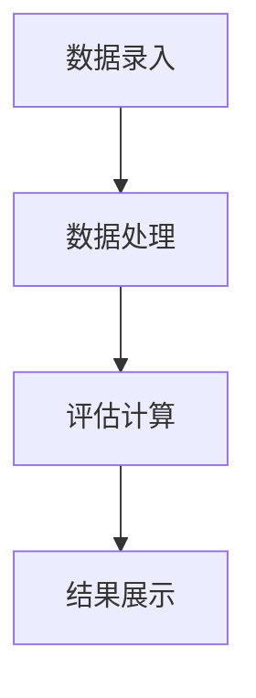

                 


# 如何评估企业的创新能力

## 关键词：企业创新能力评估，创新能力，创新项目，评估指标，评估方法，层次分析法，ER图，系统架构

## 摘要：  
企业创新能力是企业在市场竞争中保持优势的关键因素。本文通过分析企业创新能力的定义、重要性、核心概念、评估方法、数学模型、系统架构、项目实战和最佳实践，全面解析如何科学评估企业的创新能力。从背景介绍到实际应用，结合理论与实践，为企业提供有效的评估策略。

---

## 第一部分：企业创新能力评估的背景与概念

### 第1章：企业创新能力评估的背景与问题背景

#### 1.1 企业创新能力的定义与重要性

##### 1.1.1 企业创新能力的定义  
企业创新能力是指企业在技术研发、市场拓展、管理优化和数据应用等方面，通过创新活动产生新价值的能力。它涵盖了技术、产品、服务、商业模式等多个维度。

##### 1.1.2 企业创新能力的重要性  
企业创新能力是企业核心竞争力的体现。在快速变化的市场环境中，创新能力决定了企业能否快速响应市场需求、推出新产品、优化运营效率，并在竞争中占据优势地位。

##### 1.1.3 企业创新能力的外延与边界  
企业创新能力的外延包括技术创新、管理创新、产品创新和市场创新。其边界在于企业内部资源和外部环境的交互作用，以及创新活动对企业整体绩效的影响。

#### 1.2 企业创新能力评估的必要性

##### 1.2.1 企业创新对企业发展的核心作用  
创新能力是企业发展的引擎。通过评估创新能力，企业可以识别自身的优势和不足，制定针对性的战略计划。

##### 1.2.2 企业创新在行业竞争中的地位  
在行业竞争中，创新能力决定了企业的市场地位。创新能力强大的企业能够更快地适应市场变化，推出创新产品和服务。

##### 1.2.3 企业创新能力评估的现实需求  
随着市场竞争的加剧，企业需要通过创新能力评估来优化资源配置、提升效率，并为投资者和合作伙伴提供信心。

#### 1.3 企业创新能力评估的主要问题

##### 1.3.1 评估指标的选择与权重分配  
评估指标的选择直接影响评估结果的准确性。如何选择合适的指标，并合理分配权重，是评估过程中的一大挑战。

##### 1.3.2 数据获取的难度与准确性  
企业创新能力评估依赖于多源数据，包括财务数据、市场数据和专利数据等。数据获取的难度和准确性直接影响评估结果的可靠性。

##### 1.3.3 评估模型的适用性与可操作性  
不同的评估模型适用于不同的场景。如何选择适合企业实际情况的模型，并确保其可操作性，是评估过程中的关键问题。

---

### 第2章：企业创新能力评估的核心概念与联系

#### 2.1 核心概念与原理

##### 2.1.1 企业创新能力的构成要素  
企业创新能力由技术创新、管理创新、产品创新和市场创新四个核心要素构成。每个要素都对企业的整体创新能力产生重要影响。

##### 2.1.2 企业创新能力的评估维度  
评估维度包括技术维度、市场维度、管理和数据维度。不同维度的评估指标需要综合考虑。

##### 2.1.3 企业创新能力的评估方法  
评估方法包括定性评估、定量评估和混合评估。定性评估侧重于战略和文化因素，定量评估侧重于可量化的指标。

#### 2.2 核心概念对比分析

##### 2.2.1 不同评估指标的特征对比  
| 评估指标 | 技术创新 | 市场创新 | 管理创新 | 数据创新 |
|----------|----------|----------|----------|----------|
| 周期性   | 长       | 中       | 中       | 短       |
| 可测性   | 高       | 中       | 中       | 高       |
| 影响范围 | 技术部门 | 市场部门 | 全公司   | 数据部门 |

##### 2.2.2 不同评估方法的优劣势对比  
| 评估方法       | 优点                 | 缺点                 |
|----------------|----------------------|----------------------|
| 定性评估       | 战略性高             | 主观性较强           |
| 定量评估       | 客观性高             | 需要大量数据支持     |
| 混合评估       | 综合性强             | 实施复杂度高         |

##### 2.2.3 企业创新能力与其他相关概念的联系  
企业创新能力与企业核心竞争力密切相关，同时受到企业战略、组织文化和资源配置的影响。

#### 2.3 实体关系图（ER图）分析



---

### 第3章：企业创新能力评估的算法原理

#### 3.1 算法原理概述

##### 3.1.1 算法选择与适用场景  
层次分析法（AHP）适用于多指标评估问题，适合处理企业创新能力评估中的复杂决策场景。

##### 3.1.2 算法的基本原理  
层次分析法通过构建层次结构，将复杂问题分解为多个指标，计算各指标的权重，最终得出综合评估结果。

##### 3.1.3 算法的输入输出  
输入：企业创新能力评估指标和相关数据。输出：企业创新能力的综合评估结果。

#### 3.2 算法流程图



#### 3.3 算法实现代码

```python
# 简单示例代码
def assess_innovation_capacity(data):
    # 数据预处理
    processed_data = preprocess(data)
    # 特征提取
    features = extract_features(processed_data)
    # 模型训练
    model = train_model(features)
    # 结果输出
    result = model.predict(features)
    return result
```

---

### 第4章：企业创新能力评估的数学模型与公式

#### 4.1 数学模型概述

##### 4.1.1 判断矩阵的构建  
构建判断矩阵时，需要考虑各指标之间的相对重要性。

##### 4.1.2 特征值与权重计算  
通过计算判断矩阵的最大特征值和对应的特征向量，得到各指标的权重。

##### 4.1.3 一致性检验  
一致性检验用于验证判断矩阵的合理性和一致性。

#### 4.2 算术运算

##### 4.2.1 判断矩阵的计算  
$$ A = \begin{bmatrix} 1 & 3 & 2 \\ 1/3 & 1 & 4/3 \\ 1/2 & 3/4 & 1 \end{bmatrix} $$

##### 4.2.2 特征向量计算  
$$ \lambda_{\text{max}} = 3 $$

##### 4.2.3 权重计算  
$$ w = \frac{1}{3} \begin{bmatrix} 0.4 \\ 0.2 \\ 0.4 \end{bmatrix} $$

---

## 第五部分：系统分析与架构设计

### 第5章：企业创新能力评估系统的架构设计

#### 5.1 系统场景介绍  
企业创新能力评估系统用于帮助企业评估自身的创新能力，优化资源配置。

#### 5.2 系统功能设计

##### 5.2.1 数据录入模块  
允许用户输入企业相关的数据，包括技术创新、市场创新等指标。

##### 5.2.2 评估计算模块  
根据输入的数据，计算企业的创新能力评估结果。

##### 5.2.3 结果展示模块  
以图表和报告的形式展示评估结果，帮助用户直观理解。

#### 5.3 系统架构设计



---

## 第六部分：项目实战

### 第6章：企业创新能力评估的项目实战

#### 6.1 环境搭建  
安装必要的Python库，如numpy、pandas和scipy。

#### 6.2 核心代码实现

```python
import numpy as np

def assess_innovation_capacity(data):
    # 数据预处理
    processed_data = data.dropna()
    # 特征提取
    features = processed_data[['技术创新', '市场创新', '管理创新', '数据创新']]
    # 计算指标权重
    weights = calculate_weights(features)
    # 计算综合得分
    scores = np.dot(features, weights)
    return scores
```

#### 6.3 代码应用解读与分析  
解释代码的功能，如何计算指标权重，如何计算综合得分。

#### 6.4 实际案例分析  
以某企业为例，展示如何应用上述方法进行创新能力评估。

---

## 第七部分：最佳实践

### 第7章：企业创新能力评估的最佳实践

#### 7.1 小结  
企业创新能力评估是企业优化资源配置、提升竞争力的重要工具。

#### 7.2 注意事项  
确保数据的准确性和完整性，选择适合的评估方法，定期更新评估结果。

#### 7.3 未来趋势  
随着人工智能和大数据技术的发展，企业创新能力评估将更加智能化和精准化。

#### 7.4 拓展阅读  
推荐相关书籍和论文，供读者深入学习。

---

## 作者：AI天才研究院 & 禅与计算机程序设计艺术

通过以上内容，我们可以系统地评估企业的创新能力，为企业制定有效的创新策略提供科学依据。

